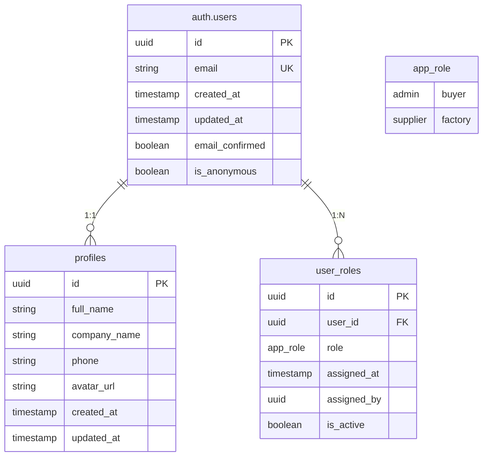
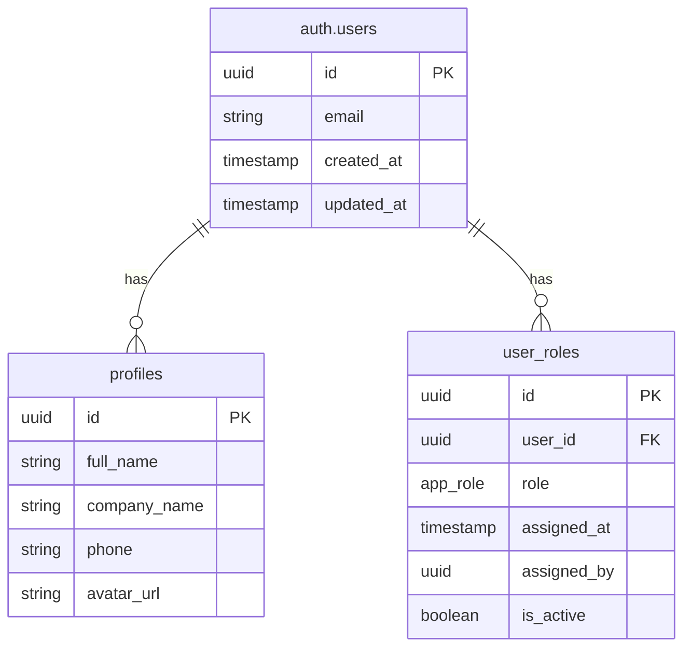
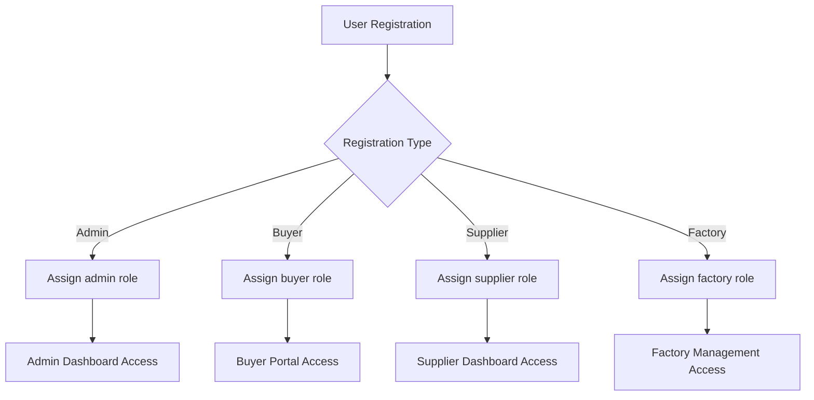
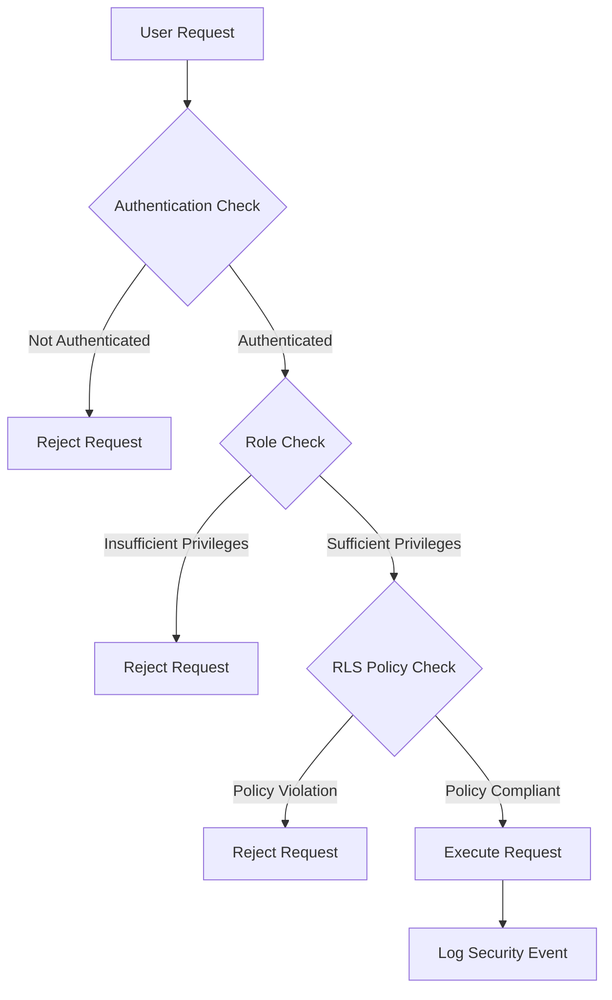
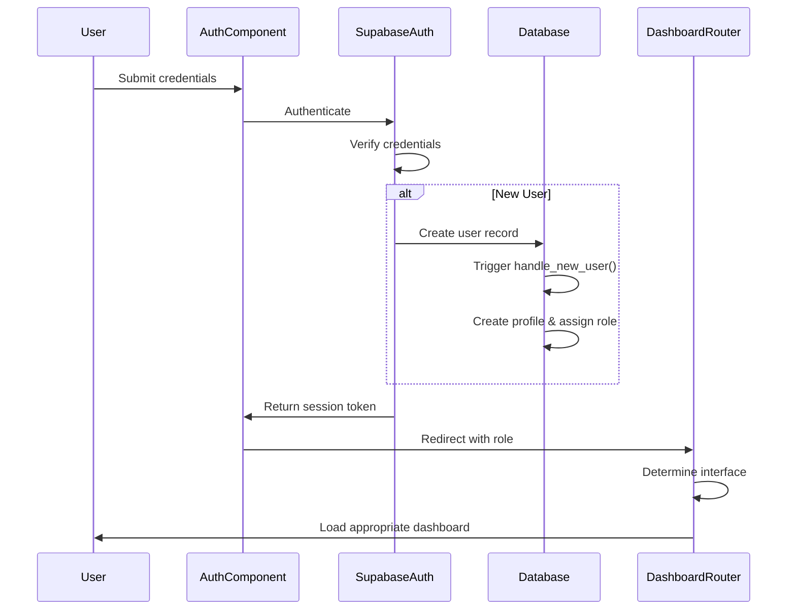

# Users and Authentication Schema

<cite>
**Referenced Files in This Document**  
- [supabase/migrations/20251115150759_remix_migration_from_pg_dump.sql](file://supabase/migrations/20251115150759_remix_migration_from_pg_dump.sql)
- [supabase/seed.sql](file://supabase/seed.sql)
- [src/integrations/supabase/types.ts](file://src/integrations/supabase/types.ts)
- [src/types/database.ts](file://src/types/database.ts)
- [src/components/SmartDashboardRouter.tsx](file://src/components/SmartDashboardRouter.tsx)
- [src/pages/Auth.tsx](file://src/pages/Auth.tsx)
- [supabase/functions/handle_new_user/index.ts](file://supabase/functions/handle_new_user/index.ts)
</cite>

## Table of Contents
1. [Introduction](#introduction)
2. [Data Model Overview](#data-model-overview)
3. [Entity Relationship Diagram](#entity-relationship-diagram)
4. [User Roles and Access Control](#user-roles-and-access-control)
5. [Field Definitions](#field-definitions)
6. [Database Functions](#database-functions)
7. [Security Policies](#security-policies)
8. [Authentication Workflow](#authentication-workflow)
9. [Data Access Patterns](#data-access-patterns)
10. [Sample Data](#sample-data)
11. [Performance Considerations](#performance-considerations)
12. [Security Measures](#security-measures)
13. [Conclusion](#conclusion)

## Introduction
This document provides comprehensive documentation for the users and authentication system in sleekapp-v100. It details the data model architecture, focusing on the relationships between the `auth.users`, `profiles`, and `user_roles` tables. The documentation covers the role-based access control system, field definitions, business rules, security policies, and data access patterns used throughout the application.

**Section sources**
- [supabase/migrations/20251115150759_remix_migration_from_pg_dump.sql](file://supabase/migrations/20251115150759_remix_migration_from_pg_dump.sql)
- [supabase/seed.sql](file://supabase/seed.sql)

## Data Model Overview
The authentication system in sleekapp-v100 is built on a robust PostgreSQL database schema with Supabase as the backend-as-a-service platform. The core of the system revolves around three main entities: `auth.users` (managed by Supabase), `profiles`, and `user_roles`. These entities work together to provide a flexible role-based access control system that supports multiple user types including admin, buyer, supplier, and factory personnel.

The data model enforces referential integrity through foreign key constraints and implements business logic through database functions and triggers. Row Level Security (RLS) policies ensure that users can only access data appropriate to their roles, providing a secure foundation for the application.



**Diagram sources**
- [supabase/migrations/20251115150759_remix_migration_from_pg_dump.sql](file://supabase/migrations/20251115150759_remix_migration_from_pg_dump.sql)
- [src/types/database.ts](file://src/types/database.ts)

**Section sources**
- [supabase/migrations/20251115150759_remix_migration_from_pg_dump.sql](file://supabase/migrations/20251115150759_remix_migration_from_pg_dump.sql)
- [src/types/database.ts](file://src/types/database.ts)

## Entity Relationship Diagram
The entity relationship diagram illustrates the core structure of the users and authentication system. The `auth.users` table is the foundation, managed by Supabase's authentication system. Each user has exactly one corresponding profile in the `profiles` table, establishing a one-to-one relationship. A single user can have multiple roles over time through the `user_roles` table, which creates a one-to-many relationship, with only one active role at any given time.



**Diagram sources**
- [supabase/migrations/20251115150759_remix_migration_from_pg_dump.sql](file://supabase/migrations/20251115150759_remix_migration_from_pg_dump.sql)
- [src/integrations/supabase/types.ts](file://src/integrations/supabase/types.ts)

**Section sources**
- [supabase/migrations/20251115150759_remix_migration_from_pg_dump.sql](file://supabase/migrations/20251115150759_remix_migration_from_pg_dump.sql)
- [src/integrations/supabase/types.ts](file://src/integrations/supabase/types.ts)

## User Roles and Access Control
The role-based access control system in sleekapp-v100 is centered around the `app_role` enum type, which defines four distinct user roles: admin, buyer, supplier, and factory. This enum is used in the `user_roles` table to assign roles to users, enabling fine-grained permission management throughout the application.

The access control system follows a hierarchical pattern where privileges are determined by role. Admin users have full system access, while other roles have permissions scoped to their specific functions. The `SmartDashboardRouter` component uses these roles to determine which dashboard interface to present to the user, routing admins to the administrative dashboard, buyers to the buyer portal, and suppliers/factory users to the production management interface.

Role assignment is controlled through the `handle_new_user()` database function, which ensures that new users are assigned appropriate default roles based on their registration path. The system supports role transitions, allowing users to have multiple roles over time while maintaining an audit trail of role changes.



**Diagram sources**
- [supabase/functions/handle_new_user/index.ts](file://supabase/functions/handle_new_user/index.ts)
- [src/components/SmartDashboardRouter.tsx](file://src/components/SmartDashboardRouter.tsx)

**Section sources**
- [supabase/functions/handle_new_user/index.ts](file://supabase/functions/handle_new_user/index.ts)
- [src/components/SmartDashboardRouter.tsx](file://src/components/SmartDashboardRouter.tsx)

## Field Definitions
This section details the field definitions for each table in the users and authentication system.

### auth.users Table
The `auth.users` table is managed by Supabase and contains core authentication data:
- **id**: UUID primary key, unique identifier for the user
- **email**: String, unique email address used for login
- **created_at**: Timestamp, when the user account was created
- **updated_at**: Timestamp, when the user record was last updated
- **email_confirmed**: Boolean, indicates if the user has verified their email
- **is_anonymous**: Boolean, indicates if the user has an anonymous account

### profiles Table
The `profiles` table contains user profile information:
- **id**: UUID primary key, references auth.users.id
- **full_name**: String, the user's full name
- **company_name**: String, the name of the user's company or organization
- **phone**: String, contact phone number
- **avatar_url**: String, URL to the user's profile picture
- **created_at**: Timestamp, when the profile was created
- **updated_at**: Timestamp, when the profile was last updated

### user_roles Table
The `user_roles` table manages role assignments:
- **id**: UUID primary key
- **user_id**: UUID foreign key referencing auth.users.id
- **role**: app_role enum (admin, buyer, supplier, factory)
- **assigned_at**: Timestamp, when the role was assigned
- **assigned_by**: UUID, reference to the user who assigned the role
- **is_active**: Boolean, indicates if this is the user's current active role

**Section sources**
- [supabase/migrations/20251115150759_remix_migration_from_pg_dump.sql](file://supabase/migrations/20251115150759_remix_migration_from_pg_dump.sql)
- [src/types/database.ts](file://src/types/database.ts)

## Database Functions
The users and authentication system employs database functions to enforce business rules and automate processes. The primary function is `handle_new_user()`, which is triggered when a new user is created in the `auth.users` table.

The `handle_new_user()` function performs several critical operations:
1. Creates a corresponding entry in the `profiles` table with default values
2. Assigns an appropriate initial role based on the user's registration context
3. Sets up default preferences and settings
4. Logs the user creation event for audit purposes
5. Ensures data consistency across related tables

This function is implemented as a PostgreSQL trigger function that executes after insert on the `auth.users` table. It uses conditional logic to determine the appropriate role assignment, considering factors such as the registration source and any invitation metadata.

```mermaid
flowchart TD
A[New User Created] --> B[Trigger handle_new_user()]
B --> C{Determine Role}
C --> |Admin Invite| D[Assign admin role]
C --> |Buyer Signup| E[Assign buyer role]
C --> |Supplier Application| F[Assign supplier role]
C --> |Factory Registration| G[Assign factory role]
D --> H[Create Profile]
E --> H
F --> H
G --> H
H --> I[Set Default Preferences]
I --> J[Log Creation Event]
J --> K[Complete User Setup]
```

**Diagram sources**
- [supabase/functions/handle_new_user/index.ts](file://supabase/functions/handle_new_user/index.ts)

**Section sources**
- [supabase/functions/handle_new_user/index.ts](file://supabase/functions/handle_new_user/index.ts)

## Security Policies
The authentication system implements robust security measures through Row Level Security (RLS) policies and other mechanisms. These policies ensure that users can only access data appropriate to their roles and permissions.

Key security policies include:
- Users can only view and update their own profile information
- Role assignment requires appropriate privileges (typically admin or system)
- Profile updates are restricted to the profile owner or authorized administrators
- Role history is immutable for audit purposes
- Sensitive operations require additional verification

The RLS policies are defined at the database level, providing a strong security foundation that cannot be bypassed by client-side code. These policies work in conjunction with the application's authentication system to create multiple layers of security.



**Diagram sources**
- [supabase/migrations/20251115150759_remix_migration_from_pg_dump.sql](file://supabase/migrations/20251115150759_remix_migration_from_pg_dump.sql)
- [supabase/functions/handle_new_user/index.ts](file://supabase/functions/handle_new_user/index.ts)

**Section sources**
- [supabase/migrations/20251115150759_remix_migration_from_pg_dump.sql](file://supabase/migrations/20251115150759_remix_migration_from_pg_dump.sql)
- [supabase/functions/handle_new_user/index.ts](file://supabase/functions/handle_new_user/index.ts)

## Authentication Workflow
The authentication workflow in sleekapp-v100 follows a standard OAuth2 pattern with additional security measures. When a user registers or logs in, the following sequence occurs:

1. User submits credentials through the Auth component
2. Supabase verifies the credentials and creates a session
3. The `handle_new_user()` function is triggered for new users
4. User is redirected to the SmartDashboardRouter based on their role
5. Appropriate dashboard interface is loaded

For enhanced security, the system implements OTP verification for sensitive operations. This adds an additional layer of protection beyond the standard email/password authentication.



**Diagram sources**
- [src/pages/Auth.tsx](file://src/pages/Auth.tsx)
- [supabase/functions/handle_new_user/index.ts](file://supabase/functions/handle_new_user/index.ts)
- [src/components/SmartDashboardRouter.tsx](file://src/components/SmartDashboardRouter.tsx)

**Section sources**
- [src/pages/Auth.tsx](file://src/pages/Auth.tsx)
- [src/components/SmartDashboardRouter.tsx](file://src/components/SmartDashboardRouter.tsx)

## Data Access Patterns
The application uses specific data access patterns to efficiently retrieve user and authentication data. The SmartDashboardRouter component queries the user's role to determine the appropriate interface, while profile information is loaded on demand for display in various components.

Common query patterns include:
- Joining auth.users with profiles and user_roles to get complete user information
- Filtering user_roles by is_active to get the current role
- Using indexes on foreign keys for efficient joins
- Caching frequently accessed profile data

These patterns are optimized for performance while maintaining data consistency and security.

**Section sources**
- [src/components/SmartDashboardRouter.tsx](file://src/components/SmartDashboardRouter.tsx)
- [src/pages/UserProfile.tsx](file://src/pages/UserProfile.tsx)

## Sample Data
The following sample data illustrates how different user types are represented in the system:

**Admin User:**
- auth.users: id=uuid1, email="admin@sleekapp.com"
- profiles: full_name="System Administrator", company_name="Sleek Apparels"
- user_roles: role=admin, is_active=true

**Buyer User:**
- auth.users: id=uuid2, email="buyer@retailco.com"
- profiles: full_name="Jane Buyer", company_name="Retail Company"
- user_roles: role=buyer, is_active=true

**Supplier User:**
- auth.users: id=uuid3, email="supplier@factory.com"
- profiles: full_name="John Supplier", company_name="Quality Factory"
- user_roles: role=supplier, is_active=true

This data structure allows the system to maintain consistent user information while supporting role-specific functionality.

**Section sources**
- [supabase/seed.sql](file://supabase/seed.sql)
- [supabase/migrations/20251115150759_remix_migration_from_pg_dump.sql](file://supabase/migrations/20251115150759_remix_migration_from_pg_dump.sql)

## Performance Considerations
The authentication system has been designed with performance in mind. Key considerations include:

- Indexes on all foreign keys and frequently queried fields
- Efficient query patterns that minimize database round trips
- Caching of user role information to reduce database load
- Optimized triggers that perform minimal operations

Authentication queries are optimized to complete within acceptable time frames, even as the user base grows. The system uses connection pooling and query optimization to maintain performance under load.

**Section sources**
- [supabase/migrations/20251115150759_remix_migration_from_pg_dump.sql](file://supabase/migrations/20251115150759_remix_migration_from_pg_dump.sql)
- [src/lib/supabaseHelpers.ts](file://src/lib/supabaseHelpers.ts)

## Security Measures
The system implements multiple security measures to protect user data and prevent unauthorized access:

- Row Level Security (RLS) policies enforce data access controls
- OTP verification for sensitive operations
- Encrypted storage of credentials by Supabase
- Regular security audits and monitoring
- Input validation and sanitization
- Protection against common vulnerabilities like SQL injection

These measures work together to create a secure authentication system that protects both user data and system integrity.

**Section sources**
- [supabase/migrations/20251115150759_remix_migration_from_pg_dump.sql](file://supabase/migrations/20251115150759_remix_migration_from_pg_dump.sql)
- [src/lib/security.ts](file://src/lib/security.ts)

## Conclusion
The users and authentication system in sleekapp-v100 provides a robust foundation for the application's security and access control. By leveraging Supabase's authentication capabilities and extending them with custom database schema and business logic, the system supports a flexible role-based access control model that can accommodate the needs of admins, buyers, suppliers, and factory personnel.

The integration between the database schema, security policies, and application components like SmartDashboardRouter creates a cohesive system that ensures users have appropriate access while maintaining data security and integrity.