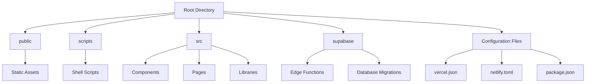
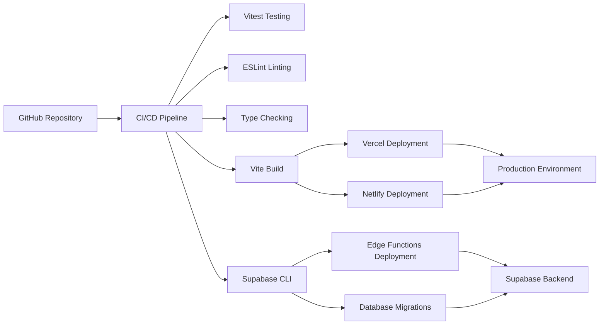
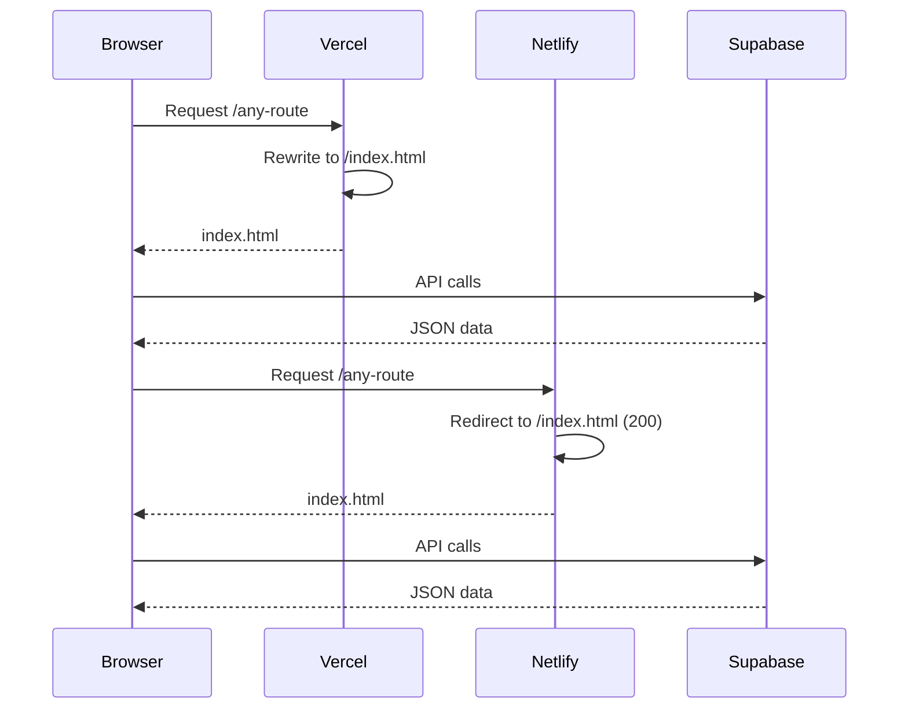
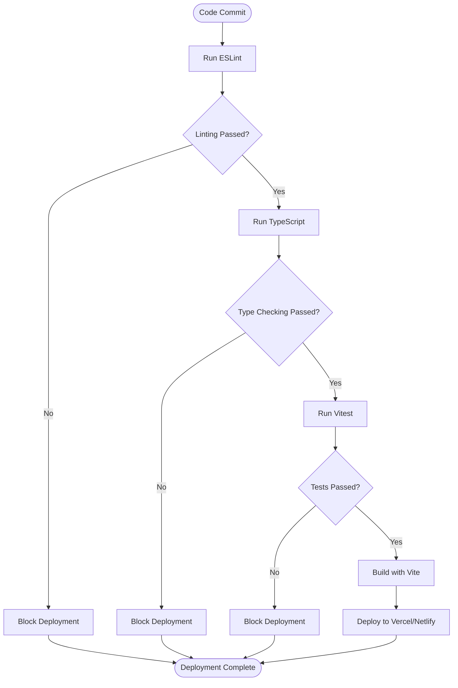
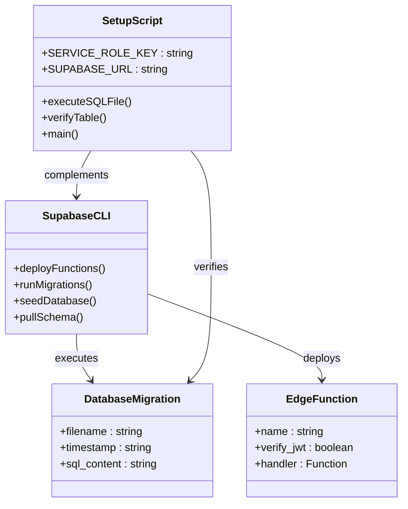
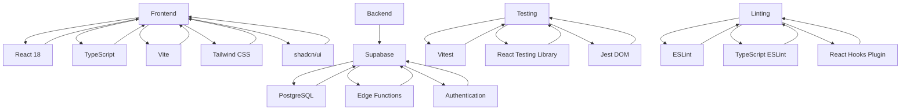

# CI/CD Pipeline

<cite>
**Referenced Files in This Document**   
- [package.json](file://package.json)
- [vercel.json](file://vercel.json)
- [netlify.toml](file://netlify.toml)
- [eslint.config.js](file://eslint.config.js)
- [vitest.config.ts](file://vitest.config.ts)
- [supabase/config.toml](file://supabase/config.toml)
- [check-status.sh](file://check-status.sh)
- [update-supabase-key.sh](file://update-supabase-key.sh)
- [scripts/fix-supabase-imports.sh](file://scripts/fix-supabase-imports.sh)
- [scripts/setup-database.js](file://scripts/setup-database.js)
- [README.md](file://README.md)
</cite>

## Table of Contents
1. [Introduction](#introduction)
2. [Project Structure](#project-structure)
3. [Core Components](#core-components)
4. [Architecture Overview](#architecture-overview)
5. [Detailed Component Analysis](#detailed-component-analysis)
6. [Dependency Analysis](#dependency-analysis)
7. [Performance Considerations](#performance-considerations)
8. [Troubleshooting Guide](#troubleshooting-guide)
9. [Conclusion](#conclusion)

## Introduction
The CI/CD pipeline for sleekapp-v100 is designed to support a modern full-stack application with React frontend, Supabase backend, and multi-platform deployment to Vercel and Netlify. The pipeline incorporates automated testing, linting, type checking, and secure deployment practices. It supports preview deployments for pull requests and production releases with rollback capabilities. The system integrates Supabase Edge Functions and database migrations through a structured workflow that ensures data consistency and application reliability.

**Section sources**
- [README.md](file://README.md#L1-L362)

## Project Structure
The project follows a standard React application structure with Vite as the build tool. The frontend code resides in the `src` directory with components organized by feature. The `supabase` directory contains all backend-related files including Edge Functions in `functions` and database migrations in `migrations`. Configuration files for Vercel and Netlify are present at the root level, along with standard development configuration files for ESLint, Vitest, and TypeScript.

**Diagram sources**
- [package.json](file://package.json#L1-L115)
- [supabase/functions](file://supabase/functions)
- [supabase/migrations](file://supabase/migrations)

**Section sources**
- [package.json](file://package.json#L1-L115)

## Core Components
The CI/CD pipeline is built around several core components: automated testing with Vitest, code quality enforcement with ESLint, frontend deployment to Vercel and Netlify, and backend deployment of Supabase Edge Functions with database migrations. The pipeline uses environment variables for configuration and supports different deployment environments through Vite's mode system. Security is maintained through proper secret management and access controls.

**Section sources**
- [package.json](file://package.json#L6-L11)
- [vitest.config.ts](file://vitest.config.ts#L1-L29)
- [eslint.config.js](file://eslint.config.js#L1-L28)

## Architecture Overview
The CI/CD architecture integrates multiple platforms and tools to deliver a seamless development and deployment experience. The frontend is built with Vite and deployed to both Vercel and Netlify for redundancy and performance optimization. The backend consists of Supabase Edge Functions and a PostgreSQL database with migrations managed through the Supabase CLI. The pipeline includes automated testing, linting, and type checking to ensure code quality before deployment.

**Diagram sources**
- [package.json](file://package.json#L6-L11)
- [vitest.config.ts](file://vitest.config.ts#L1-L29)
- [eslint.config.js](file://eslint.config.js#L1-L28)
- [vercel.json](file://vercel.json#L1-L6)
- [netlify.toml](file://netlify.toml#L1-L123)

## Detailed Component Analysis

### Frontend Deployment Configuration
The frontend deployment is configured for both Vercel and Netlify with proper routing and caching settings. Vercel uses a rewrite rule to direct all routes to index.html for client-side routing, while Netlify uses a redirect with status 200 for the same purpose. Both platforms have comprehensive caching configurations for different asset types to optimize performance.

#### For API/Service Components:

**Diagram sources**
- [vercel.json](file://vercel.json#L1-L6)
- [netlify.toml](file://netlify.toml#L1-L123)

**Section sources**
- [vercel.json](file://vercel.json#L1-L6)
- [netlify.toml](file://netlify.toml#L1-L123)

### Automated Testing and Code Quality
The automated testing and code quality components ensure that all code meets the project standards before deployment. Vitest is configured for unit testing with coverage reporting, while ESLint enforces code quality rules. The configuration includes proper setup for React with TypeScript, and test files are excluded from coverage reports.

#### For Complex Logic Components:

**Diagram sources**
- [package.json](file://package.json#L10-L11)
- [eslint.config.js](file://eslint.config.js#L1-L28)
- [vitest.config.ts](file://vitest.config.ts#L1-L29)

**Section sources**
- [package.json](file://package.json#L6-L11)
- [eslint.config.js](file://eslint.config.js#L1-L28)
- [vitest.config.ts](file://vitest.config.ts#L1-L29)

### Supabase Integration and Deployment
The Supabase integration includes Edge Functions deployment and database migrations. The Edge Functions are configured with JWT verification settings in config.toml, and the database schema is managed through SQL migration files. The setup-database.js script provides a way to initialize the database with sample data, though it notes limitations in executing DDL statements through the JavaScript client.

#### For Object-Oriented Components:

**Diagram sources**
- [supabase/config.toml](file://supabase/config.toml#L1-L80)
- [supabase/migrations](file://supabase/migrations)
- [scripts/setup-database.js](file://scripts/setup-database.js#L1-L308)

**Section sources**
- [supabase/config.toml](file://supabase/config.toml#L1-L80)
- [supabase/migrations](file://supabase/migrations)
- [scripts/setup-database.js](file://scripts/setup-database.js#L1-L308)

## Dependency Analysis
The project dependencies are managed through npm with a clear distinction between production and development dependencies. The frontend uses modern React libraries with shadcn/ui for components and Tailwind CSS for styling. The backend relies on Supabase for database, authentication, and Edge Functions. Testing is handled by Vitest with React Testing Library, and linting by ESLint with TypeScript support.

**Diagram sources**
- [package.json](file://package.json#L13-L113)

**Section sources**
- [package.json](file://package.json#L13-L113)

## Performance Considerations
The CI/CD pipeline includes several performance optimizations. Both Vercel and Netlify configurations include comprehensive caching rules for static assets with long cache durations and immutable flags. The Vite build process optimizes the frontend assets, and the Supabase Edge Functions are designed to be lightweight and fast. The database schema is optimized with proper indexing, and the application uses React Query for efficient data fetching and caching.

## Troubleshooting Guide
Common issues in the CI/CD pipeline include environment variable configuration, Supabase connection problems, and deployment failures. The check-status.sh script provides a comprehensive status check for the local development environment, verifying repository status, dependencies, development server, and environment configuration. The update-supabase-key.sh script simplifies the process of configuring Supabase credentials. For database issues, the setup-database.js script provides guidance on running migrations and seeding data.

**Section sources**
- [check-status.sh](file://check-status.sh#L1-L59)
- [update-supabase-key.sh](file://update-supabase-key.sh#L1-L55)
- [scripts/setup-database.js](file://scripts/setup-database.js#L1-L308)

## Conclusion
The CI/CD pipeline for sleekapp-v100 is a robust system that integrates modern frontend and backend technologies with reliable deployment platforms. It emphasizes code quality through automated testing and linting, ensures security through proper secret management, and provides high performance through optimized asset delivery. The pipeline supports both preview and production deployments with clear workflows for database migrations and Edge Functions deployment. With its comprehensive configuration and tooling, the pipeline enables efficient development and reliable application delivery.