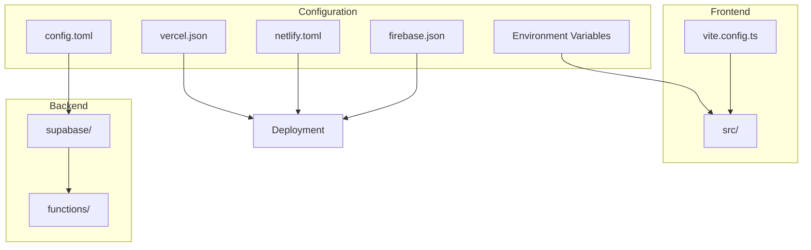
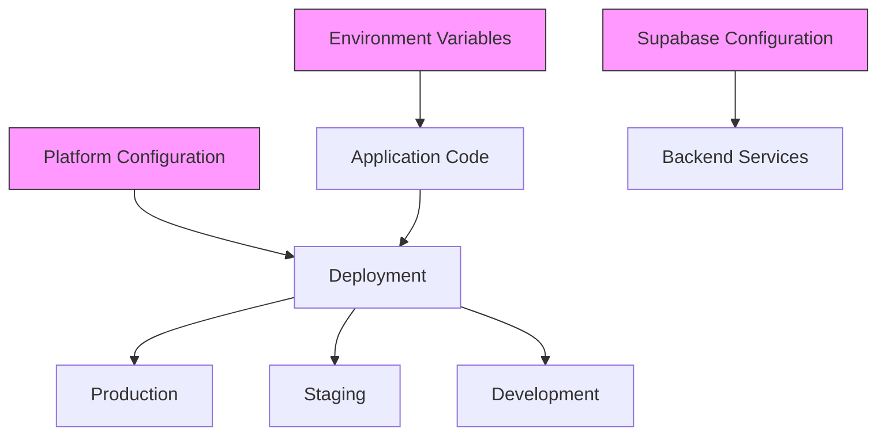
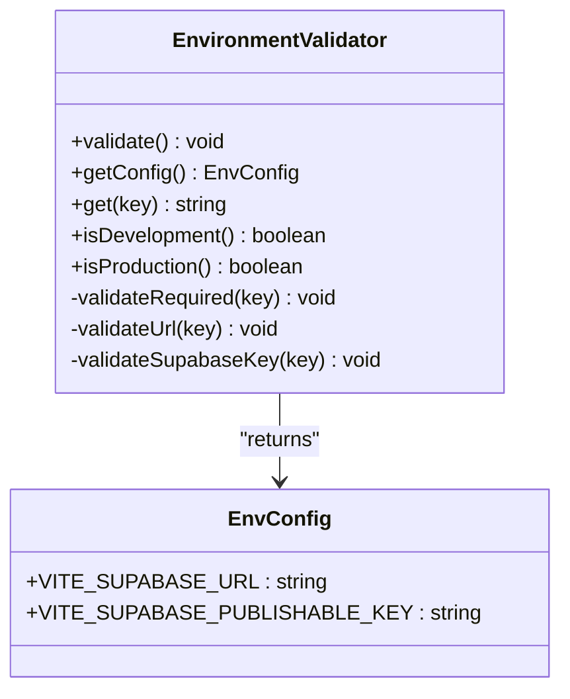
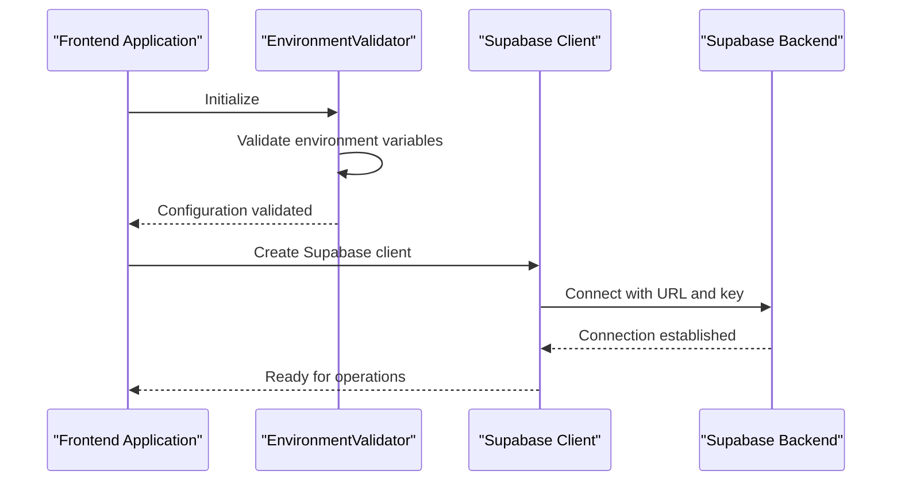
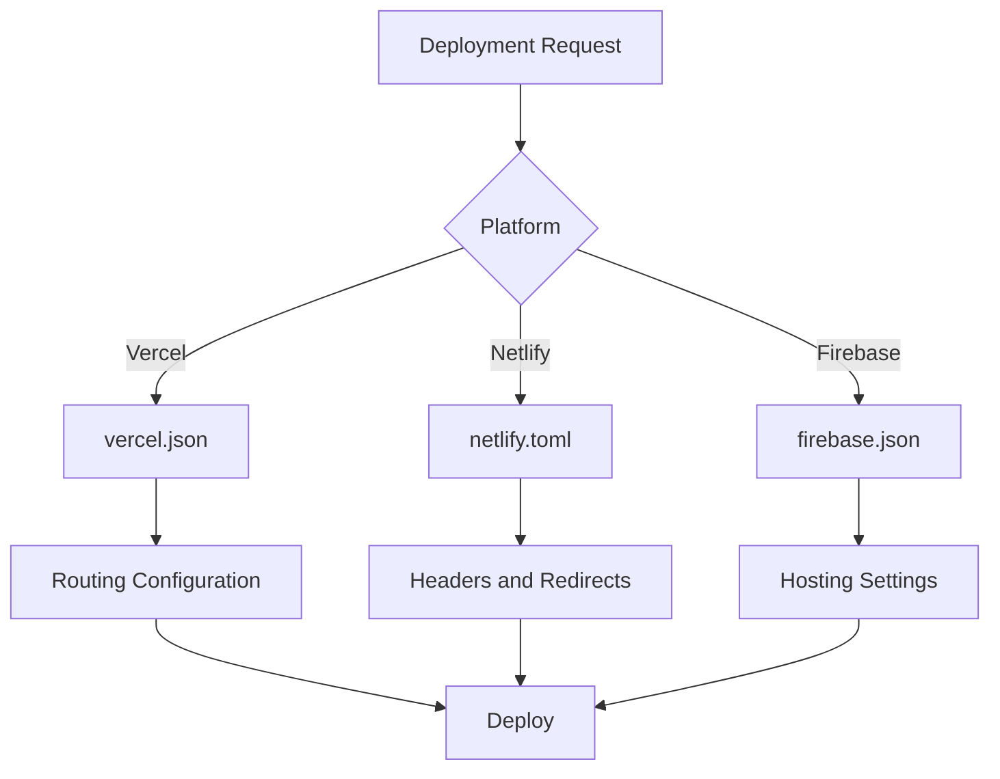
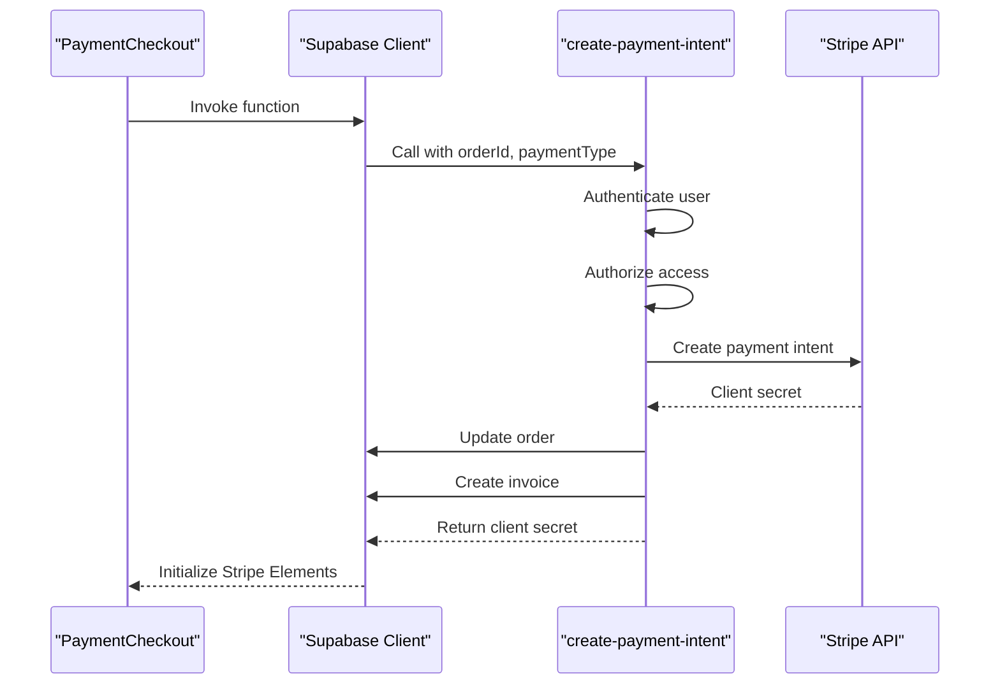
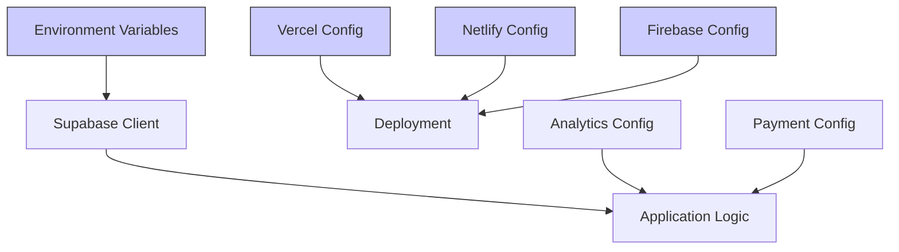

# Environment Configuration

<cite>
**Referenced Files in This Document**   
- [config.toml](file://supabase/config.toml)
- [vercel.json](file://vercel.json)
- [netlify.toml](file://netlify.toml)
- [firebase.json](file://firebase.json)
- [client.ts](file://src/integrations/supabase/client.ts)
- [env-validator.ts](file://src/lib/env-validator.ts)
- [update-supabase-key.sh](file://update-supabase-key.sh)
- [vite.config.ts](file://vite.config.ts)
- [analytics.ts](file://src/lib/analytics.ts)
- [AnalyticsProvider.tsx](file://src/components/AnalyticsProvider.tsx)
- [create-payment-intent/index.ts](file://supabase/functions/create-payment-intent/index.ts)
- [stripe-webhook/index.ts](file://supabase/functions/stripe-webhook/index.ts)
</cite>

## Table of Contents
1. [Introduction](#introduction)
2. [Project Structure](#project-structure)
3. [Core Components](#core-components)
4. [Architecture Overview](#architecture-overview)
5. [Detailed Component Analysis](#detailed-component-analysis)
6. [Dependency Analysis](#dependency-analysis)
7. [Performance Considerations](#performance-considerations)
8. [Troubleshooting Guide](#troubleshooting-guide)
9. [Conclusion](#conclusion)

## Introduction
This document provides comprehensive guidance on configuring and managing development, staging, and production environments for sleekapp-v100. The application leverages Supabase as its backend platform and supports deployment across multiple frontend hosting providers including Vercel, Netlify, and Firebase. The configuration system emphasizes security, environment isolation, and consistent deployment practices across different stages of the development lifecycle.

The environment configuration strategy focuses on secure credential management, proper isolation between environments, and streamlined deployment processes. Key aspects include environment variable validation, secure storage of API keys and database credentials, and consistent configuration across different hosting platforms.

**Section sources**
- [README.md](file://README.md#L1-L50)

## Project Structure
The project follows a standard modern web application structure with clear separation between frontend components, backend functions, and configuration files. The environment-specific configuration is primarily managed through three key files: `supabase/config.toml` for Supabase function settings, `vercel.json` for Vercel deployment configuration, `netlify.toml` for Netlify settings, and `firebase.json` for Firebase hosting configuration.

The `supabase` directory contains all backend-related configuration including database migrations, seed data, and edge function settings. The `src` directory houses the frontend application code with environment variables accessed through the Vite build system. Deployment configurations are maintained in the root directory to support multiple hosting platforms.

**Diagram sources**
- [supabase/config.toml](file://supabase/config.toml#L1-L80)
- [vercel.json](file://vercel.json#L1-L6)
- [netlify.toml](file://netlify.toml#L1-L123)
- [firebase.json](file://firebase.json#L1-L44)
- [vite.config.ts](file://vite.config.ts#L1-L215)

**Section sources**
- [project_structure](file://#L1-L200)

## Core Components
The environment configuration system centers around several core components that work together to ensure secure and reliable application operation across different environments. The primary components include the environment variable validation system, Supabase client configuration, and deployment platform integrations.

The environment validation system implemented in `env-validator.ts` ensures that all required environment variables are present and correctly formatted before the application initializes. This prevents runtime errors due to missing or invalid configuration. The Supabase client configuration establishes secure connections to the database with proper authentication, while the deployment configurations optimize performance and security for each hosting platform.

**Section sources**
- [env-validator.ts](file://src/lib/env-validator.ts#L1-L143)
- [client.ts](file://src/integrations/supabase/client.ts#L1-L20)
- [vite.config.ts](file://vite.config.ts#L1-L215)

## Architecture Overview
The environment configuration architecture follows a layered approach with clear separation between environment variables, platform-specific configurations, and application code. The system is designed to provide maximum flexibility while maintaining security and consistency across different deployment targets.

**Diagram sources**
- [env-validator.ts](file://src/lib/env-validator.ts#L1-L143)
- [vite.config.ts](file://vite.config.ts#L1-L215)
- [config.toml](file://supabase/config.toml#L1-L80)

## Detailed Component Analysis

### Environment Variable Management
The environment variable management system is implemented through a robust validation mechanism that ensures configuration integrity across all environments. The `EnvironmentValidator` class in `env-validator.ts` performs comprehensive validation of required variables, including format checking for URLs and API keys.

The system uses Vite's environment variable convention with `VITE_` prefix to expose variables to the frontend application. Critical configuration includes the Supabase URL and publishable key, which are validated on application startup. In production environments, the validation is enforced strictly to prevent deployment with incomplete configuration.

**Diagram sources**
- [env-validator.ts](file://src/lib/env-validator.ts#L1-L143)

**Section sources**
- [env-validator.ts](file://src/lib/env-validator.ts#L1-L143)

### Supabase Integration
The Supabase integration is configured through multiple layers of configuration files that work together to provide a secure and reliable connection to the backend services. The `config.toml` file in the supabase directory defines function-level settings, particularly the JWT verification requirements for each edge function.

The client configuration in `client.ts` establishes the connection using environment variables validated by the `env-validator` system. This ensures that the application only attempts to connect to Supabase with valid credentials. The configuration includes authentication settings such as session persistence and automatic token refresh.

**Diagram sources**
- [config.toml](file://supabase/config.toml#L1-L80)
- [client.ts](file://src/integrations/supabase/client.ts#L1-L20)
- [env-validator.ts](file://src/lib/env-validator.ts#L1-L143)

### Deployment Platform Configuration
The application supports multiple deployment platforms through platform-specific configuration files. Each platform has its own configuration file that defines routing, headers, and other deployment settings.

For Vercel, the `vercel.json` file configures routing to support client-side navigation in the React application. Netlify's `netlify.toml` provides extensive header configurations for security and caching, while Firebase's `firebase.json` defines hosting behavior including rewrites and asset caching.

**Diagram sources**
- [vercel.json](file://vercel.json#L1-L6)
- [netlify.toml](file://netlify.toml#L1-L123)
- [firebase.json](file://firebase.json#L1-L44)

**Section sources**
- [vercel.json](file://vercel.json#L1-L6)
- [netlify.toml](file://netlify.toml#L1-L123)
- [firebase.json](file://firebase.json#L1-L44)

### Analytics Configuration
The analytics system is configured with multiple tracking services including Google Analytics, Microsoft Clarity, Facebook Pixel, and LinkedIn Insight Tag. Configuration constants are defined in `analytics.ts` and exposed through the `AnalyticsProvider` component, which manages the initialization of tracking scripts.

The system implements deferred loading of analytics scripts to improve initial page load performance. User interaction triggers the loading of tracking code, ensuring that analytics do not block critical rendering paths. The configuration includes measurement IDs and container IDs for each service.

**Section sources**
- [analytics.ts](file://src/lib/analytics.ts#L1-L183)
- [AnalyticsProvider.tsx](file://src/components/AnalyticsProvider.tsx#L1-L148)

### Payment System Configuration
The payment system configuration integrates Stripe with Supabase through edge functions. The `create-payment-intent` function handles payment intent creation with proper authentication and authorization checks. Environment variables store the Stripe secret key and webhook secret, which are accessed securely within the edge function environment.

The configuration ensures that payment operations are only performed by authorized users (either the order owner or an admin). The system creates corresponding invoice records in Supabase when payment intents are created, maintaining consistency between payment status and order state.

**Diagram sources**
- [create-payment-intent/index.ts](file://supabase/functions/create-payment-intent/index.ts#L1-L262)
- [PaymentCheckout.tsx](file://src/pages/PaymentCheckout.tsx#L29-L174)

**Section sources**
- [create-payment-intent/index.ts](file://supabase/functions/create-payment-intent/index.ts#L1-L262)
- [stripe-webhook/index.ts](file://supabase/functions/stripe-webhook/index.ts#L1-L75)

## Dependency Analysis
The environment configuration system has minimal external dependencies, relying primarily on the built-in capabilities of the hosting platforms and Supabase. The configuration files are self-contained and do not require additional packages to function.

The system demonstrates loose coupling between the different configuration components, allowing changes to one platform's configuration without affecting others. This modularity enables teams to deploy to different platforms based on project requirements without significant reconfiguration.

**Diagram sources**
- [package.json](file://package.json#L1-L115)
- [vite.config.ts](file://vite.config.ts#L1-L215)

**Section sources**
- [package.json](file://package.json#L1-L115)

## Performance Considerations
The environment configuration contributes to application performance through several mechanisms. The Vite build configuration implements code splitting and chunk optimization to reduce initial load times. Asset caching headers in the platform configuration files ensure efficient browser caching of static resources.

The analytics system uses deferred loading to prevent tracking scripts from blocking the main thread during initial page load. Image optimization is handled through the Vite plugin configuration, automatically optimizing images during the build process.

**Section sources**
- [vite.config.ts](file://vite.config.ts#L1-L215)
- [netlify.toml](file://netlify.toml#L1-L123)
- [firebase.json](file://firebase.json#L1-L44)

## Troubleshooting Guide
Common environment-related issues and their solutions:

1. **Missing environment variables**: Ensure all required variables are set, particularly `VITE_SUPABASE_URL` and `VITE_SUPABASE_PUBLISHABLE_KEY`. Use the `update-supabase-key.sh` script to properly configure these values.

2. **Authentication failures**: Verify that the Supabase publishable key matches the project configuration. Check that the JWT verification settings in `config.toml` align with your authentication requirements.

3. **Deployment routing issues**: For client-side routing to work correctly, ensure that the platform configuration (vercel.json, netlify.toml, or firebase.json) includes proper rewrite rules to direct all routes to index.html.

4. **Analytics not tracking**: Confirm that the measurement IDs in `analytics.ts` are correct and that the `AnalyticsProvider` is properly wrapped around the application.

5. **Payment integration errors**: Verify that the Stripe secret key and webhook secret are correctly configured in the Supabase function environment variables.

**Section sources**
- [env-validator.ts](file://src/lib/env-validator.ts#L1-L143)
- [update-supabase-key.sh](file://update-supabase-key.sh#L1-L54)
- [vercel.json](file://vercel.json#L1-L6)
- [netlify.toml](file://netlify.toml#L1-L123)
- [firebase.json](file://firebase.json#L1-L44)

## Conclusion
The environment configuration system for sleekapp-v100 provides a robust foundation for managing development, staging, and production environments across multiple hosting platforms. By leveraging standardized configuration files and a comprehensive validation system, the application ensures consistent behavior and secure operation across all deployment targets.

The modular design allows for flexibility in deployment choices while maintaining a consistent configuration approach. The emphasis on security, performance, and reliability makes this configuration system well-suited for a production-grade application with complex environment requirements.