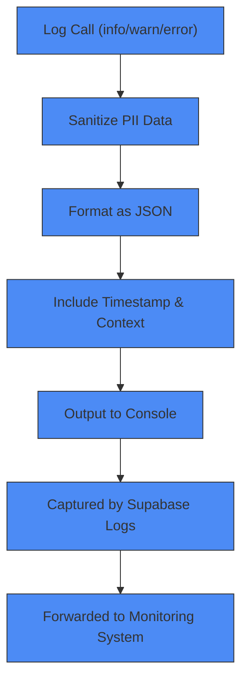
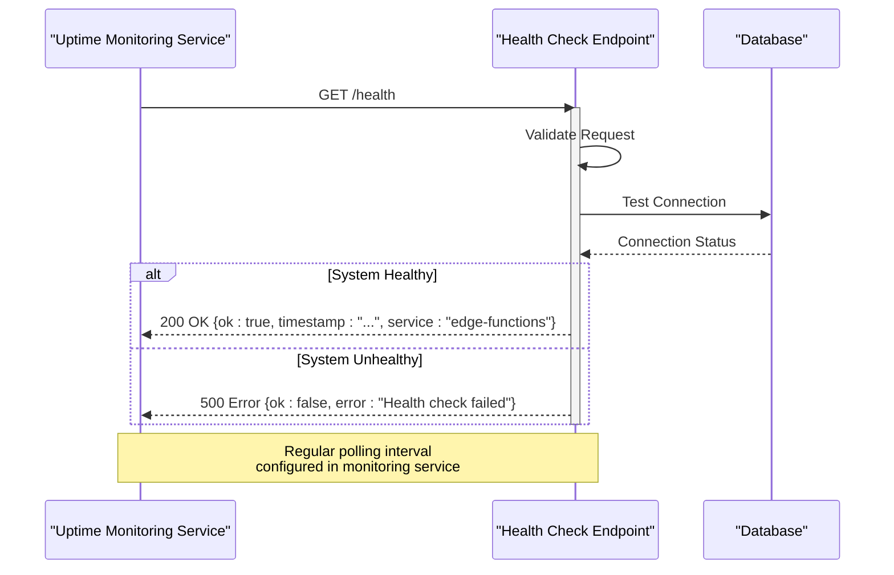
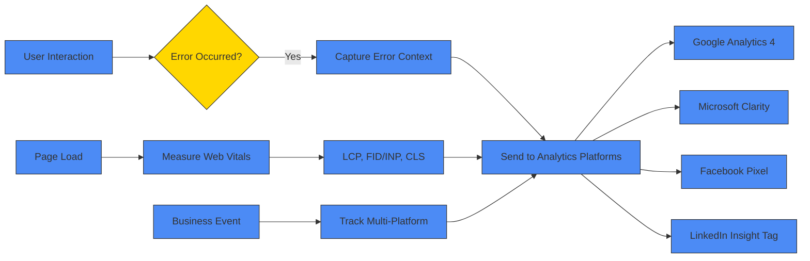
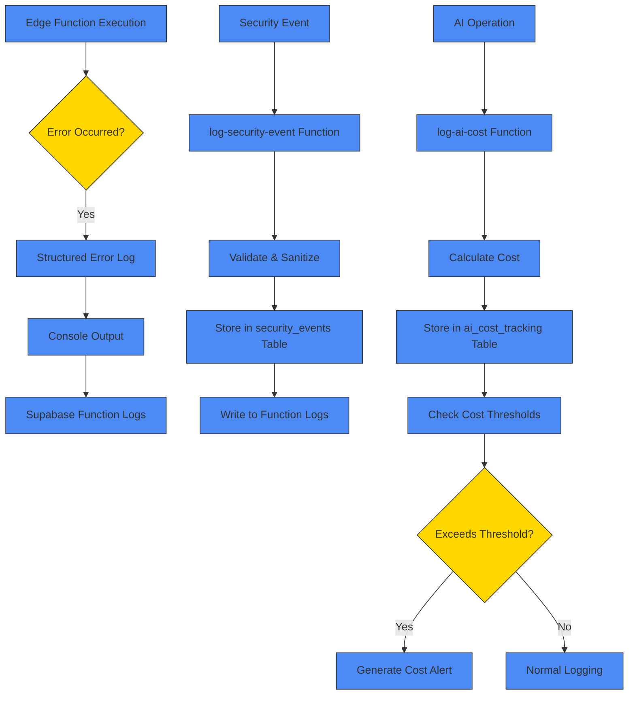
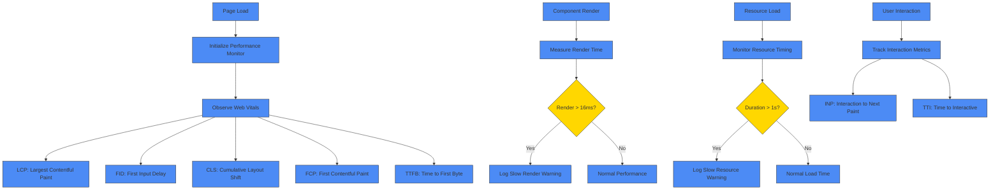
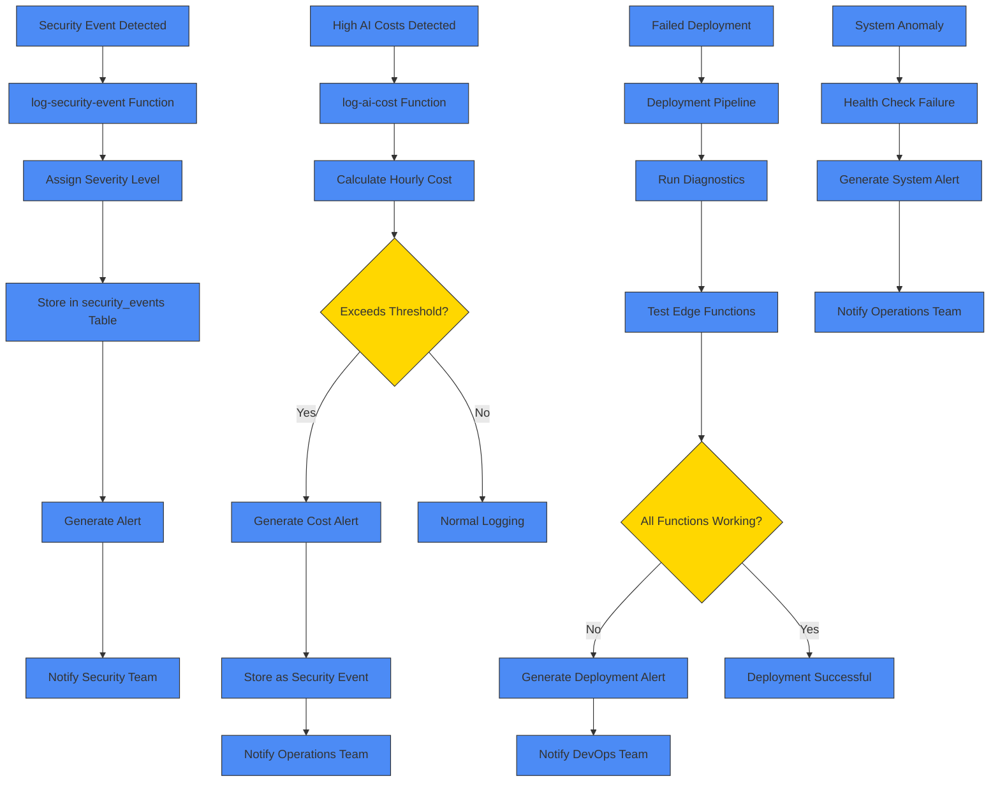
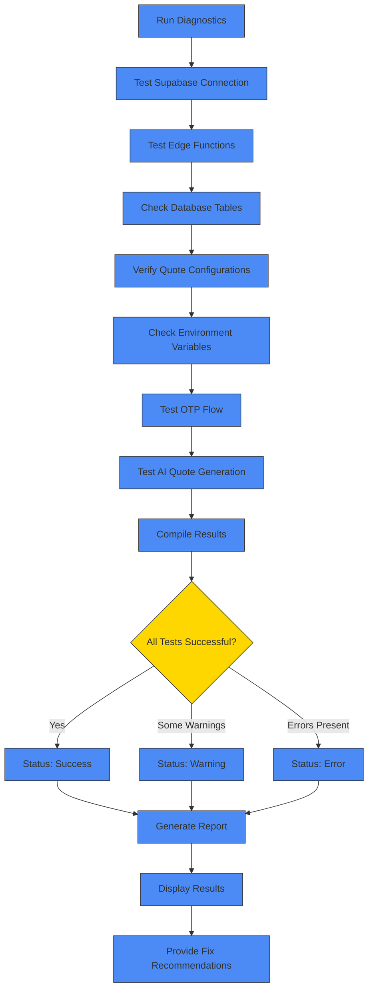
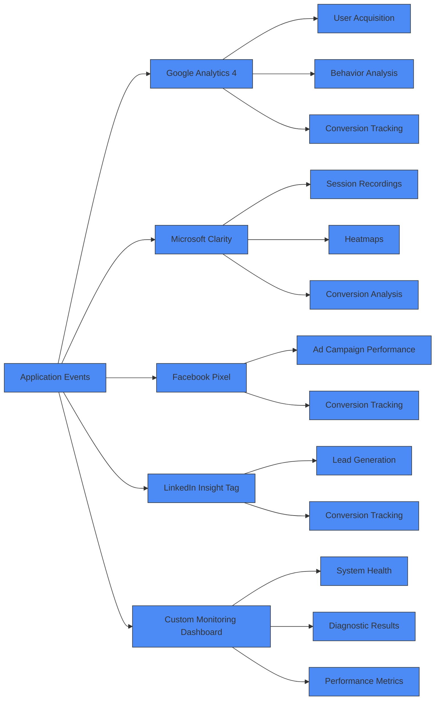
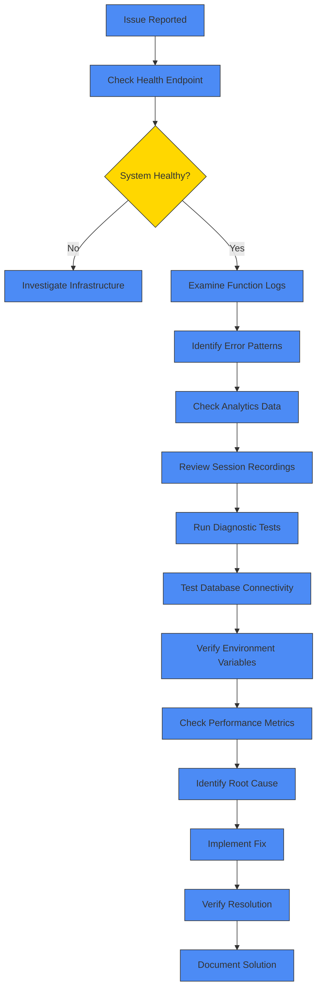

# Monitoring & Logging

<cite>
**Referenced Files in This Document**   
- [logger.ts](file://supabase/functions/_shared/logger.ts)
- [health/index.ts](file://supabase/functions/health/index.ts)
- [tracker.ts](file://src/lib/analytics/tracker.ts)
- [performanceMonitor.ts](file://src/lib/performanceMonitor.ts)
- [diagnostics.ts](file://src/lib/diagnostics.ts)
- [securityLogger.ts](file://supabase/functions/shared/securityLogger.ts)
- [useCoreWebVitals.ts](file://src/hooks/useCoreWebVitals.ts)
- [analytics.ts](file://src/lib/analytics.ts)
- [SystemHealthCheck.tsx](file://src/components/SystemHealthCheck.tsx)
- [log-security-event/index.ts](file://supabase/functions/log-security-event/index.ts)
- [log-ai-cost/index.ts](file://supabase/functions/log-ai-cost/index.ts)
- [usePerformance.ts](file://src/hooks/usePerformance.ts)
</cite>

## Table of Contents
1. [Introduction](#introduction)
2. [Structured Logging Implementation](#structured-logging-implementation)
3. [Health Check Endpoints](#health-check-endpoints)
4. [Frontend Error Tracking](#frontend-error-tracking)
5. [Backend Error Tracking](#backend-error-tracking)
6. [Performance Monitoring](#performance-monitoring)
7. [Alerting Mechanisms](#alerting-mechanisms)
8. [Diagnostic Workflows](#diagnostic-workflows)
9. [Monitoring Dashboard Integration](#monitoring-dashboard-integration)
10. [Troubleshooting Production Issues](#troubleshooting-production-issues)

## Introduction
The sleekapp-v100 application implements a comprehensive monitoring and logging system to ensure reliability, performance, and security across its frontend and backend components. The architecture combines structured logging, health checks, performance monitoring, and alerting mechanisms to provide comprehensive visibility into system operations. This documentation details the implementation of these monitoring components, focusing on how they work together to maintain system health and enable rapid troubleshooting of production issues.

## Structured Logging Implementation

The application implements structured logging across Supabase Edge Functions using a custom logger utility that ensures consistent log formatting and automatic PII (Personally Identifiable Information) sanitization. The logger is implemented in the shared logger.ts file and provides multiple log levels including INFO, WARN, ERROR, and SUCCESS.

The logging system automatically sanitizes sensitive data such as email addresses, phone numbers, order IDs, and authentication tokens to prevent accidental exposure in logs. Email addresses are sanitized to show only the first three characters followed by asterisks and the domain (e.g., joh***@example.com). Phone numbers display only the first four and last two digits (e.g., +880****90). Order IDs show only the first eight characters followed by asterisks.

Log entries are formatted as JSON objects with standardized fields including level, timestamp, context, message, and any additional data. This structured format enables easy parsing and analysis in monitoring systems. The logger also includes automatic stack trace capture for error logs, providing detailed context for debugging.

**Diagram sources**
- [logger.ts](file://supabase/functions/_shared/logger.ts#L93-L172)

**Section sources**
- [logger.ts](file://supabase/functions/_shared/logger.ts#L1-L173)

## Health Check Endpoints

The application implements health check endpoints to monitor system availability and integrate with uptime monitoring services. The primary health check endpoint is implemented in the health/index.ts file and responds to HTTP requests with a JSON payload indicating system status.

The health check endpoint follows REST conventions with proper HTTP status codes (200 for healthy, 500 for unhealthy) and includes CORS headers to allow cross-origin requests from monitoring services. The response includes a timestamp, service identifier, and OK status flag. The endpoint is designed to be lightweight and fast, minimizing the impact on system performance while providing reliable status information.

External uptime monitoring services can be configured to periodically call this endpoint and alert on failures or response time degradation. The health check can be integrated with services like UptimeRobot, Pingdom, or Datadog to provide 24/7 monitoring of application availability.

**Diagram sources**
- [health/index.ts](file://supabase/functions/health/index.ts#L1-L34)

**Section sources**
- [health/index.ts](file://supabase/functions/health/index.ts#L1-L34)

## Frontend Error Tracking

Frontend error tracking is implemented through a combination of analytics integration and custom tracking hooks. The application uses multiple analytics platforms including Google Analytics 4, Microsoft Clarity, Facebook Pixel, and LinkedIn Insight Tag to capture user behavior and errors.

The analytics system is configured in analytics.ts and provides functions to track page views, custom events, and business-specific events such as quote requests, contact form submissions, and design studio usage. These events are tracked across multiple platforms simultaneously through the trackMultiPlatformEvent function, which ensures consistent data collection across different analytics services.

The useCoreWebVitals hook implements Core Web Vitals tracking, monitoring key performance metrics including Largest Contentful Paint (LCP), First Input Delay (FID)/Interaction to Next Paint (INP), and Cumulative Layout Shift (CLS). These metrics are reported to analytics platforms to monitor user experience quality over time.

Error tracking is also implemented through the diagnostics system, which can be accessed through the SystemHealthCheck component. This allows users and administrators to run diagnostic tests and generate reports on system health.

**Diagram sources**
- [analytics.ts](file://src/lib/analytics.ts#L1-L183)
- [useCoreWebVitals.ts](file://src/hooks/useCoreWebVitals.ts#L1-L92)
- [SystemHealthCheck.tsx](file://src/components/SystemHealthCheck.tsx#L1-L101)

**Section sources**
- [analytics.ts](file://src/lib/analytics.ts#L1-L183)
- [tracker.ts](file://src/lib/analytics/tracker.ts#L1-L103)
- [useCoreWebVitals.ts](file://src/hooks/useCoreWebVitals.ts#L1-L92)
- [SystemHealthCheck.tsx](file://src/components/SystemHealthCheck.tsx#L1-L101)

## Backend Error Tracking

Backend error tracking is implemented through structured logging in Supabase Edge Functions and specialized logging functions for security and cost tracking. The system captures errors from all edge functions and stores them in a centralized logging system.

The securityLogger.ts file implements specialized functions for logging security events and AI cost tracking. Security events are logged to a dedicated security_events table with fields for event type, severity, source, IP address, user agent, and additional details. This allows for comprehensive security monitoring and incident response.

AI cost tracking is implemented to monitor the cost of AI service usage, particularly for LLM (Large Language Model) operations. The system calculates estimated costs based on token usage and logs this information to an ai_cost_tracking table. The cost tracking system also includes alerting for unusual cost patterns, such as hourly costs exceeding predefined thresholds.

The log-security-event and log-ai-cost edge functions provide HTTP endpoints for logging these specialized events from various parts of the application. These endpoints validate input, sanitize data, and store the information in the appropriate database tables while also writing to the function logs for immediate visibility.

**Diagram sources**
- [securityLogger.ts](file://supabase/functions/shared/securityLogger.ts#L1-L88)
- [log-security-event/index.ts](file://supabase/functions/log-security-event/index.ts#L1-L61)
- [log-ai-cost/index.ts](file://supabase/functions/log-ai-cost/index.ts#L1-L96)

**Section sources**
- [securityLogger.ts](file://supabase/functions/shared/securityLogger.ts#L1-L88)
- [log-security-event/index.ts](file://supabase/functions/log-security-event/index.ts#L1-L61)
- [log-ai-cost/index.ts](file://supabase/functions/log-ai-cost/index.ts#L1-L96)

## Performance Monitoring

Performance monitoring in sleekapp-v100 includes both frontend Core Web Vitals tracking and backend performance metrics. The system uses the performanceMonitor.ts utility to track key performance indicators and identify potential bottlenecks.

The frontend performance monitoring system tracks Core Web Vitals metrics including Largest Contentful Paint (LCP), First Input Delay (FID), Cumulative Layout Shift (CLS), First Contentful Paint (FCP), and Time to First Byte (TTFB). These metrics are collected using the PerformanceObserver API and reported to analytics platforms. The system also monitors slow component renders in React, logging warnings when render times exceed 16ms (the threshold for 60fps).

Resource timing is also monitored to identify slow-loading assets. The system checks for resources that take longer than 1 second to load and logs warnings in development mode. This helps identify performance issues related to large images, scripts, or third-party resources.

The usePerformance hook provides additional performance monitoring capabilities, including measurement of Time to Interactive (TTI) through long task observation. This helps identify JavaScript execution bottlenecks that may impact user experience.

**Diagram sources**
- [performanceMonitor.ts](file://src/lib/performanceMonitor.ts#L1-L195)
- [usePerformance.ts](file://src/hooks/usePerformance.ts#L1-L107)

**Section sources**
- [performanceMonitor.ts](file://src/lib/performanceMonitor.ts#L1-L195)
- [useCoreWebVitals.ts](file://src/hooks/useCoreWebVitals.ts#L1-L92)
- [usePerformance.ts](file://src/hooks/usePerformance.ts#L1-L107)

## Alerting Mechanisms

The application implements multiple alerting mechanisms for security events, failed deployments, and system anomalies. These alerts are triggered by specific conditions and are designed to notify appropriate personnel of potential issues.

Security event alerts are generated through the log-security-event function when suspicious activities are detected, such as captcha failures, rate limit violations, or suspicious patterns. These events are logged with severity levels (low, medium, high, critical) and can trigger notifications to security teams.

Cost-based alerts are implemented in the log-ai-cost function, which monitors AI service usage costs. When the hourly cost exceeds predefined thresholds ($1 for high severity, $5 for critical severity), a cost alert is generated and logged as a security event. This helps prevent unexpected cost spikes from AI service usage.

The system also includes deployment monitoring, where failed deployments can trigger alerts through integration with the deployment pipeline. While not explicitly shown in the code, the diagnostics system can be used to verify deployment success by testing edge function availability.

Anomaly detection is implemented through the combination of health checks and performance monitoring. Deviations from expected performance metrics or system availability can trigger alerts for further investigation.

**Diagram sources**
- [securityLogger.ts](file://supabase/functions/shared/securityLogger.ts#L1-L88)
- [log-security-event/index.ts](file://supabase/functions/log-security-event/index.ts#L1-L61)
- [log-ai-cost/index.ts](file://supabase/functions/log-ai-cost/index.ts#L1-L96)
- [diagnostics.ts](file://src/lib/diagnostics.ts#L1-L269)

**Section sources**
- [securityLogger.ts](file://supabase/functions/shared/securityLogger.ts#L1-L88)
- [log-security-event/index.ts](file://supabase/functions/log-security-event/index.ts#L1-L61)
- [log-ai-cost/index.ts](file://supabase/functions/log-ai-cost/index.ts#L1-L96)
- [diagnostics.ts](file://src/lib/diagnostics.ts#L1-L269)

## Diagnostic Workflows

The application includes comprehensive diagnostic workflows to troubleshoot production issues. The diagnostics system is implemented in diagnostics.ts and provides functions to test various components of the application.

The diagnostic system can test Supabase connection, edge function availability, database table existence, quote configurations, environment variables, and OTP flow functionality. These tests can be run individually or as a complete diagnostic report through the generateDiagnosticReport function.

The SystemHealthCheck component provides a user interface for running these diagnostics and viewing the results. Administrators can access this component to verify system health and generate diagnostic reports that can be shared with support teams.

Diagnostic results are categorized as success, warning, or error, with detailed messages and suggested fixes for issues. This helps streamline troubleshooting by providing clear guidance on resolving common problems.

**Diagram sources**
- [diagnostics.ts](file://src/lib/diagnostics.ts#L1-L269)
- [SystemHealthCheck.tsx](file://src/components/SystemHealthCheck.tsx#L1-L101)

**Section sources**
- [diagnostics.ts](file://src/lib/diagnostics.ts#L1-L269)
- [SystemHealthCheck.tsx](file://src/components/SystemHealthCheck.tsx#L1-L101)

## Monitoring Dashboard Integration

The monitoring system integrates with various analytics and monitoring dashboards to provide comprehensive visibility into application performance and user behavior. The application is configured to send data to multiple analytics platforms including Google Analytics 4, Microsoft Clarity, Facebook Pixel, and LinkedIn Insight Tag.

Google Analytics 4 is used for comprehensive web analytics, tracking user acquisition, behavior, and conversions. The GA4 configuration is defined in analytics.ts with the measurement ID and stream ID. Events are pushed to GA4 using the gtag function, providing detailed insights into user interactions.

Microsoft Clarity provides session recording and heatmaps to visualize user behavior. The Clarity project ID is configured in analytics.ts, enabling session recording, click tracking, and conversion analysis. This helps identify usability issues and optimize user experience.

Facebook Pixel and LinkedIn Insight Tag are used for advertising and conversion tracking, allowing the marketing team to measure campaign effectiveness and optimize ad spend.

The application also supports custom monitoring dashboards through the SystemHealthCheck component, which provides a real-time view of system health and diagnostic results.

**Diagram sources**
- [analytics.ts](file://src/lib/analytics.ts#L1-L183)
- [SystemHealthCheck.tsx](file://src/components/SystemHealthCheck.tsx#L1-L101)

**Section sources**
- [analytics.ts](file://src/lib/analytics.ts#L1-L183)
- [SystemHealthCheck.tsx](file://src/components/SystemHealthCheck.tsx#L1-L101)

## Troubleshooting Production Issues

Troubleshooting production issues in sleekapp-v100 follows a systematic approach using the available monitoring and diagnostic tools. When an issue is reported, the first step is to check the health check endpoint to verify system availability.

If the system is operational, the next step is to examine the structured logs from Supabase Edge Functions. The logs provide detailed information about function execution, including timestamps, context, and error messages with stack traces. The PII sanitization ensures that sensitive data is protected while still providing sufficient context for debugging.

For frontend issues, the analytics data can be examined to identify patterns in user behavior that may correlate with the reported issue. Session recordings from Microsoft Clarity can be particularly helpful in reproducing and understanding user-reported problems.

The diagnostic system can be used to test specific components of the application. For example, if users are reporting issues with quote generation, the testAIQuoteGeneration function can be run to verify that the AI quote generator is functioning correctly.

Database issues can be investigated by checking the existence of required tables and the configuration of quote configurations. Environment variable issues can be identified by verifying that all required variables are set.

Performance issues can be diagnosed using the performance monitoring data, including Core Web Vitals metrics and resource timing information. Slow component renders can be identified and optimized.

Security incidents can be investigated by examining the security_events table, which contains detailed information about security-related events including IP addresses, user agents, and event details.

**Diagram sources**
- [logger.ts](file://supabase/functions/_shared/logger.ts#L1-L173)
- [health/index.ts](file://supabase/functions/health/index.ts#L1-L34)
- [diagnostics.ts](file://src/lib/diagnostics.ts#L1-L269)
- [analytics.ts](file://src/lib/analytics.ts#L1-L183)
- [useCoreWebVitals.ts](file://src/hooks/useCoreWebVitals.ts#L1-L92)

**Section sources**
- [logger.ts](file://supabase/functions/_shared/logger.ts#L1-L173)
- [health/index.ts](file://supabase/functions/health/index.ts#L1-L34)
- [diagnostics.ts](file://src/lib/diagnostics.ts#L1-L269)
- [analytics.ts](file://src/lib/analytics.ts#L1-L183)
- [useCoreWebVitals.ts](file://src/hooks/useCoreWebVitals.ts#L1-L92)