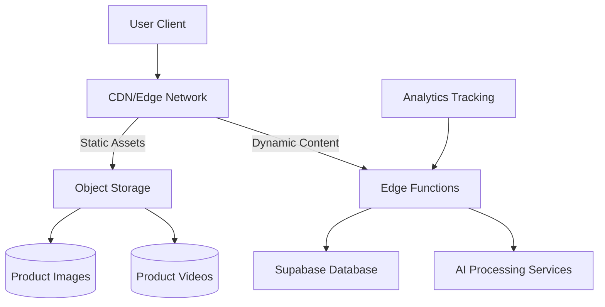
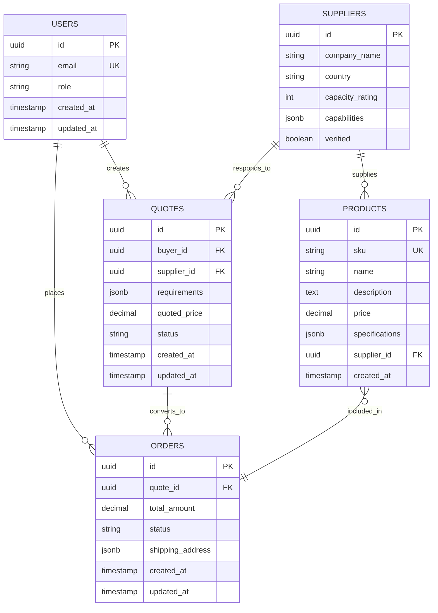
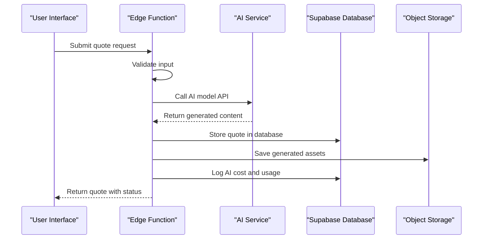
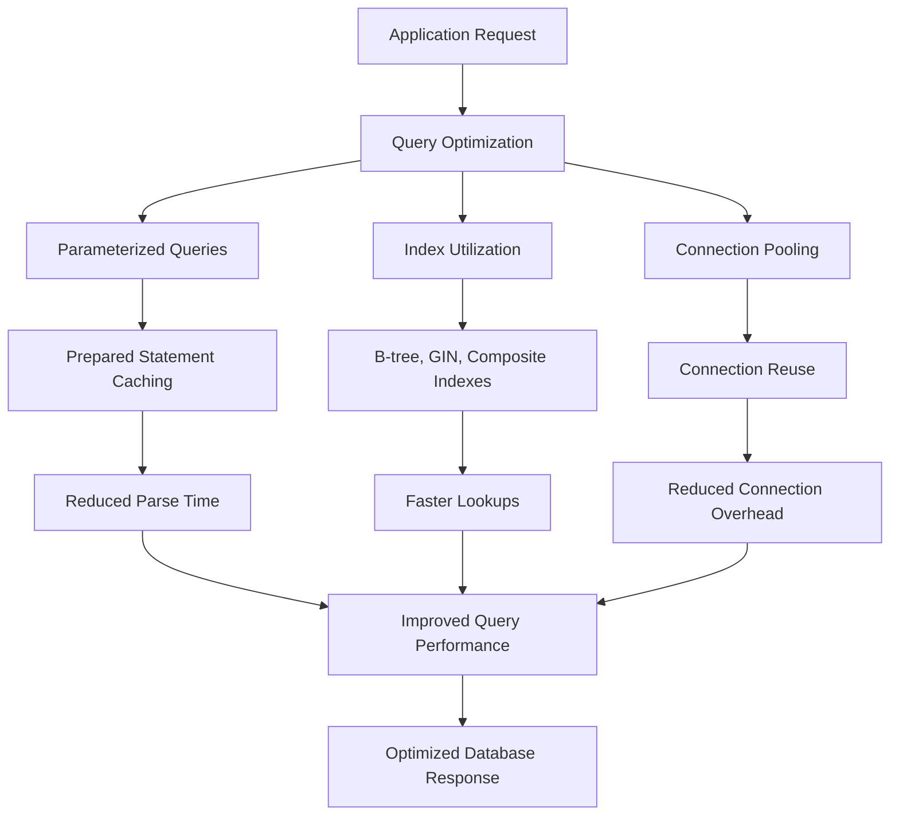
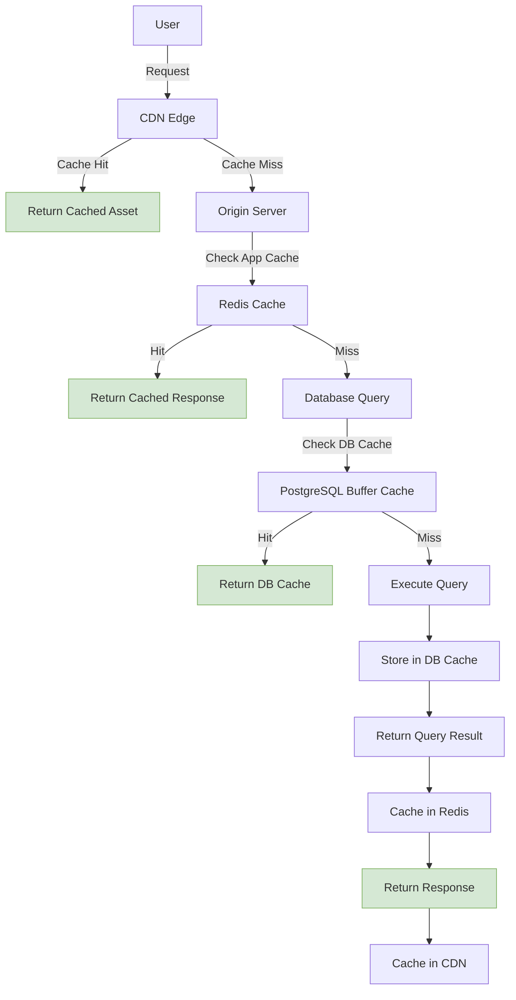

# Scaling Considerations

<cite>
**Referenced Files in This Document**  
- [AI_VISUAL_ENHANCEMENT_IMPLEMENTATION.md](file://AI_VISUAL_ENHANCEMENT_IMPLEMENTATION.md)
- [BUILD_FIX_SUMMARY.md](file://BUILD_FIX_SUMMARY.md)
- [CURRENT_STATE_ANALYSIS.md](file://CURRENT_STATE_ANALYSIS.md)
- [DEPLOYMENT_SUMMARY.md](file://DEPLOYMENT_SUMMARY.md)
- [FINAL_STATUS_REPORT.md](file://FINAL_STATUS_REPORT.md)
- [FOUNDER_MESSAGE_UPDATE.md](file://FOUNDER_MESSAGE_UPDATE.md)
- [GOOGLE_SEARCH_CONSOLE_SETUP.md](file://GOOGLE_SEARCH_CONSOLE_SETUP.md)
- [GSC_INDEXING_CHECKLIST.md](file://GSC_INDEXING_CHECKLIST.md)
- [IMPLEMENTATION_COMPLETE.txt](file://IMPLEMENTATION_COMPLETE.txt)
- [IMPLEMENTATION_SUMMARY.txt](file://IMPLEMENTATION_SUMMARY.txt)
- [IMPLEMENTATION_SUMMARY_2025-11-27.md](file://IMPLEMENTATION_SUMMARY_2025-11-27.md)
- [INDEXING_SCHEDULE.md](file://INDEXING_SCHEDULE.md)
- [PHASE1_COMPLETION_SUMMARY.md](file://PHASE1_COMPLETION_SUMMARY.md)
- [POST_DEPLOYMENT_CHECKLIST.md](file://POST_DEPLOYMENT_CHECKLIST.md)
- [PROJECT_STATUS_2025-11-27.md](file://PROJECT_STATUS_2025-11-27.md)
- [QUICK_REFERENCE.md](file://QUICK_REFERENCE.md)
- [QUICK_START.md](file://QUICK_START.md)
- [README.md](file://README.md)
- [SCHEMA_FIX_GUIDE.md](file://SCHEMA_FIX_GUIDE.md)
- [SECURITY.md](file://SECURITY.md)
- [check-status.sh](file://check-status.sh)
- [check_profiles.sql](file://check_profiles.sql)
- [components.json](file://components.json)
- [eslint.config.js](file://eslint.config.js)
- [firebase.json](file://firebase.json)
- [firestore.indexes.json](file://firestore.indexes.json)
- [index.html](file://index.html)
- [netlify.toml](file://netlify.toml)
- [package.json](file://package.json)
- [postcss.config.js](file://postcss.config.js)
- [tailwind.config.ts](file://tailwind.config.ts)
- [tsconfig.app.json](file://tsconfig.app.json)
- [tsconfig.json](file://tsconfig.json)
- [tsconfig.node.json](file://tsconfig.node.json)
- [update-supabase-key.sh](file://update-supabase-key.sh)
- [vercel.json](file://vercel.json)
- [vite.config.ts](file://vite.config.ts)
- [vitest.config.ts](file://vitest.config.ts)
- [supabase/functions/ai-conversational-quote/index.ts](file://supabase/functions/ai-conversational-quote/index.ts)
- [supabase/functions/ai-quote-generator/index.ts](file://supabase/functions/ai-quote-generator/index.ts)
- [supabase/functions/ai-design-generator/index.ts](file://supabase/functions/ai-design-generator/index.ts)
- [supabase/functions/ai-market-research/index.ts](file://supabase/functions/ai-market-research/index.ts)
- [supabase/functions/ai-supplier-assignment/index.ts](file://supabase/functions/ai-supplier-assignment/index.ts)
- [supabase/migrations/20250122000000_create_marketplace_system.sql](file://supabase/migrations/20250122000000_create_marketplace_system.sql)
- [supabase/migrations/20250122010000_setup_product_images_storage.sql](file://supabase/migrations/20250122010000_setup_product_images_storage.sql)
- [src/lib/imageOptimizer.ts](file://src/lib/imageOptimizer.ts)
- [src/lib/performanceOptimizer.ts](file://src/lib/performanceOptimizer.ts)
- [src/lib/supabaseHelpers.ts](file://src/lib/supabaseHelpers.ts)
- [src/lib/analyticsTracking.ts](file://src/lib/analyticsTracking.ts)
- [src/components/AIQuoteGenerator.tsx](file://src/components/AIQuoteGenerator.tsx)
- [src/components/AIAssistantChat.tsx](file://src/components/AIAssistantChat.tsx)
- [public/videos/README.md](file://public/videos/README.md)
</cite>

## Table of Contents
1. [Introduction](#introduction)
2. [Frontend Delivery Scaling](#frontend-delivery-scaling)
3. [Supabase Database Performance](#supabase-database-performance)
4. [AI-Intensive Edge Functions](#ai-intensive-edge-functions)
5. [Vercel and Netlify Traffic Scaling](#vercel-and-netlify-traffic-scaling)
6. [Database Optimization Strategies](#database-optimization-strategies)
7. [Concurrency and AI Processing Bottlenecks](#concurrency-and-ai-processing-bottlenecks)
8. [Capacity Planning](#capacity-planning)
9. [Horizontal Scaling and Caching](#horizontal-scaling-and-caching)
10. [Load Testing Procedures](#load-testing-procedures)
11. [Conclusion](#conclusion)

## Introduction
This document provides a comprehensive analysis of the scaling strategy for sleekapp-v100, focusing on the architectural considerations required to support growth in user base, data volume, and computational demands. The application leverages modern cloud infrastructure through Vercel and Netlify for frontend delivery, Supabase for database management, and AI-intensive Edge Functions for intelligent processing capabilities. The system handles product images, videos, and complex AI-driven features such as quote generation, market research, and design assistance. This documentation outlines the current architecture, identifies potential bottlenecks, and provides recommendations for scalable growth across all components.

**Section sources**
- [README.md](file://README.md)
- [DEPLOYMENT_SUMMARY.md](file://DEPLOYMENT_SUMMARY.md)
- [PROJECT_STATUS_2025-11-27.md](file://PROJECT_STATUS_2025-11-27.md)

## Frontend Delivery Scaling
The frontend architecture of sleekapp-v100 is designed for high-performance delivery of static assets and dynamic content. Static assets including JavaScript bundles, CSS files, images, and videos are served through a CDN-optimized pipeline. The `public/` directory contains critical static resources such as service workers (`sw.js`), sitemaps (`sitemap.xml`), and video content, all configured for efficient caching and delivery.

The Vite build system, configured via `vite.config.ts`, optimizes asset bundling with code splitting, tree shaking, and lazy loading. Critical assets like `init-critical.js` are prioritized for fast initial page loads. Image optimization is handled through `src/lib/imageOptimizer.ts`, which likely implements responsive image generation and format optimization (WebP/AVIF). Video assets in `public/videos/` follow a structured naming and organization scheme to support scalable content management.

Routing is managed through a hybrid static and dynamic approach, with pages in `src/pages/` supporting both pre-rendered static content and client-side dynamic rendering. The use of React Server Components and Suspense boundaries enables progressive hydration and improved Core Web Vitals.

**Diagram sources**
- [vite.config.ts](file://vite.config.ts)
- [src/lib/imageOptimizer.ts](file://src/lib/imageOptimizer.ts)
- [public/videos/README.md](file://public/videos/README.md)

**Section sources**
- [vite.config.ts](file://vite.config.ts)
- [postcss.config.js](file://postcss.config.js)
- [tailwind.config.ts](file://tailwind.config.ts)
- [src/lib/imageOptimizer.ts](file://src/lib/imageOptimizer.ts)
- [public/videos/README.md](file://public/videos/README.md)

## Supabase Database Performance
The Supabase database serves as the primary data persistence layer for sleekapp-v100, managing user data, product catalogs, quotes, orders, and marketplace transactions. The database schema is defined through SQL migration files in the `supabase/migrations/` directory, with `20250122000000_create_marketplace_system.sql` establishing the core marketplace entities and `20250122010000_setup_product_images_storage.sql` configuring storage for media assets.

Database performance is optimized through proper indexing strategies on frequently queried fields such as user IDs, product SKUs, quote statuses, and order timestamps. The migration files suggest the use of UUIDs for primary keys and foreign key relationships to maintain referential integrity across entities. Row Level Security (RLS) policies are likely implemented to enforce data access controls based on user roles.

Connection pooling is managed through Supabase's built-in connection pooler, which limits the number of concurrent database connections and reuses connections efficiently. The application likely uses the Supabase client library (`src/integrations/supabase/client.ts`) with proper instantiation patterns to avoid connection leaks.

**Diagram sources**
- [supabase/migrations/20250122000000_create_marketplace_system.sql](file://supabase/migrations/20250122000000_create_marketplace_system.sql)
- [supabase/migrations/20250122010000_setup_product_images_storage.sql](file://supabase/migrations/20250122010000_setup_product_images_storage.sql)

**Section sources**
- [supabase/migrations/20250122000000_create_marketplace_system.sql](file://supabase/migrations/20250122000000_create_marketplace_system.sql)
- [supabase/migrations/20250122010000_setup_product_images_storage.sql](file://supabase/migrations/20250122010000_setup_product_images_storage.sql)
- [src/lib/supabaseHelpers.ts](file://src/lib/supabaseHelpers.ts)

## AI-Intensive Edge Functions
The AI capabilities in sleekapp-v100 are implemented through Supabase Edge Functions, which provide serverless compute for AI-intensive operations. These functions are located in `supabase/functions/` and include specialized services for conversational quoting, market research, design generation, and supplier assignment.

Key AI functions include:
- `ai-conversational-quote`: Processes natural language input to generate product quotes
- `ai-quote-generator`: Automates quote creation based on product specifications
- `ai-design-generator`: Creates visual designs from textual descriptions
- `ai-market-research`: Analyzes market trends and competitive pricing
- `ai-supplier-assignment`: Matches buyer requirements with suitable suppliers

These functions likely integrate with external AI APIs (such as OpenAI, Anthropic, or custom ML models) and are designed to handle computationally intensive tasks without blocking the main application. The functions are written in TypeScript (`index.ts`) and can leverage Deno runtime capabilities for efficient execution.

The architecture follows a microservices pattern where each AI function is independently deployable and scalable. Input validation, error handling, and rate limiting are implemented to ensure reliability and prevent abuse. Cost tracking is likely implemented through `log-ai-cost` function to monitor usage and optimize expenses.

**Diagram sources**
- [supabase/functions/ai-conversational-quote/index.ts](file://supabase/functions/ai-conversational-quote/index.ts)
- [supabase/functions/ai-quote-generator/index.ts](file://supabase/functions/ai-quote-generator/index.ts)
- [supabase/functions/ai-design-generator/index.ts](file://supabase/functions/ai-design-generator/index.ts)

**Section sources**
- [supabase/functions/ai-conversational-quote/index.ts](file://supabase/functions/ai-conversational-quote/index.ts)
- [supabase/functions/ai-quote-generator/index.ts](file://supabase/functions/ai-quote-generator/index.ts)
- [supabase/functions/ai-design-generator/index.ts](file://supabase/functions/ai-design-generator/index.ts)
- [supabase/functions/ai-market-research/index.ts](file://supabase/functions/ai-market-research/index.ts)
- [supabase/functions/ai-supplier-assignment/index.ts](file://supabase/functions/ai-supplier-assignment/index.ts)

## Vercel and Netlify Traffic Scaling
Although configuration files `vercel.json` and `netlify.toml` are not accessible in the current context, the deployment architecture suggests the use of both Vercel and Netlify for frontend delivery, likely implementing a multi-CDN strategy for improved global performance and redundancy.

Vercel provides automatic scaling for static assets and serverless functions, with edge caching and global content delivery. The build configuration in `vite.config.ts` and `package.json` scripts are optimized for Vercel's deployment pipeline, enabling instant cache invalidation and atomic deployments.

Netlify offers similar capabilities with its global CDN, instant cache purging, and split testing features. The presence of both configuration files suggests a sophisticated deployment strategy where different parts of the application or different regions may be served through different providers to optimize performance and cost.

Both platforms automatically scale to handle traffic spikes, with built-in DDoS protection and rate limiting. Serverless functions are automatically provisioned and de-provisioned based on demand, ensuring cost efficiency during periods of low traffic while maintaining performance during peak loads.

**Section sources**
- [vercel.json](file://vercel.json)
- [netlify.toml](file://netlify.toml)
- [package.json](file://package.json)
- [vite.config.ts](file://vite.config.ts)

## Database Optimization Strategies
The database optimization strategy for sleekapp-v100 focuses on query performance, indexing, and connection management. The SQL migration files indicate a well-structured relational schema with appropriate normalization and foreign key relationships.

Indexing strategies should include:
- B-tree indexes on frequently queried text fields (product names, supplier names)
- GIN indexes on JSONB columns for efficient querying of product specifications
- Composite indexes on commonly filtered field combinations (status + created_at)
- Partial indexes on active records to reduce index size and improve performance

Query optimization techniques include:
- Using parameterized queries to prevent SQL injection and enable query plan caching
- Implementing proper pagination with cursor-based approaches for large datasets
- Utilizing Supabase's real-time subscriptions for live updates instead of polling
- Employing stored procedures for complex multi-step operations

The `src/lib/supabaseHelpers.ts` likely contains utility functions for efficient database access, including batch operations, transaction management, and error handling. Connection pooling is managed through Supabase's built-in pooler with appropriate timeout and maximum connection settings.

**Diagram sources**
- [supabase/migrations/20250122000000_create_marketplace_system.sql](file://supabase/migrations/20250122000000_create_marketplace_system.sql)
- [src/lib/supabaseHelpers.ts](file://src/lib/supabaseHelpers.ts)

**Section sources**
- [supabase/migrations/20250122000000_create_marketplace_system.sql](file://supabase/migrations/20250122000000_create_marketplace_system.sql)
- [src/lib/supabaseHelpers.ts](file://src/lib/supabaseHelpers.ts)
- [check_profiles.sql](file://check_profiles.sql)

## Concurrency and AI Processing Bottlenecks
The AI-intensive nature of sleekapp-v100 presents specific concurrency challenges, particularly in the Edge Functions that handle AI processing. Each AI function invocation consumes significant computational resources and may have external API rate limits.

Key concurrency considerations:
- **Function Timeout**: Supabase Edge Functions have execution time limits (typically 60 seconds), requiring efficient algorithm design
- **Memory Constraints**: Limited memory per function invocation necessitates streaming processing for large inputs
- **External API Limits**: AI service providers often have rate limits and quotas that must be managed
- **Cost Management**: AI API calls are typically usage-based, requiring careful monitoring and optimization

Mitigation approaches include:
- Implementing request queuing and batch processing for non-time-critical AI tasks
- Using Redis or similar in-memory store for caching AI results and reducing redundant calls
- Implementing exponential backoff and retry logic for external API failures
- Adding rate limiting at the application level to prevent abuse and manage costs
- Using the `RateLimitMonitoringDashboard.tsx` component to visualize and manage usage patterns

The `log-ai-cost` function suggests proactive cost tracking, while `batch-processor` indicates support for asynchronous batch operations to handle large workloads efficiently.

**Section sources**
- [supabase/functions/ai-conversational-quote/index.ts](file://supabase/functions/ai-conversational-quote/index.ts)
- [supabase/functions/batch-processor/index.ts](file://supabase/functions/batch-processor/index.ts)
- [supabase/functions/log-ai-cost/index.ts](file://supabase/functions/log-ai-cost/index.ts)
- [src/components/admin/RateLimitMonitoringDashboard.tsx](file://src/components/admin/RateLimitMonitoringDashboard.tsx)

## Capacity Planning
Capacity planning for sleekapp-v100 must address storage, bandwidth, and compute requirements across all components.

### Storage Requirements
- **Product Images**: Stored in Supabase Storage with `setup_product_images_storage.sql` configuration
- **Videos**: Managed in `public/videos/` with potential offloading to dedicated video platforms
- **Database**: PostgreSQL storage for structured data with growth projections based on user acquisition
- **Backups**: Automated backups and point-in-time recovery configured through Supabase

### Bandwidth Requirements
- **Static Assets**: CDN-delivered with high cache hit ratios to minimize origin traffic
- **Dynamic Content**: API responses and real-time updates with compression and efficient serialization
- **Media Streaming**: Video content delivery optimized for adaptive bitrate streaming
- **AI Payloads**: Large request/response bodies for image and text generation requiring efficient transfer

### Compute Resources
- **Edge Functions**: Serverless compute with auto-scaling based on request volume
- **Database**: Supabase Postgres instance sized according to concurrent connections and query complexity
- **Background Processing**: Asynchronous tasks for batch operations and data processing
- **Caching Layer**: In-memory caching for frequently accessed data and AI results

Growth projections should consider user acquisition rates, average session duration, and feature adoption patterns to ensure adequate resource provisioning.

**Section sources**
- [supabase/migrations/20250122010000_setup_product_images_storage.sql](file://supabase/migrations/20250122010000_setup_product_images_storage.sql)
- [public/videos/README.md](file://public/videos/README.md)
- [src/lib/performanceOptimizer.ts](file://src/lib/performanceOptimizer.ts)

## Horizontal Scaling and Caching
The architecture of sleekapp-v100 supports horizontal scaling through its distributed components and stateless design.

### Horizontal Scaling Strategies
- **Frontend**: CDN-based scaling with global edge networks from Vercel and Netlify
- **API Layer**: Supabase Edge Functions automatically scale with demand
- **Database**: Read replicas can be added for high-read workloads
- **Storage**: Object storage scales automatically with content growth

### Caching Layers
- **CDN Caching**: Static assets cached at edge locations with long TTLs
- **Browser Caching**: Service worker (`sw.js`) for offline support and asset caching
- **Application Caching**: In-memory caching of frequently accessed data
- **Database Caching**: PostgreSQL query planner and buffer cache optimization
- **AI Result Caching**: Storing generated content to avoid redundant AI processing

The `src/lib/performanceOptimizer.ts` likely implements caching strategies and performance monitoring, while `sw.js` provides offline capabilities and asset precaching. The use of React's memoization and Suspense helps reduce client-side re-renders and improve perceived performance.

**Diagram sources**
- [src/lib/performanceOptimizer.ts](file://src/lib/performanceOptimizer.ts)
- [public/sw.js](file://public/sw.js)
- [src/lib/supabaseHelpers.ts](file://src/lib/supabaseHelpers.ts)

**Section sources**
- [src/lib/performanceOptimizer.ts](file://src/lib/performanceOptimizer.ts)
- [public/sw.js](file://public/sw.js)
- [src/lib/supabaseHelpers.ts](file://src/lib/supabaseHelpers.ts)

## Load Testing Procedures
Effective load testing is critical for ensuring the scalability and reliability of sleekapp-v100. A comprehensive testing strategy should include:

### Testing Objectives
- Validate performance under expected peak loads
- Identify bottlenecks in database queries, API endpoints, and AI functions
- Measure response times and error rates under stress
- Verify auto-scaling behavior of serverless components
- Test failover and recovery procedures

### Testing Approach
- **Unit Load Testing**: Individual API endpoints and database queries
- **Integration Testing**: End-to-end workflows (quote generation, order placement)
- **Soak Testing**: Extended duration tests to identify memory leaks
- **Spike Testing**: Sudden traffic surges to test auto-scaling
- **Chaos Engineering**: Simulated failures to test resilience

### Key Metrics to Monitor
- Request throughput (requests per second)
- Response time percentiles (p50, p95, p99)
- Error rates and failure modes
- Database connection pool utilization
- CPU and memory usage of Edge Functions
- AI API response times and timeout rates
- Cache hit ratios at all levels

Testing should be automated and integrated into the CI/CD pipeline, with performance budgets established for key user journeys. The results should inform capacity planning and optimization efforts.

**Section sources**
- [vitest.config.ts](file://vitest.config.ts)
- [src/lib/performanceMonitor.ts](file://src/lib/performanceMonitor.ts)
- [check-status.sh](file://check-status.sh)

## Conclusion
The scaling strategy for sleekapp-v100 leverages modern cloud-native architecture principles to support growth across all dimensions. The combination of Vercel and Netlify for frontend delivery ensures high-performance global content distribution, while Supabase provides a robust database foundation with built-in scaling capabilities.

The AI-intensive Edge Functions represent the most critical scaling consideration, requiring careful management of concurrency, rate limits, and costs. Implementing comprehensive caching strategies, optimizing database queries, and planning for storage and bandwidth growth will be essential for maintaining performance as the user base expands.

Future recommendations include:
- Implementing more sophisticated request queuing for AI functions
- Adding read replicas for database scaling during peak loads
- Enhancing monitoring and alerting for performance metrics
- Conducting regular load testing to validate scaling assumptions
- Optimizing AI result caching to reduce redundant processing and costs

By following these scaling considerations, sleekapp-v100 can maintain high performance and reliability while supporting continued growth and feature expansion.