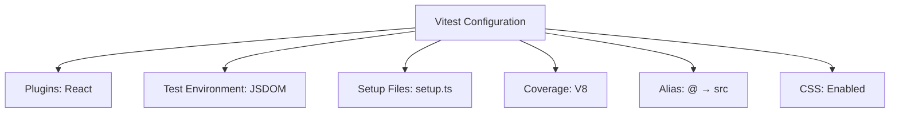
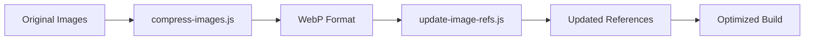
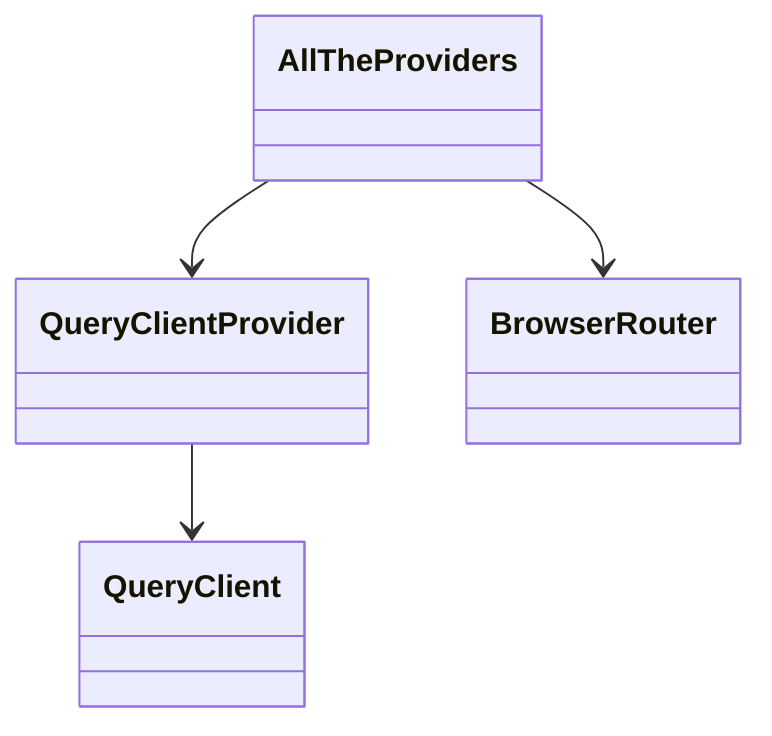

# Development Environment

<cite>
**Referenced Files in This Document**   
- [package.json](file://package.json)
- [vite.config.ts](file://vite.config.ts)
- [tsconfig.json](file://tsconfig.json)
- [tsconfig.app.json](file://tsconfig.app.json)
- [tsconfig.node.json](file://tsconfig.node.json)
- [vitest.config.ts](file://vitest.config.ts)
- [netlify.toml](file://netlify.toml)
- [vercel.json](file://vercel.json)
- [src/test/setup.ts](file://src/test/setup.ts)
- [src/test/utils/test-utils.tsx](file://src/test/utils/test-utils.tsx)
- [scripts/setup-database.js](file://scripts/setup-database.js)
- [scripts/compress-images.js](file://scripts/compress-images.js)
- [scripts/update-image-refs.js](file://scripts/update-image-refs.js)
- [scripts/fix-supabase-imports.sh](file://scripts/fix-supabase-imports.sh)
</cite>

## Table of Contents
1. [Configuration Files](#configuration-files)
2. [Development Setup](#development-setup)
3. [Build and Deployment](#build-and-deployment)
4. [Testing Strategy](#testing-strategy)
5. [Troubleshooting Guide](#troubleshooting-guide)
6. [Performance Optimization](#performance-optimization)
7. [Environment Customization](#environment-customization)

## Configuration Files

This section documents the core configuration files that define the development environment for sleekapp-v100.

### package.json
The `package.json` file serves as the project manifest, defining dependencies, scripts, and project metadata. It includes:
- **Dependencies**: Key libraries such as React 18.3.1, React Router 6.30.1, Supabase JS client 2.58.0, Firebase 12.6.0, and Tailwind CSS 3.4.17
- **Dev Dependencies**: Development tools including Vite 7.1.9, Vitest 4.0.14, TypeScript 5.8.3, ESLint 9.32.0, and testing libraries
- **Scripts**: Development workflow commands:
  - `dev`: Start development server
  - `build`: Create production build
  - `build:dev`: Create development build
  - `lint`: Run ESLint for code quality
  - `preview`: Preview production build locally

**Section sources**
- [package.json](file://package.json#L1-L115)

### vite.config.ts
The Vite configuration file defines build settings, development server options, and optimization strategies. Key features include:
- **Server Configuration**: Development server runs on port 8080 with HMR on port 8081
- **Plugins**: 
  - `@vitejs/plugin-react-swc` for React compilation
  - `vite-plugin-remove-console` to strip console logs in production
  - `vite-plugin-compression` for gzip and Brotli compression
  - `vite-plugin-image-optimizer` for automatic image optimization
  - `rollup-plugin-visualizer` for bundle analysis
- **Build Optimization**: 
  - Code splitting with strategic chunking (react-core, react-dom, router, query, etc.)
  - CSS code splitting disabled for better caching
  - Lightning CSS for faster minification
  - Asset inlining for files under 4KB
- **Alias Resolution**: `@` alias maps to `src` directory
- **Environment Variables**: Supabase and Stripe keys with fallback values

**Section sources**
- [vite.config.ts](file://vite.config.ts#L1-L215)

### tsconfig.json
The TypeScript configuration orchestrates type checking and compilation. The project uses a composite configuration with:
- **References**: Points to `tsconfig.app.json` and `tsconfig.node.json`
- **Path Mapping**: `@/*` imports resolve to `./src/*`
- **Compiler Options**: 
  - `skipLibCheck: true` for faster compilation
  - `allowJs: true` to support JavaScript files
  - `strictNullChecks: false` for flexibility
  - Various strictness rules disabled for development speed

**Section sources**
- [tsconfig.json](file://tsconfig.json#L1-L16)
- [tsconfig.app.json](file://tsconfig.app.json#L1-L30)
- [tsconfig.node.json](file://tsconfig.node.json#L1-L23)

### vitest.config.ts
The Vitest configuration enables comprehensive testing with:
- **Environment**: JSDOM for browser-like testing environment
- **Setup Files**: `src/test/setup.ts` for global test configuration
- **Coverage**: V8 coverage reporting with text, JSON, and HTML output
- **Alias Resolution**: `@` maps to `src` directory
- **CSS Support**: CSS processing enabled for component testing



**Diagram sources**
- [vitest.config.ts](file://vitest.config.ts#L1-L29)
- [src/test/setup.ts](file://src/test/setup.ts#L1-L43)

## Development Setup

This section provides step-by-step instructions for setting up the local development environment.

### Required Software
Before starting development, install the following prerequisites:
- **Node.js**: Version 18 or higher (LTS recommended)
- **pnpm**: Package manager (install via `npm install -g pnpm`)
- **Supabase CLI**: For database management (install via `npm install -g supabase`)
- **Git**: Version control system

### Environment Variables
Create a `.env` file in the project root with the following variables:
```
VITE_SUPABASE_URL=your_supabase_project_url
VITE_SUPABASE_PUBLISHABLE_KEY=your_anon_key
VITE_STRIPE_PUBLISHABLE_KEY=your_stripe_key
```

Obtain these values from your Supabase dashboard (Settings → API) and Stripe dashboard.

### Database Initialization
The application uses Supabase for backend services. Initialize the database using the provided scripts:

1. **Run setup script**:
```bash
node scripts/setup-database.js your_service_role_key
```

2. **Database setup process**:
   - The script verifies connection to Supabase
   - Checks for required tables (profiles, suppliers, products, orders, etc.)
   - Guides manual SQL execution for migrations
   - Seeds sample data for development

3. **Manual migration steps**:
   - Open Supabase SQL Editor
   - Execute `supabase/BASE_MIGRATION_SAFE.sql`
   - Execute migration files from `supabase/migrations/`
   - Run `supabase/seed_READY_TO_RUN.sql` for sample data

**Section sources**
- [scripts/setup-database.js](file://scripts/setup-database.js#L1-L308)

### Local Development Workflow
1. **Install dependencies**:
```bash
pnpm install
```

2. **Start development server**:
```bash
pnpm run dev
```

3. **Access the application**:
   - Web interface: http://localhost:8080
   - HMR server: http://localhost:8081

4. **Run tests**:
```bash
pnpm run test
```

5. **Lint code**:
```bash
pnpm run lint
```

## Build and Deployment

This section covers the build process and deployment options for sleekapp-v100.

### Build Process
The Vite build configuration optimizes the application for production:

1. **Run production build**:
```bash
pnpm run build
```

2. **Build features**:
   - Code splitting with strategic chunking
   - Gzip and Brotli compression
   - CSS minification with Lightning CSS
   - Image optimization to WebP format
   - Bundle analysis via visualizer
   - Console.log removal in production

3. **Development build** (for debugging):
```bash
pnpm run build:dev
```

### Deployment Targets
The application is configured for deployment to multiple platforms.

#### Vercel
The `vercel.json` configuration enables SPA routing:
```json
{
  "rewrites": [
    { "source": "/(.*)", "destination": "/index.html" }
  ]
}
```

This ensures client-side routing works correctly by redirecting all routes to `index.html`.

**Section sources**
- [vercel.json](file://vercel.json#L1-L6)

#### Netlify
The `netlify.toml` configuration provides comprehensive deployment settings:
- **Headers**: Security headers (X-Frame-Options, X-Content-Type-Options, etc.)
- **Caching**: Long-term caching for static assets (1 year, immutable)
- **Routing**: SPA fallback to `index.html` for client-side routing

Key features:
- Security headers for all routes
- Aggressive caching for assets, images, fonts, and media
- File-type specific caching rules
- SPA routing via 200 redirect

**Section sources**
- [netlify.toml](file://netlify.toml#L1-L123)

### Image Optimization Workflow
The project includes scripts for automated image optimization:

1. **Compress images to WebP**:
```bash
node scripts/compress-images.js
```

2. **Update image references**:
```bash
node scripts/update-image-refs.js
```

3. **Process flow**:


**Diagram sources**
- [scripts/compress-images.js](file://scripts/compress-images.js#L1-L76)
- [scripts/update-image-refs.js](file://scripts/update-image-refs.js#L1-L72)

## Testing Strategy

This section documents the testing approach and configuration for sleekapp-v100.

### Test Configuration
The testing environment is configured in `vitest.config.ts` with:
- JSDOM environment for browser simulation
- Global setup in `src/test/setup.ts`
- React testing library integration
- Coverage reporting
- Alias resolution

### Test Structure
Tests are organized in `src/test/` with:
- **setup.ts**: Global test configuration
- **utils/test-utils.tsx**: Custom render function with providers
- **mocks/**: Test-specific mocks
- Component tests in `src/components/__tests__/`
- Page tests in `src/pages/__tests__/`

### Test Utilities
The custom render function in `test-utils.tsx` wraps components with necessary providers:
- **QueryClientProvider**: For React Query
- **BrowserRouter**: For routing
- Configured with test-safe options (no retries)



**Diagram sources**
- [src/test/utils/test-utils.tsx](file://src/test/utils/test-utils.tsx#L1-L39)

### Running Tests
1. **Run all tests**:
```bash
pnpm run test
```

2. **Run tests in watch mode**:
```bash
pnpm run test --watch
```

3. **Run coverage**:
```bash
pnpm run test --coverage
```

4. **Run specific test file**:
```bash
pnpm run test path/to/test-file.test.tsx
```

## Troubleshooting Guide

This section addresses common setup issues and their solutions.

### Database Connection Issues
**Problem**: Service role key required for database setup
**Solution**: 
- Obtain service role key from Supabase Dashboard → Settings → API
- Run setup script with key: `node scripts/setup-database.js your_key_here`

**Problem**: Tables not found
**Solution**:
- Manually execute migration SQL in Supabase SQL Editor
- Run `BASE_MIGRATION_SAFE.sql` first
- Then execute individual migration files

### Build Errors
**Problem**: Module resolution issues
**Solution**:
- Verify `@` alias in `vite.config.ts` and `tsconfig.json`
- Ensure consistent import paths

**Problem**: Type errors
**Solution**:
- Check `tsconfig.app.json` configuration
- Ensure all dependencies are installed

### Environment Variable Issues
**Problem**: Missing environment variables
**Solution**:
- Create `.env` file in project root
- Add required variables (Supabase URL, publishable key, etc.)
- Restart development server

### Script Execution Issues
**Problem**: Permission denied for shell scripts
**Solution**:
- On Unix systems: `chmod +x scripts/fix-supabase-imports.sh`
- Run with: `./scripts/fix-supabase-imports.sh`

**Problem**: Image optimization script fails
**Solution**:
- Ensure Sharp and dependencies are installed
- Verify Node.js version compatibility
- Check file permissions

**Section sources**
- [scripts/fix-supabase-imports.sh](file://scripts/fix-supabase-imports.sh#L1-L15)

## Performance Optimization

This section provides tips for optimizing the development workflow.

### Development Server Performance
- **Pre-bundling**: Vite pre-bundles dependencies for faster startup
- **HMR**: Hot Module Replacement enables fast updates
- **Caching**: Image optimizer uses cache at `.cache/image-optimizer`

### Build Optimization
- **Code Splitting**: Strategic chunking reduces initial load
- **Compression**: Gzip and Brotli reduce file sizes
- **Asset Handling**: Images optimized to WebP format
- **CSS Optimization**: Single CSS file for better caching

### Bundle Analysis
Use the visualizer plugin to analyze bundle composition:
```bash
pnpm run build
# Generates dist/stats.html
```

### Image Optimization
Implement the image optimization workflow:
1. Run `compress-images.js` to convert images to WebP
2. Run `update-image-refs.js` to update references
3. Verify in build output

### Dependency Management
- Use pnpm for faster, disk-efficient package management
- Regularly update dependencies
- Audit for security vulnerabilities

## Environment Customization

This section addresses extension points for customizing the development environment.

### Vite Plugins
The configuration supports adding custom plugins:
- **Custom plugins**: Add to `plugins` array in `vite.config.ts`
- **Conditional plugins**: Use mode-based conditional loading
- **Post-processing**: Implement transform hooks

### TypeScript Configuration
Extend the TypeScript configuration by:
- Modifying `tsconfig.app.json` for app-specific rules
- Updating `tsconfig.node.json` for build script rules
- Adding new configuration files for specific purposes

### Testing Extensions
Customize the testing environment by:
- Adding new setup files
- Modifying coverage configuration
- Extending the custom render function
- Adding project-specific mocks

### Script Automation
Extend the scripts directory with:
- Database seeding scripts
- Data migration scripts
- Quality assurance scripts
- Deployment automation