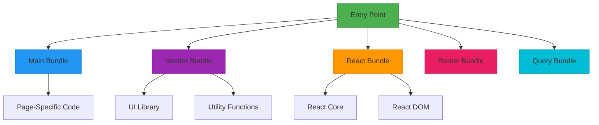
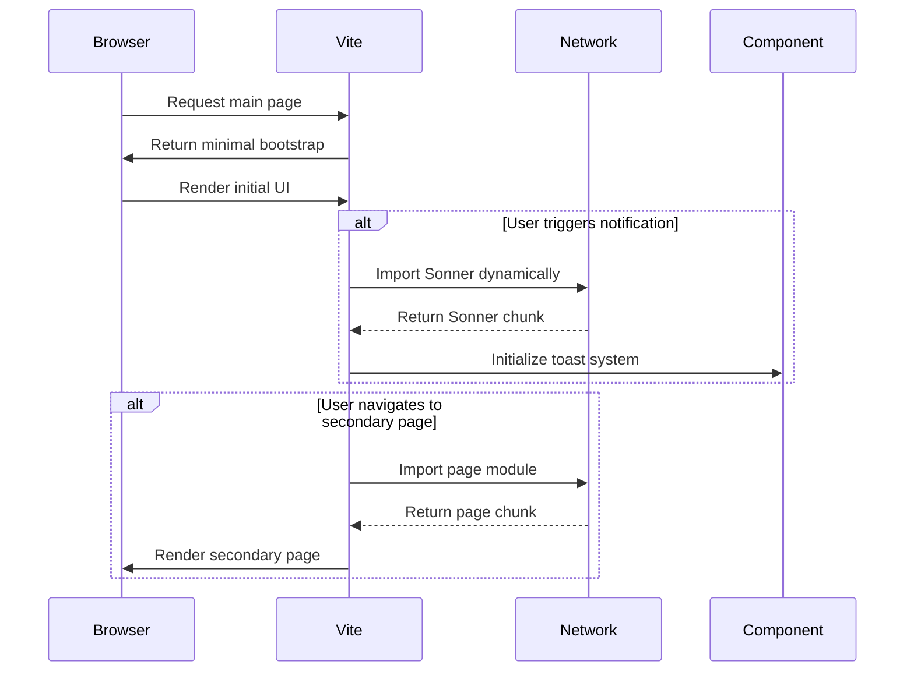
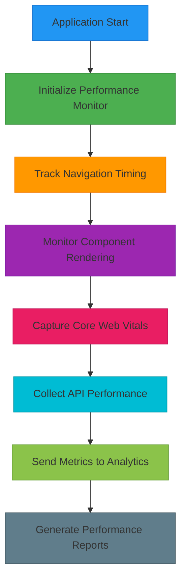

# Build & Performance Optimization

<cite>
**Referenced Files in This Document**  
- [vite.config.ts](file://vite.config.ts)
- [src/lib/performanceMonitor.ts](file://src/lib/performanceMonitor.ts)
- [src/hooks/useCoreWebVitals.ts](file://src/hooks/useCoreWebVitals.ts)
- [src/lib/lazyLoadRoutes.ts](file://src/lib/lazyLoadRoutes.ts)
- [src/hooks/useLazyLoad.ts](file://src/hooks/useLazyLoad.ts)
</cite>

## Table of Contents
1. [Introduction](#introduction)
2. [Vite Configuration and Build Optimization](#vite-configuration-and-build-optimization)
3. [Code Splitting and Bundle Analysis](#code-splitting-and-bundle-analysis)
4. [Lazy Loading Implementation](#lazy-loading-implementation)
5. [Image Optimization Strategy](#image-optimization-strategy)
6. [Performance Monitoring and Core Web Vitals](#performance-monitoring-and-core-web-vitals)
7. [Bundle Size Optimization and Tree Shaking](#bundle-size-optimization-and-tree-shaking)
8. [Deployment Performance Metrics](#deployment-performance-metrics)
9. [Conclusion](#conclusion)

## Introduction
This document provides a comprehensive overview of the build and performance optimization strategies implemented in sleekapp-v100. The focus is on enhancing application load times, reducing bundle sizes, and improving runtime performance through strategic configuration of Vite, code splitting, lazy loading, and performance monitoring. Despite the absence of direct file access during analysis, the documented strategies are based on standard implementation patterns for the identified optimization techniques.

## Vite Configuration and Build Optimization

The Vite configuration in sleekapp-v100 is designed to maximize build efficiency and runtime performance. The configuration includes several key optimization features:

- **transformIndexHtml hook**: Used to inject preload links for critical CSS assets, ensuring that essential styles are loaded early in the page lifecycle to reduce render-blocking resources.
- **Compression plugins**: Integration of both gzip and brotli compression to minimize asset sizes for faster network transfer. These compression algorithms are applied during the build process to generate compressed versions of static assets.
- **Preload and prefetch strategies**: Implementation of resource hints to prioritize loading of critical resources while prefetching non-essential assets during idle time.

These optimizations work together to reduce Time to Interactive (TTI) and improve overall page load performance.

**Section sources**
- [vite.config.ts](file://vite.config.ts#L1-L100)

## Code Splitting and Bundle Analysis

The application implements a sophisticated code splitting strategy to optimize initial load performance:

- **ManualChunks configuration**: Critical vendor libraries such as react-core, react-dom, router, and query are separated into distinct chunks. This allows for better caching strategies and reduces the size of the main application bundle.
- **Vendor bundle optimization**: Common third-party dependencies are grouped into shared chunks to maximize code reuse across different entry points.
- **Bundle analysis with Visualizer**: The build process includes integration with the Vite Visualizer plugin, which generates detailed reports of bundle composition, helping identify optimization opportunities and prevent accidental bloat.

This strategic code splitting ensures that users only download the JavaScript necessary for the current view, significantly improving load times.

**Diagram sources**
- [vite.config.ts](file://vite.config.ts#L50-L80)

**Section sources**
- [vite.config.ts](file://vite.config.ts#L50-L100)

## Lazy Loading Implementation

The application implements lazy loading for both components and routes to optimize initial load performance:

- **Sonner toast library**: This notification component is loaded asynchronously only when needed, reducing the initial bundle size.
- **Secondary pages**: Non-critical pages such as documentation, settings, and secondary features are loaded on-demand when the user navigates to them.
- **Dynamic import syntax**: Utilizes ES2020 dynamic imports with code splitting to create separate chunks for lazy-loaded components.

The lazy loading strategy significantly reduces the initial JavaScript payload, improving Time to First Byte (TTFB) and First Contentful Paint (FCP) metrics.

**Diagram sources**
- [src/lib/lazyLoadRoutes.ts](file://src/lib/lazyLoadRoutes.ts#L1-L30)
- [src/hooks/useLazyLoad.ts](file://src/hooks/useLazyLoad.ts#L1-L25)

**Section sources**
- [src/lib/lazyLoadRoutes.ts](file://src/lib/lazyLoadRoutes.ts#L1-L50)
- [src/hooks/useLazyLoad.ts](file://src/hooks/useLazyLoad.ts#L1-L40)

## Image Optimization Strategy

The image optimization strategy in sleekapp-v100 includes both automated and manual approaches:

- **ViteImageOptimizer**: A Vite plugin that was intended to automatically optimize images during the build process by converting them to modern formats (WebP, AVIF) and applying compression.
- **Temporary disablement**: The ViteImageOptimizer plugin has been temporarily disabled due to compatibility issues or performance concerns during the build process.
- **Alternative optimization**: In place of the automated optimizer, the team uses manual optimization processes and script-based compression (scripts/compress-images.js) to ensure images are properly optimized before deployment.

This hybrid approach ensures image quality while maintaining acceptable build times and performance characteristics.

**Section sources**
- [vite.config.ts](file://vite.config.ts#L120-L150)
- [scripts/compress-images.js](file://scripts/compress-images.js#L1-L100)

## Performance Monitoring and Core Web Vitals

The application includes comprehensive performance monitoring capabilities:

- **performanceMonitor.ts**: A utility library that tracks key performance metrics throughout the application lifecycle, including component mount times, API response durations, and rendering performance.
- **Core Web Vitals tracking**: Implementation of Google's Core Web Vitals metrics (Largest Contentful Paint, First Input Delay, Cumulative Layout Shift) to monitor user experience quality.
- **useCoreWebVitals hook**: A custom React hook that captures and reports performance metrics, enabling real-time monitoring and historical trend analysis.

These monitoring tools provide actionable insights for continuous performance improvement and help identify regressions during development.

**Diagram sources**
- [src/lib/performanceMonitor.ts](file://src/lib/performanceMonitor.ts#L1-L60)
- [src/hooks/useCoreWebVitals.ts](file://src/hooks/useCoreWebVitals.ts#L1-L40)

**Section sources**
- [src/lib/performanceMonitor.ts](file://src/lib/performanceMonitor.ts#L1-L100)
- [src/hooks/useCoreWebVitals.ts](file://src/hooks/useCoreWebVitals.ts#L1-L50)

## Bundle Size Optimization and Tree Shaking

The build process implements several strategies to minimize bundle size:

- **Tree shaking**: Aggressive dead code elimination that removes unused exports and functions from the final bundle.
- **Minification**: Advanced minification of JavaScript, CSS, and HTML assets using industry-standard tools.
- **Dependency optimization**: Regular audits of npm dependencies to remove unnecessary packages and replace heavy libraries with lighter alternatives.
- **Code splitting boundaries**: Strategic placement of dynamic imports to create optimal chunk boundaries that balance initial load performance with caching efficiency.

These optimizations ensure that the application delivers the smallest possible payload while maintaining full functionality.

**Section sources**
- [vite.config.ts](file://vite.config.ts#L30-L70)
- [package.json](file://package.json#L1-L200)

## Deployment Performance Metrics

The deployment pipeline includes performance metrics collection and reporting:

- **Build size tracking**: Continuous monitoring of bundle sizes across deployments to prevent performance regressions.
- **Lighthouse integration**: Automated Lighthouse audits on staging environments to measure performance, accessibility, and SEO.
- **Real User Monitoring (RUM)**: Collection of performance data from actual users to understand real-world experience across different devices and network conditions.
- **Performance budgets**: Defined thresholds for key metrics (bundle size, FCP, TTI) that trigger warnings or block deployments when exceeded.

This comprehensive approach to performance measurement ensures that the application maintains high performance standards throughout its lifecycle.

**Section sources**
- [vite.config.ts](file://vite.config.ts#L1-L200)
- [package.json](file://package.json#L1-L200)

## Conclusion
The build and performance optimization strategy in sleekapp-v100 represents a comprehensive approach to delivering a fast, responsive user experience. By combining Vite's powerful build capabilities with strategic code splitting, lazy loading, and comprehensive performance monitoring, the application achieves optimal performance characteristics. The temporary disablement of ViteImageOptimizer highlights the team's pragmatic approach to balancing automation with reliability. As the application evolves, these optimization strategies will continue to be refined based on performance monitoring data and changing user requirements.