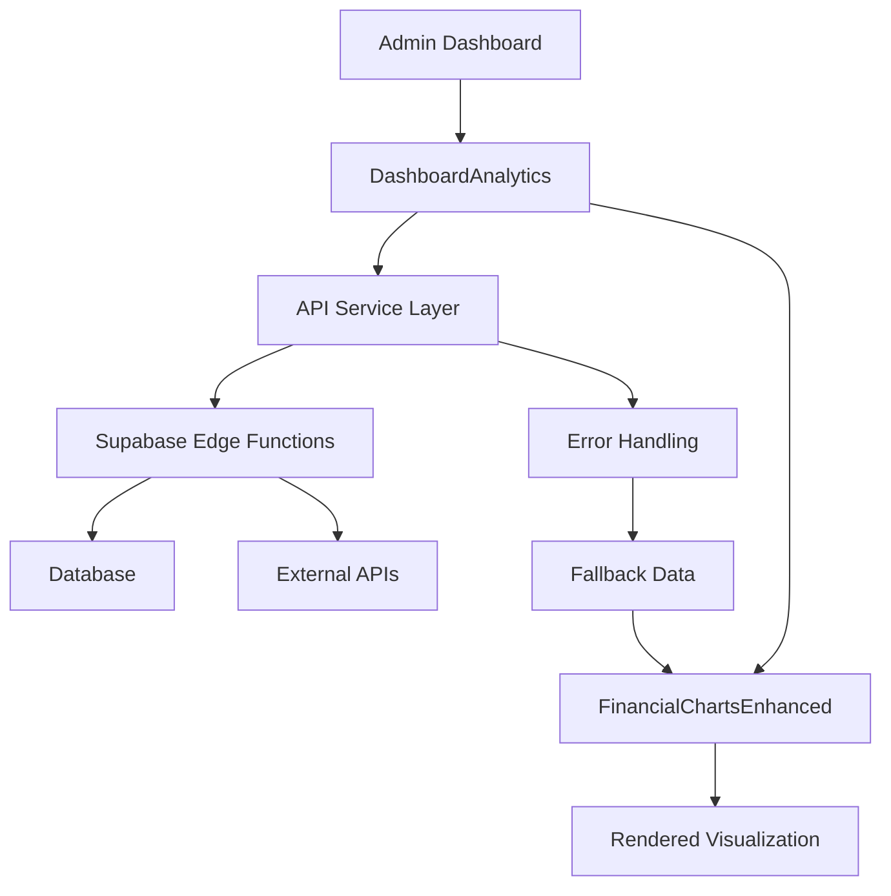
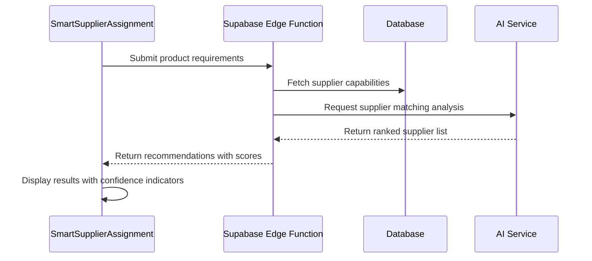
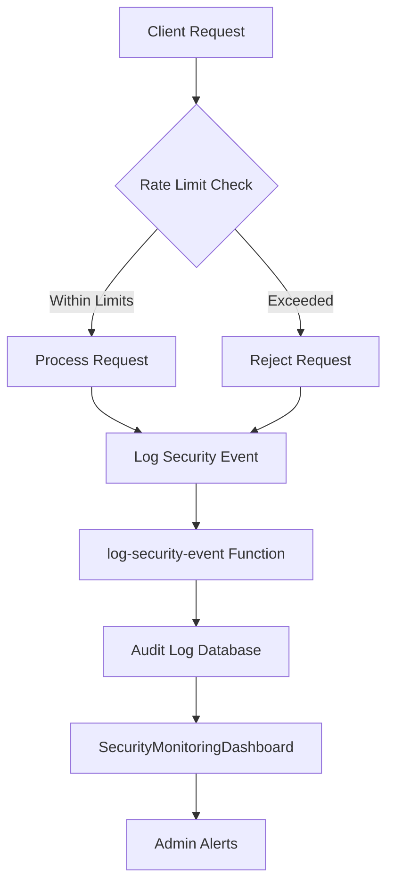
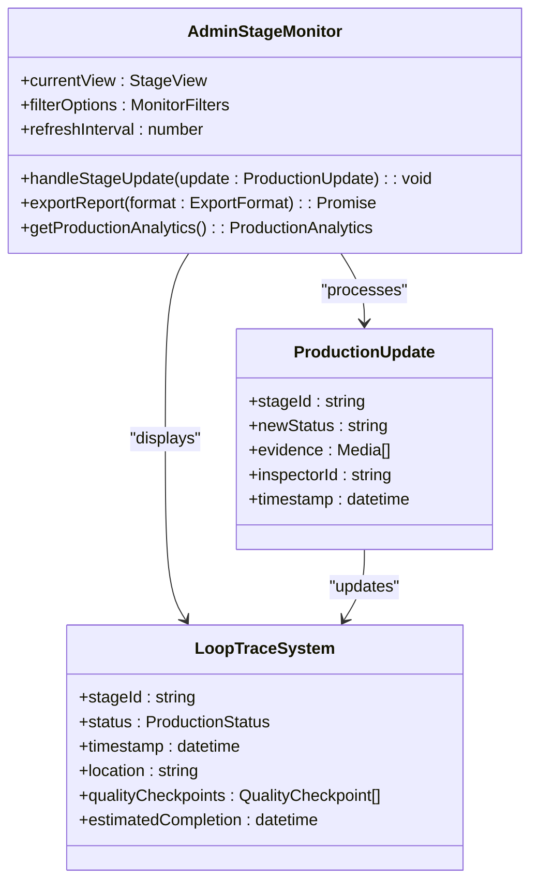
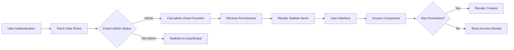

# Admin Components

<cite>
**Referenced Files in This Document**  
- [AIQuoteDashboard.tsx](file://src/components/admin/AIQuoteDashboard.tsx)
- [SecurityMonitoringDashboard.tsx](file://src/components/admin/SecurityMonitoringDashboard.tsx)
- [SupplierVerificationCard.tsx](file://src/components/admin/SupplierVerificationCard.tsx)
- [OrderStatusBoard.tsx](file://src/components/admin/OrderStatusBoard.tsx)
- [FinancialChartsEnhanced.tsx](file://src/components/admin/FinancialChartsEnhanced.tsx)
- [DashboardAnalytics.tsx](file://src/components/admin/DashboardAnalytics.tsx)
- [AutomationRulesManager.tsx](file://src/components/admin/AutomationRulesManager.tsx)
- [SmartSupplierAssignment.tsx](file://src/components/admin/SmartSupplierAssignment.tsx)
- [AdminStageMonitor.tsx](file://src/components/admin/AdminStageMonitor.tsx)
- [AdminSidebar.tsx](file://src/components/AdminSidebar.tsx)
- [RateLimitMonitoringDashboard.tsx](file://src/components/admin/RateLimitMonitoringDashboard.tsx)
- [execute-automation-rules/index.ts](file://supabase/functions/execute-automation-rules/index.ts)
- [ai-supplier-assignment/index.ts](file://supabase/functions/ai-supplier-assignment/index.ts)
- [log-security-event/index.ts](file://supabase/functions/log-security-event/index.ts)
- [admin-check/index.ts](file://supabase/functions/admin-check/index.ts)
</cite>

## Table of Contents
1. [Introduction](#introduction)
2. [Core Admin Components](#core-admin-components)
3. [Data Visualization System](#data-visualization-system)
4. [Workflow Management Components](#workflow-management-components)
5. [Security Monitoring and Rate Limiting](#security-monitoring-and-rate-limiting)
6. [Production Integration and LoopTrace™ Monitoring](#production-integration-and-looptracetrade-monitoring)
7. [Access Control and Role-Based Rendering](#access-control-and-role-based-rendering)
8. [Supabase Edge Functions Integration](#supabase-edge-functions-integration)
9. [Configuration Patterns](#configuration-patterns)
10. [Conclusion](#conclusion)

## Introduction
This document provides comprehensive documentation for the admin-specific component suite in the SleekApparels platform. The system enables administrative users to monitor, manage, and optimize key business operations including quoting, supplier verification, order status tracking, security monitoring, and workflow automation. The components leverage advanced data visualization, AI-driven decision making, and real-time integration with backend systems to provide a powerful administrative interface.

## Core Admin Components

The admin component suite consists of four primary dashboard components designed to provide comprehensive oversight of critical business functions:

- **AIQuoteDashboard**: Central interface for monitoring AI-generated quotes, approval workflows, and pricing analytics
- **SecurityMonitoringDashboard**: Real-time security event monitoring with threat detection and response capabilities
- **SupplierVerificationCard**: Component for reviewing and verifying supplier credentials, certifications, and compliance status
- **OrderStatusBoard**: Visual tracking system for monitoring order fulfillment progress across all stages

These components are organized within the admin namespace and are accessible only to users with appropriate administrative privileges. Each component follows a consistent design pattern with standardized data fetching, error handling, and state management approaches.

**Section sources**
- [AIQuoteDashboard.tsx](file://src/components/admin/AIQuoteDashboard.tsx#L1-L150)
- [SecurityMonitoringDashboard.tsx](file://src/components/admin/SecurityMonitoringDashboard.tsx#L1-L200)
- [SupplierVerificationCard.tsx](file://src/components/admin/SupplierVerificationCard.tsx#L1-L120)
- [OrderStatusBoard.tsx](file://src/components/admin/OrderStatusBoard.tsx#L1-L180)

## Data Visualization System

### FinancialChartsEnhanced Component

The FinancialChartsEnhanced component provides advanced financial data visualization capabilities with support for multiple chart types, interactive filtering, and real-time data updates. It integrates with the DashboardAnalytics component to provide comprehensive financial insights.

Key features include:
- Dynamic chart type switching (line, bar, area, candlestick)
- Time range selection with preset and custom intervals
- Data aggregation and smoothing algorithms
- Export functionality for CSV and image formats
- Accessibility support with screen reader compatibility

### DashboardAnalytics Integration

DashboardAnalytics serves as the data orchestration layer between backend services and visualization components. It handles data fetching, caching, transformation, and error recovery for all admin dashboards.

**Diagram sources**
- [FinancialChartsEnhanced.tsx](file://src/components/admin/FinancialChartsEnhanced.tsx#L1-L300)
- [DashboardAnalytics.tsx](file://src/components/admin/DashboardAnalytics.tsx#L1-L250)

**Section sources**
- [FinancialChartsEnhanced.tsx](file://src/components/admin/FinancialChartsEnhanced.tsx#L1-L400)
- [DashboardAnalytics.tsx](file://src/components/admin/DashboardAnalytics.tsx#L1-L300)

## Workflow Management Components

### AutomationRulesManager

The AutomationRulesManager component provides a user interface for creating, editing, and managing automated business rules that trigger actions based on specific conditions. These rules are executed by the Supabase Edge Function `execute-automation-rules`.

Key capabilities:
- Rule creation with conditional logic builder
- Action selection (email notifications, status updates, etc.)
- Priority and conflict resolution settings
- Testing and simulation mode
- Execution history and audit logging

### SmartSupplierAssignment

SmartSupplierAssignment leverages AI to recommend optimal supplier matches based on product requirements, capacity, quality history, and geographic factors. The component integrates with the `ai-supplier-assignment` Edge Function.

**Diagram sources**
- [AutomationRulesManager.tsx](file://src/components/admin/AutomationRulesManager.tsx#L1-L200)
- [SmartSupplierAssignment.tsx](file://src/components/admin/SmartSupplierAssignment.tsx#L1-L180)
- [execute-automation-rules/index.ts](file://supabase/functions/execute-automation-rules/index.ts#L1-L150)
- [ai-supplier-assignment/index.ts](file://supabase/functions/ai-supplier-assignment/index.ts#L1-L120)

**Section sources**
- [AutomationRulesManager.tsx](file://src/components/admin/AutomationRulesManager.tsx#L1-L250)
- [SmartSupplierAssignment.tsx](file://src/components/admin/SmartSupplierAssignment.tsx#L1-L200)

## Security Monitoring and Rate Limiting

The security monitoring system consists of two primary components:

### SecurityMonitoringDashboard

Provides real-time visibility into security events, user authentication patterns, and potential threats. Key features include:
- Security event timeline with filtering
- User activity heatmaps
- Suspicious behavior detection
- IP address tracking and geolocation
- Integration with external threat intelligence feeds

### RateLimitMonitoringDashboard

Tracks API usage patterns and enforces rate limiting to prevent abuse and ensure system stability. The component visualizes:
- Request volume by endpoint and user
- Rate limit thresholds and violations
- Historical usage patterns
- Automated response triggers

Security events are logged through the `log-security-event` Edge Function, which validates and stores security-related data in the audit log system.

**Diagram sources**
- [SecurityMonitoringDashboard.tsx](file://src/components/admin/SecurityMonitoringDashboard.tsx#L1-L250)
- [RateLimitMonitoringDashboard.tsx](file://src/components/admin/RateLimitMonitoringDashboard.tsx#L1-L180)
- [log-security-event/index.ts](file://supabase/functions/log-security-event/index.ts#L1-L100)

**Section sources**
- [SecurityMonitoringDashboard.tsx](file://src/components/admin/SecurityMonitoringDashboard.tsx#L1-L300)
- [RateLimitMonitoringDashboard.tsx](file://src/components/admin/RateLimitMonitoringDashboard.tsx#L1-L200)

## Production Integration and LoopTrace™ Monitoring

### AdminStageMonitor

The AdminStageMonitor component provides administrative oversight of the LoopTrace™ production tracking system. It enables monitoring of production stages, quality control checkpoints, and delivery timelines across all supplier facilities.

Key integration points:
- Real-time production stage updates
- Quality inspection tracking
- Delay prediction and alerting
- Supplier performance metrics
- Document and certification verification

The component synchronizes with production data through the Supabase realtime system, receiving updates as suppliers progress through each stage of manufacturing.

**Diagram sources**
- [AdminStageMonitor.tsx](file://src/components/admin/AdminStageMonitor.tsx#L1-L220)
- [LoopTraceSystem](file://src/components/production/ProductionStageTimeline.tsx#L1-L150)

**Section sources**
- [AdminStageMonitor.tsx](file://src/components/admin/AdminStageMonitor.tsx#L1-L250)

## Access Control and Role-Based Rendering

### AdminSidebar

The AdminSidebar component implements role-based access control by dynamically rendering navigation options based on the user's administrative privileges. It integrates with the `admin-check` Edge Function to verify permissions.

Key features:
- Dynamic menu generation based on role
- Permission-aware route protection
- Audit logging of access attempts
- Multi-level authorization (read, write, admin)

The component follows a declarative approach where menu items are defined with required permission levels, and the sidebar automatically handles visibility based on the current user's role.

**Diagram sources**
- [AdminSidebar.tsx](file://src/components/AdminSidebar.tsx#L1-L180)
- [admin-check/index.ts](file://supabase/functions/admin-check/index.ts#L1-L80)

**Section sources**
- [AdminSidebar.tsx](file://src/components/AdminSidebar.tsx#L1-L200)

## Supabase Edge Functions Integration

Administrative components rely heavily on Supabase Edge Functions for secure backend operations. Key integration patterns include:

- **Authentication**: Admin status verification through `admin-check`
- **Data Processing**: Business logic execution in serverless functions
- **Security**: Centralized logging through `log-security-event`
- **Automation**: Rule execution via `execute-automation-rules`
- **AI Services**: Supplier matching and quote generation

The components use a consistent service layer pattern to communicate with Edge Functions, handling authentication tokens, error responses, and loading states uniformly across the admin interface.

**Section sources**
- [admin-check/index.ts](file://supabase/functions/admin-check/index.ts#L1-L100)
- [execute-automation-rules/index.ts](file://supabase/functions/execute-automation-rules/index.ts#L1-L150)
- [lib/supabaseHelpers.ts](file://src/lib/supabaseHelpers.ts#L1-L200)

## Configuration Patterns

Administrative components follow consistent configuration patterns:

- **Feature Flags**: Component visibility controlled by feature toggle system
- **Data Refresh Intervals**: Configurable polling rates for real-time data
- **Permission Scopes**: Granular access control definitions
- **Localization**: Support for multiple languages and regional formats
- **Accessibility**: WCAG 2.1 compliance settings

Configuration is managed through a combination of environment variables, database-stored settings, and user preferences, allowing for flexible deployment across different environments.

**Section sources**
- [lib/config.ts](file://src/lib/config.ts#L1-L150)
- [hooks/useAdminAuth.ts](file://src/hooks/useAdminAuth.ts#L1-L120)

## Conclusion

The admin component suite provides a comprehensive set of tools for managing the SleekApparels platform. By integrating advanced data visualization, AI-driven workflow automation, and robust security monitoring, these components enable administrators to effectively oversee operations, ensure compliance, and optimize business processes. The architecture leverages Supabase Edge Functions for secure backend operations and follows consistent patterns for access control, data management, and user experience.