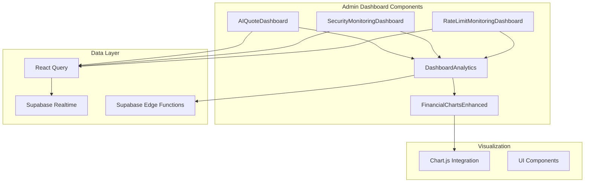
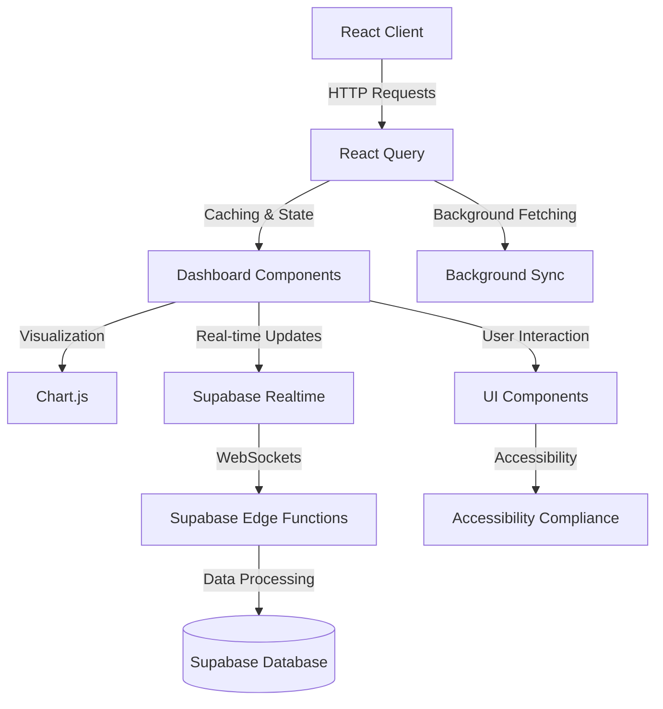
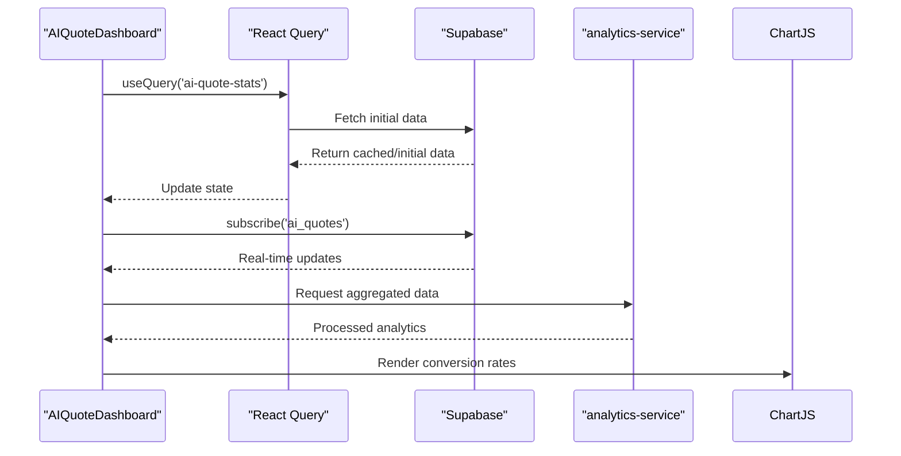
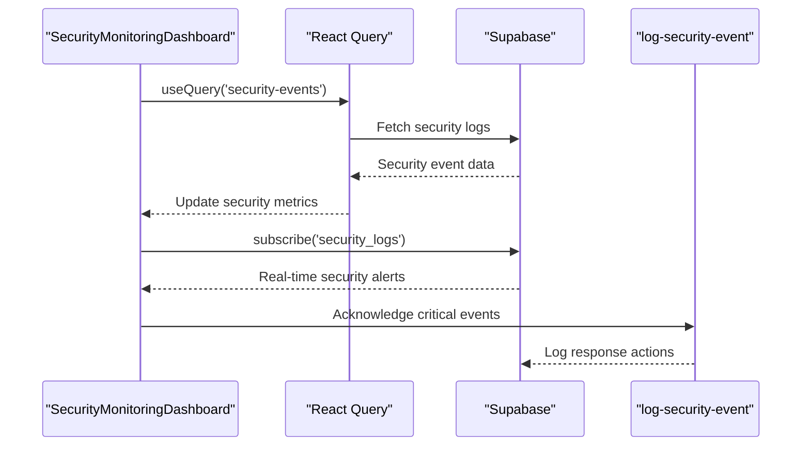
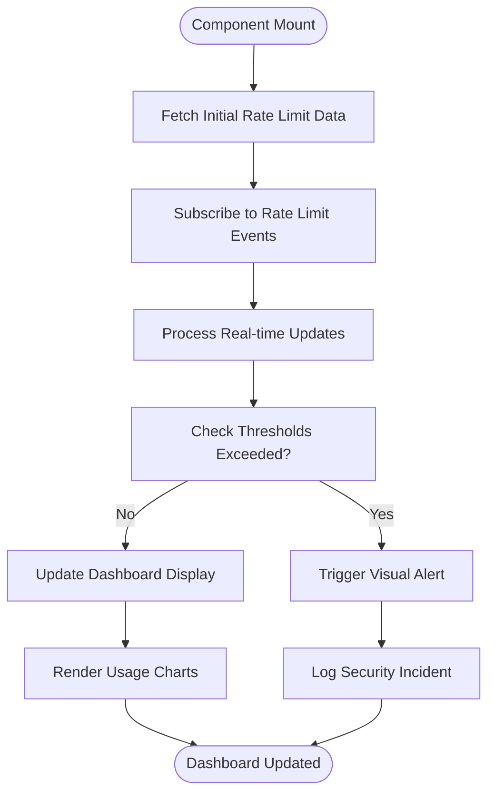
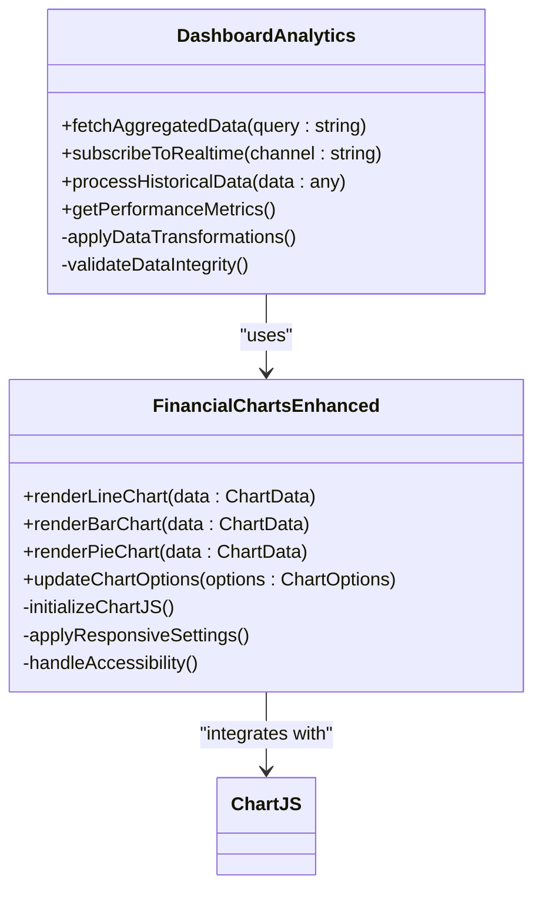
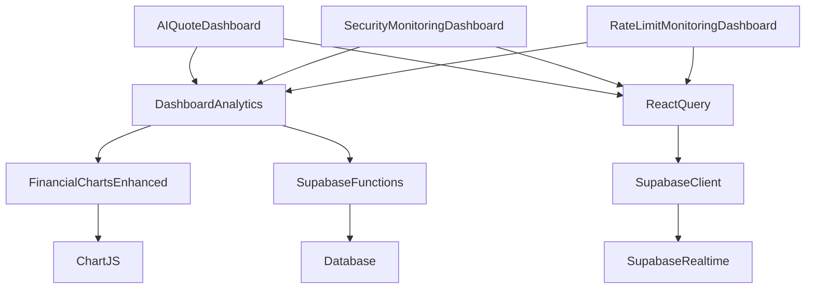

# Admin Dashboards

<cite>
**Referenced Files in This Document**  
- [AIQuoteDashboard.tsx](file://src/components/admin/AIQuoteDashboard.tsx)
- [SecurityMonitoringDashboard.tsx](file://src/components/admin/SecurityMonitoringDashboard.tsx)
- [RateLimitMonitoringDashboard.tsx](file://src/components/admin/RateLimitMonitoringDashboard.tsx)
- [DashboardAnalytics.tsx](file://src/components/admin/DashboardAnalytics.tsx)
- [FinancialChartsEnhanced.tsx](file://src/components/admin/FinancialChartsEnhanced.tsx)
- [ModernAdminDashboard.tsx](file://src/pages/ModernAdminDashboard.tsx)
- [client.ts](file://src/integrations/supabase/client.ts)
- [useQuotes.ts](file://src/hooks/useQuotes.ts)
- [useNotifications.ts](file://src/hooks/useNotifications.ts)
- [analytics-service/index.ts](file://supabase/functions/analytics-service/index.ts)
- [log-security-event/index.ts](file://supabase/functions/log-security-event/index.ts)
</cite>

## Table of Contents
1. [Introduction](#introduction)
2. [Project Structure](#project-structure)
3. [Core Components](#core-components)
4. [Architecture Overview](#architecture-overview)
5. [Detailed Component Analysis](#detailed-component-analysis)
6. [Dependency Analysis](#dependency-analysis)
7. [Performance Considerations](#performance-considerations)
8. [Troubleshooting Guide](#troubleshooting-guide)
9. [Conclusion](#conclusion)

## Introduction
This document provides comprehensive technical documentation for the administrative dashboard system in the SleekApp platform. The dashboards serve as central monitoring and analytics interfaces for administrators, providing real-time insights into AI quote conversion rates, system security events, API rate limit statistics, and financial performance indicators. The documentation covers the architecture, implementation patterns, data visualization strategies, and integration points with backend services.

## Project Structure
The administrative dashboard components are organized within the React application's component hierarchy, following a modular structure that separates concerns between data fetching, visualization, and business logic. The dashboards leverage Supabase for real-time data streaming and React Query for efficient state management.

**Diagram sources**
- [AIQuoteDashboard.tsx](file://src/components/admin/AIQuoteDashboard.tsx#L1-L50)
- [DashboardAnalytics.tsx](file://src/components/admin/DashboardAnalytics.tsx#L1-L30)
- [FinancialChartsEnhanced.tsx](file://src/components/admin/FinancialChartsEnhanced.tsx#L1-L25)

**Section sources**
- [AIQuoteDashboard.tsx](file://src/components/admin/AIQuoteDashboard.tsx#L1-L100)
- [SecurityMonitoringDashboard.tsx](file://src/components/admin/SecurityMonitoringDashboard.tsx#L1-L100)

## Core Components
The administrative dashboard system consists of three primary dashboard components: AIQuoteDashboard, SecurityMonitoringDashboard, and RateLimitMonitoringDashboard. These components share common infrastructure through the DashboardAnalytics and FinancialChartsEnhanced components, which provide standardized data processing and visualization capabilities. Each dashboard is designed to present specific metrics relevant to its domain while maintaining a consistent user experience and technical architecture.

**Section sources**
- [AIQuoteDashboard.tsx](file://src/components/admin/AIQuoteDashboard.tsx#L25-L150)
- [SecurityMonitoringDashboard.tsx](file://src/components/admin/SecurityMonitoringDashboard.tsx#L25-L150)
- [RateLimitMonitoringDashboard.tsx](file://src/components/admin/RateLimitMonitoringDashboard.tsx#L25-L150)

## Architecture Overview
The admin dashboard architecture follows a modern React pattern with clear separation between presentation, logic, and data layers. The system leverages React Query for data fetching and caching, Supabase subscriptions for real-time updates, and Chart.js for data visualization. The architecture is designed to be responsive, accessible, and performant, with optimization techniques including data aggregation, caching strategies, and efficient re-rendering patterns.

**Diagram sources**
- [client.ts](file://src/integrations/supabase/client.ts#L1-L40)
- [useQuotes.ts](file://src/hooks/useQuotes.ts#L1-L35)
- [DashboardAnalytics.tsx](file://src/components/admin/DashboardAnalytics.tsx#L10-L50)

## Detailed Component Analysis

### AIQuoteDashboard Analysis
The AIQuoteDashboard component provides administrators with insights into AI-driven quote conversion performance. It displays metrics such as quote conversion rates, average response times, and user engagement patterns with the AI quoting system. The dashboard uses real-time data from Supabase to show current performance and historical trends.

**Diagram sources**
- [AIQuoteDashboard.tsx](file://src/components/admin/AIQuoteDashboard.tsx#L50-L120)
- [analytics-service/index.ts](file://supabase/functions/analytics-service/index.ts#L1-L30)

**Section sources**
- [AIQuoteDashboard.tsx](file://src/components/admin/AIQuoteDashboard.tsx#L1-L200)

### SecurityMonitoringDashboard Analysis
The SecurityMonitoringDashboard component monitors system security events and potential threats. It displays real-time security events, authentication attempts, and system integrity checks. The dashboard integrates with Supabase Edge Functions to process and categorize security events, providing administrators with actionable insights.

**Diagram sources**
- [SecurityMonitoringDashboard.tsx](file://src/components/admin/SecurityMonitoringDashboard.tsx#L45-L110)
- [log-security-event/index.ts](file://supabase/functions/log-security-event/index.ts#L1-L25)

**Section sources**
- [SecurityMonitoringDashboard.tsx](file://src/components/admin/SecurityMonitoringDashboard.tsx#L1-L180)

### RateLimitMonitoringDashboard Analysis
The RateLimitMonitoringDashboard tracks API usage patterns and rate limit enforcement. It provides visibility into API consumption, identifies potential abuse patterns, and helps administrators manage rate limit policies. The dashboard uses aggregated data from Supabase to show usage trends across different endpoints and user roles.

**Diagram sources**
- [RateLimitMonitoringDashboard.tsx](file://src/components/admin/RateLimitMonitoringDashboard.tsx#L60-L130)
- [DashboardAnalytics.tsx](file://src/components/admin/DashboardAnalytics.tsx#L80-L120)

**Section sources**
- [RateLimitMonitoringDashboard.tsx](file://src/components/admin/RateLimitMonitoringDashboard.tsx#L1-L160)

### DashboardAnalytics and FinancialChartsEnhanced Analysis
The DashboardAnalytics and FinancialChartsEnhanced components provide shared functionality for data processing and visualization across all admin dashboards. These components abstract common patterns for data aggregation, caching, and Chart.js integration, ensuring consistency in metrics presentation and performance optimization.

**Diagram sources**
- [DashboardAnalytics.tsx](file://src/components/admin/DashboardAnalytics.tsx#L15-L80)
- [FinancialChartsEnhanced.tsx](file://src/components/admin/FinancialChartsEnhanced.tsx#L20-L90)

**Section sources**
- [DashboardAnalytics.tsx](file://src/components/admin/DashboardAnalytics.tsx#L1-L150)
- [FinancialChartsEnhanced.tsx](file://src/components/admin/FinancialChartsEnhanced.tsx#L1-L140)

## Dependency Analysis
The admin dashboard components have well-defined dependencies that follow modern React architecture patterns. The components rely on React Query for data fetching and state management, Supabase for real-time data streaming, and Chart.js for data visualization. The dependency graph shows a clear separation between presentation components and data services.

**Diagram sources**
- [package.json](file://package.json#L100-L120)
- [DashboardAnalytics.tsx](file://src/components/admin/DashboardAnalytics.tsx#L5-L40)

**Section sources**
- [package.json](file://package.json#L1-L200)
- [DashboardAnalytics.tsx](file://src/components/admin/DashboardAnalytics.tsx#L1-L200)

## Performance Considerations
The admin dashboard system implements several performance optimization techniques to ensure responsive user experiences even with large datasets. These include data aggregation strategies, caching mechanisms, and efficient re-rendering patterns. The system uses React Query's built-in caching and background refetching capabilities to minimize network requests while maintaining data freshness.

The dashboards implement virtualized rendering for large data sets and use Chart.js configuration options to optimize rendering performance. Data aggregation occurs both client-side through the DashboardAnalytics component and server-side through Supabase Edge Functions, reducing the volume of data transferred over the network.

**Section sources**
- [DashboardAnalytics.tsx](file://src/components/admin/DashboardAnalytics.tsx#L100-L180)
- [FinancialChartsEnhanced.tsx](file://src/components/admin/FinancialChartsEnhanced.tsx#L50-L120)

## Troubleshooting Guide
Common issues with the admin dashboards typically relate to data connectivity, real-time subscription failures, or visualization rendering problems. The system includes comprehensive error handling and fallback UI states to maintain usability during connectivity issues.

When troubleshooting dashboard issues, administrators should first verify Supabase connection status and check browser console logs for JavaScript errors. Network tab inspection can reveal failed API requests or subscription issues. The system's integration with Supabase Edge Functions provides detailed logging that can be accessed through the Supabase dashboard for deeper investigation.

**Section sources**
- [DashboardAnalytics.tsx](file://src/components/admin/DashboardAnalytics.tsx#L180-L250)
- [client.ts](file://src/integrations/supabase/client.ts#L50-L100)

## Conclusion
The administrative dashboard system in SleekApp provides comprehensive monitoring and analytics capabilities for platform administrators. By leveraging modern React patterns, real-time data streaming, and sophisticated visualization techniques, the dashboards deliver actionable insights into AI quote performance, system security, and API usage patterns. The modular architecture with shared components ensures consistency across dashboards while allowing for specialized functionality in each domain-specific view.

The integration with Supabase Edge Functions enables complex data processing and analytics without overburdening the client, while React Query provides efficient state management and caching. The system's focus on performance optimization, accessibility compliance, and responsive design ensures a high-quality user experience across different devices and network conditions.