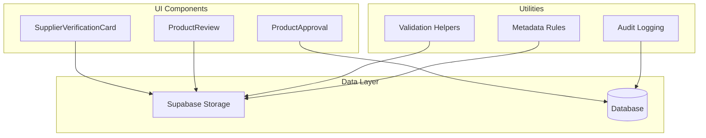
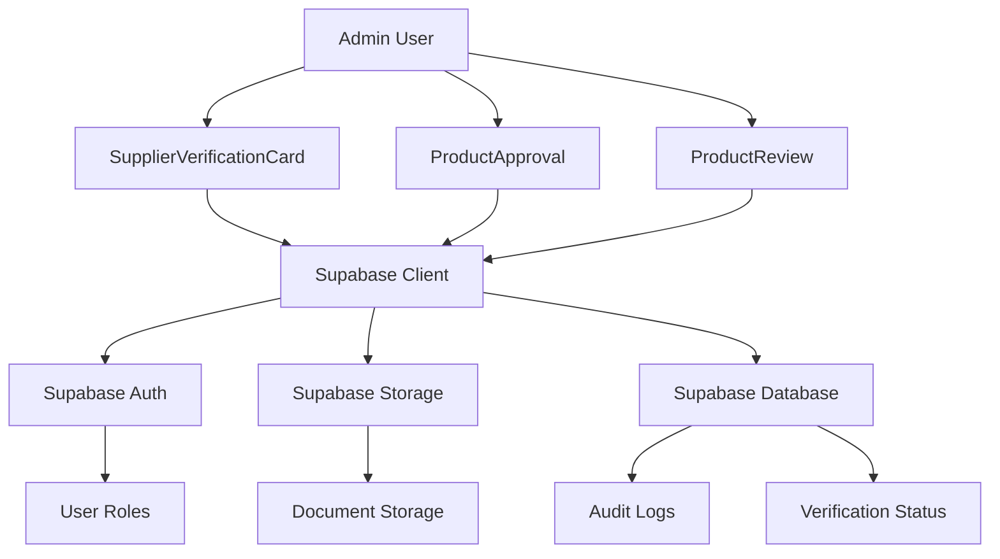
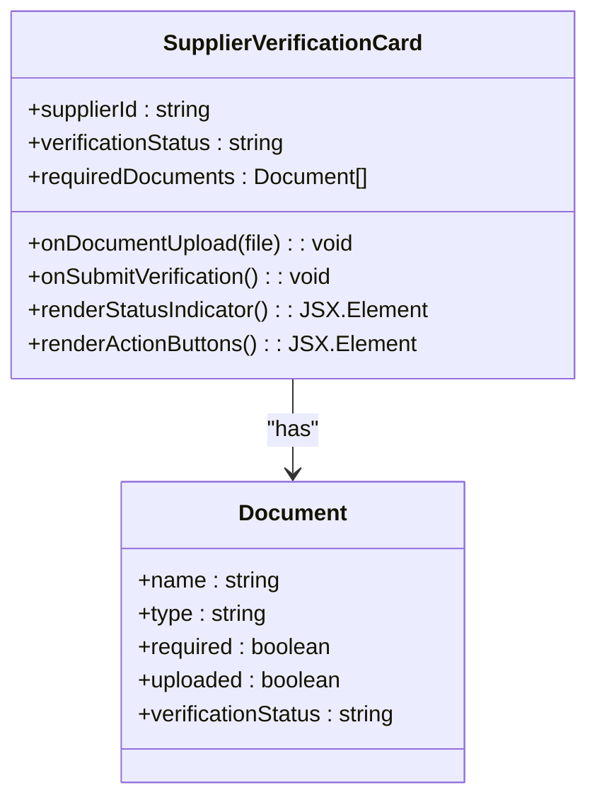
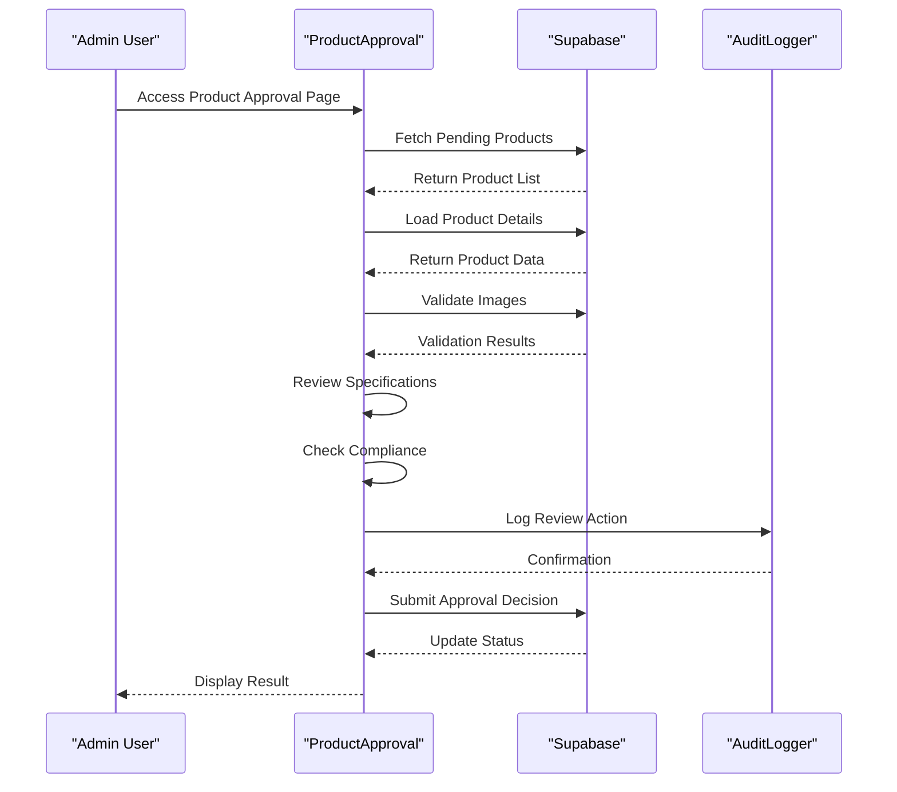
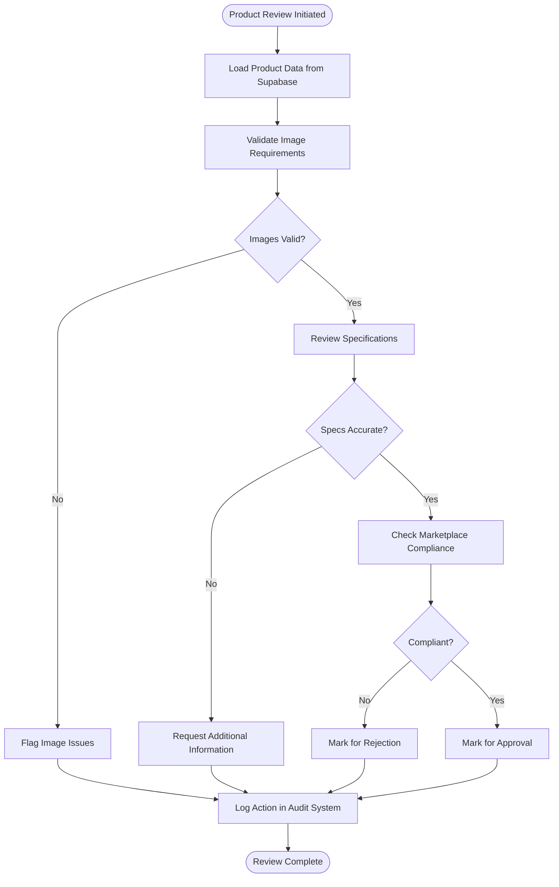
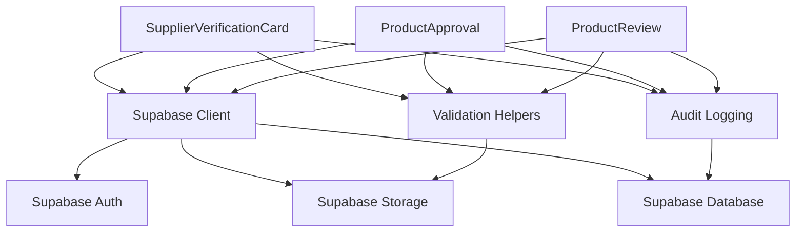

# Supplier & Product Verification

<cite>
**Referenced Files in This Document**  
- [SupplierVerificationCard.tsx](file://src/components/admin/SupplierVerificationCard.tsx)
- [ProductApproval.tsx](file://src/pages/admin/ProductApproval.tsx)
- [ProductReview.tsx](file://src/pages/admin/ProductReview.tsx)
- [SupplierVerification.tsx](file://src/pages/admin/SupplierVerification.tsx)
- [supabaseHelpers.ts](file://src/lib/supabaseHelpers.ts)
- [20250122000000_create_marketplace_system.sql](file://supabase/migrations/20250122000000_create_marketplace_system.sql)
- [client.ts](file://src/integrations/supabase/client.ts)
- [types.ts](file://src/integrations/supabase/types.ts)
- [enhancedAuditLog.ts](file://src/lib/enhancedAuditLog.ts)
- [auditLog.ts](file://src/lib/auditLog.ts)
</cite>

## Table of Contents
1. [Introduction](#introduction)
2. [Project Structure](#project-structure)
3. [Core Components](#core-components)
4. [Architecture Overview](#architecture-overview)
5. [Detailed Component Analysis](#detailed-component-analysis)
6. [Dependency Analysis](#dependency-analysis)
7. [Performance Considerations](#performance-considerations)
8. [Troubleshooting Guide](#troubleshooting-guide)
9. [Conclusion](#conclusion)

## Introduction
This document provides comprehensive documentation for the supplier and product verification system within the SleekApp platform. The verification workflow encompasses the complete lifecycle from initial submission to final approval, including document validation, capability assessment, compliance checking, and audit logging. The system is designed to ensure marketplace integrity by verifying both supplier credentials and product specifications before publication. This documentation covers the UI components, backend integration with Supabase, security considerations, and operational procedures for handling verifications.

## Project Structure
The supplier and product verification system is organized across multiple directories within the application, following a component-based architecture. The core verification components are located in the admin section of the application, with dedicated pages for product approval and review, and reusable card components for displaying verification status. The system integrates with Supabase for storage and database operations, and includes comprehensive audit logging functionality.

**Diagram sources**
- [SupplierVerificationCard.tsx](file://src/components/admin/SupplierVerificationCard.tsx#L1-L50)
- [ProductApproval.tsx](file://src/pages/admin/ProductApproval.tsx#L1-L30)
- [ProductReview.tsx](file://src/pages/admin/ProductReview.tsx#L1-L30)
- [supabaseHelpers.ts](file://src/lib/supabaseHelpers.ts#L1-L20)

**Section sources**
- [SupplierVerificationCard.tsx](file://src/components/admin/SupplierVerificationCard.tsx#L1-L100)
- [ProductApproval.tsx](file://src/pages/admin/ProductApproval.tsx#L1-L50)
- [ProductReview.tsx](file://src/pages/admin/ProductReview.tsx#L1-L50)

## Core Components
The verification system consists of three primary components: SupplierVerificationCard, ProductApproval, and ProductReview. These components work together to provide a comprehensive verification workflow for suppliers and their products. The SupplierVerificationCard displays the current verification status of a supplier and outlines required actions for completion. The ProductApproval page manages the review process for new product submissions, while the ProductReview component handles detailed examination of product specifications and images.

**Section sources**
- [SupplierVerificationCard.tsx](file://src/components/admin/SupplierVerificationCard.tsx#L25-L150)
- [ProductApproval.tsx](file://src/pages/admin/ProductApproval.tsx#L15-L80)
- [ProductReview.tsx](file://src/pages/admin/ProductReview.tsx#L20-L90)

## Architecture Overview
The verification system follows a client-server architecture with React components on the frontend and Supabase serving as the backend-as-a-service platform. The components communicate with Supabase through a dedicated client integration, leveraging Supabase's authentication, storage, and database capabilities. The architecture includes a robust audit logging system that records all verification actions for compliance and security purposes.

**Diagram sources**
- [client.ts](file://src/integrations/supabase/client.ts#L1-L40)
- [SupplierVerificationCard.tsx](file://src/components/admin/SupplierVerificationCard.tsx#L10-L35)
- [ProductApproval.tsx](file://src/pages/admin/ProductApproval.tsx#L5-L25)
- [ProductReview.tsx](file://src/pages/admin/ProductReview.tsx#L8-L30)

## Detailed Component Analysis

### SupplierVerificationCard Analysis
The SupplierVerificationCard component provides a visual representation of a supplier's verification status, displaying progress indicators and required actions. It implements a state-based UI pattern that changes appearance based on the verification stage, using color coding and iconography to communicate status at a glance. The component integrates with Supabase storage for document verification and displays metadata about submitted documents.

**Diagram sources**
- [SupplierVerificationCard.tsx](file://src/components/admin/SupplierVerificationCard.tsx#L15-L60)
- [types.ts](file://src/integrations/supabase/types.ts#L5-L25)

### ProductApproval Analysis
The ProductApproval component manages the workflow for approving new products to the marketplace. It implements a multi-stage review process that includes image validation, specification review, and compliance checking. The component displays product information in a structured format and provides approval controls for administrators. It integrates with Supabase storage to validate product images against predefined metadata rules.

**Diagram sources**
- [ProductApproval.tsx](file://src/pages/admin/ProductApproval.tsx#L20-L80)
- [supabaseHelpers.ts](file://src/lib/supabaseHelpers.ts#L15-L40)
- [enhancedAuditLog.ts](file://src/lib/enhancedAuditLog.ts#L10-L30)

### ProductReview Analysis
The ProductReview component provides a detailed interface for examining product submissions, focusing on image quality, specification accuracy, and marketplace compliance. It implements a tabbed interface for organizing review criteria and includes tools for flagging issues and requesting additional information from suppliers. The component validates product images against technical requirements stored in Supabase metadata.

**Diagram sources**
- [ProductReview.tsx](file://src/pages/admin/ProductReview.tsx#L30-L100)
- [supabaseHelpers.ts](file://src/lib/supabaseHelpers.ts#L25-L50)
- [auditLog.ts](file://src/lib/auditLog.ts#L5-L20)

## Dependency Analysis
The verification components depend on several core services and libraries within the application. The primary dependencies include the Supabase integration for data storage and retrieval, audit logging utilities for tracking verification actions, and validation helpers for enforcing business rules. The components also rely on shared UI components and styling systems to maintain consistency across the admin interface.

**Diagram sources**
- [client.ts](file://src/integrations/supabase/client.ts#L1-L50)
- [enhancedAuditLog.ts](file://src/lib/enhancedAuditLog.ts#L1-L30)
- [supabaseHelpers.ts](file://src/lib/supabaseHelpers.ts#L1-L40)

**Section sources**
- [client.ts](file://src/integrations/supabase/client.ts#L1-L60)
- [enhancedAuditLog.ts](file://src/lib/enhancedAuditLog.ts#L1-L40)
- [supabaseHelpers.ts](file://src/lib/supabaseHelpers.ts#L1-L50)

## Performance Considerations
The verification system is optimized for efficient data loading and responsive user interaction. The components implement lazy loading for document previews and use efficient state management to minimize re-renders. Image validation is performed client-side when possible to reduce server load, with critical validations performed on the server through Supabase functions. The audit logging system batches writes to minimize database operations while maintaining data integrity.

## Troubleshooting Guide
Common issues in the verification system typically relate to document upload failures, image validation errors, or permission issues. The system includes comprehensive error handling that provides specific feedback for each type of failure. For document upload issues, verify Supabase storage configuration and file size limits. For image validation failures, check that images meet the required dimensions and format specifications. Permission issues are typically resolved by verifying the admin user's role and access rights in the Supabase authentication system.

**Section sources**
- [SupplierVerificationCard.tsx](file://src/components/admin/SupplierVerificationCard.tsx#L100-L200)
- [ProductApproval.tsx](file://src/pages/admin/ProductApproval.tsx#L80-L150)
- [ProductReview.tsx](file://src/pages/admin/ProductReview.tsx#L90-L160)
- [supabaseHelpers.ts](file://src/lib/supabaseHelpers.ts#L40-L100)

## Conclusion
The supplier and product verification system in SleekApp provides a robust framework for ensuring marketplace quality and compliance. By combining intuitive UI components with secure backend integration and comprehensive audit logging, the system enables efficient verification workflows while maintaining high standards for supplier and product quality. The integration with Supabase provides scalable storage and database capabilities, while the modular component design allows for easy maintenance and future enhancements.