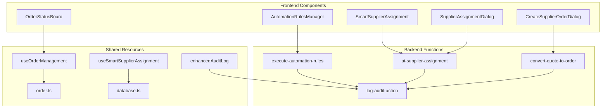
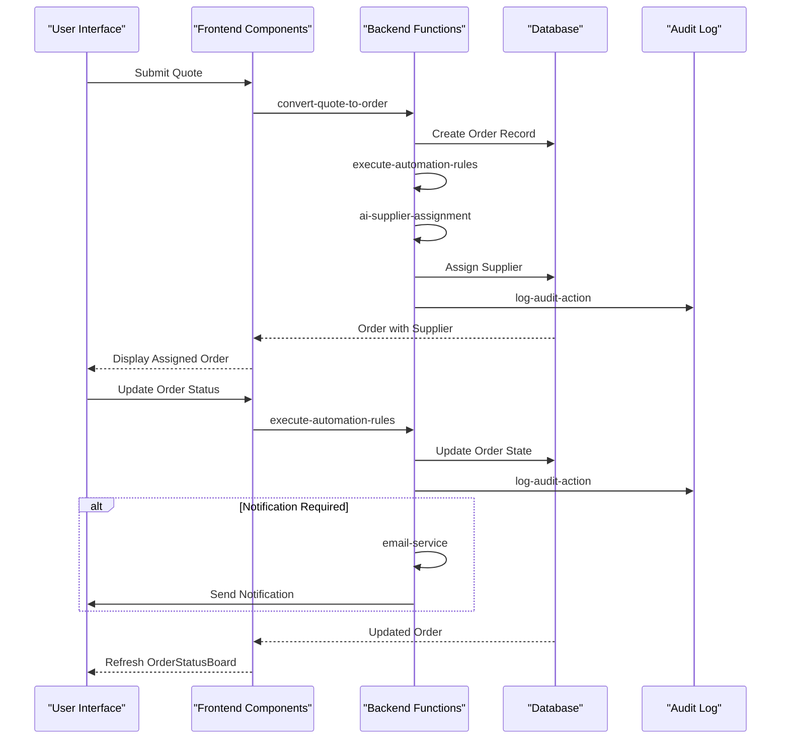
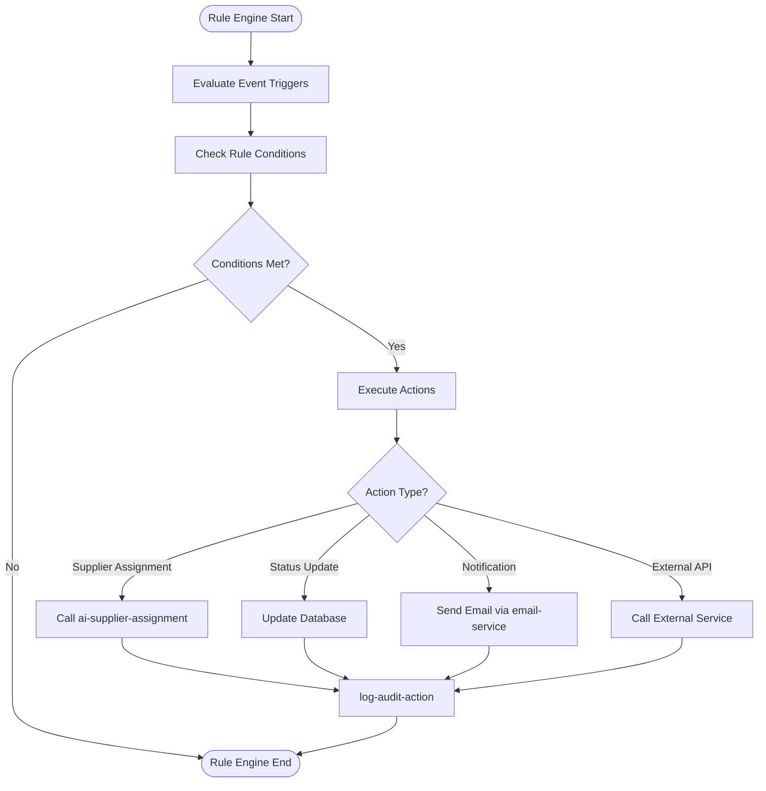
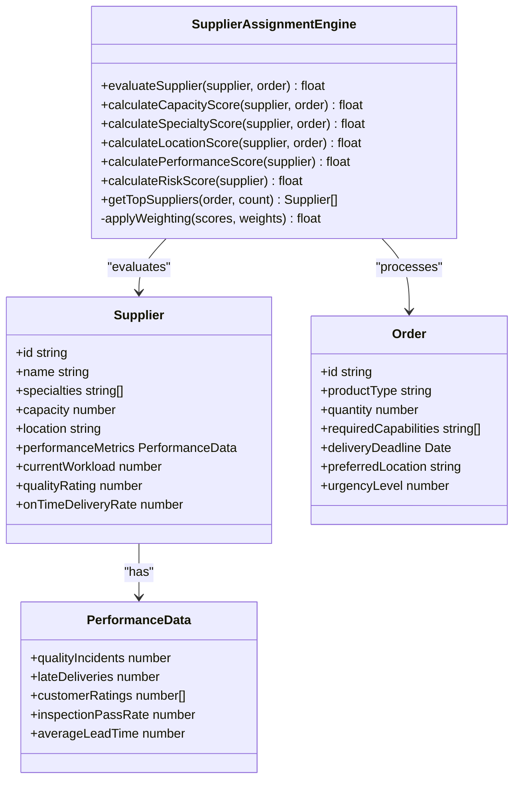
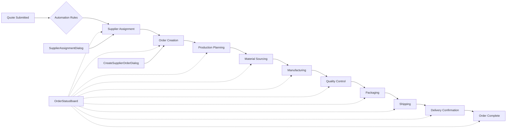
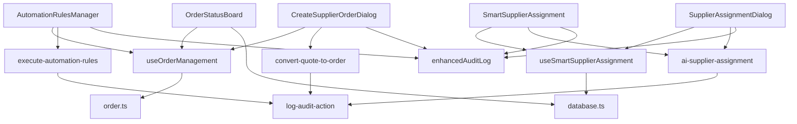

# Workflow Management

<cite>
**Referenced Files in This Document**
- [AutomationRulesManager.tsx](file://src/components/admin/AutomationRulesManager.tsx)
- [SmartSupplierAssignment.tsx](file://src/components/admin/SmartSupplierAssignment.tsx)
- [OrderStatusBoard.tsx](file://src/components/admin/OrderStatusBoard.tsx)
- [CreateSupplierOrderDialog.tsx](file://src/components/admin/CreateSupplierOrderDialog.tsx)
- [SupplierAssignmentDialog.tsx](file://src/components/admin/SupplierAssignmentDialog.tsx)
- [execute-automation-rules/index.ts](file://supabase/functions/execute-automation-rules/index.ts)
- [ai-supplier-assignment/index.ts](file://supabase/functions/ai-supplier-assignment/index.ts)
- [convert-quote-to-order/index.ts](file://supabase/functions/convert-quote-to-order/index.ts)
- [order.ts](file://src/types/order.ts)
- [database.ts](file://src/types/database.ts)
- [useOrderManagement.ts](file://src/hooks/useOrderManagement.ts)
- [useSmartSupplierAssignment.ts](file://src/hooks/useSmartSupplierAssignment.ts)
- [enhancedAuditLog.ts](file://src/lib/enhancedAuditLog.ts)
- [auditLog.ts](file://src/lib/auditLog.ts)
</cite>

## Table of Contents
1. [Introduction](#introduction)
2. [Project Structure](#project-structure)
3. [Core Components](#core-components)
4. [Architecture Overview](#architecture-overview)
5. [Detailed Component Analysis](#detailed-component-analysis)
6. [Dependency Analysis](#dependency-analysis)
7. [Performance Considerations](#performance-considerations)
8. [Troubleshooting Guide](#troubleshooting-guide)
9. [Conclusion](#conclusion)

## Introduction
This document provides comprehensive documentation for the workflow management system in the SleekApparels platform. The system centers around three key components: AutomationRulesManager, SmartSupplierAssignment, and OrderStatusBoard, which work together to streamline order processing, supplier matching, and production tracking. The workflow engine automates business processes by triggering actions based on order, quote, and production events, while the supplier assignment algorithm intelligently matches buyer requirements with supplier capabilities. The system handles the complete order lifecycle from creation to fulfillment, with robust state management and synchronization across components.

## Project Structure
The workflow management components are organized within the admin section of the components directory, with supporting functionality distributed across hooks, types, and Supabase functions. The frontend components handle user interaction and visualization, while backend functions process automation rules and supplier assignments.



**Diagram sources**
- [AutomationRulesManager.tsx](file://src/components/admin/AutomationRulesManager.tsx)
- [SmartSupplierAssignment.tsx](file://src/components/admin/SmartSupplierAssignment.tsx)
- [OrderStatusBoard.tsx](file://src/components/admin/OrderStatusBoard.tsx)
- [execute-automation-rules/index.ts](file://supabase/functions/execute-automation-rules/index.ts)
- [ai-supplier-assignment/index.ts](file://supabase/functions/ai-supplier-assignment/index.ts)
- [order.ts](file://src/types/order.ts)
- [database.ts](file://src/types/database.ts)

**Section sources**
- [src/components/admin](file://src/components/admin)
- [supabase/functions](file://supabase/functions)
- [src/types](file://src/types)
- [src/hooks](file://src/hooks)
- [src/lib](file://src/lib)

## Core Components
The workflow management system consists of three primary components that orchestrate the order fulfillment process. The AutomationRulesManager implements a rule engine that monitors order, quote, and production events and triggers automated actions based on configurable conditions. SmartSupplierAssignment employs an algorithmic approach to match buyer requirements with supplier capabilities, considering factors such as production capacity, specialty, location, and performance metrics. OrderStatusBoard provides a real-time visualization of order states across the production pipeline, enabling monitoring and intervention when necessary. These components are supported by dialog interfaces for creating supplier orders and assigning suppliers to quotes, which guide users through complex workflow decisions.

**Section sources**
- [AutomationRulesManager.tsx](file://src/components/admin/AutomationRulesManager.tsx)
- [SmartSupplierAssignment.tsx](file://src/components/admin/SmartSupplierAssignment.tsx)
- [OrderStatusBoard.tsx](file://src/components/admin/OrderStatusBoard.tsx)
- [CreateSupplierOrderDialog.tsx](file://src/components/admin/CreateSupplierOrderDialog.tsx)
- [SupplierAssignmentDialog.tsx](file://src/components/admin/SupplierAssignmentDialog.tsx)

## Architecture Overview
The workflow management architecture follows a distributed event-driven pattern with separation between frontend presentation components and backend processing functions. When a relevant event occurs (such as quote submission or order status change), the system evaluates applicable automation rules, potentially triggering supplier assignment, order creation, or notification workflows. The rule engine operates on a condition-action paradigm, where conditions are evaluated against order, quote, or production data, and matching rules trigger predefined actions. Supplier assignment leverages both deterministic matching rules and AI-powered recommendations to optimize the selection process. All workflow operations are logged for audit purposes, and state changes are synchronized across the system through a combination of real-time database subscriptions and state management hooks.



**Diagram sources**
- [convert-quote-to-order/index.ts](file://supabase/functions/convert-quote-to-order/index.ts)
- [execute-automation-rules/index.ts](file://supabase/functions/execute-automation-rules/index.ts)
- [ai-supplier-assignment/index.ts](file://supabase/functions/ai-supplier-assignment/index.ts)
- [log-audit-action/index.ts](file://supabase/functions/log-audit-action/index.ts)
- [email-service/index.ts](file://supabase/functions/email-service/index.ts)

## Detailed Component Analysis

### Automation Rules Engine
The AutomationRulesManager implements a flexible rule engine that enables automated workflow execution based on business conditions. The system monitors events across the order lifecycle and executes predefined actions when conditions are met. Rules can be configured to trigger on various events including quote submission, order status changes, production milestones, and deadline approaches. The engine supports complex conditional logic with support for AND/OR operators, field comparisons, and value thresholds. Each rule consists of trigger conditions, evaluation criteria, and resulting actions, which may include supplier assignment, status updates, notifications, or external service calls.



**Diagram sources**
- [AutomationRulesManager.tsx](file://src/components/admin/AutomationRulesManager.tsx)
- [execute-automation-rules/index.ts](file://supabase/functions/execute-automation-rules/index.ts)
- [enhancedAuditLog.ts](file://src/lib/enhancedAuditLog.ts)

**Section sources**
- [AutomationRulesManager.tsx](file://src/components/admin/AutomationRulesManager.tsx#L1-L200)
- [execute-automation-rules/index.ts](file://supabase/functions/execute-automation-rules/index.ts#L1-L150)

### Supplier Assignment Algorithm
The SmartSupplierAssignment component implements an intelligent algorithm that matches buyer requirements with supplier capabilities. The algorithm evaluates multiple factors including production capacity, specialty alignment, geographic location, historical performance, and current workload. It uses a scoring system to rank potential suppliers, with configurable weights for different criteria based on order requirements. The system supports both manual assignment through the SupplierAssignmentDialog and automated recommendations powered by AI analysis of historical matching success rates. The algorithm also considers risk factors such as supplier reliability, quality metrics, and delivery performance to optimize the assignment decision.



**Diagram sources**
- [SmartSupplierAssignment.tsx](file://src/components/admin/SmartSupplierAssignment.tsx)
- [ai-supplier-assignment/index.ts](file://supabase/functions/ai-supplier-assignment/index.ts)
- [database.ts](file://src/types/database.ts)
- [order.ts](file://src/types/order.ts)

**Section sources**
- [SmartSupplierAssignment.tsx](file://src/components/admin/SmartSupplierAssignment.tsx#L1-L180)
- [ai-supplier-assignment/index.ts](file://supabase/functions/ai-supplier-assignment/index.ts#L1-L120)
- [useSmartSupplierAssignment.ts](file://src/hooks/useSmartSupplierAssignment.ts#L1-L90)

### Order Management Workflow
The order management workflow spans from initial quote conversion to final fulfillment, coordinated through the OrderStatusBoard and supporting dialog components. When a quote is converted to an order, the system initiates the workflow by creating an order record and triggering the automation rules engine. The CreateSupplierOrderDialog guides users through the supplier selection and order creation process, while the SupplierAssignmentDialog facilitates manual or AI-assisted supplier assignment. The OrderStatusBoard provides a comprehensive view of all orders across different stages of production, with real-time updates and visual indicators for priority items or potential delays.



**Diagram sources**
- [OrderStatusBoard.tsx](file://src/components/admin/OrderStatusBoard.tsx)
- [CreateSupplierOrderDialog.tsx](file://src/components/admin/CreateSupplierOrderDialog.tsx)
- [SupplierAssignmentDialog.tsx](file://src/components/admin/SupplierAssignmentDialog.tsx)
- [convert-quote-to-order/index.ts](file://supabase/functions/convert-quote-to-order/index.ts)

**Section sources**
- [OrderStatusBoard.tsx](file://src/components/admin/OrderStatusBoard.tsx#L1-L220)
- [CreateSupplierOrderDialog.tsx](file://src/components/admin/CreateSupplierOrderDialog.tsx#L1-L160)
- [SupplierAssignmentDialog.tsx](file://src/components/admin/SupplierAssignmentDialog.tsx#L1-L140)
- [useOrderManagement.ts](file://src/hooks/useOrderManagement.ts#L1-L110)

### State Management and Synchronization
The system employs a robust state management pattern to track order status transitions and ensure consistency across distributed components. Order states follow a defined lifecycle with valid transitions between stages, enforced by both frontend validation and backend business logic. State changes are propagated through real-time database subscriptions, ensuring that all connected clients receive immediate updates. The OrderStatusBoard subscribes to order updates and re-renders affected components when state changes occur. Conflict resolution strategies handle concurrent edits, with last-write-wins semantics combined with audit logging to maintain accountability.

```mermaid
stateDiagram-v2
[*] --> Draft
Draft --> Submitted : submitQuote()
Submitted --> Assigned : assignSupplier()
Assigned --> InProduction : startProduction()
InProduction --> QualityCheck : productionComplete()
QualityCheck --> Approved : qcPass()
QualityCheck --> Rejected : qcFail()
Rejected --> InProduction : reworkRequired()
Approved --> Packaging : readyForPackaging()
Packaging --> Shipped : shipOrder()
Shipped --> Delivered : deliveryConfirmed()
Delivered --> Completed : orderComplete()
state InProduction {
[*] --> Cutting
Cutting --> Sewing
Sewing --> Finishing
Finishing --> InProduction
}
state QualityCheck {
[*] --> Inspection
Inspection --> ApprovalPending
ApprovalPending --> Approved : managerApproval()
ApprovalPending --> Rejected : issuesFound()
}
```

**Diagram sources**
- [OrderStatusBoard.tsx](file://src/components/admin/OrderStatusBoard.tsx)
- [useOrderManagement.ts](file://src/hooks/useOrderManagement.ts)
- [order.ts](file://src/types/order.ts)

**Section sources**
- [OrderStatusBoard.tsx](file://src/components/admin/OrderStatusBoard.tsx#L50-L200)
- [useOrderManagement.ts](file://src/hooks/useOrderManagement.ts#L25-L80)
- [order.ts](file://src/types/order.ts#L15-L60)

## Dependency Analysis
The workflow management components depend on a combination of frontend hooks, backend functions, and data models to provide their functionality. The components rely on Supabase functions for business logic execution and database operations, with real-time synchronization through database subscriptions. Type definitions in the types directory provide interface contracts between components, ensuring type safety across the system. Audit logging is implemented consistently across workflow operations, with both basic and enhanced logging utilities capturing critical actions for compliance and troubleshooting.



**Diagram sources**
- [AutomationRulesManager.tsx](file://src/components/admin/AutomationRulesManager.tsx)
- [SmartSupplierAssignment.tsx](file://src/components/admin/SmartSupplierAssignment.tsx)
- [OrderStatusBoard.tsx](file://src/components/admin/OrderStatusBoard.tsx)
- [CreateSupplierOrderDialog.tsx](file://src/components/admin/CreateSupplierOrderDialog.tsx)
- [SupplierAssignmentDialog.tsx](file://src/components/admin/SupplierAssignmentDialog.tsx)
- [useOrderManagement.ts](file://src/hooks/useOrderManagement.ts)
- [useSmartSupplierAssignment.ts](file://src/hooks/useSmartSupplierAssignment.ts)
- [order.ts](file://src/types/order.ts)
- [database.ts](file://src/types/database.ts)
- [enhancedAuditLog.ts](file://src/lib/enhancedAuditLog.ts)
- [auditLog.ts](file://src/lib/auditLog.ts)

**Section sources**
- [src/components/admin](file://src/components/admin#L1-L1000)
- [src/hooks](file://src/hooks#L1-L500)
- [src/types](file://src/types#L1-L300)
- [src/lib](file://src/lib#L1-L200)
- [supabase/functions](file://supabase/functions#L1-L800)

## Performance Considerations
The workflow management system is designed to handle high volumes of concurrent executions through several optimization strategies. The rule engine uses efficient indexing and filtering to minimize the number of rules evaluated for each event, with rules organized by trigger type for faster lookup. Supplier assignment calculations are optimized through pre-computed supplier capability indices and cached performance metrics. Database queries are optimized with appropriate indexing on frequently accessed fields such as order status, supplier specialties, and timestamps. For high-volume scenarios, the system can leverage Supabase's built-in connection pooling and query optimization features. The frontend implements virtualized rendering for the OrderStatusBoard to maintain performance with large numbers of orders, and debounces rapid state updates to prevent excessive re-renders.

**Section sources**
- [execute-automation-rules/index.ts](file://supabase/functions/execute-automation-rules/index.ts#L30-L100)
- [ai-supplier-assignment/index.ts](file://supabase/functions/ai-supplier-assignment/index.ts#L25-L80)
- [OrderStatusBoard.tsx](file://src/components/admin/OrderStatusBoard.tsx#L80-L150)
- [useOrderManagement.ts](file://src/hooks/useOrderManagement.ts#L40-L70)

## Troubleshooting Guide
Common issues in the workflow management system typically involve rule configuration errors, supplier assignment failures, or state synchronization problems. For automation rules that fail to trigger, verify that the rule conditions match the event data structure and that the trigger event is being properly emitted. When supplier assignment returns no results, check that supplier capabilities are properly configured and that capacity constraints are not overly restrictive. If order status updates are not reflecting across components, ensure that database subscriptions are active and that the user has appropriate permissions. All workflow operations are logged in the audit system, which can be queried by order ID, user ID, or timestamp range to trace the sequence of events. The system includes retry mechanisms for transient failures in external service calls, with exponential backoff and maximum retry limits to prevent cascading failures.

**Section sources**
- [enhancedAuditLog.ts](file://src/lib/enhancedAuditLog.ts#L10-L100)
- [execute-automation-rules/index.ts](file://supabase/functions/execute-automation-rules/index.ts#L100-L150)
- [ai-supplier-assignment/index.ts](file://supabase/functions/ai-supplier-assignment/index.ts#L90-L120)
- [OrderStatusBoard.tsx](file://src/components/admin/OrderStatusBoard.tsx#L180-L220)

## Conclusion
The workflow management system in SleekApparels provides a comprehensive solution for automating and optimizing the order fulfillment process. By combining rule-based automation, intelligent supplier matching, and real-time order tracking, the system reduces manual intervention while improving decision quality and operational efficiency. The architecture balances flexibility with reliability, allowing business rules to be easily configured while maintaining data consistency and auditability. Future enhancements could include machine learning models to predict optimal supplier assignments based on historical outcomes, advanced analytics for identifying bottlenecks in the production pipeline, and integration with external logistics providers for end-to-end supply chain visibility.