# Authentication Components

<cite>
**Referenced Files in This Document**  
- [CustomerSignupForm.tsx](file://src/components/auth/CustomerSignupForm.tsx)
- [ProductionPartnerSignupForm.tsx](file://src/components/auth/ProductionPartnerSignupForm.tsx)
- [useFirebaseAuth.tsx](file://src/hooks/useFirebaseAuth.tsx)
- [auth.ts](file://src/lib/firebase/auth.ts)
- [client.ts](file://src/integrations/supabase/client.ts)
- [Auth.tsx](file://src/pages/Auth.tsx)
- [supabase-adapter.ts](file://src/lib/firebase/supabase-adapter.ts)
- [password-breach-check/index.ts](file://supabase/functions/password-breach-check/index.ts)
- [send-otp/index.ts](file://supabase/functions/send-otp/index.ts)
- [verify-otp/index.ts](file://supabase/functions/verify-otp/index.ts)
</cite>

## Table of Contents
1. [Introduction](#introduction)
2. [Project Structure](#project-structure)
3. [Core Components](#core-components)
4. [Architecture Overview](#architecture-overview)
5. [Detailed Component Analysis](#detailed-component-analysis)
6. [Authentication Workflow](#authentication-workflow)
7. [Security Features](#security-features)
8. [Form Validation and Error Handling](#form-validation-and-error-handling)
9. [Role-Based Redirection and Session Management](#role-based-redirection-and-session-management)
10. [Integration with Firebase and Supabase](#integration-with-firebase-and-supabase)
11. [Troubleshooting Guide](#troubleshooting-guide)
12. [Conclusion](#conclusion)

## Introduction
This document provides comprehensive documentation for the authentication components in the SleekApp platform, focusing on the CustomerSignupForm and ProductionPartnerSignupForm. The authentication system implements a multi-step registration workflow with identity verification, integrating Firebase Authentication for user management and Supabase as the backend database. The system includes robust security features such as password breach checking and OTP verification, with form validation powered by React Hook Form and Zod. This documentation details the implementation, workflow, and integration patterns used throughout the authentication system.

## Project Structure
The authentication components are organized within the src directory following a feature-based structure. The core authentication components reside in the src/components/auth directory, while authentication hooks are located in src/hooks, and Firebase/Supabase integration utilities are in src/lib/firebase and src/integrations/supabase respectively. Serverless functions for authentication operations are implemented in the supabase/functions directory.

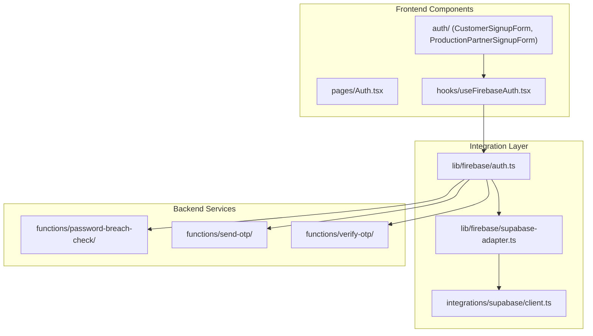

**Diagram sources**
- [CustomerSignupForm.tsx](file://src/components/auth/CustomerSignupForm.tsx)
- [ProductionPartnerSignupForm.tsx](file://src/components/auth/ProductionPartnerSignupForm.tsx)
- [useFirebaseAuth.tsx](file://src/hooks/useFirebaseAuth.tsx)
- [auth.ts](file://src/lib/firebase/auth.ts)
- [supabase-adapter.ts](file://src/lib/firebase/supabase-adapter.ts)
- [client.ts](file://src/integrations/supabase/client.ts)
- [password-breach-check/index.ts](file://supabase/functions/password-breach-check/index.ts)
- [send-otp/index.ts](file://supabase/functions/send-otp/index.ts)
- [verify-otp/index.ts](file://supabase/functions/verify-otp/index.ts)

**Section sources**
- [CustomerSignupForm.tsx](file://src/components/auth/CustomerSignupForm.tsx)
- [ProductionPartnerSignupForm.tsx](file://src/components/auth/ProductionPartnerSignupForm.tsx)
- [useFirebaseAuth.tsx](file://src/hooks/useFirebaseAuth.tsx)

## Core Components
The authentication system centers around two primary signup components: CustomerSignupForm and ProductionPartnerSignupForm. These components implement a multi-step registration process with progressive form disclosure, collecting user information in stages to improve usability. Both components leverage React Hook Form for form state management and validation, with Zod for schema validation. The forms integrate with Firebase Authentication for identity management and Supabase for persistent data storage, implementing role-based user differentiation from the point of registration.

**Section sources**
- [CustomerSignupForm.tsx](file://src/components/auth/CustomerSignupForm.tsx)
- [ProductionPartnerSignupForm.tsx](file://src/components/auth/ProductionPartnerSignupForm.tsx)

## Architecture Overview
The authentication architecture follows a layered pattern with clear separation of concerns between presentation, business logic, and data access layers. The frontend components handle user interface and form validation, while custom hooks encapsulate authentication logic and state management. The integration layer translates between Firebase Authentication and Supabase, ensuring data consistency across both systems. Serverless functions deployed on Supabase handle sensitive operations like password breach checking and OTP verification, maintaining security boundaries.

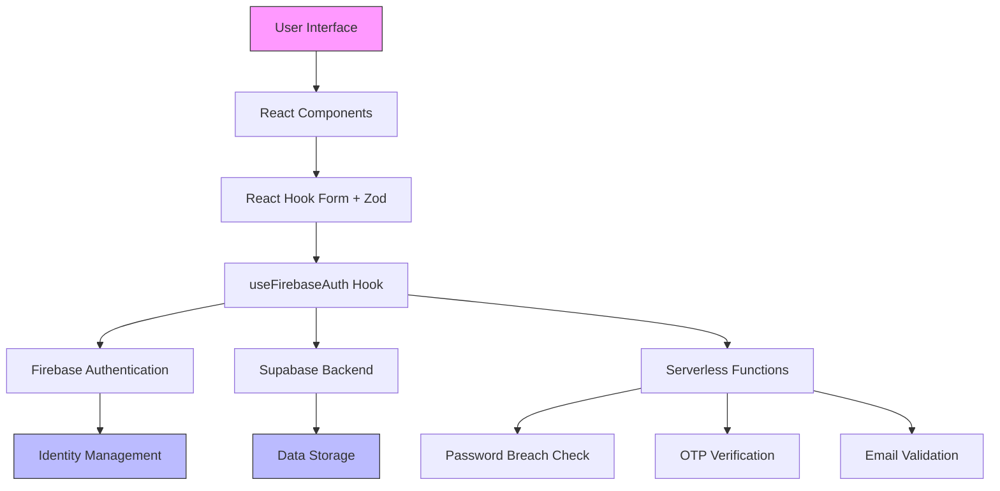

**Diagram sources**
- [CustomerSignupForm.tsx](file://src/components/auth/CustomerSignupForm.tsx)
- [ProductionPartnerSignupForm.tsx](file://src/components/auth/ProductionPartnerSignupForm.tsx)
- [useFirebaseAuth.tsx](file://src/hooks/useFirebaseAuth.tsx)
- [auth.ts](file://src/lib/firebase/auth.ts)

## Detailed Component Analysis

### CustomerSignupForm Analysis
The CustomerSignupForm component implements a multi-step registration process for customer users. It collects basic information, contact details, and preferences in sequential steps, providing a guided onboarding experience. The form uses React Hook Form for efficient form state management and re-renders, with Zod for comprehensive schema validation at each step.

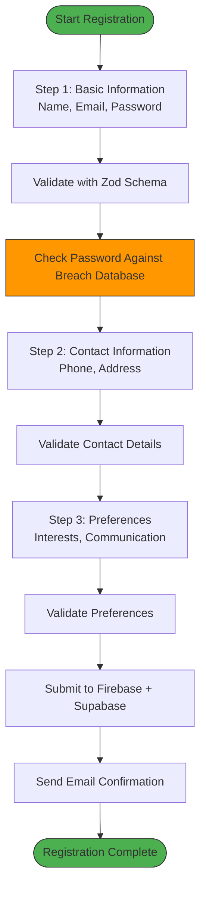

**Diagram sources**
- [CustomerSignupForm.tsx](file://src/components/auth/CustomerSignupForm.tsx)
- [auth.ts](file://src/lib/firebase/auth.ts)
- [password-breach-check/index.ts](file://supabase/functions/password-breach-check/index.ts)

### ProductionPartnerSignupForm Analysis
The ProductionPartnerSignupForm component handles registration for production partners (suppliers), collecting additional business-specific information beyond the standard user data. This includes company details, production capabilities, certifications, and compliance information. The form implements conditional logic to show relevant fields based on the partner type selected.

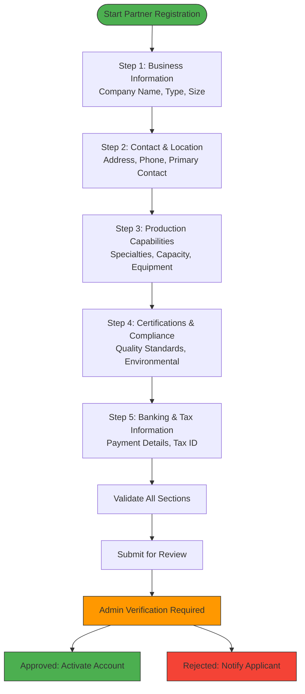

**Diagram sources**
- [ProductionPartnerSignupForm.tsx](file://src/components/auth/ProductionPartnerSignupForm.tsx)
- [auth.ts](file://src/lib/firebase/auth.ts)

### Authentication Hook Analysis
The useFirebaseAuth custom hook encapsulates the authentication logic, providing a clean interface between the UI components and the underlying authentication services. It manages the authentication state, handles login, registration, and logout operations, and integrates with both Firebase Authentication and Supabase.

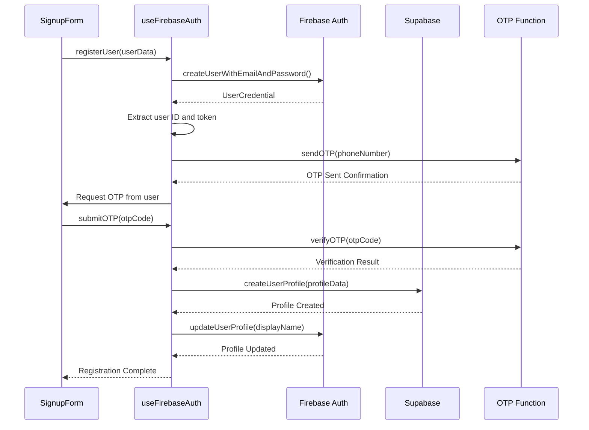

**Diagram sources**
- [useFirebaseAuth.tsx](file://src/hooks/useFirebaseAuth.tsx)
- [auth.ts](file://src/lib/firebase/auth.ts)
- [supabase-adapter.ts](file://src/lib/firebase/supabase-adapter.ts)
- [send-otp/index.ts](file://supabase/functions/send-otp/index.ts)
- [verify-otp/index.ts](file://supabase/functions/verify-otp/index.ts)

## Authentication Workflow
The authentication workflow follows a multi-step process designed to balance security, usability, and data completeness. For both customer and production partner registration, the workflow progresses through information collection, validation, identity verification, and account activation stages.

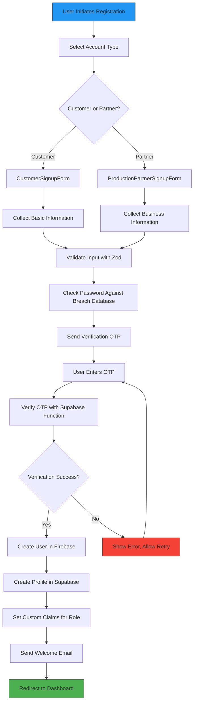

**Diagram sources**
- [CustomerSignupForm.tsx](file://src/components/auth/CustomerSignupForm.tsx)
- [ProductionPartnerSignupForm.tsx](file://src/components/auth/ProductionPartnerSignupForm.tsx)
- [useFirebaseAuth.tsx](file://src/hooks/useFirebaseAuth.tsx)
- [auth.ts](file://src/lib/firebase/auth.ts)
- [password-breach-check/index.ts](file://supabase/functions/password-breach-check/index.ts)
- [send-otp/index.ts](file://supabase/functions/send-otp/index.ts)
- [verify-otp/index.ts](file://supabase/functions/verify-otp/index.ts)

## Security Features
The authentication system implements multiple security layers to protect user accounts and prevent common attack vectors. These include password breach checking, multi-factor authentication via OTP, rate limiting, and secure session management.

### Password Breach Checking
The system integrates with a password breach checking service to prevent users from setting compromised passwords. When a user creates an account or changes their password, the system checks the password against a database of known breached passwords.

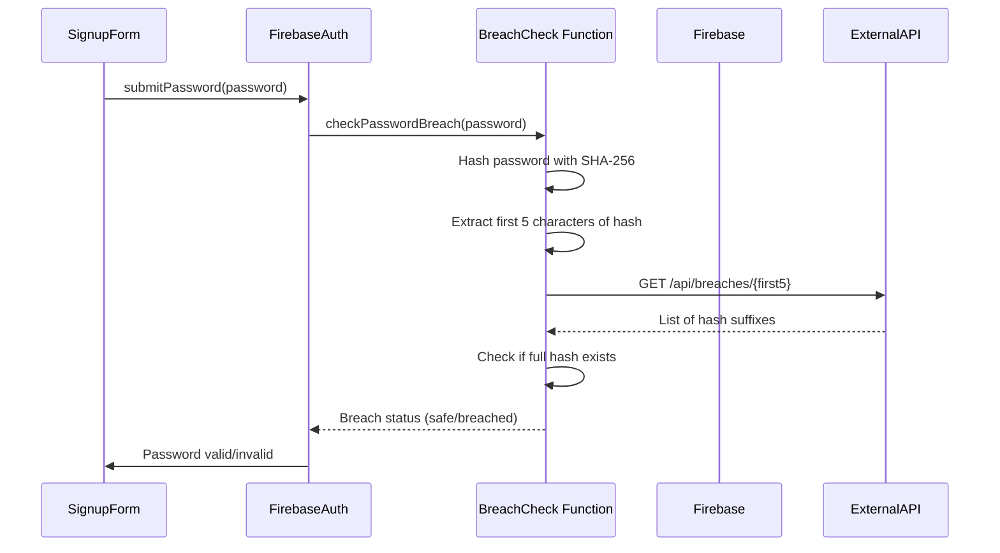

**Diagram sources**
- [auth.ts](file://src/lib/firebase/auth.ts)
- [password-breach-check/index.ts](file://supabase/functions/password-breach-check/index.ts)

### OTP Verification Flow
The OTP verification system provides an additional layer of security by verifying user ownership of a phone number. The system generates time-limited codes sent via SMS, which users must enter to complete registration or sensitive operations.

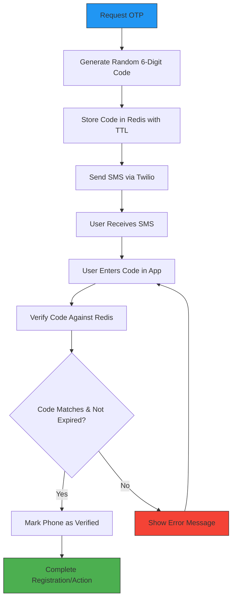

**Diagram sources**
- [auth.ts](file://src/lib/firebase/auth.ts)
- [send-otp/index.ts](file://supabase/functions/send-otp/index.ts)
- [verify-otp/index.ts](file://supabase/functions/verify-otp/index.ts)

## Form Validation and Error Handling
The authentication forms implement comprehensive validation using React Hook Form and Zod, providing real-time feedback and clear error messages. The validation strategy combines client-side validation for immediate feedback with server-side validation for security-critical checks.

### Validation Architecture
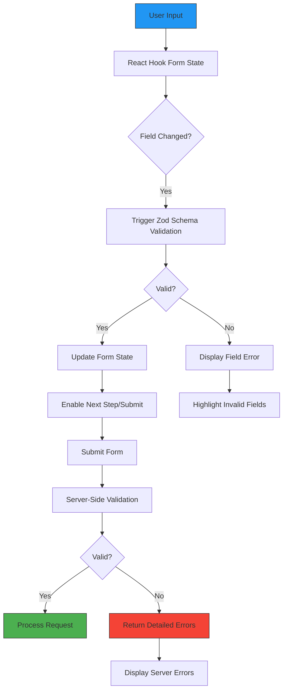

**Diagram sources**
- [CustomerSignupForm.tsx](file://src/components/auth/CustomerSignupForm.tsx)
- [ProductionPartnerSignupForm.tsx](file://src/components/auth/ProductionPartnerSignupForm.tsx)
- [auth.ts](file://src/lib/firebase/auth.ts)

## Role-Based Redirection and Session Management
The system implements role-based redirection after login, directing users to appropriate dashboards based on their role (customer, production partner, or admin). Session management follows security best practices with token refresh mechanisms and idle timeout detection.

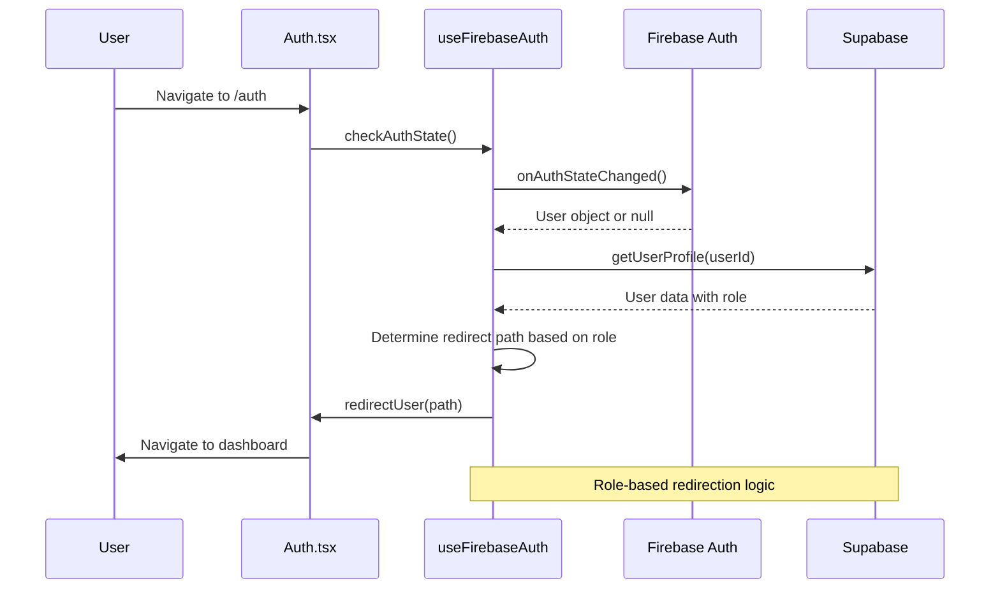

**Diagram sources**
- [Auth.tsx](file://src/pages/Auth.tsx)
- [useFirebaseAuth.tsx](file://src/hooks/useFirebaseAuth.tsx)
- [supabase-adapter.ts](file://src/lib/firebase/supabase-adapter.ts)

## Integration with Firebase and Supabase
The authentication system leverages Firebase Authentication for identity management and Supabase for data persistence, using a custom adapter pattern to bridge the two systems. This hybrid approach combines Firebase's robust authentication features with Supabase's flexible PostgreSQL backend.

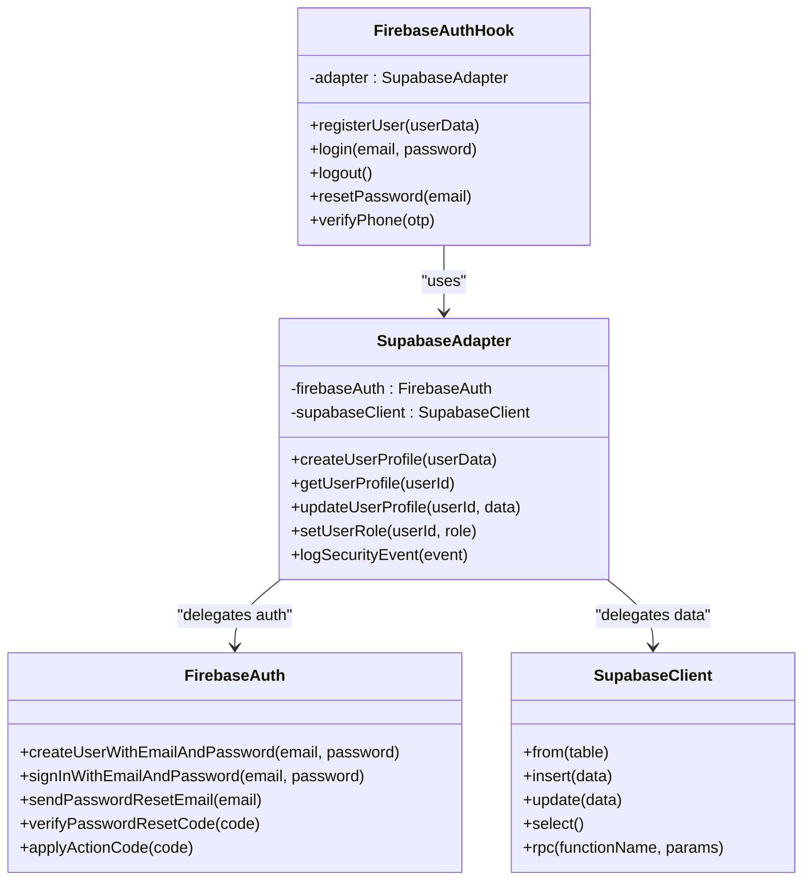

**Diagram sources**
- [auth.ts](file://src/lib/firebase/auth.ts)
- [supabase-adapter.ts](file://src/lib/firebase/supabase-adapter.ts)
- [client.ts](file://src/integrations/supabase/client.ts)
- [useFirebaseAuth.tsx](file://src/hooks/useFirebaseAuth.tsx)

## Troubleshooting Guide
This section documents common issues and their solutions related to the authentication components.

### Common Registration Issues
- **Email already in use**: The system prevents duplicate accounts with the same email. Users should use the password reset flow if they've forgotten their credentials.
- **OTP not received**: Check spam folder, verify phone number format, and ensure SMS gateway is operational. The system allows resending OTP after a cooldown period.
- **Password breach detected**: Users must choose a stronger password that hasn't been exposed in data breaches.
- **Form validation errors**: Ensure all required fields are completed with valid data according to the specified formats.

### Debugging Authentication Flows
When troubleshooting authentication issues, check the following:
1. Verify Firebase configuration is correctly loaded
2. Check network requests to Supabase functions for errors
3. Review browser console for JavaScript errors
4. Validate that environment variables are properly set
5. Check rate limiting on OTP requests

**Section sources**
- [CustomerSignupForm.tsx](file://src/components/auth/CustomerSignupForm.tsx)
- [ProductionPartnerSignupForm.tsx](file://src/components/auth/ProductionPartnerSignupForm.tsx)
- [useFirebaseAuth.tsx](file://src/hooks/useFirebaseAuth.tsx)
- [auth.ts](file://src/lib/firebase/auth.ts)

## Conclusion
The authentication system in SleekApp provides a secure, user-friendly registration and login experience with robust validation and security features. By combining Firebase Authentication with Supabase backend services, the system achieves a balance of reliability, scalability, and flexibility. The modular architecture with clear separation of concerns makes the system maintainable and extensible, while the comprehensive validation and error handling ensure a smooth user experience. The role-based access control and redirection patterns enable personalized user journeys from the moment of registration.