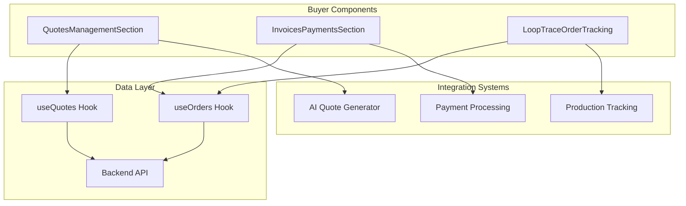
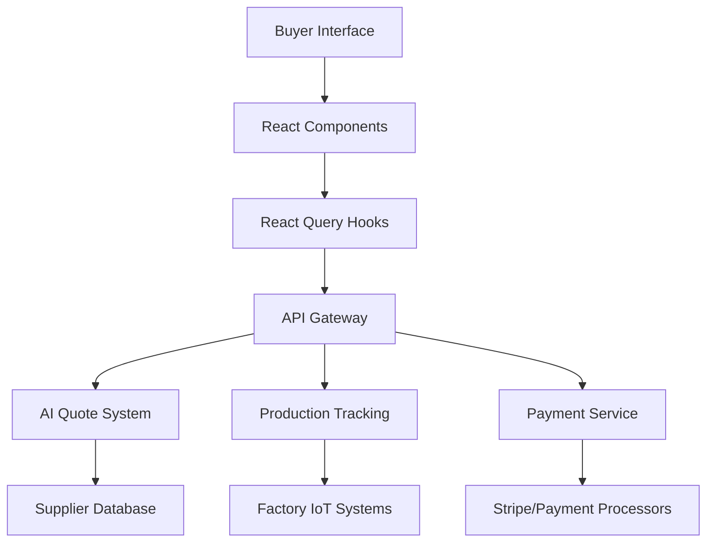
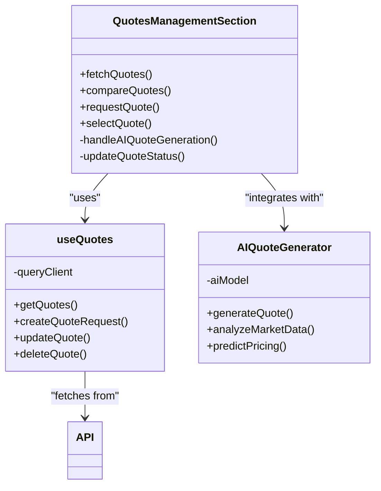
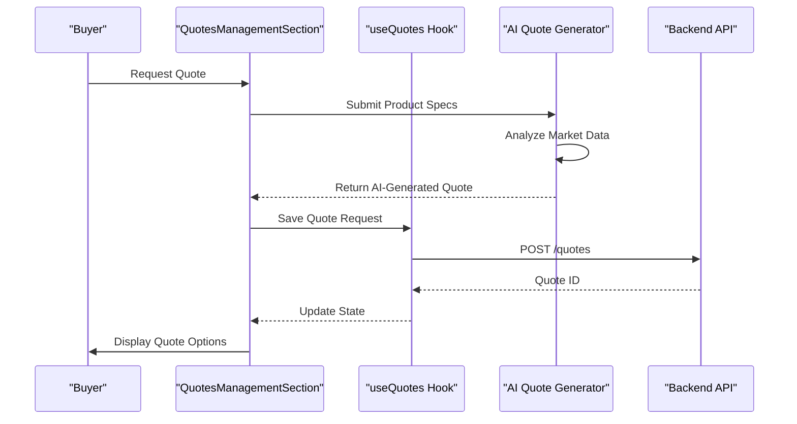
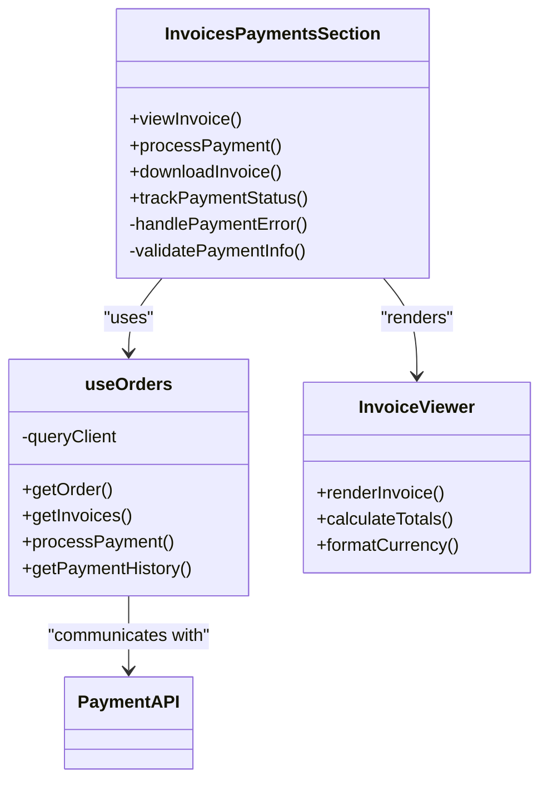
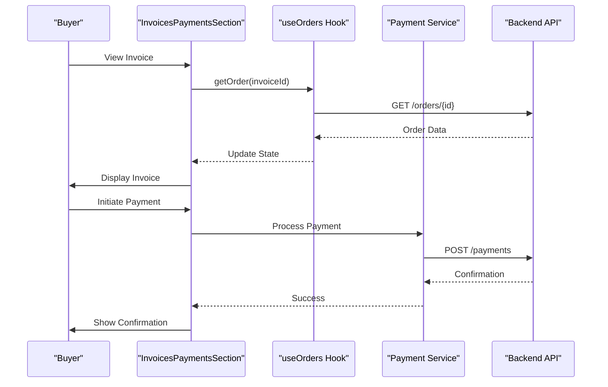
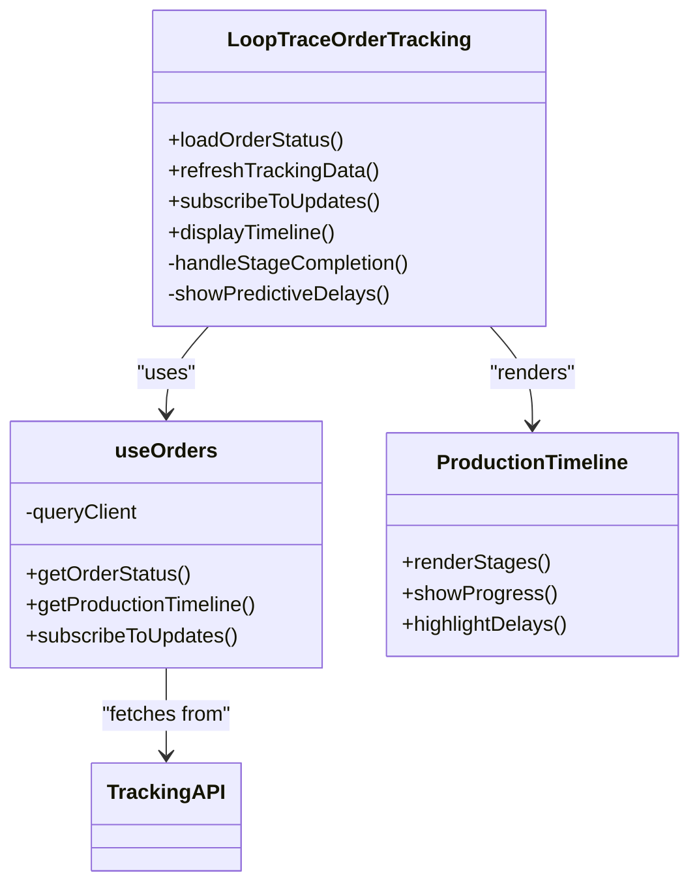
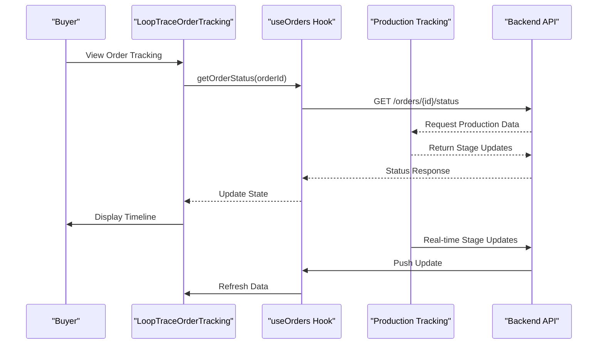
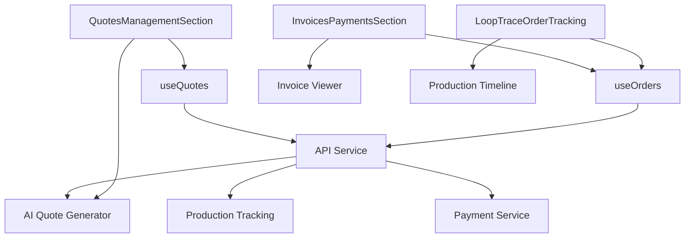

# Buyer Components

<cite>
**Referenced Files in This Document**  
- [QuotesManagementSection.tsx](file://src/components/buyer/QuotesManagementSection.tsx)
- [InvoicesPaymentsSection.tsx](file://src/components/buyer/InvoicesPaymentsSection.tsx)
- [LoopTraceOrderTracking.tsx](file://src/components/buyer/LoopTraceOrderTracking.tsx)
- [useQuotes.ts](file://src/hooks/useQuotes.ts)
- [useOrders.ts](file://src/hooks/useOrders.ts)
- [ModernBuyerDashboard.tsx](file://src/pages/ModernBuyerDashboard.tsx)
- [BuyerOrderTracking.tsx](file://src/pages/BuyerOrderTracking.tsx)
- [TrackOrder.tsx](file://src/pages/TrackOrder.tsx)
- [Orders.tsx](file://src/pages/Orders.tsx)
- [AIQuoteGenerator.tsx](file://src/components/AIQuoteGenerator.tsx)
- [ProductionTimeline.tsx](file://src/components/ProductionTimeline.tsx)
- [OrderStatusTimeline.tsx](file://src/components/OrderStatusTimeline.tsx)
- [InvoiceViewer.tsx](file://src/components/payment/InvoiceViewer.tsx)
- [QuoteComparison.tsx](file://src/components/quote/QuoteComparison.tsx)
</cite>

## Table of Contents
1. [Introduction](#introduction)
2. [Project Structure](#project-structure)
3. [Core Components](#core-components)
4. [Architecture Overview](#architecture-overview)
5. [Detailed Component Analysis](#detailed-component-analysis)
6. [Dependency Analysis](#dependency-analysis)
7. [Performance Considerations](#performance-considerations)
8. [Troubleshooting Guide](#troubleshooting-guide)
9. [Conclusion](#conclusion)

## Introduction
This document provides comprehensive documentation for the buyer-facing components in the SleekApp platform. It focuses on three primary components: QuotesManagementSection, InvoicesPaymentsSection, and LoopTraceOrderTracking. These components enable buyers to manage quotes, process payments, and track order production in real time. The documentation covers integration with the AI quote generation system, production tracking workflows, user experience patterns, state management using React Query hooks, and guidance on buyer interactions throughout the ordering lifecycle.

## Project Structure
The buyer components are organized within the `src/components/buyer` directory, following a feature-based architecture. These components integrate with various hooks in the `src/hooks` directory for data fetching and state management. The overall structure separates concerns between UI presentation, business logic, and data access layers, enabling maintainable and scalable code.

**Diagram sources**
- [QuotesManagementSection.tsx](file://src/components/buyer/QuotesManagementSection.tsx)
- [InvoicesPaymentsSection.tsx](file://src/components/buyer/InvoicesPaymentsSection.tsx)
- [LoopTraceOrderTracking.tsx](file://src/components/buyer/LoopTraceOrderTracking.tsx)
- [useQuotes.ts](file://src/hooks/useQuotes.ts)
- [useOrders.ts](file://src/hooks/useOrders.ts)

**Section sources**
- [QuotesManagementSection.tsx](file://src/components/buyer/QuotesManagementSection.tsx)
- [InvoicesPaymentsSection.tsx](file://src/components/buyer/InvoicesPaymentsSection.tsx)
- [LoopTraceOrderTracking.tsx](file://src/components/buyer/LoopTraceOrderTracking.tsx)

## Core Components
The three core buyer components—QuotesManagementSection, InvoicesPaymentsSection, and LoopTraceOrderTracking—form the foundation of the buyer experience in SleekApp. These components provide intuitive interfaces for managing the entire order lifecycle from quote request to delivery. They leverage React Query for efficient data fetching and caching, ensuring responsive user experiences even with complex data requirements.

**Section sources**
- [QuotesManagementSection.tsx](file://src/components/buyer/QuotesManagementSection.tsx)
- [InvoicesPaymentsSection.tsx](file://src/components/buyer/InvoicesPaymentsSection.tsx)
- [LoopTraceOrderTracking.tsx](file://src/components/buyer/LoopTraceOrderTracking.tsx)

## Architecture Overview
The buyer components follow a modular architecture that separates presentation from logic. They consume data through custom React Query hooks (`useQuotes`, `useOrders`) which handle API communication, caching, and state synchronization. The components integrate with AI systems for quote generation and with production tracking systems for real-time order updates. This architecture enables a seamless experience where buyers can compare quotes, process payments, and monitor production progress in a unified interface.

**Diagram sources**
- [useQuotes.ts](file://src/hooks/useQuotes.ts)
- [useOrders.ts](file://src/hooks/useOrders.ts)
- [AIQuoteGenerator.tsx](file://src/components/AIQuoteGenerator.tsx)
- [ProductionTimeline.tsx](file://src/components/ProductionTimeline.tsx)

## Detailed Component Analysis

### QuotesManagementSection Analysis
The QuotesManagementSection component enables buyers to request, compare, and manage quotes from multiple suppliers. It integrates with the AI quote generation system to provide instant preliminary quotes based on product specifications and market data.

#### For Object-Oriented Components:

**Diagram sources**
- [QuotesManagementSection.tsx](file://src/components/buyer/QuotesManagementSection.tsx)
- [useQuotes.ts](file://src/hooks/useQuotes.ts)
- [AIQuoteGenerator.tsx](file://src/components/AIQuoteGenerator.tsx)

#### For API/Service Components:

**Diagram sources**
- [QuotesManagementSection.tsx](file://src/components/buyer/QuotesManagementSection.tsx)
- [useQuotes.ts](file://src/hooks/useQuotes.ts)
- [AIQuoteGenerator.tsx](file://src/components/AIQuoteGenerator.tsx)

**Section sources**
- [QuotesManagementSection.tsx](file://src/components/buyer/QuotesManagementSection.tsx)
- [useQuotes.ts](file://src/hooks/useQuotes.ts)
- [AIQuoteGenerator.tsx](file://src/components/AIQuoteGenerator.tsx)

### InvoicesPaymentsSection Analysis
The InvoicesPaymentsSection component handles the financial aspects of the buyer journey, including invoice viewing, payment processing, and payment history tracking. It provides a secure interface for completing transactions and maintaining financial records.

#### For Object-Oriented Components:

**Diagram sources**
- [InvoicesPaymentsSection.tsx](file://src/components/buyer/InvoicesPaymentsSection.tsx)
- [useOrders.ts](file://src/hooks/useOrders.ts)
- [InvoiceViewer.tsx](file://src/components/payment/InvoiceViewer.tsx)

#### For API/Service Components:

**Diagram sources**
- [InvoicesPaymentsSection.tsx](file://src/components/buyer/InvoicesPaymentsSection.tsx)
- [useOrders.ts](file://src/hooks/useOrders.ts)
- [InvoiceViewer.tsx](file://src/components/payment/InvoiceViewer.tsx)

**Section sources**
- [InvoicesPaymentsSection.tsx](file://src/components/buyer/InvoicesPaymentsSection.tsx)
- [useOrders.ts](file://src/hooks/useOrders.ts)
- [InvoiceViewer.tsx](file://src/components/payment/InvoiceViewer.tsx)

### LoopTraceOrderTracking Analysis
The LoopTraceOrderTracking component provides real-time visibility into order production status. It displays a timeline of production stages, quality checks, and shipping updates, enabling buyers to monitor their orders from factory to delivery.

#### For Object-Oriented Components:

**Diagram sources**
- [LoopTraceOrderTracking.tsx](file://src/components/buyer/LoopTraceOrderTracking.tsx)
- [useOrders.ts](file://src/hooks/useOrders.ts)
- [ProductionTimeline.tsx](file://src/components/ProductionTimeline.tsx)

#### For API/Service Components:

**Diagram sources**
- [LoopTraceOrderTracking.tsx](file://src/components/buyer/LoopTraceOrderTracking.tsx)
- [useOrders.ts](file://src/hooks/useOrders.ts)
- [ProductionTimeline.tsx](file://src/components/ProductionTimeline.tsx)

**Section sources**
- [LoopTraceOrderTracking.tsx](file://src/components/buyer/LoopTraceOrderTracking.tsx)
- [useOrders.ts](file://src/hooks/useOrders.ts)
- [ProductionTimeline.tsx](file://src/components/ProductionTimeline.tsx)

## Dependency Analysis
The buyer components have well-defined dependencies that enable their functionality while maintaining separation of concerns. The components depend on React Query hooks for data management, which in turn depend on the backend API services. There are no circular dependencies, and the architecture allows for independent development and testing of components.

**Diagram sources**
- [QuotesManagementSection.tsx](file://src/components/buyer/QuotesManagementSection.tsx)
- [InvoicesPaymentsSection.tsx](file://src/components/buyer/InvoicesPaymentsSection.tsx)
- [LoopTraceOrderTracking.tsx](file://src/components/buyer/LoopTraceOrderTracking.tsx)
- [useQuotes.ts](file://src/hooks/useQuotes.ts)
- [useOrders.ts](file://src/hooks/useOrders.ts)

**Section sources**
- [QuotesManagementSection.tsx](file://src/components/buyer/QuotesManagementSection.tsx)
- [InvoicesPaymentsSection.tsx](file://src/components/buyer/InvoicesPaymentsSection.tsx)
- [LoopTraceOrderTracking.tsx](file://src/components/buyer/LoopTraceOrderTracking.tsx)
- [useQuotes.ts](file://src/hooks/useQuotes.ts)
- [useOrders.ts](file://src/hooks/useOrders.ts)

## Performance Considerations
The buyer components are optimized for performance through efficient data fetching strategies, caching with React Query, and lazy loading of non-critical resources. The use of React Query's built-in caching and background refetching ensures that users see up-to-date information without unnecessary loading states. Components are designed to minimize re-renders through proper state management and memoization techniques.

## Troubleshooting Guide
When issues arise with buyer components, common troubleshooting steps include verifying API connectivity, checking authentication status, ensuring React Query cache consistency, and validating data formats from the backend. The components include error boundaries and user-friendly error messages to help diagnose issues. For real-time tracking problems, verify the WebSocket connection status and check the production tracking system's health.

**Section sources**
- [QuotesManagementSection.tsx](file://src/components/buyer/QuotesManagementSection.tsx)
- [InvoicesPaymentsSection.tsx](file://src/components/buyer/InvoicesPaymentsSection.tsx)
- [LoopTraceOrderTracking.tsx](file://src/components/buyer/LoopTraceOrderTracking.tsx)
- [useQuotes.ts](file://src/hooks/useQuotes.ts)
- [useOrders.ts](file://src/hooks/useOrders.ts)

## Conclusion
The buyer-facing components in SleekApp provide a comprehensive and intuitive experience for managing quotes, payments, and order tracking. By leveraging React Query for state management and integrating with AI and production tracking systems, these components deliver a seamless workflow that enhances buyer confidence and engagement. The modular architecture enables future enhancements and ensures maintainability as the platform evolves.