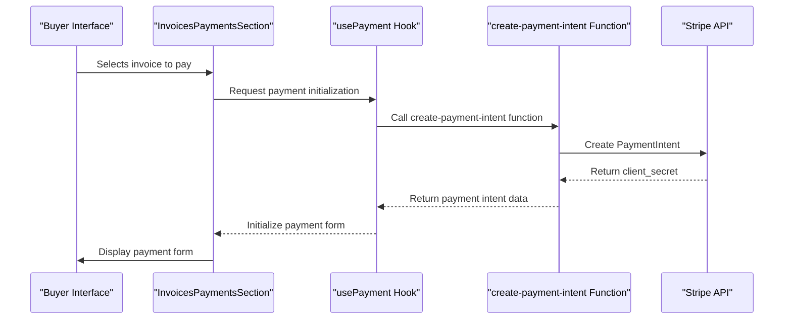
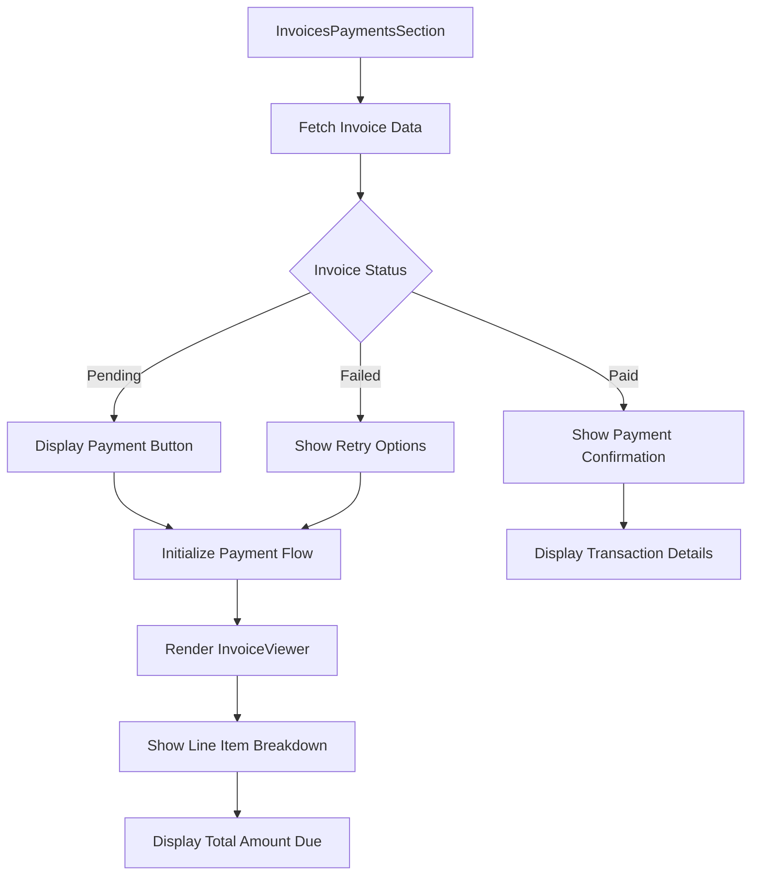
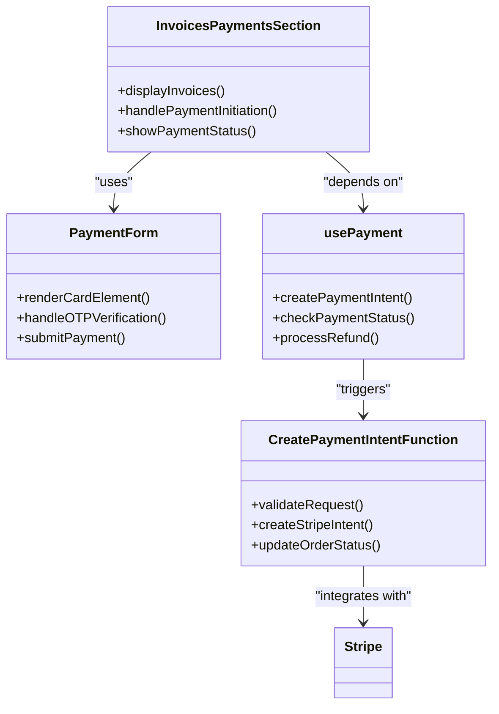
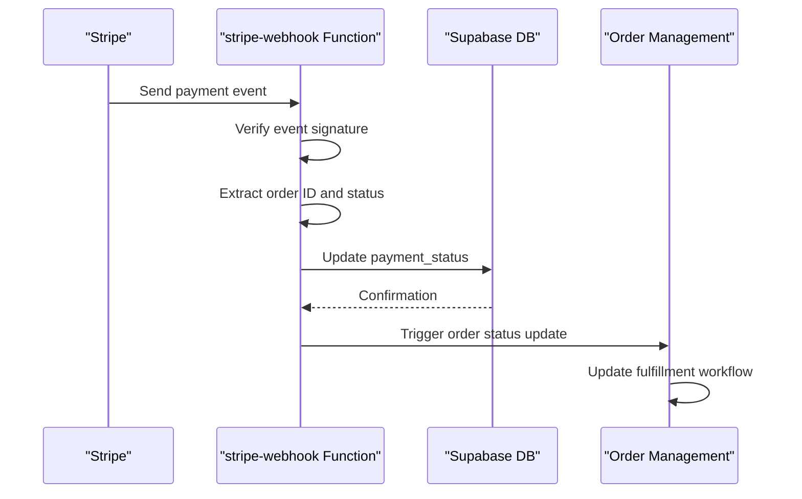
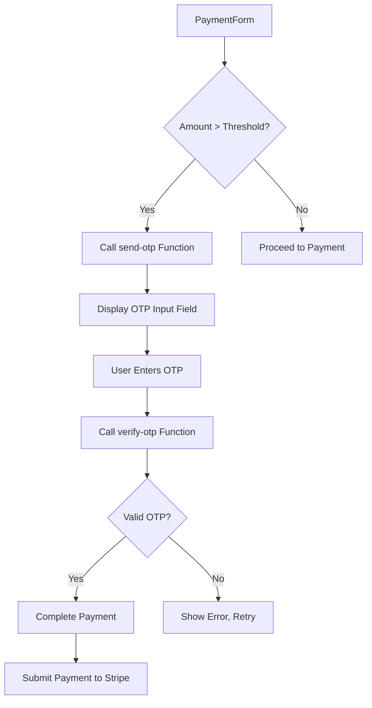
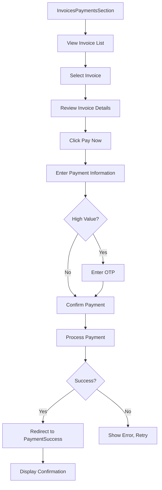
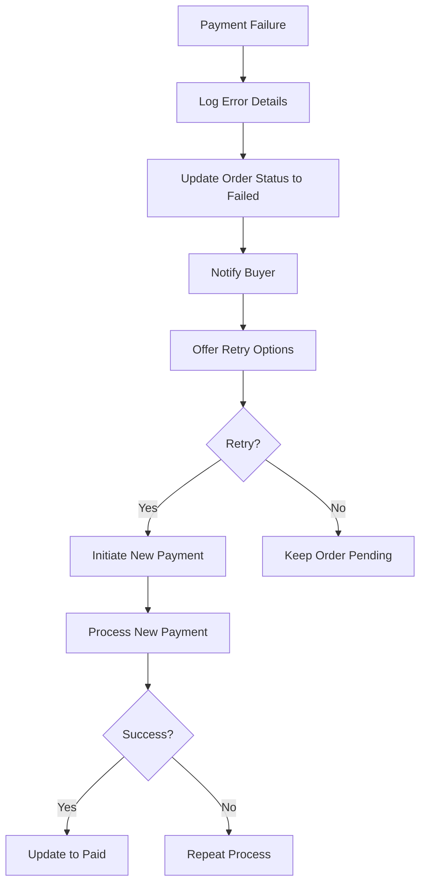

# Invoices and Payments

<cite>
**Referenced Files in This Document**  
- [InvoicesPaymentsSection.tsx](file://src/components/buyer/InvoicesPaymentsSection.tsx)
- [PaymentForm.tsx](file://src/components/payment/PaymentForm.tsx)
- [InvoiceViewer.tsx](file://src/components/payment/InvoiceViewer.tsx)
- [create-payment-intent/index.ts](file://supabase/functions/create-payment-intent/index.ts)
- [stripe-webhook/index.ts](file://supabase/functions/stripe-webhook/index.ts)
- [PaymentCheckout.tsx](file://src/pages/PaymentCheckout.tsx)
- [PaymentSuccess.tsx](file://src/pages/PaymentSuccess.tsx)
- [usePayment.ts](file://src/hooks/usePayment.ts)
</cite>

## Table of Contents
1. [Introduction](#introduction)
2. [Core Components Overview](#core-components-overview)
3. [Payment Workflow Integration](#payment-workflow-integration)
4. [Invoice Management and Display](#invoice-management-and-display)
5. [Secure Payment Processing with Stripe](#secure-payment-processing-with-stripe)
6. [Payment Status Tracking and Order Synchronization](#payment-status-tracking-and-order-synchronization)
7. [High-Value Transaction Security: OTP Verification](#high-value-transaction-security-otp-verification)
8. [User Experience for Payment Processing](#user-experience-for-payment-processing)
9. [Error Handling and Reconciliation](#error-handling-and-reconciliation)
10. [Conclusion](#conclusion)

## Introduction
The InvoicesPaymentsSection component is a critical part of the buyer-facing interface that manages the complete payment lifecycle for orders placed through the platform. This document details how the component integrates with Stripe for secure payment processing, displays comprehensive invoice information, and ensures seamless synchronization between payment status and order fulfillment workflows. The system is designed to handle various payment scenarios including standard transactions, high-value purchases requiring additional verification, and post-payment reconciliation processes.

## Core Components Overview

The payment ecosystem consists of several interconnected components that work together to provide a secure and user-friendly payment experience. The InvoicesPaymentsSection serves as the main interface for buyers to view their invoices and initiate payments, while supporting components handle specific aspects of the payment flow.

**Section sources**
- [InvoicesPaymentsSection.tsx](file://src/components/buyer/InvoicesPaymentsSection.tsx#L1-L150)
- [PaymentForm.tsx](file://src/components/payment/PaymentForm.tsx#L1-L200)
- [InvoiceViewer.tsx](file://src/components/payment/InvoiceViewer.tsx#L1-L120)

## Payment Workflow Integration

The payment workflow begins when a buyer converts a quote into an order, triggering the generation of an invoice. The InvoicesPaymentsSection component retrieves this invoice data and presents it to the user with clear payment options. When the user initiates payment, the system creates a payment intent through a Supabase Edge Function that communicates securely with Stripe's API.

**Diagram sources**
- [InvoicesPaymentsSection.tsx](file://src/components/buyer/InvoicesPaymentsSection.tsx#L50-L100)
- [usePayment.ts](file://src/hooks/usePayment.ts#L20-L80)
- [create-payment-intent/index.ts](file://supabase/functions/create-payment-intent/index.ts#L1-L60)

**Section sources**
- [InvoicesPaymentsSection.tsx](file://src/components/buyer/InvoicesPaymentsSection.tsx#L25-L120)
- [usePayment.ts](file://src/hooks/usePayment.ts#L15-L100)

## Invoice Management and Display

The InvoicesPaymentsSection component provides buyers with a comprehensive view of their invoice history and current payment obligations. It integrates with the InvoiceViewer component to display detailed breakdowns of charges, including itemized costs, applicable taxes, shipping fees, and any discounts or promotions applied to the order.

**Diagram sources**
- [InvoicesPaymentsSection.tsx](file://src/components/buyer/InvoicesPaymentsSection.tsx#L30-L90)
- [InvoiceViewer.tsx](file://src/components/payment/InvoiceViewer.tsx#L15-L75)

**Section sources**
- [InvoicesPaymentsSection.tsx](file://src/components/buyer/InvoicesPaymentsSection.tsx#L15-L100)
- [InvoiceViewer.tsx](file://src/components/payment/InvoiceViewer.tsx#L1-L80)

## Secure Payment Processing with Stripe

The integration with Stripe follows security best practices by using Payment Intents API for handling payment flows. The create-payment-intent Supabase Edge Function acts as a secure intermediary between the client application and Stripe, preventing sensitive API keys from being exposed in the frontend code.

When a payment is initiated, the system:
1. Creates a payment intent with the exact amount and currency
2. Associates the intent with the specific order and buyer
3. Returns a client secret to the frontend for completing the payment
4. Handles the payment confirmation through Stripe Elements

**Diagram sources**
- [InvoicesPaymentsSection.tsx](file://src/components/buyer/InvoicesPaymentsSection.tsx#L40-L80)
- [PaymentForm.tsx](file://src/components/payment/PaymentForm.tsx#L10-L60)
- [usePayment.ts](file://src/hooks/usePayment.ts#L5-L40)
- [create-payment-intent/index.ts](file://supabase/functions/create-payment-intent/index.ts#L5-L30)

**Section sources**
- [InvoicesPaymentsSection.tsx](file://src/components/buyer/InvoicesPaymentsSection.tsx#L20-L90)
- [PaymentForm.tsx](file://src/components/payment/PaymentForm.tsx#L1-L150)
- [usePayment.ts](file://src/hooks/usePayment.ts#L1-L120)
- [create-payment-intent/index.ts](file://supabase/functions/create-payment-intent/index.ts#L1-L80)

## Payment Status Tracking and Order Synchronization

Payment status is tightly integrated with the order workflow through webhook events from Stripe. The stripe-webhook Supabase function listens for payment events and updates the corresponding order status in the database, ensuring that fulfillment processes only proceed when payment has been successfully confirmed.

**Diagram sources**
- [stripe-webhook/index.ts](file://supabase/functions/stripe-webhook/index.ts#L1-L50)
- [usePayment.ts](file://src/hooks/usePayment.ts#L60-L100)

**Section sources**
- [stripe-webhook/index.ts](file://supabase/functions/stripe-webhook/index.ts#L1-L70)
- [usePayment.ts](file://src/hooks/usePayment.ts#L50-L120)

## High-Value Transaction Security: OTP Verification

For high-value transactions exceeding a predefined threshold, the PaymentForm component implements an additional security layer using OTP verification. This process involves:
1. Detecting when a transaction exceeds the security threshold
2. Triggering the send-otp Supabase function to deliver a verification code
3. Requiring the user to enter the OTP before completing the payment
4. Validating the OTP through the verify-otp function before processing

**Diagram sources**
- [PaymentForm.tsx](file://src/components/payment/PaymentForm.tsx#L80-L150)
- [send-otp/index.ts](file://supabase/functions/send-otp/index.ts#L1-L25)
- [verify-otp/index.ts](file://supabase/functions/verify-otp/index.ts#L1-L25)

**Section sources**
- [PaymentForm.tsx](file://src/components/payment/PaymentForm.tsx#L75-L200)
- [send-otp/index.ts](file://supabase/functions/send-otp/index.ts#L1-L30)
- [verify-otp/index.ts](file://supabase/functions/verify-otp/index.ts#L1-L30)

## User Experience for Payment Processing

The user experience is designed to be intuitive and transparent throughout the payment process. The InvoicesPaymentsSection provides a clear overview of all outstanding invoices, allowing buyers to:
- View detailed invoice breakdowns
- Track payment history
- Initiate payments with a single click
- Receive immediate feedback on payment status
- Access payment confirmation details

Upon successful payment, users are redirected to the PaymentSuccess page which displays transaction details and next steps in the order fulfillment process.

**Diagram sources**
- [InvoicesPaymentsSection.tsx](file://src/components/buyer/InvoicesPaymentsSection.tsx#L1-L150)
- [PaymentCheckout.tsx](file://src/pages/PaymentCheckout.tsx#L1-L100)
- [PaymentSuccess.tsx](file://src/pages/PaymentSuccess.tsx#L1-L80)

**Section sources**
- [InvoicesPaymentsSection.tsx](file://src/components/buyer/InvoicesPaymentsSection.tsx#L1-L200)
- [PaymentCheckout.tsx](file://src/pages/PaymentCheckout.tsx#L1-L150)
- [PaymentSuccess.tsx](file://src/pages/PaymentSuccess.tsx#L1-L120)

## Error Handling and Reconciliation

The system includes comprehensive error handling for various payment scenarios:
- Failed payments due to insufficient funds or card issues
- Network interruptions during payment processing
- Discrepancies between payment status and order fulfillment
- Refund processing and reconciliation

When a payment fails, the InvoicesPaymentsSection displays appropriate error messages and provides options to retry with a different payment method. The system also maintains a reconciliation process to resolve any discrepancies between payment records and order status.

**Diagram sources**
- [InvoicesPaymentsSection.tsx](file://src/components/buyer/InvoicesPaymentsSection.tsx#L120-L180)
- [usePayment.ts](file://src/hooks/usePayment.ts#L100-L150)
- [stripe-webhook/index.ts](file://supabase/functions/stripe-webhook/index.ts#L40-L70)

**Section sources**
- [InvoicesPaymentsSection.tsx](file://src/components/buyer/InvoicesPaymentsSection.tsx#L100-L200)
- [usePayment.ts](file://src/hooks/usePayment.ts#L80-L150)
- [stripe-webhook/index.ts](file://supabase/functions/stripe-webhook/index.ts#L30-L80)

## Conclusion

The InvoicesPaymentsSection component provides a robust and secure payment management system that integrates seamlessly with Stripe for processing transactions. By leveraging Supabase Edge Functions for secure payment intent creation and webhook handling, the system maintains high security standards while providing a smooth user experience. The implementation includes comprehensive features for invoice management, payment status tracking, OTP verification for high-value transactions, and error handling for failed payments and reconciliation scenarios. This architecture ensures that payment processing is both secure and user-friendly, supporting the platform's commitment to reliable order fulfillment.