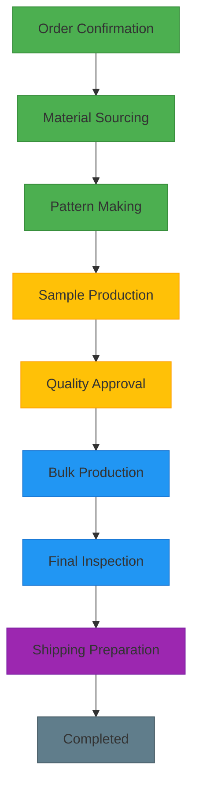
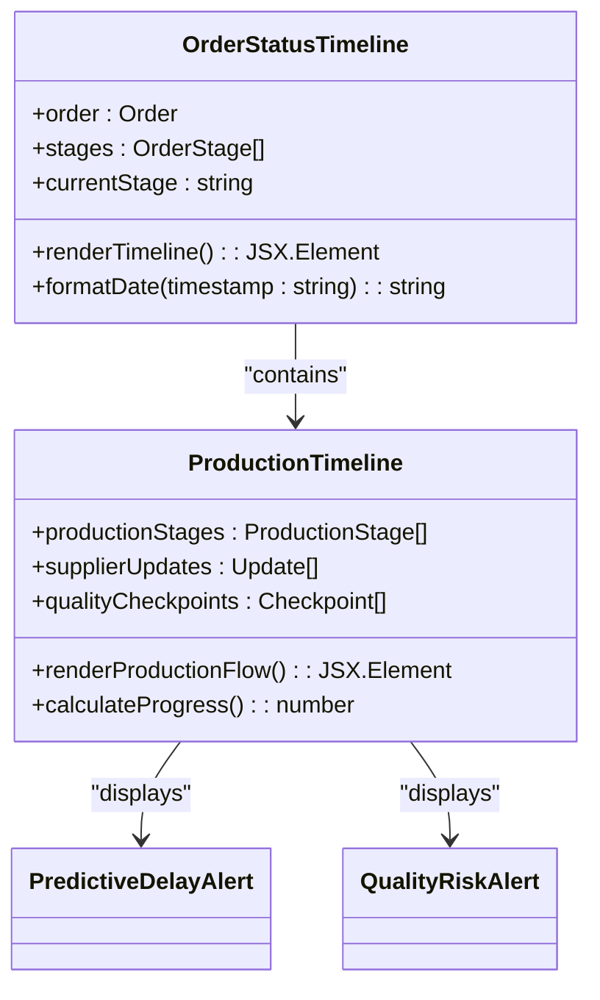
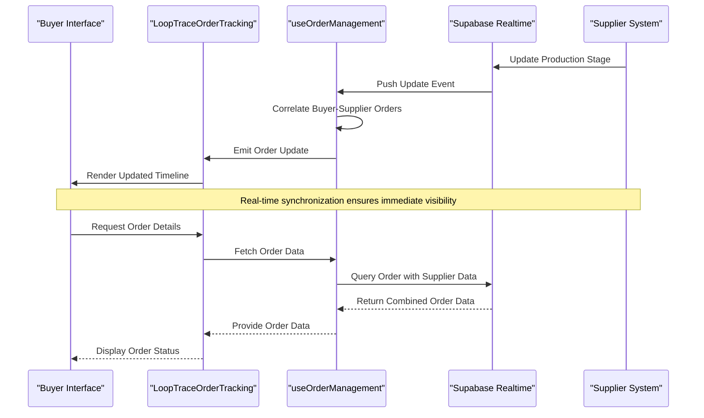
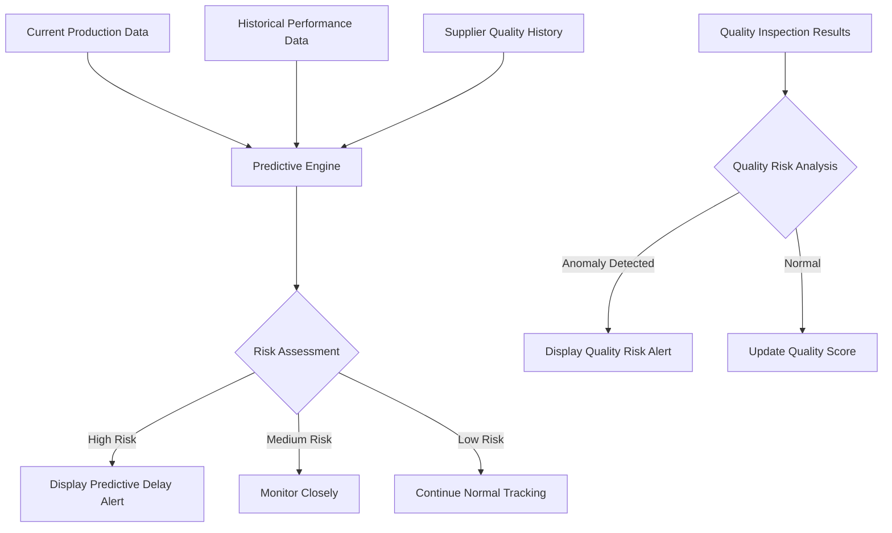

# Order Tracking

<cite>
**Referenced Files in This Document**  
- [LoopTraceOrderTracking.tsx](file://src/components/buyer/LoopTraceOrderTracking.tsx)
- [OrderStatusTimeline.tsx](file://src/components/OrderStatusTimeline.tsx)
- [ProductionTimeline.tsx](file://src/components/ProductionTimeline.tsx)
- [useOrderManagement.ts](file://src/hooks/useOrderManagement.ts)
- [PredictiveDelayAlert.tsx](file://src/components/production/PredictiveDelayAlert.tsx)
- [QualityRiskAlert.tsx](file://src/components/production/QualityRiskAlert.tsx)
- [client.ts](file://src/integrations/supabase/client.ts)
- [supabaseHelpers.ts](file://src/lib/supabaseHelpers.ts)
</cite>

## Table of Contents
1. [Introduction](#introduction)
2. [LoopTraceOrderTracking Component Overview](#looptraceordertracking-component-overview)
3. [Integration with 8-Stage LoopTrace™ Manufacturing Process](#integration-with-8-stage-looptracetrade-manufacturing-process)
4. [OrderStatusTimeline and ProductionTimeline Components](#orderstatustimeline-and-productiontimeline-components)
5. [Real-Time Data Flow from Supabase](#real-time-data-flow-from-supabase)
6. [User Experience for Production Monitoring](#user-experience-for-production-monitoring)
7. [Predictive Delay and Quality Risk Alerts](#predictive-delay-and-quality-risk-alerts)
8. [Common Issues and Solutions](#common-issues-and-solutions)
9. [Conclusion](#conclusion)

## Introduction
The LoopTraceOrderTracking component provides real-time visibility into production workflows for buyers, enabling transparent monitoring of garment manufacturing across all stages. This document details how the component integrates with the 8-stage LoopTrace™ manufacturing process, visualizes production progress through timeline components, and delivers predictive alerts for potential delays and quality risks. The system leverages Supabase for real-time data synchronization between buyer and supplier orders, ensuring accurate tracking and estimated delivery dates.

## LoopTraceOrderTracking Component Overview
The LoopTraceOrderTracking component serves as the central interface for buyers to monitor their production orders. It aggregates data from multiple sources, including supplier updates, quality control checkpoints, and production stage completions. The component renders a comprehensive view of order status, incorporating both chronological progress and predictive analytics.

**Section sources**
- [LoopTraceOrderTracking.tsx](file://src/components/buyer/LoopTraceOrderTracking.tsx#L1-L150)

## Integration with 8-Stage LoopTrace™ Manufacturing Process
The LoopTraceOrderTracking component is tightly integrated with the 8-stage LoopTrace™ manufacturing process, which includes: Order Confirmation, Material Sourcing, Pattern Making, Sample Production, Quality Approval, Bulk Production, Final Inspection, and Shipping Preparation. Each stage is represented in the timeline with status indicators, completion timestamps, and responsible parties.

The component listens for stage transition events through Supabase subscriptions, updating the UI in real-time as suppliers progress through the manufacturing workflow. This integration ensures that buyers receive immediate visibility into production milestones and can identify potential bottlenecks early in the process.

**Diagram sources**
- [LoopTraceOrderTracking.tsx](file://src/components/buyer/LoopTraceOrderTracking.tsx#L50-L80)
- [initialize-production-stages/index.ts](file://supabase/functions/initialize-production-stages/index.ts#L1-L40)

## OrderStatusTimeline and ProductionTimeline Components
The OrderStatusTimeline and ProductionTimeline components provide visual representations of order progress through the manufacturing lifecycle. The OrderStatusTimeline focuses on buyer-centric milestones such as order placement, payment confirmation, and delivery estimates, while the ProductionTimeline details the supplier-side manufacturing stages.

Both components use a horizontal timeline layout with color-coded status indicators, completion percentages, and interactive tooltips displaying additional details. The timelines are synchronized, allowing users to correlate buyer order events with corresponding production activities.

**Diagram sources**
- [OrderStatusTimeline.tsx](file://src/components/OrderStatusTimeline.tsx#L1-L100)
- [ProductionTimeline.tsx](file://src/components/ProductionTimeline.tsx#L1-L120)

**Section sources**
- [OrderStatusTimeline.tsx](file://src/components/OrderStatusTimeline.tsx#L1-L150)
- [ProductionTimeline.tsx](file://src/components/ProductionTimeline.tsx#L1-L180)

## Real-Time Data Flow from Supabase
The LoopTraceOrderTracking system fetches order data from Supabase using real-time subscriptions that synchronize changes between buyer and supplier orders. When a supplier updates a production stage, the change is immediately propagated to the buyer's tracking interface through Supabase's real-time capabilities.

The data flow begins with the useOrderManagement hook, which establishes a connection to Supabase and subscribes to order updates. The hook correlates buyer orders with their corresponding supplier orders using a shared order ID, ensuring data consistency across both perspectives. This real-time synchronization enables accurate estimated delivery dates that update automatically as production progresses.

**Diagram sources**
- [useOrderManagement.ts](file://src/hooks/useOrderManagement.ts#L1-L80)
- [client.ts](file://src/integrations/supabase/client.ts#L1-L30)
- [supabaseHelpers.ts](file://src/lib/supabaseHelpers.ts#L15-L50)

**Section sources**
- [useOrderManagement.ts](file://src/hooks/useOrderManagement.ts#L1-L100)
- [client.ts](file://src/integrations/supabase/client.ts#L1-L40)

## User Experience for Production Monitoring
The user experience for monitoring production stages is designed to provide comprehensive visibility while maintaining simplicity. Buyers can view their orders in a dashboard format, with each order displaying its current production stage, completion percentage, and any active alerts.

Key features include:
- Interactive timeline with hover details for each production stage
- Supplier update feed showing recent progress and communications
- Quality risk indicators highlighting potential issues
- Estimated delivery date calculations based on current progress and historical data
- Mobile-responsive design for on-the-go monitoring

The interface allows buyers to drill down into specific orders to view detailed production updates, quality inspection reports, and communication history with suppliers. This transparency builds trust and enables proactive decision-making when potential delays are identified.

**Section sources**
- [LoopTraceOrderTracking.tsx](file://src/components/buyer/LoopTraceOrderTracking.tsx#L150-L300)
- [ProductionUpdateForm.tsx](file://src/components/ProductionUpdateForm.tsx#L1-L60)

## Predictive Delay and Quality Risk Alerts
The system implements predictive analytics to identify potential delays and quality risks before they impact delivery schedules. The PredictiveDelayAlert component analyzes historical production data, current stage durations, and supplier performance metrics to forecast potential bottlenecks.

Similarly, the QualityRiskAlert component uses machine learning models to identify patterns associated with quality issues based on factors such as material type, production complexity, and supplier quality history. These alerts are displayed prominently in the timeline interface, allowing buyers to address concerns proactively.

The prediction models are updated in real-time as new production data becomes available, ensuring that alerts remain accurate and relevant throughout the manufacturing process.

**Diagram sources**
- [PredictiveDelayAlert.tsx](file://src/components/production/PredictiveDelayAlert.tsx#L1-L40)
- [QualityRiskAlert.tsx](file://src/components/production/QualityRiskAlert.tsx#L1-L35)
- [predict-quality-risks/index.ts](file://supabase/functions/predict-quality-risks/index.ts#L1-L25)

**Section sources**
- [PredictiveDelayAlert.tsx](file://src/components/production/PredictiveDelayAlert.tsx#L1-L60)
- [QualityRiskAlert.tsx](file://src/components/production/QualityRiskAlert.tsx#L1-L55)

## Common Issues and Solutions
Several common issues arise in order tracking systems, particularly around data synchronization and incomplete production information. The LoopTraceOrderTracking component addresses these challenges through several mechanisms:

**Data Synchronization Delays**: Network latency or temporary Supabase connectivity issues can cause delays in update propagation. The system implements local caching with optimistic updates, displaying changes immediately while confirming with the server in the background. If a synchronization conflict occurs, the system resolves it by prioritizing the most recent timestamp.

**Handling Incomplete Production Data**: Suppliers may occasionally skip stages or provide incomplete updates. The system validates all production data against the expected 8-stage workflow, flagging any deviations. When incomplete data is detected, the interface displays a warning and prompts the supplier to provide the missing information.

**Accurate Estimated Delivery Dates**: Delivery estimates are calculated using a weighted algorithm that considers the current stage duration, historical completion times for similar orders, and supplier performance metrics. The estimate is updated in real-time as new data becomes available, with confidence intervals displayed to indicate prediction reliability.

**Section sources**
- [supabaseHelpers.ts](file://src/lib/supabaseHelpers.ts#L50-L120)
- [useOrderManagement.ts](file://src/hooks/useOrderManagement.ts#L80-L150)
- [ProductionTimeline.tsx](file://src/components/ProductionTimeline.tsx#L120-L200)

## Conclusion
The LoopTraceOrderTracking component provides comprehensive real-time visibility into the 8-stage LoopTrace™ manufacturing process, enabling buyers to monitor production progress with unprecedented transparency. By integrating OrderStatusTimeline and ProductionTimeline components, the system correlates buyer and supplier order data through Supabase real-time subscriptions, ensuring accurate and up-to-date information. Predictive delay and quality risk alerts empower buyers to proactively address potential issues, while robust handling of data synchronization challenges ensures reliable tracking throughout the manufacturing lifecycle. This comprehensive approach to order tracking enhances trust, improves decision-making, and ultimately delivers a superior experience for both buyers and suppliers.