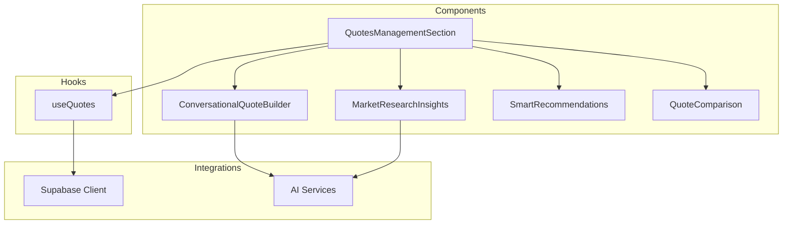
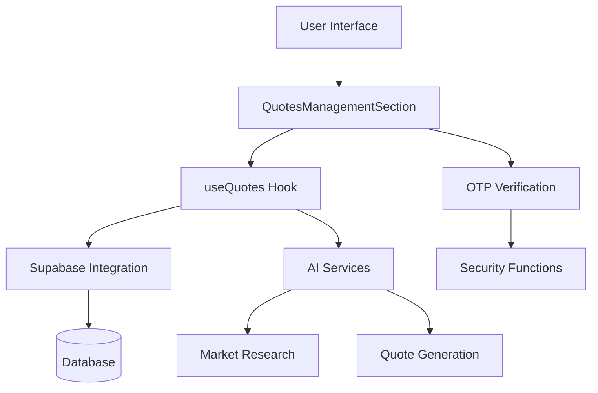
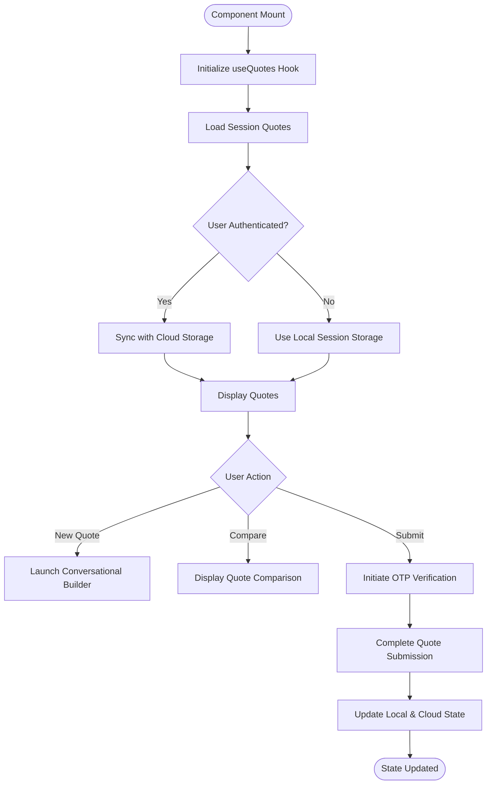
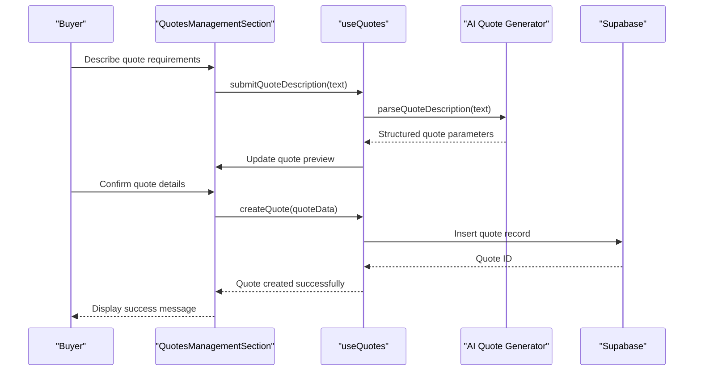
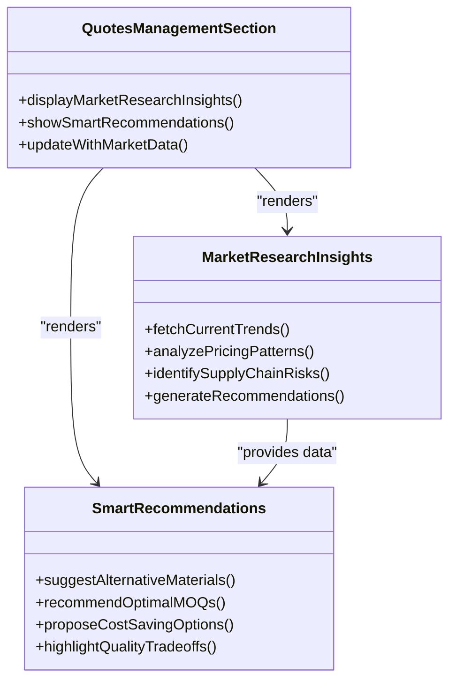
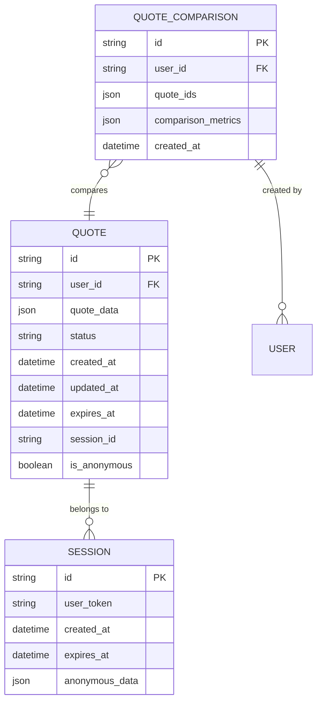
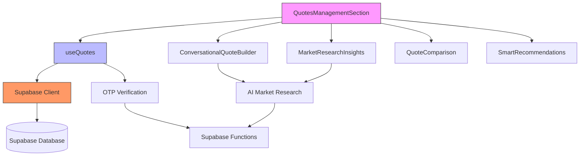

# Quotes Management

<cite>
**Referenced Files in This Document**  
- [QuotesManagementSection.tsx](file://src/components/buyer/QuotesManagementSection.tsx)
- [useQuotes.ts](file://src/hooks/useQuotes.ts)
- [ConversationalQuoteBuilder.tsx](file://src/components/quote/ConversationalQuoteBuilder.tsx)
- [MarketResearchInsights.tsx](file://src/components/quote/MarketResearchInsights.tsx)
- [QuoteComparison.tsx](file://src/components/quote/QuoteComparison.tsx)
- [SmartRecommendations.tsx](file://src/components/quote/SmartRecommendations.tsx)
- [AIQuoteGeneratorWithOTP.tsx](file://src/components/AIQuoteGeneratorWithOTP.tsx)
- [supabase/client.ts](file://src/integrations/supabase/client.ts)
- [types/database.ts](file://src/types/database.ts)
</cite>

## Table of Contents
1. [Introduction](#introduction)
2. [Project Structure](#project-structure)
3. [Core Components](#core-components)
4. [Architecture Overview](#architecture-overview)
5. [Detailed Component Analysis](#detailed-component-analysis)
6. [Dependency Analysis](#dependency-analysis)
7. [Performance Considerations](#performance-considerations)
8. [Troubleshooting Guide](#troubleshooting-guide)
9. [Conclusion](#conclusion)

## Introduction
The QuotesManagementSection component provides buyers with a comprehensive interface to manage AI-generated quotes throughout the procurement lifecycle. This system integrates conversational quote building, market research insights, and intelligent comparison tools to streamline decision-making. The component enables users to create, compare, track, and act on quotes while maintaining session continuity across devices through Supabase-powered synchronization.

## Project Structure
The quote management system is organized across multiple directories with clear separation of concerns. The core functionality resides in the buyer and quote component directories, with supporting hooks and integration layers providing data management and external service connectivity.

**Diagram sources**
- [QuotesManagementSection.tsx](file://src/components/buyer/QuotesManagementSection.tsx)
- [ConversationalQuoteBuilder.tsx](file://src/components/quote/ConversationalQuoteBuilder.tsx)
- [MarketResearchInsights.tsx](file://src/components/quote/MarketResearchInsights.tsx)

## Core Components
The QuotesManagementSection serves as the central hub for quote operations, orchestrating interactions between the conversational quote builder, market research insights, and comparison tools. It manages state for active quotes, historical records, and user preferences while coordinating OTP verification workflows for quote submission and access.

**Section sources**
- [QuotesManagementSection.tsx](file://src/components/buyer/QuotesManagementSection.tsx)
- [useQuotes.ts](file://src/hooks/useQuotes.ts)

## Architecture Overview
The quote management system follows a layered architecture with clear separation between presentation, business logic, and data access layers. The useQuotes hook serves as the central data management layer, abstracting Supabase interactions and providing a clean API to components.

**Diagram sources**
- [useQuotes.ts](file://src/hooks/useQuotes.ts)
- [supabase/client.ts](file://src/integrations/supabase/client.ts)
- [AIQuoteGeneratorWithOTP.tsx](file://src/components/AIQuoteGeneratorWithOTP.tsx)

## Detailed Component Analysis

### Quotes Management Section Analysis
The QuotesManagementSection component provides a unified interface for managing the entire quote lifecycle. It coordinates between multiple sub-components and manages complex state transitions during quote creation, comparison, and submission processes.

**Diagram sources**
- [QuotesManagementSection.tsx](file://src/components/buyer/QuotesManagementSection.tsx)
- [useQuotes.ts](file://src/hooks/useQuotes.ts)

### Conversational Quote Builder Integration
The conversational quote builder enables natural language interaction for quote creation. Users can describe their requirements in plain language, which the system parses and converts into structured quote parameters.

**Diagram sources**
- [QuotesManagementSection.tsx](file://src/components/buyer/QuotesManagementSection.tsx)
- [useQuotes.ts](file://src/hooks/useQuotes.ts)
- [ConversationalQuoteBuilder.tsx](file://src/components/quote/ConversationalQuoteBuilder.tsx)

### Market Research Insights Integration
Market research insights are dynamically integrated into the quote management process, providing buyers with real-time data on pricing trends, supplier availability, and material costs.

**Diagram sources**
- [QuotesManagementSection.tsx](file://src/components/buyer/QuotesManagementSection.tsx)
- [MarketResearchInsights.tsx](file://src/components/quote/MarketResearchInsights.tsx)
- [SmartRecommendations.tsx](file://src/components/quote/SmartRecommendations.tsx)

### Quote Comparison and Historical Tracking
The system provides robust comparison capabilities that allow buyers to evaluate multiple quotes based on various parameters including price, lead time, quality metrics, and sustainability factors.

**Diagram sources**
- [types/database.ts](file://src/types/database.ts)
- [useQuotes.ts](file://src/hooks/useQuotes.ts)
- [QuoteComparison.tsx](file://src/components/quote/QuoteComparison.tsx)

## Dependency Analysis
The quote management system depends on several core services and libraries to function properly. These dependencies enable data persistence, AI integration, and secure authentication workflows.

**Diagram sources**
- [package.json](file://package.json)
- [QuotesManagementSection.tsx](file://src/components/buyer/QuotesManagementSection.tsx)
- [useQuotes.ts](file://src/hooks/useQuotes.ts)

## Performance Considerations
The system implements several performance optimizations to ensure responsive interactions during quote management tasks. These include data caching, lazy loading of historical quotes, and efficient synchronization between local sessions and cloud storage.

**Section sources**
- [useQuotes.ts](file://src/hooks/useQuotes.ts)
- [QuotesManagementSection.tsx](file://src/components/buyer/QuotesManagementSection.tsx)

## Troubleshooting Guide
Common issues in the quote management system typically relate to session management, synchronization across devices, and quote expiration policies. The following guidance addresses these frequent scenarios.

### Quote Expiration and Session Management
Quotes have a finite lifespan and may expire if not acted upon within the designated timeframe. Anonymous sessions are particularly susceptible to data loss when browsers clear local storage.

**Section sources**
- [useQuotes.ts](file://src/hooks/useQuotes.ts)
- [QuotesManagementSection.tsx](file://src/components/buyer/QuotesManagementSection.tsx)

### Synchronization Between Devices
When users access their quotes from multiple devices, synchronization issues may occur due to timing conflicts between local changes and cloud updates.

**Section sources**
- [useQuotes.ts](file://src/hooks/useQuotes.ts)
- [supabase/client.ts](file://src/integrations/supabase/client.ts)

## Conclusion
The QuotesManagementSection component provides a comprehensive solution for managing AI-generated quotes, integrating conversational interfaces, market intelligence, and comparison tools into a unified buyer experience. By leveraging Supabase for data persistence and synchronization, the system maintains continuity across sessions and devices while ensuring secure access through OTP verification workflows.