# Component Library

<cite>
**Referenced Files in This Document**   
- [AIQuoteGeneratorWithOTP.tsx](file://src/components/AIQuoteGeneratorWithOTP.tsx)
- [ProductionStageTimeline.tsx](file://src/components/production/ProductionStageTimeline.tsx)
- [SmartDashboardRouter.tsx](file://src/components/SmartDashboardRouter.tsx)
- [button.tsx](file://src/components/ui/button.tsx)
- [card.tsx](file://src/components/ui/card.tsx)
- [input.tsx](file://src/components/ui/input.tsx)
- [form.tsx](file://src/components/ui/form.tsx)
- [dialog.tsx](file://src/components/ui/dialog.tsx)
- [badge.tsx](file://src/components/ui/badge.tsx)
- [table.tsx](file://src/components/ui/table.tsx)
- [tooltip.tsx](file://src/components/ui/tooltip.tsx)
- [tailwind.config.ts](file://tailwind.config.ts)
- [components.json](file://components.json)
- [DashboardAnalytics.tsx](file://src/components/admin/DashboardAnalytics.tsx)
- [QuotesManagementSection.tsx](file://src/components/buyer/QuotesManagementSection.tsx)
- [SupplierProfile.tsx](file://src/components/supplier/SupplierProfile.tsx)
</cite>

## Table of Contents
1. [Introduction](#introduction)
2. [Design System Implementation](#design-system-implementation)
3. [Component Categorization](#component-categorization)
4. [Shared UI Components](#shared-ui-components)
5. [Component Composition Patterns](#component-composition-patterns)
6. [Prop Interfaces and Usage Guidelines](#prop-interfaces-and-usage-guidelines)
7. [Key Component Examples](#key-component-examples)
8. [Accessibility Features](#accessibility-features)
9. [Responsive Design Patterns](#responsive-design-patterns)
10. [Theming Capabilities](#theming-capabilities)
11. [Component Customization and Extension](#component-customization-and-extension)
12. [Component Testing](#component-testing)
13. [Performance Optimization](#performance-optimization)
14. [Conclusion](#conclusion)

## Introduction
The sleekapp-v100 frontend component library is a comprehensive design system built using shadcn/ui components and Radix UI primitives, with Tailwind CSS for utility-first styling. This documentation provides a detailed overview of the component library, focusing on its architecture, implementation patterns, and usage guidelines. The system is organized into domain-specific components for admin, buyer, supplier, production, and quote management, along with shared UI components that ensure consistency across the application. This documentation will explore the design system's implementation, component categorization, composition patterns, and best practices for developers working with this library.

## Design System Implementation

The sleekapp-v100 component library implements a modern design system using shadcn/ui components built on top of Radix UI primitives. This approach combines the accessibility and functionality of Radix UI with the customizable, utility-first styling of Tailwind CSS. The design system is configured through the components.json file, which establishes aliases for key directories and integrates with Tailwind CSS for consistent styling.

The implementation follows a layered architecture where base components from Radix UI provide accessible interactive elements, while shadcn/ui components wrap these with application-specific styling and functionality. Tailwind CSS is used extensively for utility-first styling, with custom configurations in tailwind.config.ts that define the application's design tokens, including colors, spacing, typography, and animations.

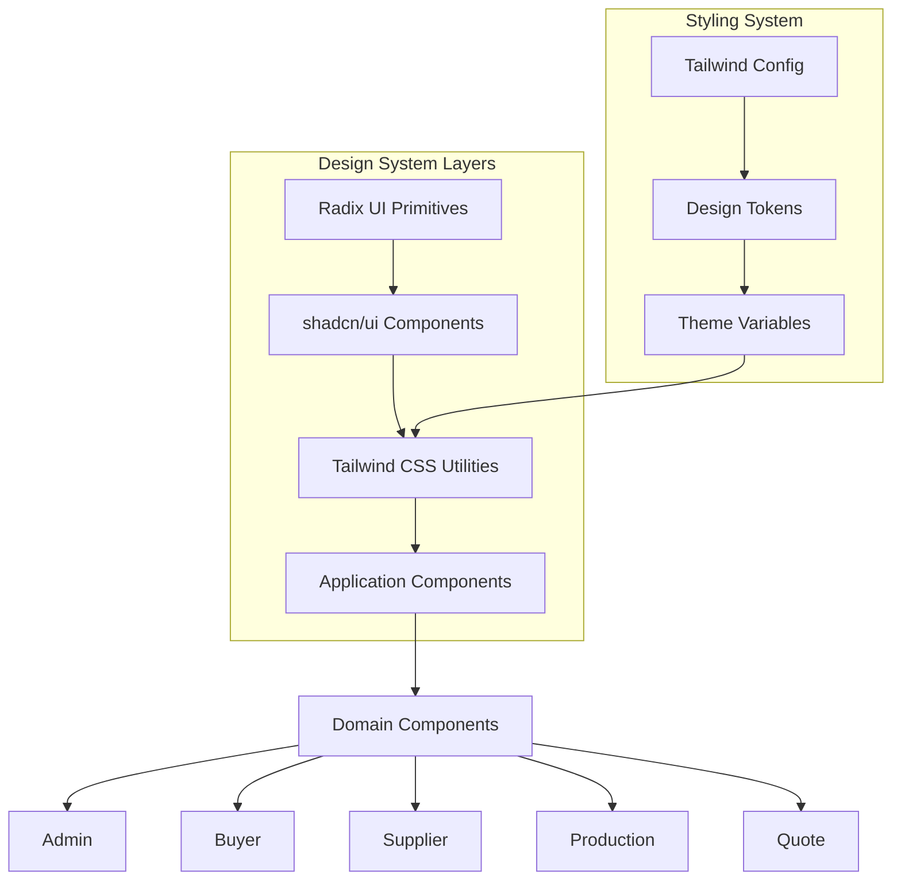

**Diagram sources**
- [components.json](file://components.json)
- [tailwind.config.ts](file://tailwind.config.ts)
- [button.tsx](file://src/components/ui/button.tsx)

**Section sources**
- [components.json](file://components.json)
- [tailwind.config.ts](file://tailwind.config.ts)

## Component Categorization

The component library is organized into domain-specific categories that align with the application's business domains. This categorization improves code organization, maintainability, and developer onboarding by grouping related functionality together.

The primary component categories include:

- **Admin**: Components for administrative functionality such as dashboards, analytics, and management panels
- **Buyer**: Components focused on buyer experiences including quotes management and order tracking
- **Supplier**: Components for supplier interactions like profile management and order coordination
- **Production**: Components for production tracking and quality control
- **Quote**: Components for quote generation and management
- **Shared**: Common components used across multiple domains

Each category contains components specific to its domain while leveraging shared UI components for consistency. For example, the admin category includes components like DashboardAnalytics and AdminStageMonitor, while the buyer category features QuotesManagementSection and InvoicesPaymentsSection.

```mermaid
graph TD
A[Component Library] --> B[Admin]
A --> C[Buyer]
A --> D[Supplier]
A --> E[Production]
A --> F[Quote]
A --> G[Shared]
B --> B1[DashboardAnalytics]
B --> B2[AdminStageMonitor]
B --> B3[FinancialChartsEnhanced]
C --> C1[QuotesManagementSection]
C --> C2[InvoicesPaymentsSection]
C --> C3[LoopTraceOrderTracking]
D --> D1[SupplierProfile]
D --> D2[SupplierOrdersList]
D --> D3[ProductionManagementPanel]
E --> E1[ProductionStageTimeline]
E --> E2[AIQualityScanner]
E --> E3[PredictiveDelayAlert]
F --> F1[AIQuoteGeneratorWithOTP]
F --> F2[ConversationalQuoteBuilder]
F --> F3[SmartFactoryMatcher]
G --> G1[Button]
G --> G2[Card]
G --> G3[Dialog]
```

**Diagram sources**
- [DashboardAnalytics.tsx](file://src/components/admin/DashboardAnalytics.tsx)
- [QuotesManagementSection.tsx](file://src/components/buyer/QuotesManagementSection.tsx)
- [SupplierProfile.tsx](file://src/components/supplier/SupplierProfile.tsx)
- [ProductionStageTimeline.tsx](file://src/components/production/ProductionStageTimeline.tsx)
- [AIQuoteGeneratorWithOTP.tsx](file://src/components/AIQuoteGeneratorWithOTP.tsx)

**Section sources**
- [src/components/admin](file://src/components/admin)
- [src/components/buyer](file://src/components/buyer)
- [src/components/supplier](file://src/components/supplier)
- [src/components/production](file://src/components/production)
- [src/components/quote](file://src/components/quote)

## Shared UI Components

The shared UI components in src/components/ui form the foundation of the design system, providing consistent, reusable elements across the application. These components are built using shadcn/ui patterns with Radix UI primitives and styled with Tailwind CSS.

Key shared components include:

- **Button**: A versatile button component with multiple variants (default, gold, coral, outline, secondary, ghost, link, destructive) and sizes (default, sm, lg, icon)
- **Card**: A container component with header, title, description, content, and footer sections, featuring consistent styling and hover effects
- **Input**: A form input component with standardized styling and accessibility features
- **Form**: A comprehensive form system built on react-hook-form with components for form fields, labels, descriptions, and error messages
- **Dialog**: A modal dialog component with overlay, close functionality, and structured content areas
- **Badge**: A small label component for displaying status or categories
- **Table**: A responsive table component with header, body, footer, and cell components
- **Tooltip**: An accessible tooltip component for providing additional information on hover

These components follow consistent patterns for props, styling, and accessibility, ensuring a cohesive user experience across the application.

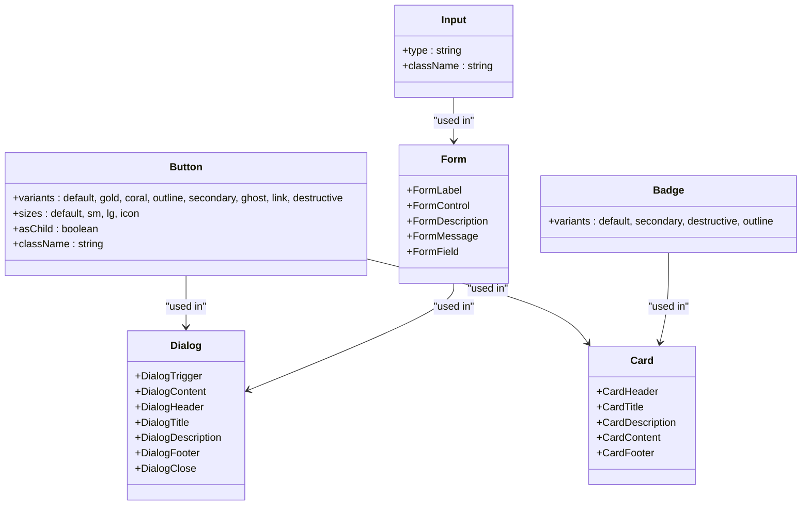

**Diagram sources**
- [button.tsx](file://src/components/ui/button.tsx)
- [card.tsx](file://src/components/ui/card.tsx)
- [input.tsx](file://src/components/ui/input.tsx)
- [form.tsx](file://src/components/ui/form.tsx)
- [dialog.tsx](file://src/components/ui/dialog.tsx)
- [badge.tsx](file://src/components/ui/badge.tsx)
- [table.tsx](file://src/components/ui/table.tsx)

**Section sources**
- [src/components/ui](file://src/components/ui)

## Component Composition Patterns

The component library employs several composition patterns to promote reusability, maintainability, and flexibility. These patterns leverage React's compositional nature and the capabilities of the underlying libraries.

The primary composition patterns include:

1. **Wrapper Components**: Shared UI components wrap Radix UI primitives with application-specific styling and functionality. For example, the Button component wraps a native button element with Tailwind CSS classes and additional props.

2. **Compound Components**: Components like Card and Dialog use the compound component pattern, where a parent component provides context to child components (e.g., CardHeader, CardTitle, CardContent).

3. **Render Props and Children as Function**: Components like FormField use render props patterns to provide flexibility in how content is rendered.

4. **Higher-Order Components**: The library uses component composition rather than traditional HOCs, favoring the "asChild" pattern in components like Button to allow wrapping arbitrary components with button behavior.

5. **Context-Based Composition**: Components use React context for state management and prop drilling reduction, such as the Form component providing context to form fields.

6. **Slot Pattern**: The library implements the slot pattern using Radix UI's Slot component, allowing for flexible content composition.

These patterns enable developers to create complex UIs by composing simple, focused components while maintaining consistency and accessibility.

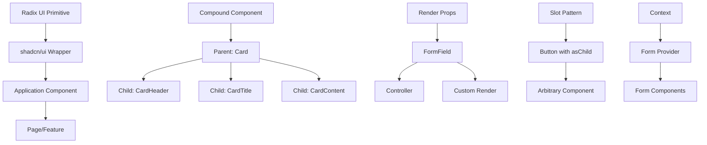

**Diagram sources**
- [button.tsx](file://src/components/ui/button.tsx)
- [card.tsx](file://src/components/ui/card.tsx)
- [form.tsx](file://src/components/ui/form.tsx)
- [dialog.tsx](file://src/components/ui/dialog.tsx)

**Section sources**
- [src/components/ui](file://src/components/ui)

## Prop Interfaces and Usage Guidelines

The component library follows consistent patterns for prop interfaces and usage, making it easier for developers to learn and use the components effectively.

### Prop Interface Patterns

1. **Extending HTML Attributes**: Components extend native HTML attributes to maintain familiarity and accessibility. For example, the Button component extends React.ButtonHTMLAttributes<HTMLButtonElement>.

2. **Variant Props with CVa**: The library uses class-variance-authority (cva) for managing variants, allowing components to have multiple visual styles controlled by props. The buttonVariants in button.tsx demonstrate this pattern.

3. **Composition Props**: Components include props like "asChild" to enable flexible composition, allowing them to wrap other components while maintaining their styling and behavior.

4. **Controlled and Uncontrolled Patterns**: Components support both controlled and uncontrolled usage patterns, giving developers flexibility in state management.

### Usage Guidelines

1. **Consistent Import Paths**: Use the aliases defined in components.json (e.g., "@/components/ui/button") for consistent imports.

2. **Variant Usage**: Leverage the variant system to maintain visual consistency across the application.

3. **Accessibility**: All components are built with accessibility in mind, following WCAG guidelines and using semantic HTML.

4. **Responsive Design**: Components are designed to be responsive by default, using Tailwind CSS's responsive prefixes.

5. **Performance**: Components are optimized for performance with appropriate use of memoization and efficient rendering patterns.

6. **Theming**: Components respect the application's theme through CSS variables defined in tailwind.config.ts.

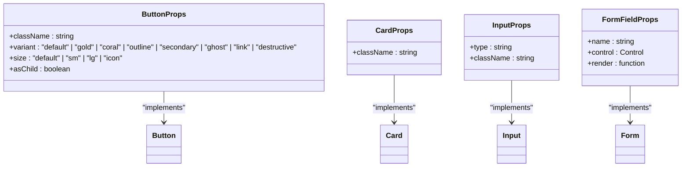

**Diagram sources**
- [button.tsx](file://src/components/ui/button.tsx)
- [card.tsx](file://src/components/ui/card.tsx)
- [input.tsx](file://src/components/ui/input.tsx)
- [form.tsx](file://src/components/ui/form.tsx)

**Section sources**
- [src/components/ui](file://src/components/ui)

## Key Component Examples

This section highlights three key components that demonstrate the capabilities and patterns of the component library: AIQuoteGeneratorWithOTP, ProductionStageTimeline, and SmartDashboardRouter.

### AIQuoteGeneratorWithOTP

The AIQuoteGeneratorWithOTP component provides an AI-powered quote generation system with email verification. It demonstrates complex state management, form validation, and integration with external services.

Key features:
- Multi-step workflow (form → OTP verification → loading → result)
- Integration with Supabase functions for OTP sending and verification
- AI-powered quote generation
- Responsive design with mobile-first approach
- Accessibility features including proper labeling and focus management

The component uses a comprehensive validation schema with Zod, manages multiple states (loading, OTP verification, result display), and provides a seamless user experience with loading indicators and success animations.

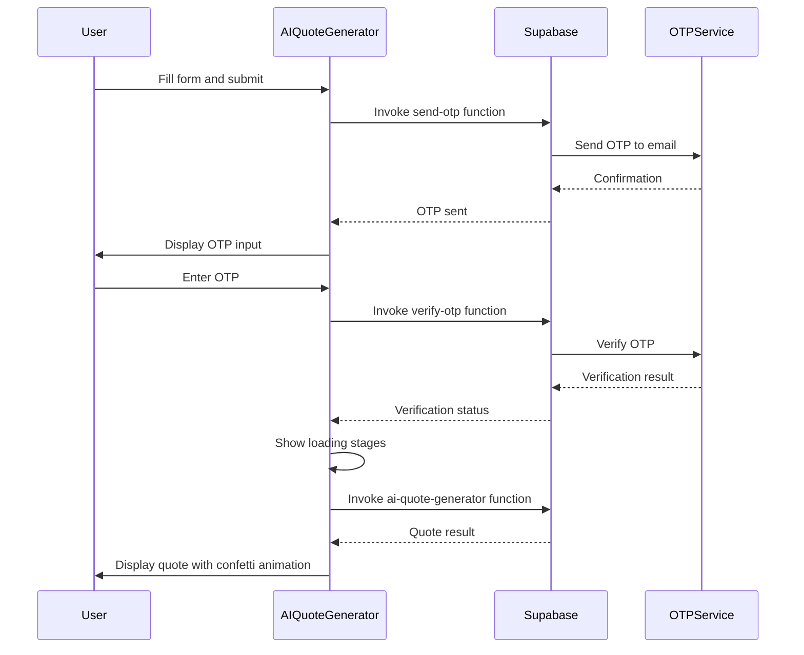

**Diagram sources**
- [AIQuoteGeneratorWithOTP.tsx](file://src/components/AIQuoteGeneratorWithOTP.tsx)

### ProductionStageTimeline

The ProductionStageTimeline component visualizes the production process stages with their status, dates, and progress. It demonstrates data visualization, conditional rendering, and responsive design.

Key features:
- Timeline visualization with vertical connector line
- Status-based styling (completed, in_progress, delayed, pending)
- Progress bars for in-progress stages
- Date formatting and display
- Responsive layout that works on mobile and desktop

The component accepts production stage data and renders a visually appealing timeline that helps users track production progress at a glance.

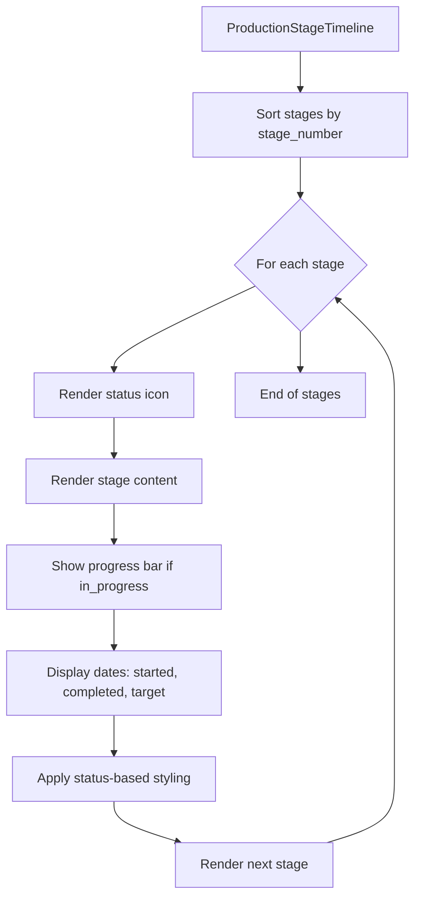

**Diagram sources**
- [ProductionStageTimeline.tsx](file://src/components/production/ProductionStageTimeline.tsx)

### SmartDashboardRouter

The SmartDashboardRouter component handles role-based routing to the appropriate dashboard. It demonstrates authentication integration, role-based access control, and navigation patterns.

Key features:
- Authentication state detection
- Role-based routing (admin, supplier, buyer)
- Loading state with fallback timeout
- Error handling and fallback routing
- Navigation with replace to prevent back-button issues

The component ensures users are directed to the correct dashboard based on their role, providing a seamless onboarding experience.

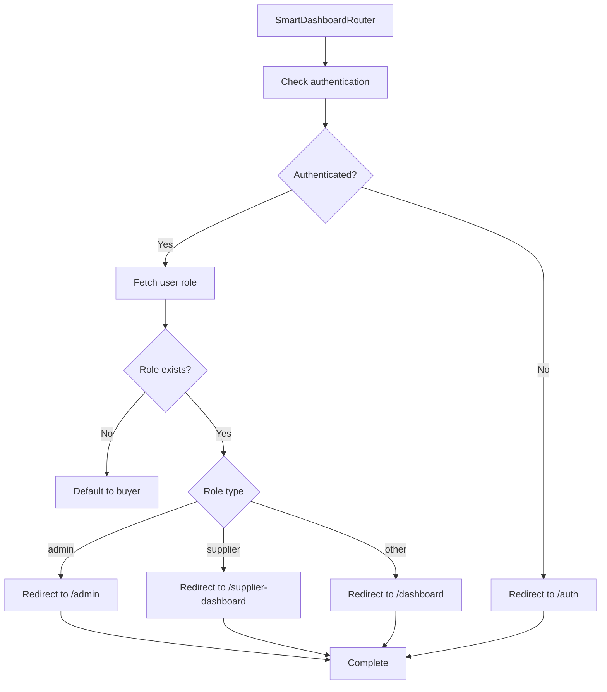

**Diagram sources**
- [SmartDashboardRouter.tsx](file://src/components/SmartDashboardRouter.tsx)

**Section sources**
- [AIQuoteGeneratorWithOTP.tsx](file://src/components/AIQuoteGeneratorWithOTP.tsx)
- [ProductionStageTimeline.tsx](file://src/components/production/ProductionStageTimeline.tsx)
- [SmartDashboardRouter.tsx](file://src/components/SmartDashboardRouter.tsx)

## Accessibility Features

The component library prioritizes accessibility, ensuring that all users can effectively interact with the application regardless of their abilities or assistive technologies.

Key accessibility features include:

1. **Semantic HTML**: Components use appropriate HTML elements and ARIA attributes to convey structure and meaning.

2. **Keyboard Navigation**: All interactive elements are keyboard accessible, with logical tab order and focus indicators.

3. **Screen Reader Support**: Components include proper labeling, roles, and states for screen readers.

4. **Color Contrast**: The design system ensures sufficient color contrast for text and interactive elements.

5. **Focus Management**: Modal components like Dialog manage focus properly, trapping focus within the dialog and returning it to the triggering element when closed.

6. **Reduced Motion**: The library respects users' preferences for reduced motion through appropriate media queries.

7. **Form Accessibility**: Form components provide proper labels, error messages, and validation feedback.

8. **Dynamic Content Announcements**: The toast component uses ARIA live regions to announce important messages to screen readers.

The implementation leverages Radix UI primitives, which are built with accessibility in mind, and extends them with application-specific accessibility enhancements.

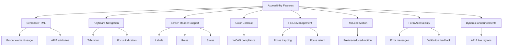

**Diagram sources**
- [button.tsx](file://src/components/ui/button.tsx)
- [card.tsx](file://src/components/ui/card.tsx)
- [input.tsx](file://src/components/ui/input.tsx)
- [form.tsx](file://src/components/ui/form.tsx)
- [dialog.tsx](file://src/components/ui/dialog.tsx)
- [tooltip.tsx](file://src/components/ui/tooltip.tsx)

**Section sources**
- [src/components/ui](file://src/components/ui)

## Responsive Design Patterns

The component library implements responsive design patterns to ensure optimal user experience across different device sizes and screen resolutions.

Key responsive design patterns include:

1. **Mobile-First Approach**: Components are designed with mobile devices in mind first, then enhanced for larger screens.

2. **Fluid Layouts**: The use of relative units and flexible grids ensures layouts adapt to different screen sizes.

3. **Breakpoint-Based Adjustments**: Tailwind CSS breakpoints (sm, md, lg, xl) are used to make targeted adjustments at specific screen widths.

4. **Touch-Friendly Design**: Interactive elements have appropriate sizes and spacing for touch interactions.

5. **Conditional Rendering**: Some components render different content or layouts based on screen size.

6. **Responsive Typography**: Font sizes and line heights adjust based on screen size for optimal readability.

7. **Flexible Images and Media**: Images and media elements scale appropriately within their containers.

8. **Viewport Units**: Strategic use of viewport units (vw, vh) for elements that should scale with the viewport.

The implementation leverages Tailwind CSS's responsive prefixes and utilities to create adaptive layouts that work well on smartphones, tablets, and desktop computers.

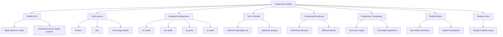

**Diagram sources**
- [tailwind.config.ts](file://tailwind.config.ts)
- [button.tsx](file://src/components/ui/button.tsx)
- [card.tsx](file://src/components/ui/card.tsx)

**Section sources**
- [tailwind.config.ts](file://tailwind.config.ts)
- [src/components/ui](file://src/components/ui)

## Theming Capabilities

The component library supports theming through CSS variables and Tailwind CSS configuration, allowing for easy customization of the visual appearance.

Key theming capabilities include:

1. **CSS Variables**: The design system uses CSS variables for colors, spacing, typography, and other design tokens, making it easy to customize the theme.

2. **Tailwind Configuration**: The tailwind.config.ts file defines the application's design system, including colors, fonts, spacing, and other properties.

3. **Dark Mode Support**: The library supports dark mode through the "darkMode" configuration in Tailwind CSS.

4. **Theme Switching**: Components respect the user's preferred color scheme and can be configured for theme switching.

5. **Customizable Variants**: The cva (class-variance-authority) system allows for easy creation of new component variants.

6. **Design Token System**: The application uses a comprehensive design token system for consistent styling across components.

The theming system is configured in tailwind.config.ts, which defines the color palette, typography, spacing, and other design properties that are used throughout the component library.

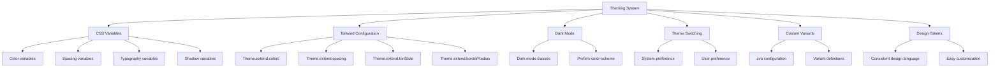

**Diagram sources**
- [tailwind.config.ts](file://tailwind.config.ts)
- [components.json](file://components.json)

**Section sources**
- [tailwind.config.ts](file://tailwind.config.ts)
- [components.json](file://components.json)

## Component Customization and Extension

The component library supports customization and extension through several patterns that allow developers to adapt components to specific use cases while maintaining consistency.

Key customization and extension patterns include:

1. **Props-Based Customization**: Components expose props that allow for visual and behavioral customization.

2. **Composition**: Components can be composed together to create more complex UIs.

3. **Slot Pattern**: The "asChild" prop in components like Button allows wrapping arbitrary components with button behavior.

4. **Theming**: The design system can be customized through CSS variables and Tailwind configuration.

5. **Extending Base Components**: Developers can create new components by extending base components with additional functionality.

6. **Custom Variants**: The cva system allows for defining new variants for components.

7. **Override Styles**: The className prop allows for adding custom styles to components.

8. **Context Overrides**: Components can be customized through context providers.

These patterns enable developers to create tailored user experiences while maintaining the integrity of the design system.

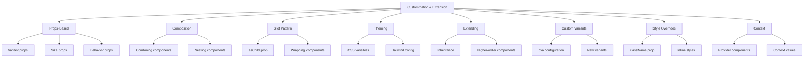

**Diagram sources**
- [button.tsx](file://src/components/ui/button.tsx)
- [card.tsx](file://src/components/ui/card.tsx)
- [form.tsx](file://src/components/ui/form.tsx)
- [tailwind.config.ts](file://tailwind.config.ts)

**Section sources**
- [src/components/ui](file://src/components/ui)
- [tailwind.config.ts](file://tailwind.config.ts)

## Component Testing

The component library includes testing utilities and patterns to ensure component reliability and maintainability.

Key testing aspects include:

1. **Unit Testing**: Individual components are tested for correct rendering and behavior.

2. **Integration Testing**: Component interactions and compositions are tested to ensure they work together correctly.

3. **Accessibility Testing**: Components are tested for accessibility compliance using automated tools and manual testing.

4. **Visual Regression Testing**: The library may use tools to detect unintended visual changes.

5. **Interaction Testing**: User interactions like clicks, form submissions, and keyboard navigation are tested.

6. **State Testing**: Component state changes and lifecycle methods are tested.

7. **Mocking External Dependencies**: External services like Supabase are mocked during testing.

8. **Test Coverage**: The library aims for high test coverage to catch regressions.

The testing setup includes Vitest for unit testing, React Testing Library for component testing, and other tools configured in vitest.config.ts.

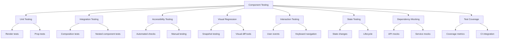

**Section sources**
- [src/test](file://src/test)
- [vitest.config.ts](file://vitest.config.ts)

## Performance Optimization

The component library implements several performance optimization techniques to ensure fast rendering and smooth user experiences.

Key performance optimizations include:

1. **Code Splitting**: Components are code-split to reduce initial bundle size.

2. **Lazy Loading**: Non-critical components are loaded lazily.

3. **Memoization**: Components use React.memo and useMemo to prevent unnecessary re-renders.

4. **Efficient State Management**: State updates are optimized to minimize re-renders.

5. **Virtualization**: Large lists are virtualized to improve performance.

6. **Image Optimization**: Images are optimized for web delivery.

7. **Bundle Optimization**: The build process optimizes bundles for size and performance.

8. **Caching**: Data and computations are cached when appropriate.

9. **Debouncing and Throttling**: Expensive operations are debounced or throttled.

10. **Intersection Observers**: Lazy loading of content based on viewport visibility.

These optimizations ensure that the application performs well even with complex UIs and large datasets.

```mermaid
graph TD
A[Performance Optimization] --> B[Code Splitting]
A --> C[Lazy Loading]
A --> D[Memoization]
A --> E[State Management]
A --> F[Virtualization]
A --> G[Image Optimization]
A --> H[Bundle Optimization]
A --> I[Caching]
A --> J[Debouncing]
A --> K[Intersection Observers]
B --> L[Dynamic imports]
B --> M[Route-based splitting]
C --> N[React.lazy]
C --> O[Suspense]
D --> P[React.memo]
D --> Q[useMemo]
D --> R[useCallback]
E --> S[State colocation]
E --> T[Derived state]
F --> U[Windowing]
F --> V[Infinite scroll]
G --> W[Compression]
G --> X[Responsive images]
H --> Y[Tree shaking]
H --> Z[Minification]
I --> AA[Query caching]
I --> AB[Result caching]
J --> AC[Input handling]
J --> AD[Resize events]
K --> AE[Lazy loading]
K --> AF[Visibility detection]
```

**Section sources**
- [vite.config.ts](file://vite.config.ts)
- [tailwind.config.ts](file://tailwind.config.ts)
- [src/lib/performanceOptimizer.ts](file://src/lib/performanceOptimizer.ts)

## Conclusion

The sleekapp-v100 frontend component library represents a comprehensive design system that combines the accessibility of Radix UI primitives with the flexibility of shadcn/ui components and the utility-first approach of Tailwind CSS. The library is organized into domain-specific categories with a robust set of shared UI components that ensure consistency across the application.

Key strengths of the component library include:

- **Consistent Design Language**: The use of design tokens and CSS variables ensures visual consistency.
- **Accessibility**: Components are built with accessibility in mind, following best practices and WCAG guidelines.
- **Responsive Design**: The library supports a wide range of devices and screen sizes.
- **Performance**: Optimization techniques ensure fast rendering and smooth interactions.
- **Extensibility**: Components can be customized and extended to meet specific requirements.
- **Developer Experience**: Clear patterns and documentation make it easy for developers to use the components effectively.

The component library provides a solid foundation for building user interfaces in the sleekapp-v100 application, enabling rapid development of consistent, accessible, and performant UIs. By following the patterns and guidelines outlined in this documentation, developers can create high-quality user experiences that align with the application's design principles.