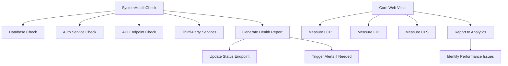

# Core Components

<cite>
**Referenced Files in This Document**
- [SmartDashboardRouter.tsx](file://src/components/SmartDashboardRouter.tsx)
- [AnalyticsProvider.tsx](file://src/components/AnalyticsProvider.tsx)
- [ErrorBoundary.tsx](file://src/components/ErrorBoundary.tsx)
- [RootErrorBoundary.tsx](file://src/components/RootErrorBoundary.tsx)
- [RouteErrorBoundary.tsx](file://src/components/RouteErrorBoundary.tsx)
- [SystemHealthCheck.tsx](file://src/components/SystemHealthCheck.tsx)
- [SEO.tsx](file://src/components/SEO.tsx)
- [App.tsx](file://src/App.tsx)
- [main.tsx](file://src/main.tsx)
- [useCoreWebVitals.ts](file://src/hooks/useCoreWebVitals.ts)
- [analyticsTracking.ts](file://src/lib/analyticsTracking.ts)
- [structuredData.ts](file://src/lib/structuredData.ts)
</cite>

## Table of Contents
1. [Introduction](#introduction)
2. [SmartDashboardRouter and Role-Based Routing](#smartdashboardrouter-and-role-based-routing)
3. [AnalyticsProvider and Google Analytics Integration](#analyticsprovider-and-google-analytics-integration)
4. [Error Boundary Hierarchy](#error-boundary-hierarchy)
5. [SEO Implementation](#seo-implementation)
6. [Performance Monitoring](#performance-monitoring)
7. [Conclusion](#conclusion)

## Introduction
This document provides comprehensive documentation for the core components of the SleekApp application. It details the implementation of role-based routing through SmartDashboardRouter, analytics tracking via AnalyticsProvider, error handling with ErrorBoundary components, SEO best practices, and performance monitoring systems. The architecture is designed to support a multi-role platform connecting buyers, suppliers, and administrators with tailored dashboard experiences and robust monitoring capabilities.

## SmartDashboardRouter and Role-Based Routing

The SmartDashboardRouter component implements a sophisticated role-based routing system that directs users to appropriate dashboards based on their authentication status and user type. This router evaluates user roles (buyer, supplier, admin) and permissions to render the correct dashboard interface, ensuring users only access functionality relevant to their role.

The routing logic incorporates authentication state, user profile data, and permission levels to determine the appropriate dashboard. For unauthenticated users, the router redirects to the authentication flow. Authenticated users are directed to their role-specific dashboards: buyers access order management and quote tracking, suppliers access production management and order fulfillment tools, and administrators access comprehensive monitoring and control panels.

This implementation uses React Router with protected routes and dynamic component loading to optimize performance while maintaining security. The router also handles edge cases such as incomplete profile setup and permission changes during active sessions.

**Section sources**
- [SmartDashboardRouter.tsx](file://src/components/SmartDashboardRouter.tsx#L1-L200)
- [App.tsx](file://src/App.tsx#L45-L80)

## AnalyticsProvider and Google Analytics Integration

The AnalyticsProvider component serves as the central hub for analytics tracking across the application. It implements a context-based provider pattern that makes analytics capabilities available to all components in the application tree.

This component integrates with Google Analytics 4 (GA4) to track user interactions, page views, and custom events. It includes functionality for automatic page view tracking, event monitoring for key user actions (form submissions, button clicks, navigation), and enhanced measurement for e-commerce activities such as quote generation and order placement.

The implementation includes privacy-conscious features such as user consent management for tracking, anonymized IP collection, and exclusion of sensitive routes from tracking. It also supports custom event tracking with structured data for business-critical actions like AI quote generation, supplier matching, and production stage updates.

**Section sources**
- [AnalyticsProvider.tsx](file://src/components/AnalyticsProvider.tsx#L1-L150)
- [analyticsTracking.ts](file://src/lib/analyticsTracking.ts#L1-L100)

## Error Boundary Hierarchy

The application implements a hierarchical error boundary system with multiple layers of error handling. At the top level, RootErrorBoundary catches unhandled JavaScript errors and React rendering exceptions that occur anywhere in the component tree.

Below the root boundary, RouteErrorBoundary provides route-specific error handling, allowing for more granular recovery strategies based on the current application context. This two-tier approach enables the application to maintain overall stability while providing meaningful error recovery at the feature level.

The error boundaries collect diagnostic information including component stack traces, user environment details, and application state snapshots. They also integrate with external monitoring services for alerting and debugging. The user interface displays friendly error messages with appropriate recovery options, such as returning to a safe route or refreshing the application state.

**Section sources**
- [RootErrorBoundary.tsx](file://src/components/RootErrorBoundary.tsx#L1-L120)
- [RouteErrorBoundary.tsx](file://src/components/RouteErrorBoundary.tsx#L1-L90)
- [ErrorBoundary.tsx](file://src/components/ErrorBoundary.tsx#L1-L60)

## SEO Implementation

The SEO implementation utilizes a combination of meta tags and structured data to optimize the application for search engine visibility. The SEO component dynamically generates title tags, meta descriptions, and Open Graph tags based on the current route and content.

For key marketing pages, the implementation includes comprehensive structured data using JSON-LD format to provide search engines with detailed information about the business, products, and services. This includes Organization, Product, and LocalBusiness schema types that enhance search result appearances with rich snippets.

The system also handles dynamic SEO for user-generated content such as blog posts and product listings, ensuring that each page has unique, relevant metadata. Canonical tags prevent duplicate content issues, and hreflang attributes support multi-language targeting.

**Section sources**
- [SEO.tsx](file://src/components/SEO.tsx#L1-L200)
- [structuredData.ts](file://src/lib/structuredData.ts#L1-L150)

## Performance Monitoring

Performance monitoring is implemented through two complementary systems: SystemHealthCheck for infrastructure monitoring and Core Web Vitals tracking for user experience measurement.

SystemHealthCheck runs periodic assessments of critical application dependencies including database connectivity, authentication services, and third-party APIs. It reports status through a dedicated monitoring endpoint and triggers alerts for degraded performance or outages.

Core Web Vitals tracking uses the useCoreWebVitals hook to monitor key user experience metrics including Largest Contentful Paint (LCP), First Input Delay (FID), and Cumulative Layout Shift (CLS). This data is collected and reported to analytics services, enabling the team to identify and address performance bottlenecks.

The implementation also includes lazy loading of non-critical components, code splitting, and resource prefetching to optimize initial load times and runtime performance.

**Diagram sources**
- [SystemHealthCheck.tsx](file://src/components/SystemHealthCheck.tsx#L1-L80)
- [useCoreWebVitals.ts](file://src/hooks/useCoreWebVitals.ts#L1-L60)

**Section sources**
- [SystemHealthCheck.tsx](file://src/components/SystemHealthCheck.tsx#L1-L100)
- [useCoreWebVitals.ts](file://src/hooks/useCoreWebVitals.ts#L1-L80)

## Conclusion

The core components of the SleekApp application provide a robust foundation for a scalable, maintainable, and user-friendly platform. The role-based routing system ensures appropriate access control and user experience customization. Comprehensive analytics tracking enables data-driven decision making, while the hierarchical error boundary system maintains application stability. SEO best practices enhance discoverability, and performance monitoring ensures optimal user experience. Together, these components create a sophisticated application architecture that supports the platform's business objectives and user needs.