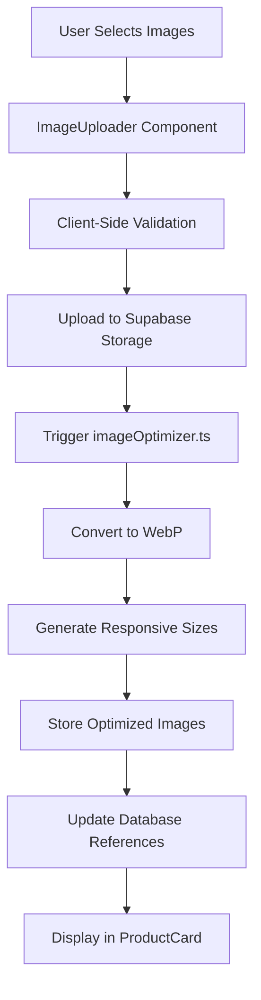
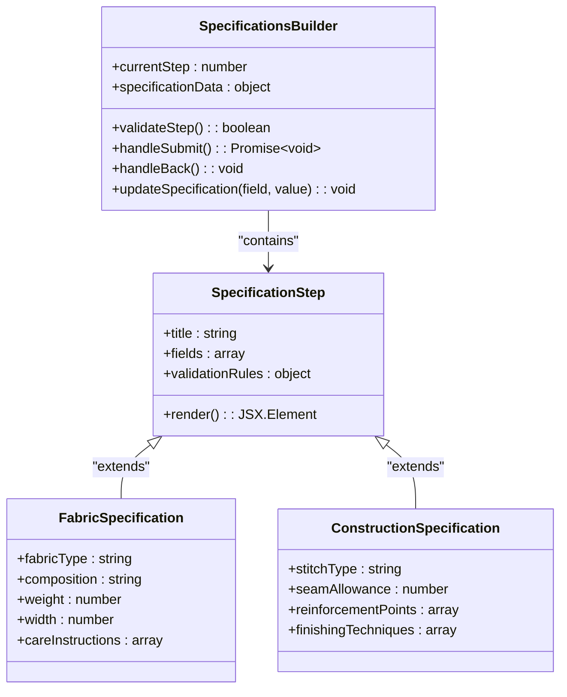
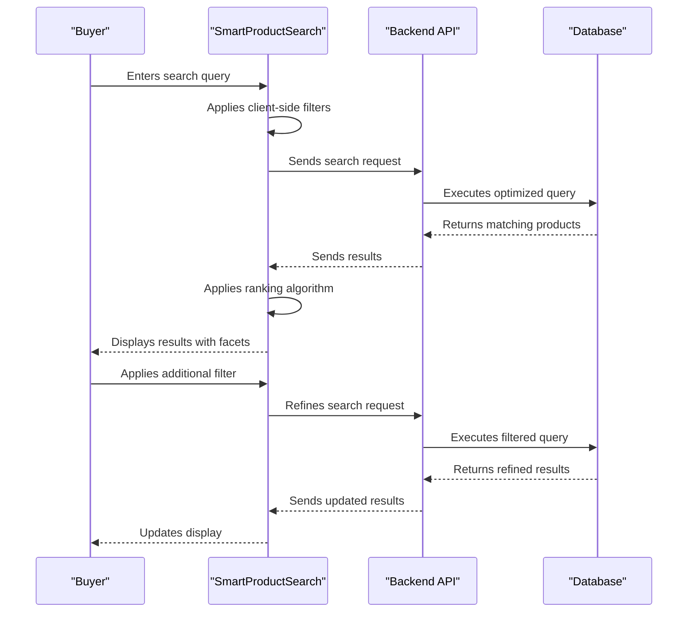
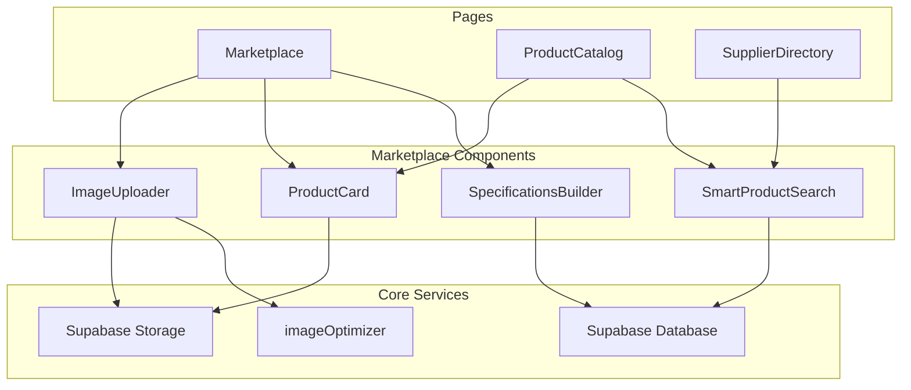

# Marketplace Components

<cite>
**Referenced Files in This Document**  
- [ImageUploader.tsx](file://src/components/marketplace/ImageUploader.tsx)
- [SpecificationsBuilder.tsx](file://src/components/marketplace/SpecificationsBuilder.tsx)
- [ProductCard.tsx](file://src/components/products/ProductCard.tsx)
- [SmartProductSearch.tsx](file://src/components/SmartProductSearch.tsx)
- [imageOptimizer.ts](file://src/lib/imageOptimizer.ts)
- [Marketplace.tsx](file://src/pages/Marketplace.tsx)
- [SupplierDirectory.tsx](file://src/pages/SupplierDirectory.tsx)
- [ProductCatalog.tsx](file://src/pages/ProductCatalog.tsx)
- [types/marketplace.ts](file://src/types/marketplace.ts)
</cite>

## Table of Contents
1. [Introduction](#introduction)
2. [Product Catalog Implementation](#product-catalog-implementation)
3. [Supplier Directory Features](#supplier-directory-features)
4. [Image Handling Workflow](#image-handling-workflow)
5. [Product Specification Builder](#product-specification-builder)
6. [Smart Product Search and Filtering](#smart-product-search-and-filtering)
7. [Supplier Capability Matching](#supplier-capability-matching)
8. [Component Architecture](#component-architecture)
9. [Conclusion](#conclusion)

## Introduction
The marketplace functionality in SleekApp provides a comprehensive platform for buyers and suppliers to connect, collaborate, and transact efficiently. This document details the core components that enable product listing, specification management, image handling, search functionality, and supplier matching. The system is designed to streamline the apparel manufacturing process by connecting buyers with production partners based on technical requirements, capabilities, and quality standards.

## Product Catalog Implementation
The product catalog serves as the central repository for all available manufacturing options, displaying products with rich media, technical specifications, and pricing information. Implemented primarily through the `ProductCatalog.tsx` page and `ProductCard.tsx` component, the catalog presents products in a grid layout with filtering and sorting capabilities. Each product entry contains essential information such as product type, minimum order quantity (MOQ), lead time, material composition, and manufacturing capabilities.

The catalog integrates with the Supabase backend to fetch product data and maintains state through React context providers. Products are organized by category (e.g., Activewear, Casualwear, Knitwear) with dynamic loading to optimize performance. The implementation supports infinite scrolling and lazy loading of product images to enhance user experience, particularly on mobile devices.

**Section sources**
- [ProductCatalog.tsx](file://src/pages/ProductCatalog.tsx#L1-L150)
- [ProductCard.tsx](file://src/components/products/ProductCard.tsx#L1-L80)

## Supplier Directory Features
The supplier directory provides a comprehensive view of production partners, showcasing their capabilities, certifications, and performance metrics. Accessible via the `SupplierDirectory.tsx` page, this feature enables buyers to discover and evaluate potential manufacturing partners based on specific criteria such as location, specialization, capacity, and compliance certifications.

Suppliers are displayed with key information including factory location, production capacity, lead times, quality control processes, and sustainability practices. The directory includes filtering options to narrow down suppliers based on technical capabilities (e.g., cut-and-sew, knitting, dyeing) and business parameters (e.g., MOQ, export experience). Each supplier profile links to a detailed view with production analytics, customer reviews, and sample request functionality.

**Section sources**
- [SupplierDirectory.tsx](file://src/pages/SupplierDirectory.tsx#L1-L120)
- [SupplierProfileCard.tsx](file://src/components/supplier/SupplierProfileCard.tsx#L1-L60)

## Image Handling Workflow
The image handling system manages the complete lifecycle of product imagery from upload to optimization and display. The `ImageUploader.tsx` component provides an intuitive interface for suppliers to upload product images, supporting drag-and-drop functionality, multiple file selection, and real-time upload progress tracking.

Once uploaded, images are processed through the `imageOptimizer.ts` utility, which performs several optimization tasks:
- Format conversion to WebP for improved compression
- Responsive image generation at multiple resolutions
- Metadata stripping to reduce file size
- Quality optimization based on content type
- CDN-friendly filename generation

The optimized images are stored in Supabase storage with appropriate access controls and cached for rapid delivery. The system implements lazy loading and progressive image loading to enhance perceived performance, with fallback mechanisms for unsupported formats.

**Diagram sources**
- [ImageUploader.tsx](file://src/components/marketplace/ImageUploader.tsx#L1-L70)
- [imageOptimizer.ts](file://src/lib/imageOptimizer.ts#L1-L100)

**Section sources**
- [ImageUploader.tsx](file://src/components/marketplace/ImageUploader.tsx#L1-L100)
- [imageOptimizer.ts](file://src/lib/imageOptimizer.ts#L1-L120)

## Product Specification Builder
The SpecificationsBuilder component provides an interactive interface for capturing detailed manufacturing requirements. This tool enables buyers to define technical specifications for custom apparel production, including fabric composition, construction methods, trims and accessories, quality standards, and packaging requirements.

The builder implements a step-by-step workflow that guides users through the specification process:
1. Product type selection
2. Fabric and material requirements
3. Construction and stitching specifications
4. Trim and accessory details
5. Quality control parameters
6. Packaging and labeling requirements

The interface includes validation rules to ensure technical feasibility and provides real-time feedback on manufacturing implications (e.g., lead time impact, cost considerations). Specifications are stored in a structured format that enables automated supplier matching based on capability alignment.

**Diagram sources**
- [SpecificationsBuilder.tsx](file://src/components/marketplace/SpecificationsBuilder.tsx#L1-L90)

**Section sources**
- [SpecificationsBuilder.tsx](file://src/components/marketplace/SpecificationsBuilder.tsx#L1-L120)

## Smart Product Search and Filtering
The SmartProductSearch component implements advanced search and filtering capabilities to help users quickly find relevant products and suppliers. The search functionality combines text-based queries with faceted filtering to provide precise results.

Key features include:
- Full-text search across product names, descriptions, and specifications
- Multi-dimensional filtering by category, price range, MOQ, lead time, and technical capabilities
- Dynamic filter refinement based on current results
- Saved search functionality for frequent queries
- Search result ranking based on relevance and popularity

The implementation uses a combination of client-side filtering for immediate feedback and server-side queries for comprehensive searches. The component integrates with analytics tracking to monitor search behavior and improve relevance over time.

**Diagram sources**
- [SmartProductSearch.tsx](file://src/components/SmartProductSearch.tsx#L1-L80)

**Section sources**
- [SmartProductSearch.tsx](file://src/components/SmartProductSearch.tsx#L1-L100)

## Supplier Capability Matching
The supplier matching system connects buyer requirements with supplier capabilities through a sophisticated matching algorithm. When a buyer submits product specifications or search criteria, the system evaluates registered suppliers based on their declared capabilities, historical performance, and technical expertise.

The matching process considers multiple factors:
- Technical capability alignment (fabric handling, construction methods)
- Production capacity and availability
- Geographic location and shipping logistics
- Quality control standards and certifications
- Historical performance metrics and customer satisfaction
- Specialized expertise (e.g., sustainable manufacturing, technical apparel)

Results are presented in order of match score, with transparency about the basis for each recommendation. The system also provides alternative suggestions when ideal matches are unavailable, helping buyers discover suitable production partners they might not have considered.

**Section sources**
- [SmartSupplierAssignment.tsx](file://src/components/admin/SmartSupplierAssignment.tsx#L1-L60)
- [useSupplierCapabilities.ts](file://src/hooks/useSupplierCapabilities.ts#L1-L40)

## Component Architecture
The marketplace components follow a modular architecture with clear separation of concerns. The system is built using React with TypeScript, leveraging modern hooks and component patterns for maintainability and scalability.

**Diagram sources**
- [Marketplace.tsx](file://src/pages/Marketplace.tsx#L1-L50)
- [ProductCatalog.tsx](file://src/pages/ProductCatalog.tsx#L1-L40)
- [SupplierDirectory.tsx](file://src/pages/SupplierDirectory.tsx#L1-L35)

## Conclusion
The marketplace functionality in SleekApp provides a comprehensive ecosystem for apparel manufacturing collaboration. By integrating product catalog management, supplier discovery, specification capture, and intelligent matching, the platform streamlines the connection between buyers and production partners. The components are designed with user experience, performance, and scalability in mind, leveraging modern web technologies to create an efficient and intuitive marketplace experience.