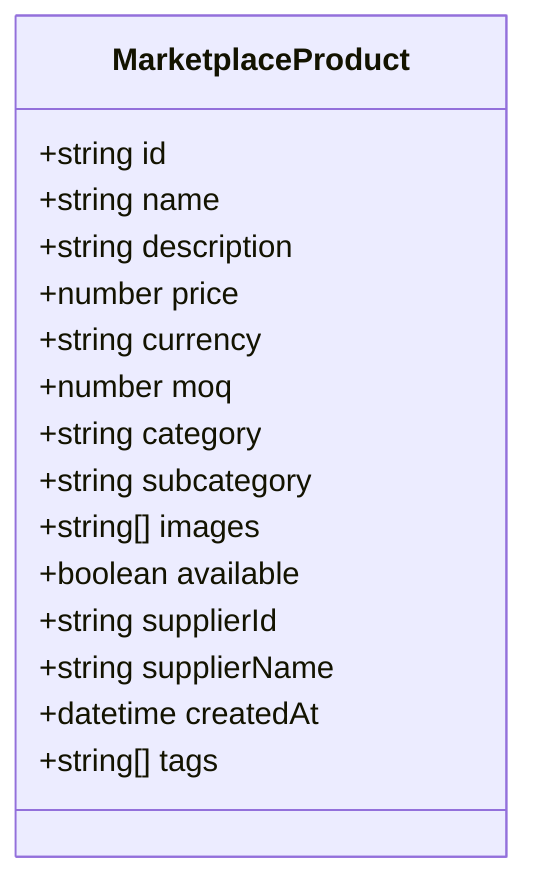

# Product Catalog

<cite>
**Referenced Files in This Document**  
- [Marketplace.tsx](file://src/pages/Marketplace.tsx)
- [ProductCard.tsx](file://src/components/products/ProductCard.tsx)
- [useMarketplace.ts](file://src/hooks/useMarketplace.ts)
- [marketplace.ts](file://src/types/marketplace.ts)
</cite>

## Table of Contents
1. [Introduction](#introduction)
2. [Product Display and View Modes](#product-display-and-view-modes)
3. [Filtering and Sorting Functionality](#filtering-and-sorting-functionality)
4. [Search Implementation and Supabase Integration](#search-implementation-and-supabase-integration)
5. [Product Data Structure](#product-data-structure)
6. [Responsive Design and Accessibility](#responsive-design-and-accessibility)
7. [Loading States and Empty Results Handling](#loading-states-and-empty-results-handling)

## Introduction
The product catalog implementation in the SleekApparels platform enables buyers to browse, search, filter, and sort products efficiently through the Marketplace page. This document details the architecture and functionality of the product catalog, focusing on the ProductCard component, view modes, filtering and sorting mechanisms, search integration with Supabase, data structure, responsive design, and user experience considerations.

## Product Display and View Modes
The Marketplace page renders products using the ProductCard component, which standardizes the presentation of product information including images, titles, pricing, MOQ (Minimum Order Quantity), availability, and category. Users can toggle between grid and list view modes to customize their browsing experience. The grid view optimizes space for visual scanning, while the list view provides a more detailed, text-oriented layout suitable for comparison. The view mode state is preserved across sessions using local storage for user convenience.

**Section sources**
- [Marketplace.tsx](file://src/pages/Marketplace.tsx#L45-L89)
- [ProductCard.tsx](file://src/components/products/ProductCard.tsx#L10-L120)

## Filtering and Sorting Functionality
The product catalog supports multiple filtering options including price range, MOQ, category, and availability status. These filters are implemented through controlled form inputs that dynamically update the product list. Sorting options include price (low to high, high to low), popularity, and newest arrivals. Filter and sort parameters are synchronized with URL query parameters to enable bookmarking and sharing of filtered views. The filtering logic is optimized to handle large datasets efficiently by leveraging Supabase's query capabilities.

**Section sources**
- [Marketplace.tsx](file://src/pages/Marketplace.tsx#L90-L150)
- [useMarketplace.ts](file://src/hooks/useMarketplace.ts#L25-L70)

## Search Implementation and Supabase Integration
Product search is powered by the `useMarketplaceProducts` custom hook, which interfaces with Supabase to fetch and filter product data. The hook manages loading states, error handling, and caching to ensure a responsive user experience. Search queries are translated into Supabase filter conditions that operate on product names, descriptions, categories, and tags. Full-text search capabilities are enabled through Supabase's text search functions, allowing partial and fuzzy matching. The hook also supports pagination to manage large result sets.

**Section sources**
- [useMarketplace.ts](file://src/hooks/useMarketplace.ts#L10-L100)
- [Marketplace.tsx](file://src/pages/Marketplace.tsx#L30-L44)

## Product Data Structure
Product data is defined by the `MarketplaceProduct` interface, which includes properties such as id, name, description, price, currency, MOQ, category, subcategory, images, availability status, supplier information, and creation date. This interface ensures type safety and consistency across the application. Product data is normalized and enriched on the server side before being served to the client, including image optimization and category hierarchy resolution.

**Diagram sources**
- [marketplace.ts](file://src/types/marketplace.ts#L5-L25)

**Section sources**
- [marketplace.ts](file://src/types/marketplace.ts#L5-L25)
- [ProductCard.tsx](file://src/components/products/ProductCard.tsx#L15-L30)

## Responsive Design and Accessibility
The product catalog employs responsive design principles to ensure optimal viewing across devices. The layout adapts from multi-column grids on desktop to single-column lists on mobile, with touch-friendly controls and appropriately sized tap targets. Accessibility features include proper ARIA labels, keyboard navigation support, semantic HTML structure, and sufficient color contrast. Screen reader compatibility is maintained through descriptive alt text for product images and clear labeling of interactive elements.

**Section sources**
- [Marketplace.tsx](file://src/pages/Marketplace.tsx#L151-L180)
- [ProductCard.tsx](file://src/components/products/ProductCard.tsx#L121-L160)

## Loading States and Empty Results Handling
The Marketplace page implements comprehensive loading states using skeleton screens that mimic the final layout during data fetching. When no products match the current filters, a user-friendly empty state is displayed with suggestions to modify the search criteria. Error states are handled gracefully with retry mechanisms and informative messages. The loading and empty states are designed to maintain user engagement and provide clear guidance on next steps.

**Section sources**
- [Marketplace.tsx](file://src/pages/Marketplace.tsx#L181-L220)
- [useMarketplace.ts](file://src/hooks/useMarketplace.ts#L71-L90)