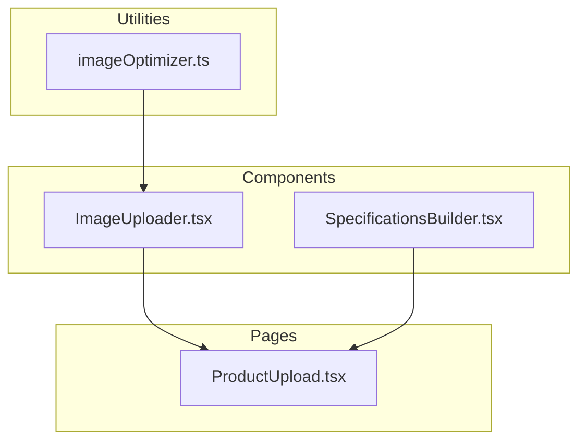
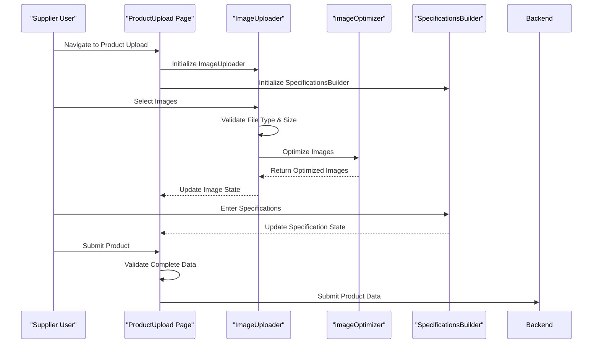
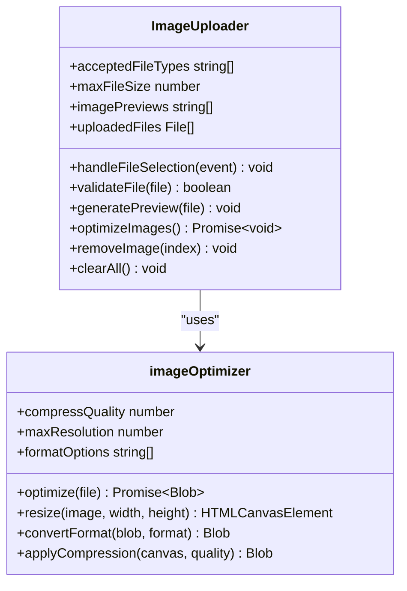
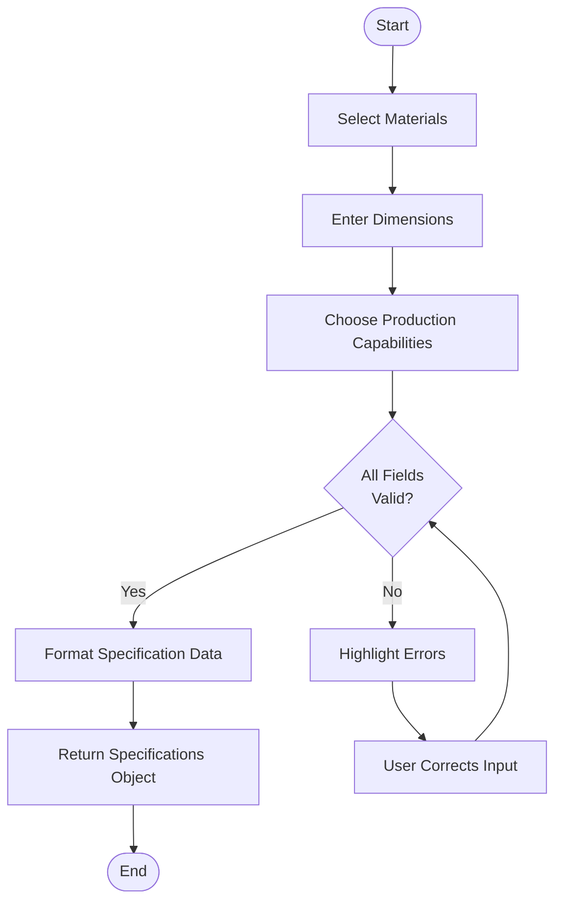
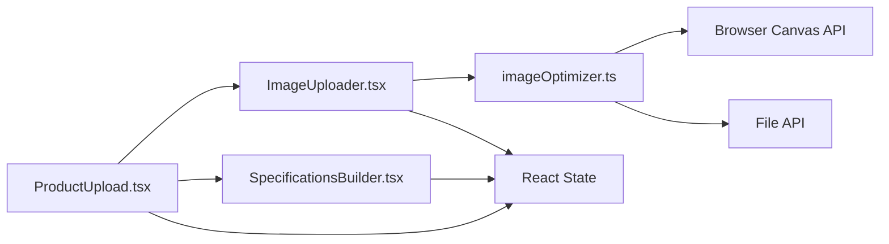

# Product Upload & Image Handling

<cite>
**Referenced Files in This Document**
- [ImageUploader.tsx](file://src/components/marketplace/ImageUploader.tsx)
- [SpecificationsBuilder.tsx](file://src/components/marketplace/SpecificationsBuilder.tsx)
- [imageOptimizer.ts](file://src/lib/imageOptimizer.ts)
- [ProductUpload.tsx](file://src/pages/supplier/ProductUpload.tsx)
</cite>

## Table of Contents
1. [Introduction](#introduction)
2. [Project Structure](#project-structure)
3. [Core Components](#core-components)
4. [Architecture Overview](#architecture-overview)
5. [Detailed Component Analysis](#detailed-component-analysis)
6. [Dependency Analysis](#dependency-analysis)
7. [Performance Considerations](#performance-considerations)
8. [Troubleshooting Guide](#troubleshooting-guide)
9. [Conclusion](#conclusion)

## Introduction
This document provides comprehensive documentation for the product upload workflow and image handling system within the SleekApparel platform. It details the functionality of the ImageUploader component for managing image selection, validation, preview generation, and optimization through the imageOptimizer utility. Additionally, it covers the SpecificationsBuilder component used for capturing manufacturing requirements such as materials, dimensions, and production capabilities. The integration between image uploads and product specification data is explained, along with file type restrictions, size limits, optimization techniques, error handling procedures, security considerations, and performance optimizations for handling large image files.

## Project Structure
The product upload and image handling system is organized within the src directory structure, with key components located in specific subdirectories. The marketplace components handle user interface elements for image uploading and specification building, while utility functions for image optimization reside in the lib directory. Page-level integration occurs within the supplier section of the application.

**Diagram sources**
- [ImageUploader.tsx](file://src/components/marketplace/ImageUploader.tsx)
- [SpecificationsBuilder.tsx](file://src/components/marketplace/SpecificationsBuilder.tsx)
- [imageOptimizer.ts](file://src/lib/imageOptimizer.ts)
- [ProductUpload.tsx](file://src/pages/supplier/ProductUpload.tsx)

**Section sources**
- [ImageUploader.tsx](file://src/components/marketplace/ImageUploader.tsx)
- [SpecificationsBuilder.tsx](file://src/components/marketplace/SpecificationsBuilder.tsx)
- [imageOptimizer.ts](file://src/lib/imageOptimizer.ts)
- [ProductUpload.tsx](file://src/pages/supplier/ProductUpload.tsx)

## Core Components
The system's core functionality revolves around two primary components: ImageUploader and SpecificationsBuilder. These components work in tandem to enable suppliers to upload product images and define manufacturing specifications through an intuitive interface. The ImageUploader handles all aspects of image management including selection, validation, preview generation, and optimization, while the SpecificationsBuilder captures detailed manufacturing requirements necessary for production.

**Section sources**
- [ImageUploader.tsx](file://src/components/marketplace/ImageUploader.tsx)
- [SpecificationsBuilder.tsx](file://src/components/marketplace/SpecificationsBuilder.tsx)

## Architecture Overview
The product upload workflow follows a structured architecture where user interactions with the ProductUpload page integrate both the ImageUploader and SpecificationsBuilder components. When a supplier initiates a product upload, they first select images through the ImageUploader, which validates file types and sizes before processing them through the imageOptimizer. Simultaneously, the SpecificationsBuilder collects manufacturing details that are ultimately combined with the optimized images to create a complete product listing.

**Diagram sources**
- [ProductUpload.tsx](file://src/pages/supplier/ProductUpload.tsx)
- [ImageUploader.tsx](file://src/components/marketplace/ImageUploader.tsx)
- [imageOptimizer.ts](file://src/lib/imageOptimizer.ts)
- [SpecificationsBuilder.tsx](file://src/components/marketplace/SpecificationsBuilder.tsx)

## Detailed Component Analysis

### ImageUploader Analysis
The ImageUploader component provides a comprehensive solution for handling product images. It supports drag-and-drop functionality and traditional file selection methods, validating each uploaded file against predefined criteria including allowed file types (JPEG, PNG, WEBP) and maximum file size limits. Upon successful validation, the component generates previews for user confirmation and processes images through the imageOptimizer utility to ensure optimal quality and performance.

#### For Object-Oriented Components:

**Diagram sources**
- [ImageUploader.tsx](file://src/components/marketplace/ImageUploader.tsx)
- [imageOptimizer.ts](file://src/lib/imageOptimizer.ts)

**Section sources**
- [ImageUploader.tsx](file://src/components/marketplace/ImageUploader.tsx)
- [imageOptimizer.ts](file://src/lib/imageOptimizer.ts)

### SpecificationsBuilder Analysis
The SpecificationsBuilder component enables suppliers to define comprehensive manufacturing requirements for their products. It captures essential information including material composition, dimensions, care instructions, and production capabilities. The component provides structured input fields with validation to ensure data completeness and accuracy, facilitating seamless communication between buyers and suppliers.

#### For Complex Logic Components:

**Diagram sources**
- [SpecificationsBuilder.tsx](file://src/components/marketplace/SpecificationsBuilder.tsx)

**Section sources**
- [SpecificationsBuilder.tsx](file://src/components/marketplace/SpecificationsBuilder.tsx)

## Dependency Analysis
The product upload system relies on several key dependencies between components and utilities. The ImageUploader depends on the imageOptimizer for processing images, while both components are integrated into the ProductUpload page. The system also depends on external libraries for file handling, image manipulation, and state management.

**Diagram sources**
- [ProductUpload.tsx](file://src/pages/supplier/ProductUpload.tsx)
- [ImageUploader.tsx](file://src/components/marketplace/ImageUploader.tsx)
- [SpecificationsBuilder.tsx](file://src/components/marketplace/SpecificationsBuilder.tsx)
- [imageOptimizer.ts](file://src/lib/imageOptimizer.ts)

**Section sources**
- [ProductUpload.tsx](file://src/pages/supplier/ProductUpload.tsx)
- [ImageUploader.tsx](file://src/components/marketplace/ImageUploader.tsx)
- [SpecificationsBuilder.tsx](file://src/components/marketplace/SpecificationsBuilder.tsx)
- [imageOptimizer.ts](file://src/lib/imageOptimizer.ts)

## Performance Considerations
The system implements several performance optimizations to handle large image files efficiently. Image optimization occurs client-side to reduce upload times and server storage requirements. The imageOptimizer applies compression algorithms and resolution adjustments while maintaining visual quality. For large batches of images, processing occurs asynchronously to prevent UI blocking. Additionally, preview generation uses lightweight representations to minimize memory usage during the upload process.

## Troubleshooting Guide
The system includes comprehensive error handling for various failure scenarios. For invalid uploads, the ImageUploader displays specific error messages indicating whether the issue relates to file type, size, or corruption. Failed optimizations trigger fallback mechanisms that attempt alternative processing methods or provide detailed error reports. Validation errors in the SpecificationsBuilder highlight problematic fields and provide guidance for correction.

**Section sources**
- [ImageUploader.tsx](file://src/components/marketplace/ImageUploader.tsx)
- [imageOptimizer.ts](file://src/lib/imageOptimizer.ts)
- [SpecificationsBuilder.tsx](file://src/components/marketplace/SpecificationsBuilder.tsx)

## Conclusion
The product upload and image handling system provides a robust solution for suppliers to create comprehensive product listings with high-quality images and detailed manufacturing specifications. By integrating the ImageUploader and SpecificationsBuilder components within the ProductUpload workflow, the system ensures data completeness, optimizes performance, and maintains security standards for user-uploaded content.