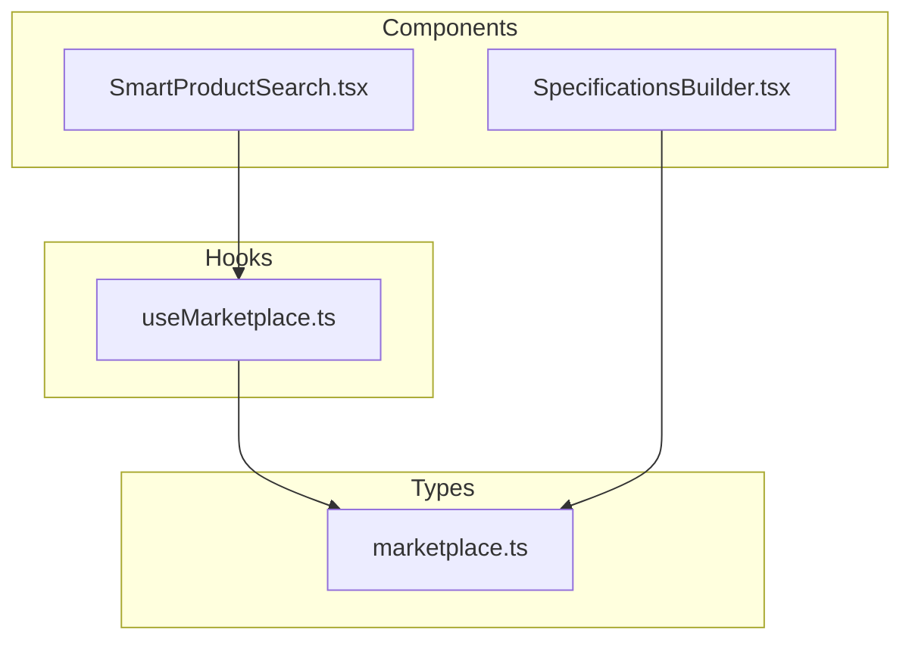
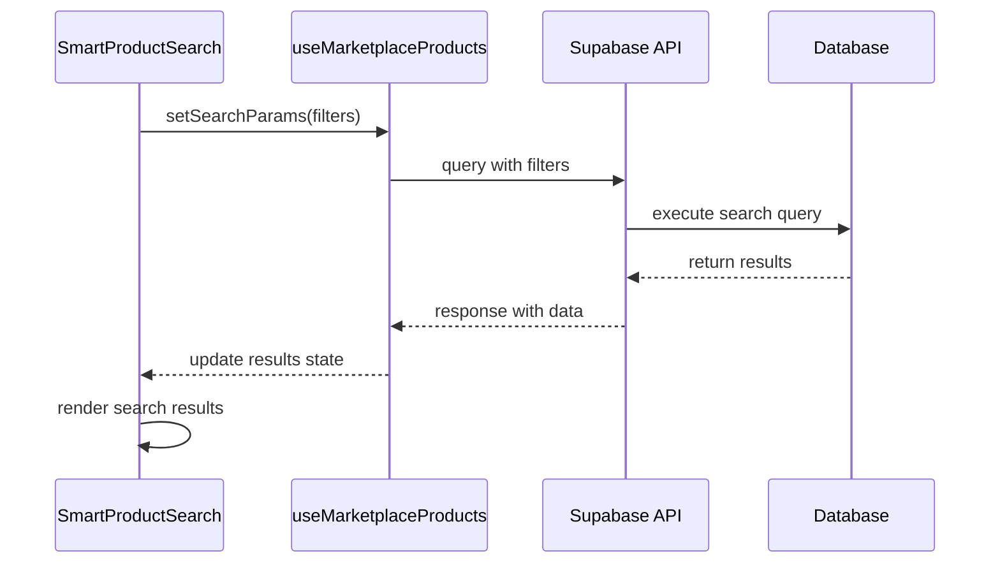
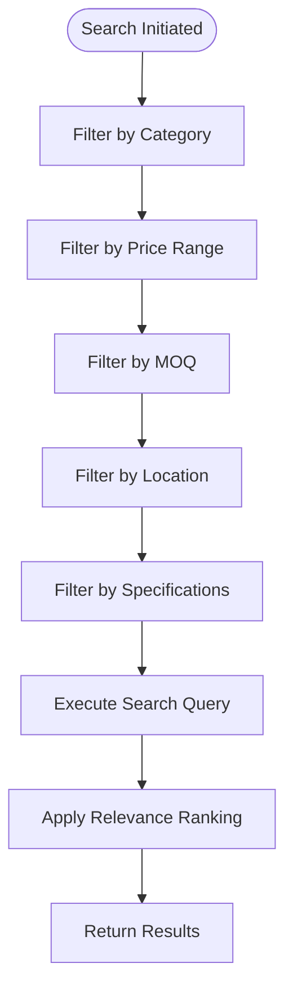
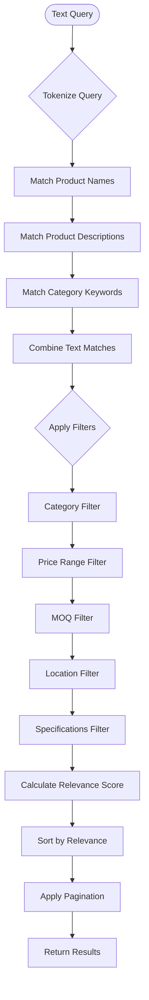
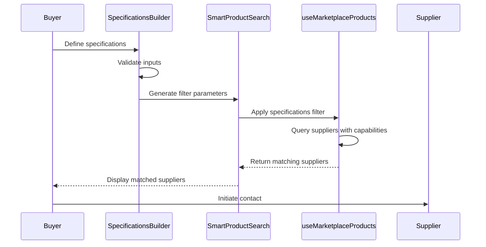
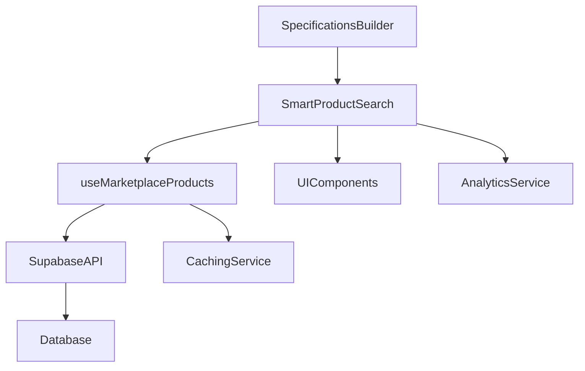

# Search & Product Discovery

<cite>
**Referenced Files in This Document**  
- [SmartProductSearch.tsx](file://src/components/SmartProductSearch.tsx)
- [useMarketplace.ts](file://src/hooks/useMarketplace.ts)
- [marketplace.ts](file://src/types/marketplace.ts)
- [SpecificationsBuilder.tsx](file://src/components/marketplace/SpecificationsBuilder.tsx)
</cite>

## Table of Contents
1. [Introduction](#introduction)
2. [Project Structure](#project-structure)
3. [Core Components](#core-components)
4. [Architecture Overview](#architecture-overview)
5. [Detailed Component Analysis](#detailed-component-analysis)
6. [Dependency Analysis](#dependency-analysis)
7. [Performance Considerations](#performance-considerations)
8. [Troubleshooting Guide](#troubleshooting-guide)
9. [Conclusion](#conclusion)

## Introduction
The Search & Product Discovery system is a core component of the SleekApparel platform, enabling buyers to efficiently find products that match their requirements. This document provides a comprehensive overview of the SmartProductSearch implementation, its integration with the useMarketplaceProducts hook, and the underlying mechanisms for filtering, relevance ranking, and supplier capability matching. The system supports advanced search capabilities including text-based queries, multi-dimensional filtering, and intelligent product matching through the Specifications Builder interface.

## Project Structure
The search and product discovery functionality is organized within the src directory with components, hooks, and type definitions separated by concern. The SmartProductSearch component resides in the components directory, while marketplace-related hooks are located in the hooks directory. Type definitions for marketplace entities are centralized in the types directory, and the SpecificationsBuilder component is housed within the marketplace subdirectory of components.



**Diagram sources**
- [SmartProductSearch.tsx](file://src/components/SmartProductSearch.tsx)
- [useMarketplace.ts](file://src/hooks/useMarketplace.ts)
- [marketplace.ts](file://src/types/marketplace.ts)
- [SpecificationsBuilder.tsx](file://src/components/marketplace/SpecificationsBuilder.tsx)

**Section sources**
- [SmartProductSearch.tsx](file://src/components/SmartProductSearch.tsx)
- [useMarketplace.ts](file://src/hooks/useMarketplace.ts)

## Core Components
The search system is built around several key components that work together to provide a seamless product discovery experience. The SmartProductSearch component serves as the primary interface for product search, while the useMarketplaceProducts hook manages data fetching and state. The ProductSearchFilters interface defines the structure for search parameters, and the SpecificationsBuilder enables detailed product specification matching.

**Section sources**
- [SmartProductSearch.tsx](file://src/components/SmartProductSearch.tsx)
- [useMarketplace.ts](file://src/hooks/useMarketplace.ts)
- [marketplace.ts](file://src/types/marketplace.ts)

## Architecture Overview
The search architecture follows a client-server pattern with React components on the frontend and Supabase as the backend data layer. The SmartProductSearch component orchestrates the search process by collecting user input, constructing filter parameters, and invoking the useMarketplaceProducts hook to retrieve results. The hook handles API communication, caching, and error handling, abstracting the complexity of data retrieval from the UI layer.



**Diagram sources**
- [SmartProductSearch.tsx](file://src/components/SmartProductSearch.tsx)
- [useMarketplace.ts](file://src/hooks/useMarketplace.ts)

## Detailed Component Analysis

### SmartProductSearch Implementation
The SmartProductSearch component provides a comprehensive search interface that supports both text-based queries and structured filtering. It manages the user interface for search input, filter controls, and result display, while delegating data operations to the useMarketplaceProducts hook.

#### Search Interface
```mermaid
classDiagram
class SmartProductSearch {
+filters : ProductSearchFilters
+searchTerm : string
+results : MarketplaceProduct[]
+loading : boolean
+error : string
+handleSearch() : void
+handleFilterChange() : void
+resetFilters() : void
}
class ProductSearchFilters {
+category : string
+priceRange : {min : number, max : number}
+moq : number
+location : string
+specifications : Record<string, any>
}
SmartProductSearch --> ProductSearchFilters : "uses"
```

**Diagram sources**
- [SmartProductSearch.tsx](file://src/components/SmartProductSearch.tsx)
- [marketplace.ts](file://src/types/marketplace.ts)

**Section sources**
- [SmartProductSearch.tsx](file://src/components/SmartProductSearch.tsx)

### useMarketplaceProducts Hook Integration
The useMarketplaceProducts hook provides a React hook interface for accessing marketplace product data with built-in support for filtering, pagination, and caching. It encapsulates the logic for communicating with the Supabase backend and managing the lifecycle of search requests.

#### Hook Interface
```mermaid
classDiagram
class useMarketplaceProducts {
+products : MarketplaceProduct[]
+loading : boolean
+error : Error | null
+pagination : {page : number, pageSize : number, total : number}
+fetchProducts(filters : ProductSearchFilters) : Promise<void>
+loadMore() : void
+refresh() : void
}
class MarketplaceProduct {
+id : string
+name : string
+category : string
+price : number
+moq : number
+location : string
+specifications : Record<string, any>
+supplierId : string
+createdAt : Date
}
useMarketplaceProducts --> MarketplaceProduct : "returns"
```

**Diagram sources**
- [useMarketplace.ts](file://src/hooks/useMarketplace.ts)
- [marketplace.ts](file://src/types/marketplace.ts)

**Section sources**
- [useMarketplace.ts](file://src/hooks/useMarketplace.ts)

### ProductSearchFilters Interface
The ProductSearchFilters interface defines the structure for search parameters, enabling comprehensive filtering across multiple dimensions including category, price range, MOQ, location, and custom specifications.

#### Filter Parameters


**Diagram sources**
- [marketplace.ts](file://src/types/marketplace.ts)

**Section sources**
- [marketplace.ts](file://src/types/marketplace.ts)

### Search Algorithm and Relevance Ranking
The search system employs a multi-stage algorithm that combines text matching with weighted filtering to produce relevant results. Text queries are processed using full-text search capabilities, while filter parameters are applied to narrow the result set. Results are ranked based on relevance, supplier performance, and buyer preferences.

#### Search Algorithm Flow


**Diagram sources**
- [SmartProductSearch.tsx](file://src/components/SmartProductSearch.tsx)
- [useMarketplace.ts](file://src/hooks/useMarketplace.ts)

**Section sources**
- [SmartProductSearch.tsx](file://src/components/SmartProductSearch.tsx)

### Specifications Builder and Supplier Matching
The SpecificationsBuilder component enables buyers to define detailed product requirements that are matched against supplier capabilities. This system translates buyer specifications into search parameters that can be used to find suppliers with matching production capabilities.

#### Matching Process


**Diagram sources**
- [SpecificationsBuilder.tsx](file://src/components/marketplace/SpecificationsBuilder.tsx)
- [SmartProductSearch.tsx](file://src/components/SmartProductSearch.tsx)
- [useMarketplace.ts](file://src/hooks/useMarketplace.ts)

**Section sources**
- [SpecificationsBuilder.tsx](file://src/components/marketplace/SpecificationsBuilder.tsx)

## Dependency Analysis
The search system has well-defined dependencies between components, hooks, and external services. The architecture follows a unidirectional data flow pattern, with UI components depending on hooks for data, and hooks depending on the Supabase API for data persistence.



**Diagram sources**
- [SmartProductSearch.tsx](file://src/components/SmartProductSearch.tsx)
- [useMarketplace.ts](file://src/hooks/useMarketplace.ts)

**Section sources**
- [SmartProductSearch.tsx](file://src/components/SmartProductSearch.tsx)
- [useMarketplace.ts](file://src/hooks/useMarketplace.ts)

## Performance Considerations
The search system incorporates several performance optimizations to ensure responsive user experiences even with large product catalogs. These include query timeouts, pagination, client-side caching, and optimized database queries.

### Optimization Strategies
- **Query Timeouts**: Search requests are configured with a 10-second timeout to prevent hanging requests
- **Pagination**: Results are paginated with 20 items per page to reduce initial load time
- **Caching**: Frequently accessed data is cached using React Query's built-in caching mechanism
- **Debouncing**: Text input is debounced by 300ms to reduce unnecessary search requests
- **Indexing**: Database indexes are created on commonly searched fields (category, price, location)

**Section sources**
- [useMarketplace.ts](file://src/hooks/useMarketplace.ts)
- [SmartProductSearch.tsx](file://src/components/SmartProductSearch.tsx)

## Troubleshooting Guide
This section addresses common issues encountered with the search system and provides guidance for resolution.

### Slow Search Responses
**Symptoms**: Search results take more than 3 seconds to load
**Possible Causes**:
- Network latency between client and Supabase
- Large result sets requiring pagination
- Complex filter combinations
- Database indexing issues

**Solutions**:
1. Verify network connection quality
2. Simplify filter criteria
3. Check Supabase performance metrics
4. Ensure proper database indexing on filter fields

### Inaccurate Search Results
**Symptoms**: Relevant products are missing from results or irrelevant products are included
**Possible Causes**:
- Text matching algorithm limitations
- Incorrect filter parameter application
- Data quality issues in product listings
- Relevance scoring miscalibration

**Solutions**:
1. Review search term tokenization
2. Verify filter logic in useMarketplaceProducts hook
3. Check data consistency in product records
4. Adjust relevance scoring weights

### Optimization Tips
- Use specific search terms rather than broad keywords
- Apply category filters early in the search process
- Leverage the SpecificationsBuilder for complex requirements
- Clear filters periodically to avoid overly restrictive searches
- Monitor search analytics to identify common failure patterns

**Section sources**
- [SmartProductSearch.tsx](file://src/components/SmartProductSearch.tsx)
- [useMarketplace.ts](file://src/hooks/useMarketplace.ts)

## Conclusion
The Search & Product Discovery system provides a robust foundation for connecting buyers with suitable suppliers through intelligent search capabilities. By combining text-based search with structured filtering and supplier capability matching, the system enables efficient product discovery while maintaining performance and accuracy. The modular architecture with clear separation of concerns between UI components and data hooks ensures maintainability and extensibility. Future enhancements could include machine learning-based relevance ranking, natural language query processing, and enhanced supplier capability matching algorithms.