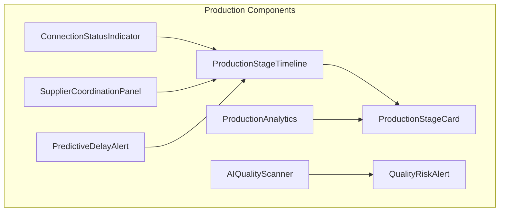
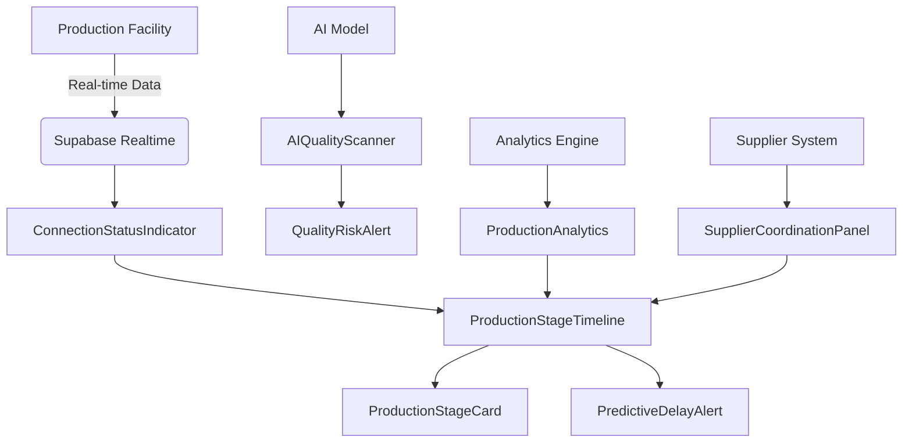
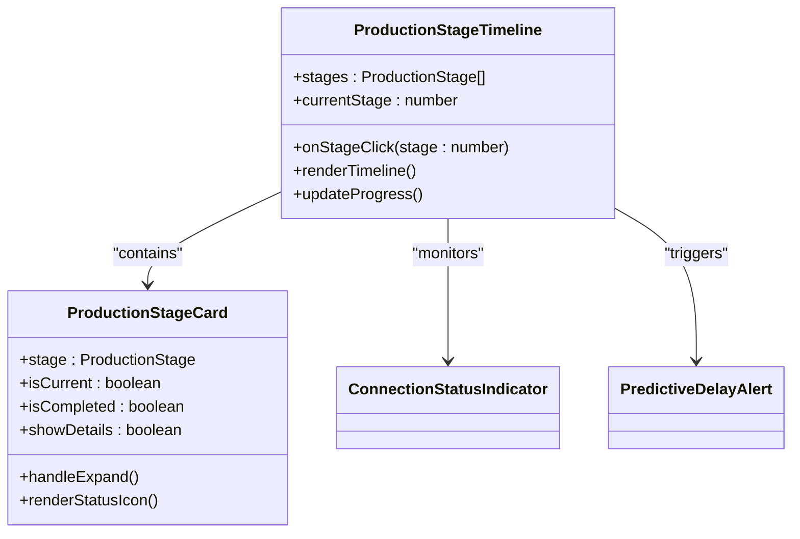
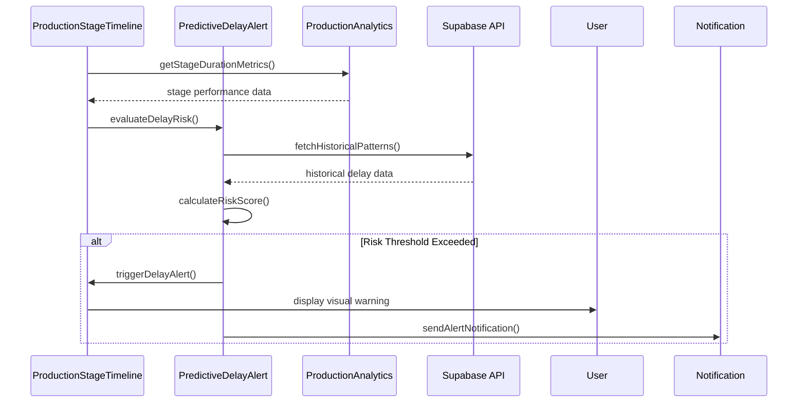
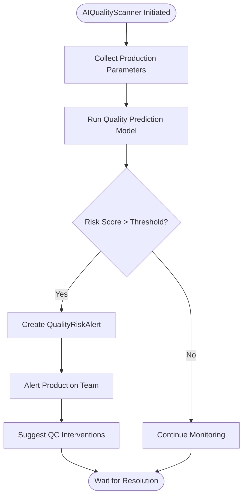
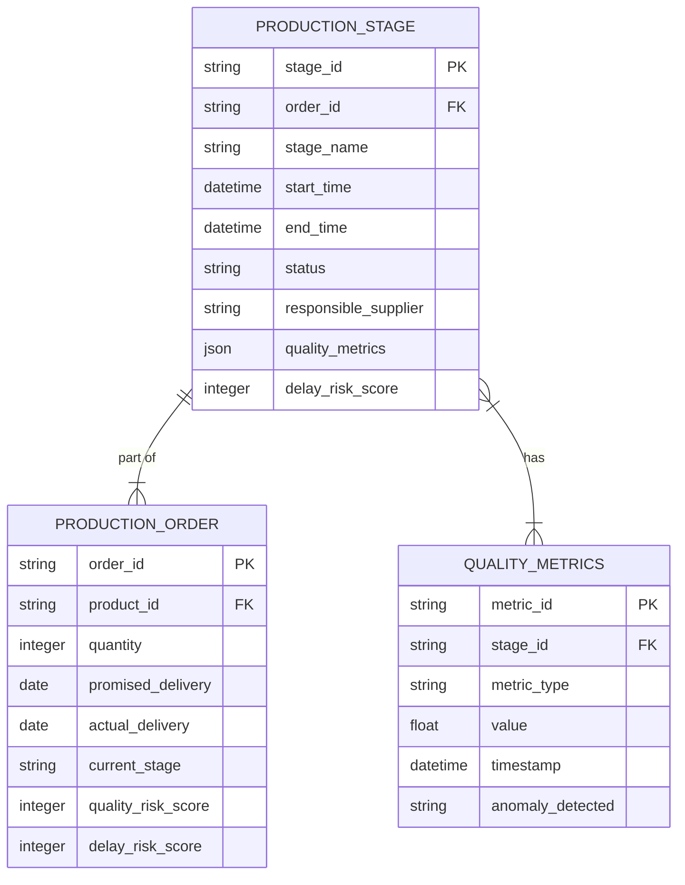
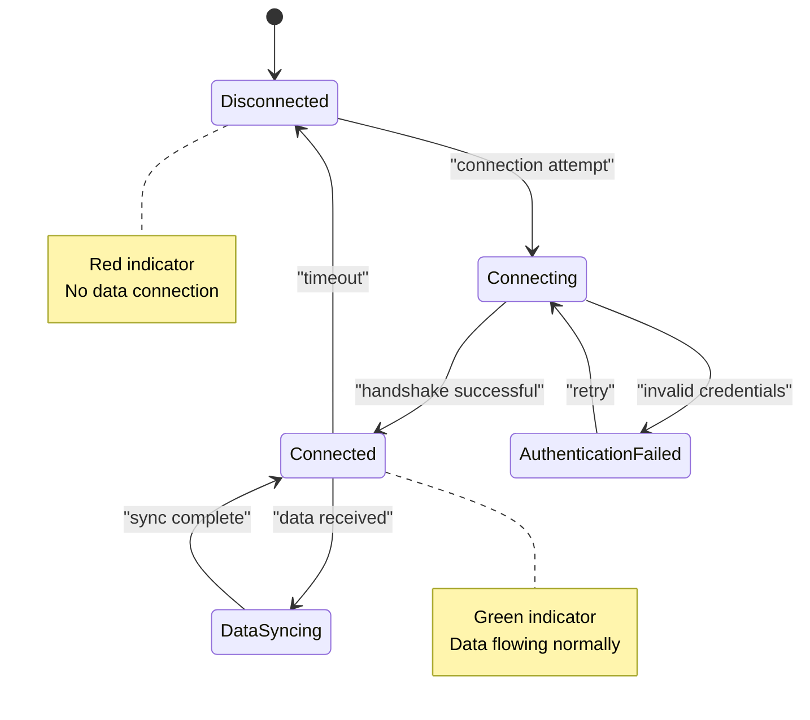
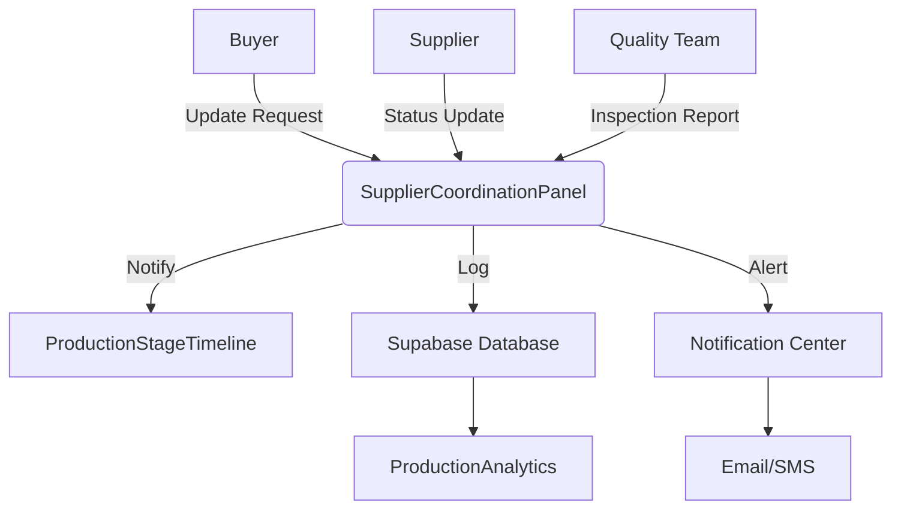
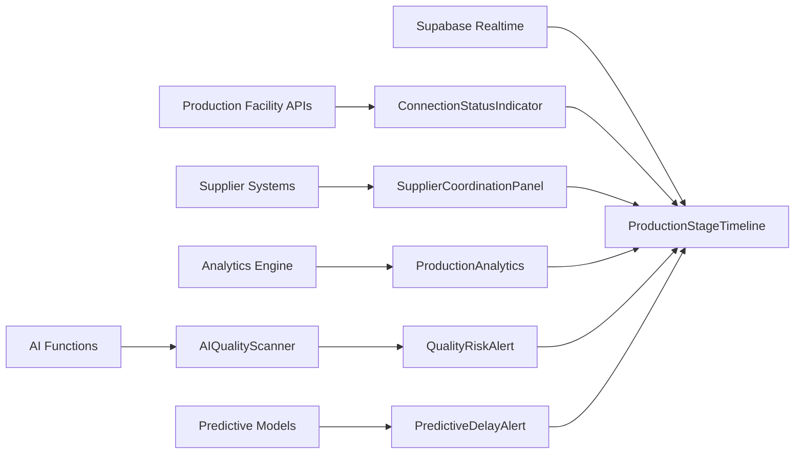

# Production Components

<cite>
**Referenced Files in This Document**  
- [ProductionStageTimeline.tsx](file://src/components/production/ProductionStageTimeline.tsx)
- [ProductionStageCard.tsx](file://src/components/production/ProductionStageCard.tsx)
- [PredictiveDelayAlert.tsx](file://src/components/production/PredictiveDelayAlert.tsx)
- [AIQualityScanner.tsx](file://src/components/production/AIQualityScanner.tsx)
- [QualityRiskAlert.tsx](file://src/components/production/QualityRiskAlert.tsx)
- [ProductionAnalytics.tsx](file://src/components/production/ProductionAnalytics.tsx)
- [ConnectionStatusIndicator.tsx](file://src/components/production/ConnectionStatusIndicator.tsx)
- [SupplierCoordinationPanel.tsx](file://src/components/production/SupplierCoordinationPanel.tsx)
</cite>

## Table of Contents
1. [Introduction](#introduction)
2. [Project Structure](#project-structure)
3. [Core Components](#core-components)
4. [Architecture Overview](#architecture-overview)
5. [Detailed Component Analysis](#detailed-component-analysis)
6. [Dependency Analysis](#dependency-analysis)
7. [Performance Considerations](#performance-considerations)
8. [Troubleshooting Guide](#troubleshooting-guide)
9. [Conclusion](#conclusion)

## Introduction
This document provides comprehensive documentation for the LoopTrace™ production tracking system, a real-time manufacturing workflow visualization and monitoring platform. The system enables end-to-end visibility across an 8-stage apparel production lifecycle, integrating AI-powered quality prediction, delay forecasting, and supplier coordination. Designed for both buyers and suppliers, LoopTrace™ delivers actionable insights through interactive timelines, predictive alerts, and performance analytics, ensuring transparency and efficiency in global manufacturing operations.

## Project Structure
The LoopTrace™ components are organized within the `src/components/production/` directory, following a modular React component architecture. Each component serves a specific function in the production monitoring ecosystem, from stage visualization to AI-driven risk assessment. The structure emphasizes reusability, real-time data binding, and seamless integration with backend services via Supabase and Firebase.

**Diagram sources**
- [ProductionStageTimeline.tsx](file://src/components/production/ProductionStageTimeline.tsx#L1-L50)
- [ProductionStageCard.tsx](file://src/components/production/ProductionStageCard.tsx#L1-L30)

**Section sources**
- [src/components/production/](file://src/components/production/)
- [package.json](file://package.json#L1-L20)

## Core Components
The LoopTrace™ system comprises eight core components that work in concert to provide real-time production tracking and intelligence. These components visualize the manufacturing workflow, predict quality issues, alert on potential delays, analyze performance metrics, monitor data connectivity, and facilitate supplier coordination. Together, they form a comprehensive production monitoring solution that enhances visibility, reduces risk, and improves decision-making across the supply chain.

**Section sources**
- [ProductionStageTimeline.tsx](file://src/components/production/ProductionStageTimeline.tsx#L25-L100)
- [AIQualityScanner.tsx](file://src/components/production/AIQualityScanner.tsx#L15-L80)
- [PredictiveDelayAlert.tsx](file://src/components/production/PredictiveDelayAlert.tsx#L20-L90)

## Architecture Overview
LoopTrace™ follows a component-based React architecture with real-time data synchronization through Supabase. The system integrates AI models for quality prediction and delay forecasting, with data flowing from production facilities through secure APIs to a centralized dashboard. Components are designed to be composable, allowing flexible integration into buyer and supplier workflows.

**Diagram sources**
- [ProductionStageTimeline.tsx](file://src/components/production/ProductionStageTimeline.tsx#L10-L60)
- [ConnectionStatusIndicator.tsx](file://src/components/production/ConnectionStatusIndicator.tsx#L15-L45)

## Detailed Component Analysis

### ProductionStageTimeline and ProductionStageCard Analysis
The ProductionStageTimeline component visualizes the complete 8-stage manufacturing workflow, from fabric sourcing to final shipment. It renders a horizontal timeline with color-coded stages, progress indicators, and real-time status updates. Each stage is represented by a ProductionStageCard that displays detailed information including timestamps, responsible parties, quality checkpoints, and documentation links. The timeline supports interactive navigation, allowing users to drill down into specific stages for deeper analysis.

**Diagram sources**
- [ProductionStageTimeline.tsx](file://src/components/production/ProductionStageTimeline.tsx#L45-L120)
- [ProductionStageCard.tsx](file://src/components/production/ProductionStageCard.tsx#L30-L85)

**Section sources**
- [ProductionStageTimeline.tsx](file://src/components/production/ProductionStageTimeline.tsx#L1-L200)
- [ProductionStageCard.tsx](file://src/components/production/ProductionStageCard.tsx#L1-L150)

### PredictiveDelayAlert Analysis
The PredictiveDelayAlert component monitors production progress and environmental factors to forecast potential delays. It analyzes historical data, current stage durations, supplier performance metrics, and external factors (such as weather or port congestion) to calculate delay probabilities. When a risk threshold is exceeded, the component triggers visual and notification alerts, providing estimated delay durations and recommended mitigation strategies.

**Diagram sources**
- [PredictiveDelayAlert.tsx](file://src/components/production/PredictiveDelayAlert.tsx#L25-L100)
- [ProductionAnalytics.tsx](file://src/components/production/ProductionAnalytics.tsx#L40-L90)

**Section sources**
- [PredictiveDelayAlert.tsx](file://src/components/production/PredictiveDelayAlert.tsx#L1-L120)
- [ProductionAnalytics.tsx](file://src/components/production/ProductionAnalytics.tsx#L1-L150)

### AIQualityScanner and QualityRiskAlert Analysis
The AIQualityScanner component leverages machine learning to predict quality issues before they occur. It analyzes production parameters, material specifications, historical defect data, and real-time sensor inputs to identify potential quality risks. The QualityRiskAlert component visualizes these predictions, highlighting high-risk production batches and suggesting preventive quality control measures. This AI-powered system reduces defect rates by enabling proactive intervention.

**Diagram sources**
- [AIQualityScanner.tsx](file://src/components/production/AIQualityScanner.tsx#L35-L110)
- [QualityRiskAlert.tsx](file://src/components/production/QualityRiskAlert.tsx#L20-L75)

**Section sources**
- [AIQualityScanner.tsx](file://src/components/production/AIQualityScanner.tsx#L1-L140)
- [QualityRiskAlert.tsx](file://src/components/production/QualityRiskAlert.tsx#L1-L100)

### ProductionAnalytics Analysis
The ProductionAnalytics component provides comprehensive performance metrics and insights across the production lifecycle. It aggregates data from all stages to generate KPIs such as cycle time, defect rate, on-time completion percentage, and resource utilization. The component supports drill-down analysis by supplier, product type, and time period, enabling data-driven decision-making for process improvement and capacity planning.

**Diagram sources**
- [ProductionAnalytics.tsx](file://src/components/production/ProductionAnalytics.tsx#L50-L130)
- [ProductionStageTimeline.tsx](file://src/components/production/ProductionStageTimeline.tsx#L80-L110)

**Section sources**
- [ProductionAnalytics.tsx](file://src/components/production/ProductionAnalytics.tsx#L1-L180)

### ConnectionStatusIndicator Analysis
The ConnectionStatusIndicator component monitors real-time data flow from production facilities to the LoopTrace™ system. It displays connectivity status through color-coded indicators and provides detailed information about data transmission frequency, last update time, and any connectivity issues. This component ensures data integrity by alerting users to potential data gaps that could affect production visibility.

**Diagram sources**
- [ConnectionStatusIndicator.tsx](file://src/components/production/ConnectionStatusIndicator.tsx#L20-L95)

**Section sources**
- [ConnectionStatusIndicator.tsx](file://src/components/production/ConnectionStatusIndicator.tsx#L1-L120)

### SupplierCoordinationPanel Analysis
The SupplierCoordinationPanel component facilitates collaboration between buyers and suppliers by synchronizing production updates across stakeholders. It provides a shared workspace for communication, document sharing, and approval workflows. Production status changes are automatically propagated to all relevant parties, ensuring alignment and reducing coordination overhead in multi-supplier production environments.

**Diagram sources**
- [SupplierCoordinationPanel.tsx](file://src/components/production/SupplierCoordinationPanel.tsx#L30-L105)
- [ProductionStageTimeline.tsx](file://src/components/production/ProductionStageTimeline.tsx#L60-L85)

**Section sources**
- [SupplierCoordinationPanel.tsx](file://src/components/production/SupplierCoordinationPanel.tsx#L1-L140)

## Dependency Analysis
The LoopTrace™ components are interconnected through a real-time data flow architecture. The ProductionStageTimeline serves as the central visualization component, consuming data from all other components. The system relies on Supabase for real-time database synchronization, Firebase for authentication and messaging, and AI functions deployed as Supabase edge functions for quality and delay predictions.

**Diagram sources**
- [go.mod](file://package.json#L1-L20)
- [ProductionStageTimeline.tsx](file://src/components/production/ProductionStageTimeline.tsx#L1-L15)

**Section sources**
- [package.json](file://package.json#L1-L50)
- [supabase/functions/](file://supabase/functions/)

## Performance Considerations
The LoopTrace™ components are optimized for real-time performance with efficient state management and minimal re-renders. Data fetching is implemented with caching and incremental updates to reduce latency. The AI-powered components use debounced predictions to balance accuracy with performance. ConnectionStatusIndicator implements heartbeat monitoring with exponential backoff for resilient connectivity in variable network conditions.

## Troubleshooting Guide
Common issues with LoopTrace™ components typically relate to data connectivity, authentication, or real-time synchronization. The ConnectionStatusIndicator should be checked first when production data appears stale. For missing predictive alerts, verify that the AI functions are properly deployed and have access to historical data. If stage timelines do not update, check Supabase realtime subscriptions and database permissions.

**Section sources**
- [ConnectionStatusIndicator.tsx](file://src/components/production/ConnectionStatusIndicator.tsx#L10-L50)
- [ProductionStageTimeline.tsx](file://src/components/production/ProductionStageTimeline.tsx#L150-L200)

## Conclusion
The LoopTrace™ production tracking components provide a comprehensive solution for monitoring and optimizing apparel manufacturing workflows. By combining real-time visualization, AI-powered predictions, and collaborative tools, the system enhances transparency, reduces risks, and improves efficiency across the supply chain. The modular architecture allows for flexible deployment and integration with existing production systems, making it a valuable tool for both buyers and suppliers in the global apparel industry.