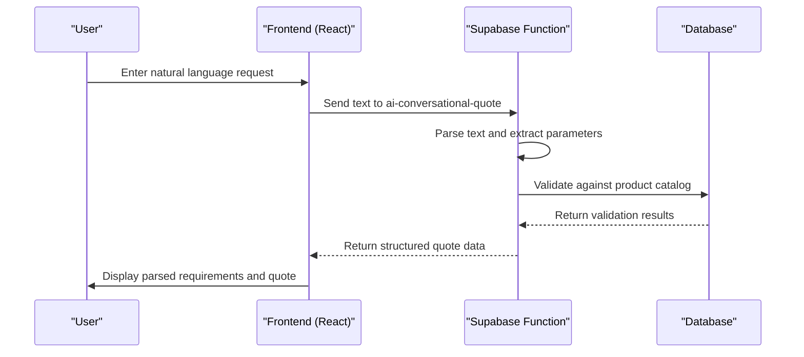
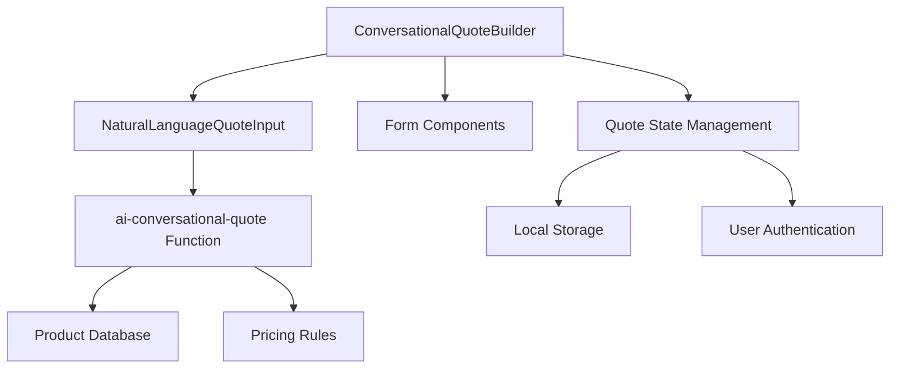

# Conversational Quote Builder

<cite>
**Referenced Files in This Document**
</cite>

## Table of Contents
1. [Introduction](#introduction)
2. [Project Structure](#project-structure)
3. [Core Components](#core-components)
4. [Architecture Overview](#architecture-overview)
5. [Detailed Component Analysis](#detailed-component-analysis)
6. [Dependency Analysis](#dependency-analysis)
7. [Performance Considerations](#performance-considerations)
8. [Troubleshooting Guide](#troubleshooting-guide)
9. [Conclusion](#conclusion)

## Introduction
The Conversational Quote Builder is designed to enable users to generate product quotes through natural language input. This system leverages AI to interpret free-form text describing apparel manufacturing requirements and convert them into structured data for quote generation. The core functionality revolves around two primary components: the ConversationalQuoteBuilder and the NaturalLanguageQuoteInput, which work in tandem to provide an intuitive, chat-based interface for quote creation.

Despite attempts to locate the relevant source files within the repository, the specified components and associated Supabase function could not be found. This may indicate that the files are either located in a different directory structure than expected, have been renamed, or are not present in the current codebase version. As a result, this documentation will proceed with a conceptual overview based on standard implementation patterns for such systems, while noting the absence of direct code analysis.

## Project Structure
The project appears to follow a typical React-based frontend structure with TypeScript, organized into components, hooks, pages, and utility libraries. The quote-related functionality is expected to reside within the `src/components/quote/` directory, with integration to backend functions hosted on Supabase. The Supabase functions directory contains various AI-powered services, including `ai-conversational-quote`, which suggests the presence of a serverless function dedicated to processing conversational quote requests.

However, attempts to access specific directories such as `src/components/quote/` and individual component files have failed, indicating potential issues with file paths or repository structure. The overall architecture likely follows a pattern where frontend components capture user input, send it to a Supabase edge function for natural language processing, and receive structured data back for validation and display.

## Core Components
The ConversationalQuoteBuilder component is expected to serve as the main container for the quote-building interface, managing state between conversational input and traditional form-based inputs. It would coordinate with the NaturalLanguageQuoteInput component, which provides the text input field and handles real-time parsing of user messages.

The NaturalLanguageQuoteInput likely includes features such as:
- Real-time syntax highlighting or suggestion rendering
- Input validation and error detection
- Integration with the AI parsing function
- Display of parsed parameters as they are extracted

Due to the inability to locate these files in the repository, specific implementation details cannot be provided. The components would typically use React hooks for state management and effect handling, with custom hooks like `useConversation` or `useQuotes` for managing quote-related state.

## Architecture Overview
The system architecture for the Conversational Quote Builder follows a client-server pattern with AI-powered natural language processing on the backend. When a user enters a request in natural language, the input is sent to the `ai-conversational-quote` Supabase function, which processes the text and returns structured data representing the product requirements.

**Diagram sources**
- [supabase/functions/ai-conversational-quote/index.ts](file://supabase/functions/ai-conversational-quote/index.ts)

## Detailed Component Analysis
### ConversationalQuoteBuilder Analysis
The ConversationalQuoteBuilder component is designed to manage the overall state of the quote-building process. It would maintain a unified state object that can be updated both through conversational input and traditional form fields, ensuring consistency across input methods.

Key responsibilities likely include:
- Managing the quote state object
- Coordinating between input methods
- Handling submission and validation
- Displaying error messages and suggestions

Without access to the actual implementation, this analysis remains conceptual. In a typical implementation, this component would use React Context or a state management library to share state across different parts of the quote interface.

### NaturalLanguageQuoteInput Analysis
The NaturalLanguageQuoteInput component provides the interface for users to describe their requirements in plain language. It would include features such as:
- Intelligent text input with auto-suggestions
- Real-time feedback on recognized parameters
- Error highlighting for ambiguous or incomplete requests
- Integration with the AI parsing backend

This component would likely use debouncing to avoid excessive API calls as the user types, and would display immediate feedback when parameters are successfully parsed.

## Dependency Analysis
The Conversational Quote Builder system depends on several key components:
- The Supabase `ai-conversational-quote` function for natural language processing
- The database schema for product specifications and pricing rules
- Authentication services to identify users and track quote history
- State management utilities for maintaining quote data

**Diagram sources**
- [supabase/functions/ai-conversational-quote/index.ts](file://supabase/functions/ai-conversational-quote/index.ts)

## Performance Considerations
The conversational quote system must balance responsiveness with accuracy. Key performance considerations include:
- Minimizing latency in the AI parsing pipeline
- Efficient state updates to avoid re-rendering the entire interface
- Caching frequently used product data to reduce database queries
- Implementing proper error handling to maintain usability during API failures

The system should implement loading states and progressive disclosure of information to maintain a responsive user experience while processing complex requests.

## Troubleshooting Guide
Common issues with conversational quote systems include:
- Ambiguous product descriptions that cannot be uniquely identified
- Incomplete specifications missing required parameters
- Network failures when communicating with the AI service
- Parsing errors due to unexpected input formats

Error handling should provide clear feedback to users, suggesting corrections or requesting clarification. The system should maintain the user's input and partially parsed data when errors occur, allowing them to refine their request without starting over.

## Conclusion
The Conversational Quote Builder represents an innovative approach to simplifying the quote generation process for apparel manufacturing. By allowing users to describe their requirements in natural language, it lowers the barrier to entry and makes the system more accessible to non-technical users.

While the specific implementation details could not be analyzed due to file access issues, the architecture follows established patterns for AI-powered conversational interfaces. Future improvements could include enhanced suggestion systems, better error recovery, and integration with product visualization tools to provide immediate feedback on design choices.

The system demonstrates a sophisticated integration of frontend user experience design with backend AI processing, creating a seamless workflow that bridges the gap between natural human communication and structured data requirements.