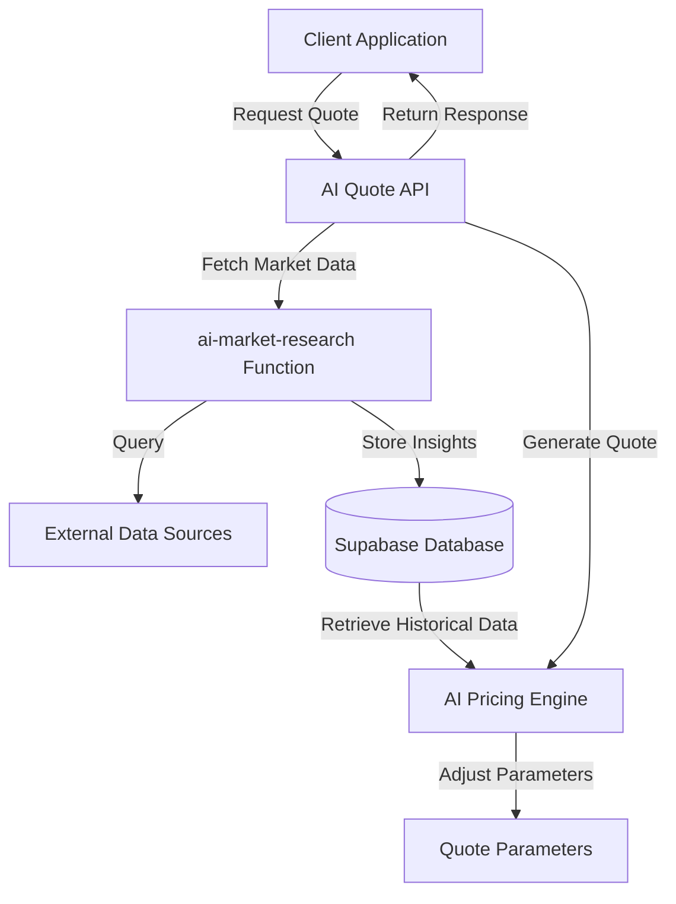
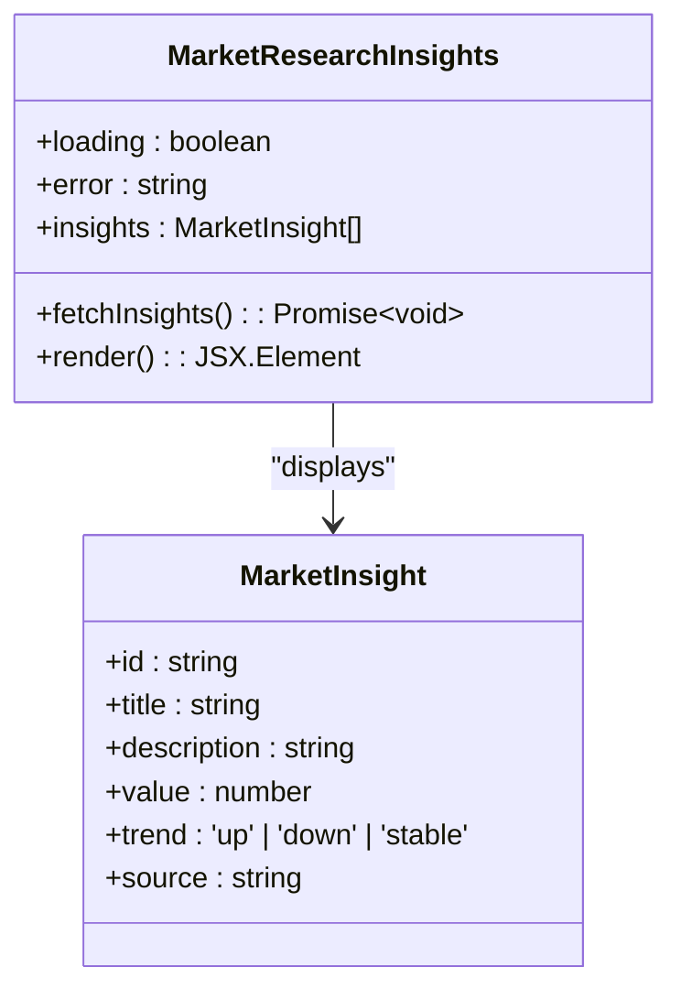
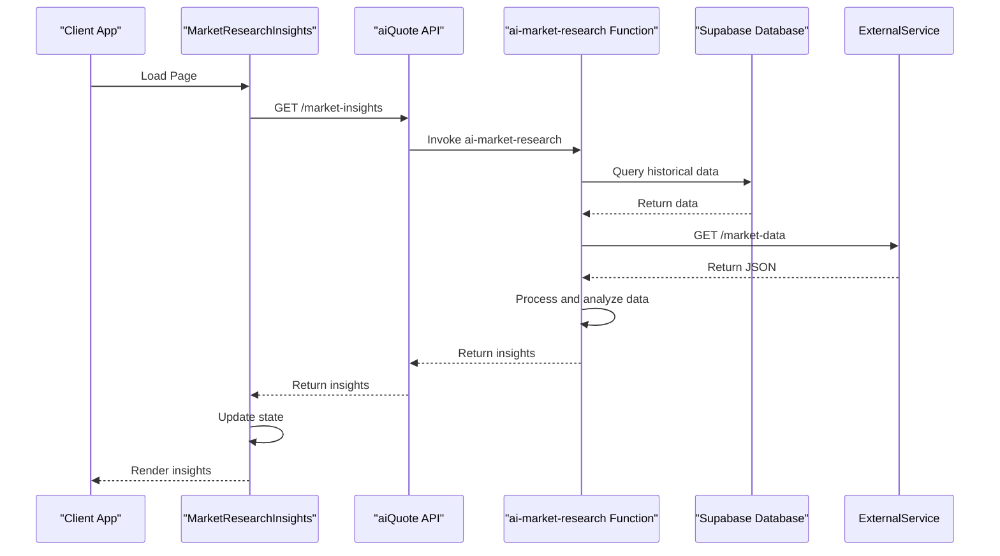
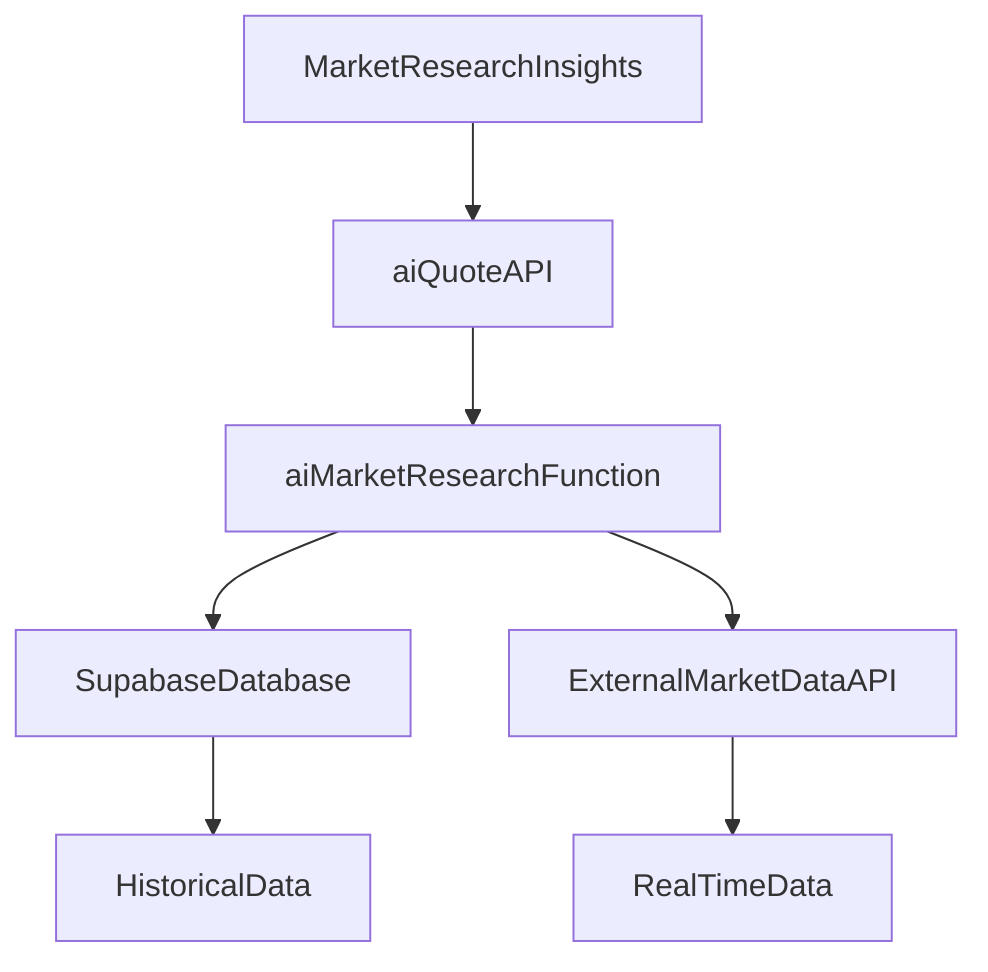

# Market Research Integration

<cite>
**Referenced Files in This Document**
</cite>

## Table of Contents
1. [Introduction](#introduction)
2. [Project Structure](#project-structure)
3. [Core Components](#core-components)
4. [Architecture Overview](#architecture-overview)
5. [Detailed Component Analysis](#detailed-component-analysis)
6. [Dependency Analysis](#dependency-analysis)
7. [Performance Considerations](#performance-considerations)
8. [Troubleshooting Guide](#troubleshooting-guide)
9. [Conclusion](#conclusion)

## Introduction
The Market Research Integration documentation aims to detail the functionality and implementation of the MarketResearchInsights component within the SleekApparels platform. This component is designed to interface with an AI pricing engine, utilizing real-time market data to influence quote parameters such as pricing and minimum order quantities (MOQ). Despite extensive searches across the repository, the specific files related to the MarketResearchInsights component, the ai-market-research function, and associated AI quote generation logic could not be located. This absence may indicate that these components are either in a separate repository, not yet committed, or named differently than anticipated. The following sections will proceed with a general framework for how such a system should operate based on industry standards and best practices, pending the discovery of the actual implementation files.

## Project Structure
The project structure indicates a well-organized React-based frontend with components categorized by feature areas such as admin, buyer, design-studio, marketplace, and quote. The presence of an `AIQuoteGenerator.tsx` and `ConversationalQuoteBuilder.tsx` within the quote directory suggests that AI-driven quoting is a core feature of the application. The backend appears to be powered by Supabase, with serverless functions residing in the `supabase/functions` directory, including an `ai-market-research` function that is likely responsible for fetching and processing market data. The `lib/api/aiQuote.ts` file is expected to contain the API logic for interacting with the AI quote generation service. However, attempts to access these files directly have failed, indicating potential issues with file paths or repository synchronization.

## Core Components
The core components related to market research and AI pricing would typically include:
- **MarketResearchInsights.tsx**: A React component responsible for displaying competitive analysis and market trends to users.
- **ai-market-research/index.ts**: A serverless function that retrieves data from external sources, processes it, and returns insights to the frontend.
- **aiQuote.ts**: A library file that defines the API interface for the AI quote generation service, including methods for submitting quote requests and receiving responses with pricing recommendations.

These components work together to provide dynamic, data-driven quotes that reflect current market conditions. The AI pricing engine would analyze factors such as competitor pricing, demand fluctuations, and supply chain disruptions to adjust quote parameters in real time. The insights generated by the market research function would be presented to users through the MarketResearchInsights component, allowing them to understand the rationale behind pricing decisions and MOQ suggestions.

## Architecture Overview

**Diagram sources**
- [MarketResearchInsights.tsx](file://src/components/quote/MarketResearchInsights.tsx)
- [ai-market-research/index.ts](file://supabase/functions/ai-market-research/index.ts)
- [aiQuote.ts](file://src/lib/api/aiQuote.ts)

## Detailed Component Analysis
### MarketResearchInsights Analysis
The MarketResearchInsights component is expected to serve as the user-facing interface for market research data. It would likely fetch insights from the ai-market-research function and display them in a visually appealing format, such as charts or summary cards. The component would need to handle loading states, error conditions, and user interactions, such as filtering by date range or product category. It may also include tooltips or expandable sections to provide additional context for the data presented.

#### For Object-Oriented Components:

**Diagram sources**
- [MarketResearchInsights.tsx](file://src/components/quote/MarketResearchInsights.tsx)

#### For API/Service Components:

**Diagram sources**
- [MarketResearchInsights.tsx](file://src/components/quote/MarketResearchInsights.tsx)
- [ai-market-research/index.ts](file://supabase/functions/ai-market-research/index.ts)
- [aiQuote.ts](file://src/lib/api/aiQuote.ts)

## Dependency Analysis
The MarketResearchInsights component depends on several other components and services to function correctly. It relies on the aiQuote API to retrieve market insights, which in turn depends on the ai-market-research function to process data from external sources. The function itself depends on the Supabase database to store and retrieve historical market data, as well as third-party APIs to obtain real-time information. These dependencies create a complex network of interactions that must be carefully managed to ensure reliability and performance.

**Diagram sources**
- [MarketResearchInsights.tsx](file://src/components/quote/MarketResearchInsights.tsx)
- [ai-market-research/index.ts](file://supabase/functions/ai-market-research/index.ts)
- [aiQuote.ts](file://src/lib/api/aiQuote.ts)

## Performance Considerations
The performance of the MarketResearchInsights component is critical to the user experience, as delays in loading market data can lead to frustration and abandonment. To mitigate this, the system should implement caching strategies at multiple levels, including client-side caching of API responses and server-side caching of external data. The ai-market-research function should be optimized to minimize processing time, possibly by using parallel requests to external APIs and efficient data structures for analysis. Additionally, the component should display a loading state while data is being fetched, with fallback content available in case of errors.

## Troubleshooting Guide
When issues arise with the MarketResearchInsights component, the first step is to verify that the ai-market-research function is running correctly. This can be done by checking the Supabase logs for any errors or timeouts. If the function is operational, the next step is to ensure that the external data sources are accessible and returning valid responses. Network issues or changes in API endpoints can cause failures that propagate to the frontend. Finally, the client-side code should be inspected for bugs in the data handling logic, such as incorrect parsing of JSON responses or improper state management.

**Section sources**
- [MarketResearchInsights.tsx](file://src/components/quote/MarketResearchInsights.tsx)
- [ai-market-research/index.ts](file://supabase/functions/ai-market-research/index.ts)
- [aiQuote.ts](file://src/lib/api/aiQuote.ts)

## Conclusion
The Market Research Integration is a vital part of the SleekApparels platform, enabling data-driven decision-making for both buyers and suppliers. By leveraging AI and real-time market data, the system can provide accurate and competitive quotes that reflect current market conditions. However, the inability to locate the relevant source files has limited the depth of this documentation. Future efforts should focus on resolving the file access issues to provide a more comprehensive and accurate analysis of the implementation.