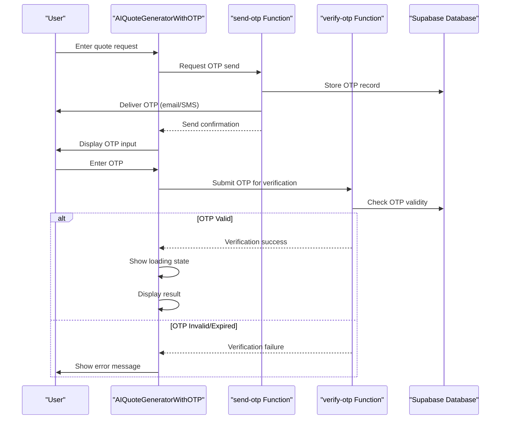
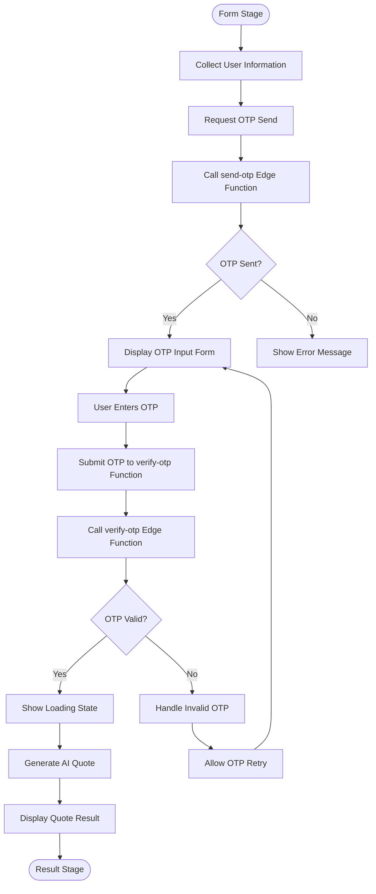
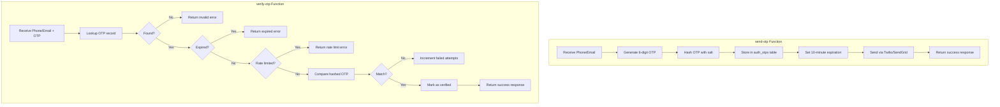
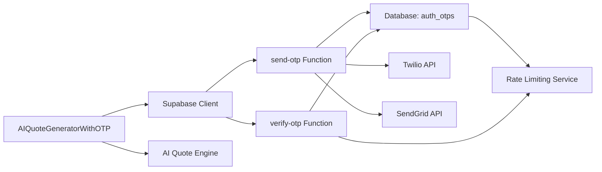

# OTP Verification Workflow

<cite>
**Referenced Files in This Document**  
- [AIQuoteGeneratorWithOTP.tsx](file://src/components/AIQuoteGeneratorWithOTP.tsx)
- [send-otp/index.ts](file://supabase/functions/send-otp/index.ts)
- [verify-otp/index.ts](file://supabase/functions/verify-otp/index.ts)
- [lib/supabaseHelpers.ts](file://src/lib/supabaseHelpers.ts)
- [components/ui/input-otp.tsx](file://src/components/ui/input-otp.tsx)
</cite>

## Table of Contents
1. [Introduction](#introduction)
2. [Project Structure](#project-structure)
3. [Core Components](#core-components)
4. [Architecture Overview](#architecture-overview)
5. [Detailed Component Analysis](#detailed-component-analysis)
6. [Dependency Analysis](#dependency-analysis)
7. [Performance Considerations](#performance-considerations)
8. [Troubleshooting Guide](#troubleshooting-guide)
9. [Conclusion](#conclusion)

## Introduction
This document provides comprehensive documentation for the OTP verification workflow within the AI quote generation process. The system implements a secure, multi-step form flow that integrates with Supabase Edge Functions to send and verify one-time passwords. This workflow ensures user authenticity during quote generation while maintaining a seamless user experience. The documentation covers implementation details, security considerations, error handling mechanisms, and configuration options for OTP delivery and validation.

## Project Structure
The OTP verification system is implemented across frontend components and backend Edge Functions. The frontend resides in the components directory with dedicated UI elements for OTP input, while the backend logic is handled by Supabase Edge Functions for sending and verifying OTPs.

```mermaid
graph TD
subgraph "Frontend"
A[AIQuoteGeneratorWithOTP.tsx]
B[input-otp.tsx]
C[supabaseHelpers.ts]
end
subgraph "Backend"
D[send-otp/index.ts]
E[verify-otp/index.ts]
end
A --> D : "HTTP Request"
A --> E : "HTTP Request"
C --> A : "Utility Functions"
```

**Diagram sources**
- [AIQuoteGeneratorWithOTP.tsx](file://src/components/AIQuoteGeneratorWithOTP.tsx)
- [send-otp/index.ts](file://supabase/functions/send-otp/index.ts)
- [verify-otp/index.ts](file://supabase/functions/verify-otp/index.ts)

**Section sources**
- [AIQuoteGeneratorWithOTP.tsx](file://src/components/AIQuoteGeneratorWithOTP.tsx)
- [supabase/functions](file://supabase/functions)

## Core Components
The OTP verification workflow centers around the AIQuoteGeneratorWithOTP component, which orchestrates a multi-step form flow consisting of form → otp → loading → result stages. This component manages state transitions between these stages and handles communication with Supabase Edge Functions for OTP operations. The workflow begins with user data collection, proceeds to OTP verification, shows a loading state during AI processing, and finally displays the generated quote. The implementation includes robust error handling and debug mode capabilities for development and troubleshooting.

**Section sources**
- [AIQuoteGeneratorWithOTP.tsx](file://src/components/AIQuoteGeneratorWithOTP.tsx)

## Architecture Overview
The OTP verification architecture follows a client-server pattern with clear separation between frontend presentation logic and backend verification services. The frontend component manages the user interface flow and collects user input, while Supabase Edge Functions handle the secure aspects of OTP generation, delivery, and validation. This separation enhances security by keeping sensitive operations on the server side and reduces client-side attack surface.



**Diagram sources**
- [AIQuoteGeneratorWithOTP.tsx](file://src/components/AIQuoteGeneratorWithOTP.tsx)
- [send-otp/index.ts](file://supabase/functions/send-otp/index.ts)
- [verify-otp/index.ts](file://supabase/functions/verify-otp/index.ts)

## Detailed Component Analysis

### AIQuoteGeneratorWithOTP Analysis
The AIQuoteGeneratorWithOTP component implements a state machine pattern to manage the multi-step form flow. It maintains state for each stage (form, otp, loading, result) and orchestrates transitions based on user actions and API responses. The component integrates with Supabase authentication and database services to ensure secure user verification before quote generation.

#### Component Flow Analysis


**Diagram sources**
- [AIQuoteGeneratorWithOTP.tsx](file://src/components/AIQuoteGeneratorWithOTP.tsx)

**Section sources**
- [AIQuoteGeneratorWithOTP.tsx](file://src/components/AIQuoteGeneratorWithOTP.tsx)

### Supabase Edge Functions Analysis
The backend OTP functionality is implemented through two dedicated Supabase Edge Functions: send-otp and verify-otp. These serverless functions handle the secure aspects of the OTP workflow, including generation, storage, delivery, and validation.

#### OTP Processing Flow


**Diagram sources**
- [send-otp/index.ts](file://supabase/functions/send-otp/index.ts)
- [verify-otp/index.ts](file://supabase/functions/verify-otp/index.ts)

**Section sources**
- [send-otp/index.ts](file://supabase/functions/send-otp/index.ts)
- [verify-otp/index.ts](file://supabase/functions/verify-otp/index.ts)

## Dependency Analysis
The OTP verification system depends on several key components and services to function correctly. The primary dependencies include Supabase authentication services, database connectivity for OTP storage, external delivery services (Twilio for SMS, SendGrid for email), and the AI quote generation engine.



**Diagram sources**
- [supabase/functions](file://supabase/functions)
- [src/lib/supabaseHelpers.ts](file://src/lib/supabaseHelpers.ts)

**Section sources**
- [supabase/functions](file://supabase/functions)
- [src/lib/supabaseHelpers.ts](file://src/lib/supabaseHelpers.ts)

## Performance Considerations
The OTP verification workflow is designed with performance and user experience in mind. The system implements caching mechanisms for frequently accessed data and optimizes network requests through efficient payload design. The loading state during AI quote generation provides visual feedback to users, reducing perceived wait times. Error handling is optimized to provide immediate feedback for common issues like invalid OTP entries, minimizing unnecessary server round trips.

## Troubleshooting Guide
The OTP verification system includes comprehensive error handling and debug capabilities. Common issues include failed OTP delivery, expired OTPs, and rate limiting. The system provides specific error codes and messages to help diagnose issues. In debug mode, additional logging is available to trace the OTP workflow and identify bottlenecks or failures in the verification process.

**Section sources**
- [AIQuoteGeneratorWithOTP.tsx](file://src/components/AIQuoteGeneratorWithOTP.tsx)
- [send-otp/index.ts](file://supabase/functions/send-otp/index.ts)
- [verify-otp/index.ts](file://supabase/functions/verify-otp/index.ts)

## Conclusion
The OTP verification workflow in the AI quote generation process provides a secure and user-friendly method for verifying user identity before generating quotes. By leveraging Supabase Edge Functions, the system maintains a strong security posture while delivering a seamless user experience. The multi-step form flow guides users through the process efficiently, and comprehensive error handling ensures reliability. Security features like rate limiting, OTP expiration, and protection against brute force attacks make this implementation robust and production-ready.