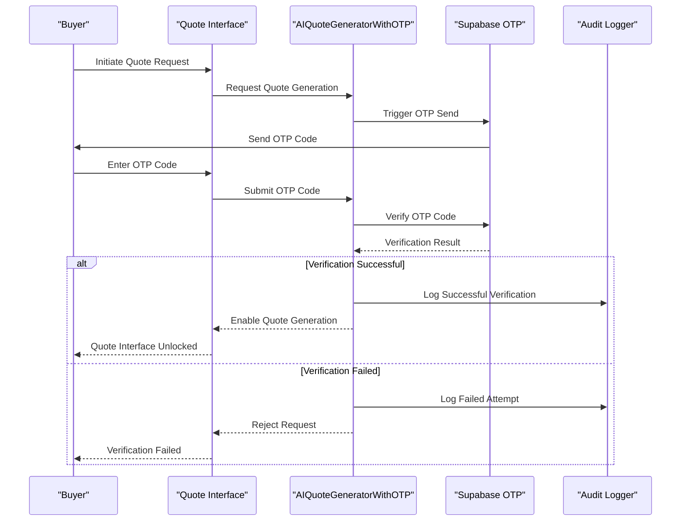
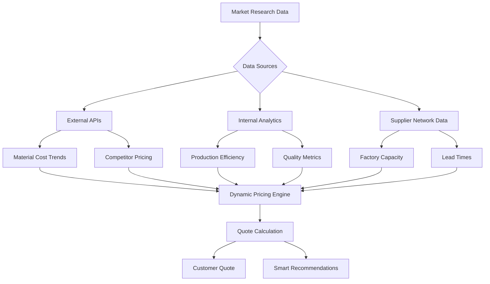
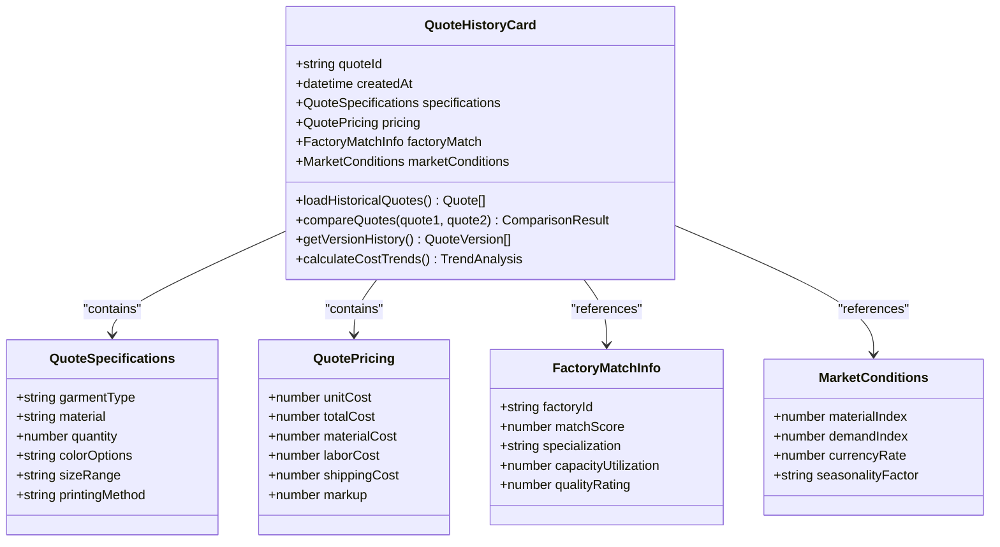
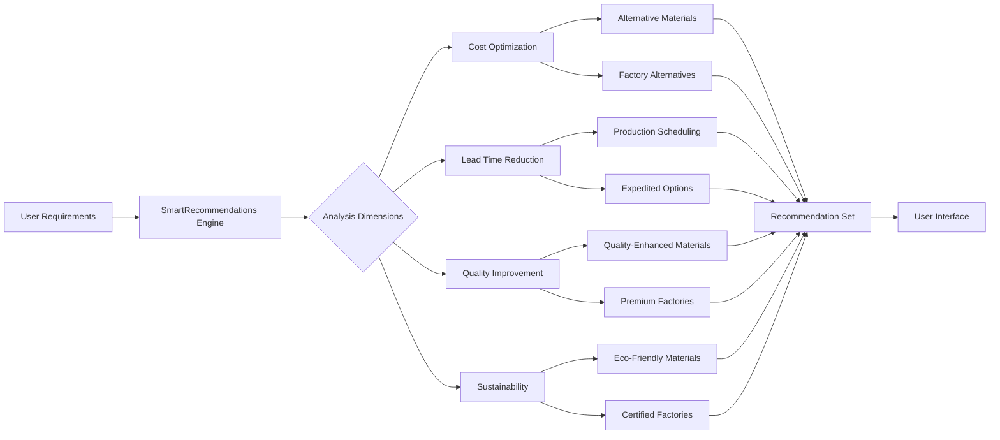
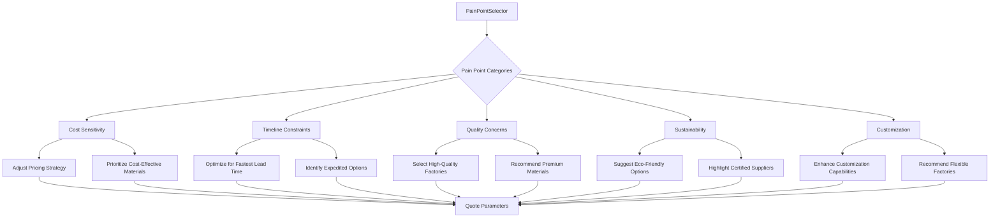

# Quote Components

<cite>
**Referenced Files in This Document**  
- [ConversationalQuoteBuilder.tsx](file://src/components/quote/ConversationalQuoteBuilder.tsx)
- [NaturalLanguageQuoteInput.tsx](file://src/components/quote/NaturalLanguageQuoteInput.tsx)
- [SmartFactoryMatcher.tsx](file://src/components/quote/SmartFactoryMatcher.tsx)
- [AIQuoteGeneratorWithOTP.tsx](file://src/components/AIQuoteGeneratorWithOTP.tsx)
- [MarketResearchInsights.tsx](file://src/components/quote/MarketResearchInsights.tsx)
- [QuoteHistoryCard.tsx](file://src/components/quote/QuoteHistoryCard.tsx)
- [SmartRecommendations.tsx](file://src/components/quote/SmartRecommendations.tsx)
- [PainPointSelector.tsx](file://src/components/quote/PainPointSelector.tsx)
</cite>

## Table of Contents
1. [Introduction](#introduction)
2. [Core Quote Generation Components](#core-quote-generation-components)
3. [OTP Verification Workflow](#otp-verification-workflow)
4. [Market Research Integration](#market-research-integration)
5. [Quote Comparison and Historical Tracking](#quote-comparison-and-historical-tracking)
6. [Smart Recommendations and Material Suggestions](#smart-recommendations-and-material-suggestions)
7. [Customer Requirement Capture](#customer-requirement-capture)
8. [Conclusion](#conclusion)

## Introduction
This document provides comprehensive documentation for the AI-powered quote generation system in the SleekApp platform. The system enables buyers to generate accurate, personalized quotes through conversational interfaces, natural language input, and intelligent factory matching. The documentation covers the core components, security workflows, market research integration, historical tracking, and smart recommendation features that make up the advanced quoting system.

## Core Quote Generation Components

The AI-powered quote generation system consists of several interconnected components that work together to provide an intuitive and intelligent quoting experience. The primary components include ConversationalQuoteBuilder, NaturalLanguageQuoteInput, and SmartFactoryMatcher, which collectively enable users to specify their requirements through natural interaction patterns.

**Section sources**
- [ConversationalQuoteBuilder.tsx](file://src/components/quote/ConversationalQuoteBuilder.tsx#L1-L150)
- [NaturalLanguageQuoteInput.tsx](file://src/components/quote/NaturalLanguageQuoteInput.tsx#L1-L120)
- [SmartFactoryMatcher.tsx](file://src/components/quote/SmartFactoryMatcher.tsx#L1-L130)

## OTP Verification Workflow

The AIQuoteGeneratorWithOTP component implements a secure verification workflow that ensures quote requests are initiated by legitimate users. When a user submits a quote request, the system triggers an OTP (One-Time Password) verification process through the Supabase authentication system. The OTP is sent via email or SMS, and the user must enter the code to proceed with quote generation. This security measure prevents automated scraping and ensures that quote generation resources are used appropriately.

The verification workflow integrates with Supabase functions including `send-otp` and `verify-otp`, which handle the generation, delivery, and validation of one-time passwords. Upon successful verification, the system unlocks full quote generation capabilities and records the verification event in the audit log for security monitoring.

**Diagram sources**
- [AIQuoteGeneratorWithOTP.tsx](file://src/components/AIQuoteGeneratorWithOTP.tsx#L25-L200)
- [supabase/functions/send-otp/index.ts](file://supabase/functions/send-otp/index.ts)
- [supabase/functions/verify-otp/index.ts](file://supabase/functions/verify-otp/index.ts)

**Section sources**
- [AIQuoteGeneratorWithOTP.tsx](file://src/components/AIQuoteGeneratorWithOTP.tsx#L1-L250)

## Market Research Integration

The MarketResearchInsights component integrates real-time market data into the quote generation process, allowing the system to provide competitive pricing and strategic recommendations. This component connects to external market research APIs and internal analytics data to gather information on material costs, production trends, competitor pricing, and demand patterns.

Market research data influences pricing calculations by adjusting base costs based on current market conditions. For example, if cotton prices have increased due to supply chain disruptions, the system automatically reflects this in quote calculations. The component also provides insights on optimal production timelines based on factory capacity utilization across the supplier network.

**Diagram sources**
- [MarketResearchInsights.tsx](file://src/components/quote/MarketResearchInsights.tsx#L15-L100)
- [supabase/functions/ai-market-research/index.ts](file://supabase/functions/ai-market-research/index.ts)

**Section sources**
- [MarketResearchInsights.tsx](file://src/components/quote/MarketResearchInsights.tsx#L1-L140)

## Quote Comparison and Historical Tracking

The QuoteHistoryCard component provides users with the ability to compare current quotes against historical quotes and track quote evolution over time. This feature enables buyers to identify pricing trends, evaluate cost savings, and make informed decisions based on historical data.

The system stores quote metadata including creation date, specifications, pricing breakdown, factory match scores, and market conditions at the time of generation. Users can compare multiple quotes side-by-side, with visual indicators highlighting cost differences, material changes, and lead time variations. The historical tracking also includes version history when quotes are revised based on changing requirements.

**Diagram sources**
- [QuoteHistoryCard.tsx](file://src/components/quote/QuoteHistoryCard.tsx#L20-L120)

**Section sources**
- [QuoteHistoryCard.tsx](file://src/components/quote/QuoteHistoryCard.tsx#L1-L150)

## Smart Recommendations and Material Suggestions

The SmartRecommendations component provides intelligent suggestions for alternative materials, factory matches, and design optimizations based on the user's requirements. These recommendations are generated using machine learning models that analyze historical quote data, factory performance metrics, material properties, and market trends.

When a user specifies requirements, the system evaluates multiple scenarios and suggests alternatives that could provide cost savings, faster production times, or improved quality. For example, if a user requests organic cotton, the system might suggest a recycled polyester blend that meets sustainability goals while reducing costs by 15-20%.

The recommendation engine considers factors such as material availability, factory expertise with specific materials, seasonal demand patterns, and minimum order quantity requirements. It also provides comparative analysis showing the trade-offs between different options in terms of cost, lead time, and quality.

**Diagram sources**
- [SmartRecommendations.tsx](file://src/components/quote/SmartRecommendations.tsx#L10-L90)

**Section sources**
- [SmartRecommendations.tsx](file://src/components/quote/SmartRecommendations.tsx#L1-L110)

## Customer Requirement Capture

The PainPointSelector component enables users to identify and communicate their specific challenges and requirements through a structured selection process. Instead of requiring users to articulate complex manufacturing requirements in technical terms, this component presents common pain points in business language that non-experts can easily understand.

The selector categorizes pain points into areas such as cost sensitivity, timeline constraints, quality concerns, sustainability requirements, and customization complexity. When a user selects specific pain points, the system adjusts quote parameters to prioritize solutions that address those concerns. For example, selecting "tight timeline" triggers the system to prioritize factories with available capacity and expedited production options.

This approach ensures that the quote generation process captures the underlying business needs rather than just technical specifications, resulting in more relevant and actionable quotes. The selected pain points also influence the recommendation engine, factory matching algorithm, and pricing strategy.

**Diagram sources**
- [PainPointSelector.tsx](file://src/components/quote/PainPointSelector.tsx#L15-L80)

**Section sources**
- [PainPointSelector.tsx](file://src/components/quote/PainPointSelector.tsx#L1-L100)

## Conclusion
The AI-powered quote generation system in SleekApp represents a comprehensive solution that combines conversational interfaces, market intelligence, security verification, and smart recommendations to transform the apparel manufacturing quotation process. By integrating components like ConversationalQuoteBuilder, MarketResearchInsights, and SmartRecommendations, the system provides users with accurate, competitive, and personalized quotes that reflect current market conditions and business requirements. The OTP verification workflow ensures security and resource protection, while historical tracking and comparison features enable data-driven decision making. Together, these components create a powerful platform that simplifies complex manufacturing quotations for buyers while optimizing matches with capable suppliers.