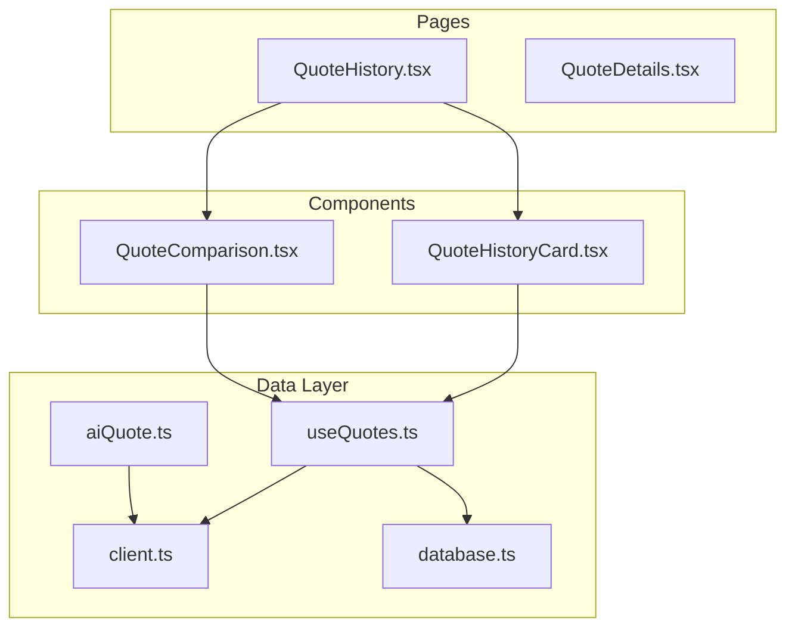
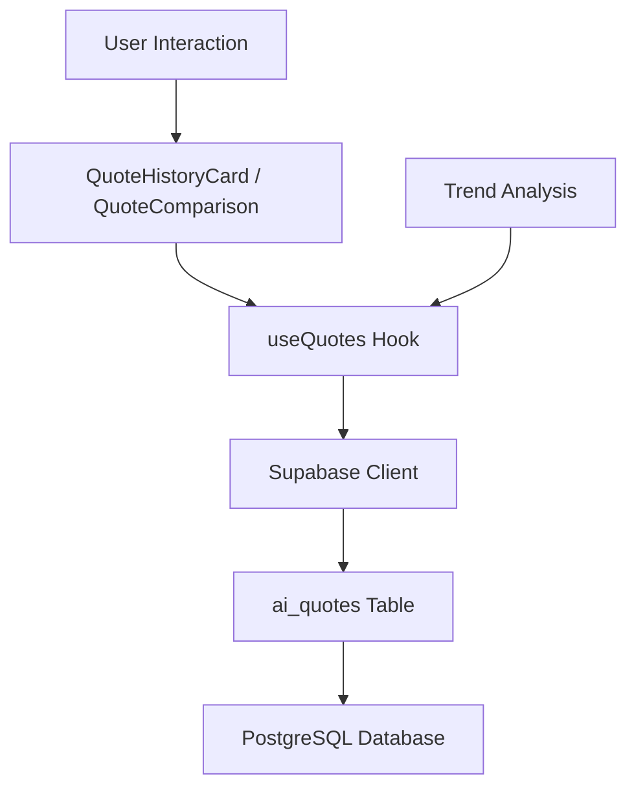
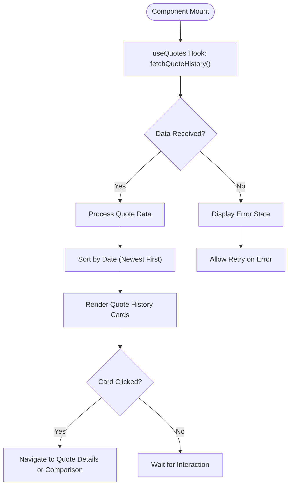
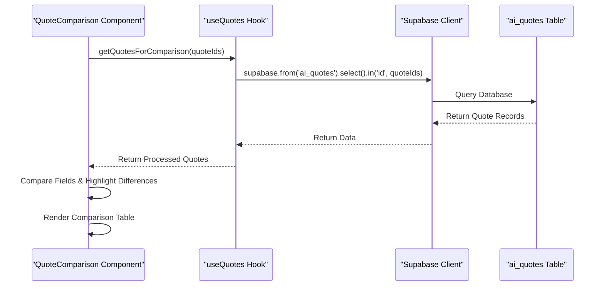
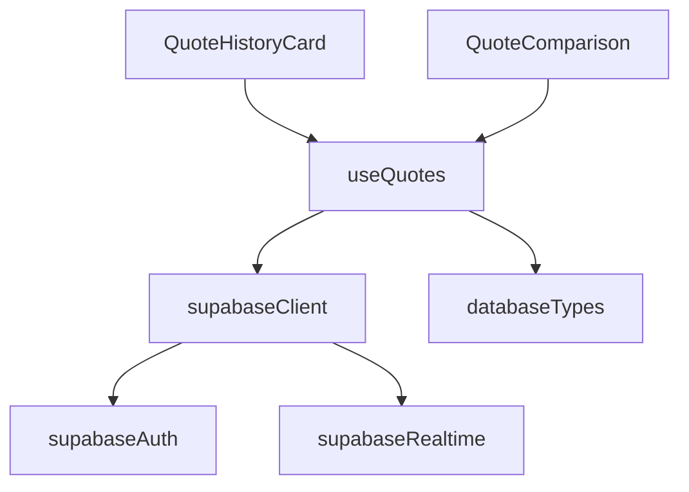

# Quote History and Comparison

<cite>
**Referenced Files in This Document**  
- [QuoteHistoryCard.tsx](file://src/components/quote/QuoteHistoryCard.tsx)
- [QuoteComparison.tsx](file://src/components/quote/QuoteComparison.tsx)
- [QuoteHistory.tsx](file://src/pages/QuoteHistory.tsx)
- [useQuotes.ts](file://src/hooks/useQuotes.ts)
- [client.ts](file://src/integrations/supabase/client.ts)
- [database.ts](file://src/types/database.ts)
- [aiQuote.ts](file://src/lib/api/aiQuote.ts)
</cite>

## Table of Contents
1. [Introduction](#introduction)
2. [Project Structure](#project-structure)
3. [Core Components](#core-components)
4. [Architecture Overview](#architecture-overview)
5. [Detailed Component Analysis](#detailed-component-analysis)
6. [Dependency Analysis](#dependency-analysis)
7. [Performance Considerations](#performance-considerations)
8. [Troubleshooting Guide](#troubleshooting-guide)
9. [Conclusion](#conclusion)

## Introduction
This document provides comprehensive documentation for the quote history tracking and comparison features within the SleekApparels platform. It details the implementation of the `QuoteHistoryCard` and `QuoteComparison` components, explains how historical quote data is retrieved from the `ai_quotes` table via the Supabase client, and describes the schema used to store quotes. The document also covers how historical data supports trend analysis, visualizes differences in pricing, timelines, and specifications, and outlines the user flow for accessing past quotes and generating comparisons.

## Project Structure
The quote history and comparison functionality is organized under the `src/components/quote` directory, with related pages in `src/pages`. The data layer is managed through Supabase integration in `src/integrations/supabase`, while business logic and state management are handled by custom hooks in `src/hooks`. Types and database schema definitions reside in `src/types`, ensuring type safety across the application.

**Diagram sources**
- [QuoteHistoryCard.tsx](file://src/components/quote/QuoteHistoryCard.tsx)
- [QuoteComparison.tsx](file://src/components/quote/QuoteComparison.tsx)
- [QuoteHistory.tsx](file://src/pages/QuoteHistory.tsx)
- [useQuotes.ts](file://src/hooks/useQuotes.ts)
- [client.ts](file://src/integrations/supabase/client.ts)
- [database.ts](file://src/types/database.ts)

**Section sources**
- [src/components/quote](file://src/components/quote)
- [src/pages](file://src/pages)
- [src/hooks](file://src/hooks)
- [src/integrations/supabase](file://src/integrations/supabase)
- [src/types](file://src/types)

## Core Components
The core components for quote history and comparison are `QuoteHistoryCard` and `QuoteComparison`. These components enable users to view their past quotes and compare multiple quotes side-by-side to evaluate differences in pricing, production timelines, material specifications, and other key parameters. Both components rely on data fetched from the `ai_quotes` table through the Supabase client, using the `useQuotes` hook for state management and data retrieval.

**Section sources**
- [QuoteHistoryCard.tsx](file://src/components/quote/QuoteHistoryCard.tsx)
- [QuoteComparison.tsx](file://src/components/quote/QuoteComparison.tsx)
- [useQuotes.ts](file://src/hooks/useQuotes.ts)

## Architecture Overview
The quote history and comparison system follows a layered architecture with clear separation between UI components, business logic, and data access layers. The frontend components render quote data and handle user interactions, while the `useQuotes` custom hook manages data fetching, caching, and state synchronization. All data is persisted in the Supabase PostgreSQL database, specifically in the `ai_quotes` table, which stores comprehensive quote details including pricing, specifications, and metadata.

**Diagram sources**
- [QuoteHistoryCard.tsx](file://src/components/quote/QuoteHistoryCard.tsx)
- [QuoteComparison.tsx](file://src/components/quote/QuoteComparison.tsx)
- [useQuotes.ts](file://src/hooks/useQuotes.ts)
- [client.ts](file://src/integrations/supabase/client.ts)
- [database.ts](file://src/types/database.ts)

## Detailed Component Analysis

### QuoteHistoryCard Analysis
The `QuoteHistoryCard` component displays a summary of past quotes, allowing users to quickly access their quote history. It renders key information such as quote ID, creation date, total price, and status. Users can click on individual cards to view detailed quote information or initiate a comparison with other quotes.

**Diagram sources**
- [QuoteHistoryCard.tsx](file://src/components/quote/QuoteHistoryCard.tsx)
- [useQuotes.ts](file://src/hooks/useQuotes.ts)

**Section sources**
- [QuoteHistoryCard.tsx](file://src/components/quote/QuoteHistoryCard.tsx#L1-L150)

### QuoteComparison Analysis
The `QuoteComparison` component enables side-by-side comparison of multiple quotes, highlighting differences in pricing, timelines, and specifications. It fetches selected quotes from the `ai_quotes` table and presents them in a tabular format with visual indicators for variations between quotes.

**Diagram sources**
- [QuoteComparison.tsx](file://src/components/quote/QuoteComparison.tsx)
- [useQuotes.ts](file://src/hooks/useQuotes.ts)
- [client.ts](file://src/integrations/supabase/client.ts)

**Section sources**
- [QuoteComparison.tsx](file://src/components/quote/QuoteComparison.tsx#L1-L200)

## Dependency Analysis
The quote history and comparison features depend on several core modules within the application. The components rely on the Supabase client for data access, the `useQuotes` hook for business logic, and type definitions from the database schema. These dependencies ensure type safety, efficient data retrieval, and consistent state management across the application.

**Diagram sources**
- [useQuotes.ts](file://src/hooks/useQuotes.ts)
- [client.ts](file://src/integrations/supabase/client.ts)
- [database.ts](file://src/types/database.ts)

**Section sources**
- [useQuotes.ts](file://src/hooks/useQuotes.ts#L1-L100)
- [client.ts](file://src/integrations/supabase/client.ts#L1-L50)

## Performance Considerations
The quote history and comparison system is optimized for performance through several mechanisms:
- Data fetching is handled through the `useQuotes` hook with built-in caching to minimize redundant database queries
- The Supabase client uses efficient queries with appropriate indexing on the `ai_quotes` table
- Large quote datasets are paginated to improve load times
- Comparison operations are performed client-side after initial data retrieval to reduce server load
- Component memoization prevents unnecessary re-renders during user interactions

[No sources needed since this section provides general guidance]

## Troubleshooting Guide
Common issues with quote history and comparison functionality typically relate to data retrieval or display. The system includes error handling for failed database queries, network issues, and invalid quote selections. Users can refresh data or retry failed operations through UI controls.

**Section sources**
- [useQuotes.ts](file://src/hooks/useQuotes.ts#L50-L80)
- [QuoteHistoryCard.tsx](file://src/components/quote/QuoteHistoryCard.tsx#L100-L120)
- [QuoteComparison.tsx](file://src/components/quote/QuoteComparison.tsx#L150-L180)

## Conclusion
The quote history tracking and comparison features provide valuable functionality for users to review past quotes and make informed decisions when selecting manufacturing partners. By leveraging the Supabase backend and a well-structured frontend architecture, the system delivers reliable access to historical quote data and powerful comparison tools that highlight key differences in pricing, timelines, and specifications. The modular design ensures maintainability and scalability as additional features are added to the platform.

[No sources needed since this section summarizes without analyzing specific files]