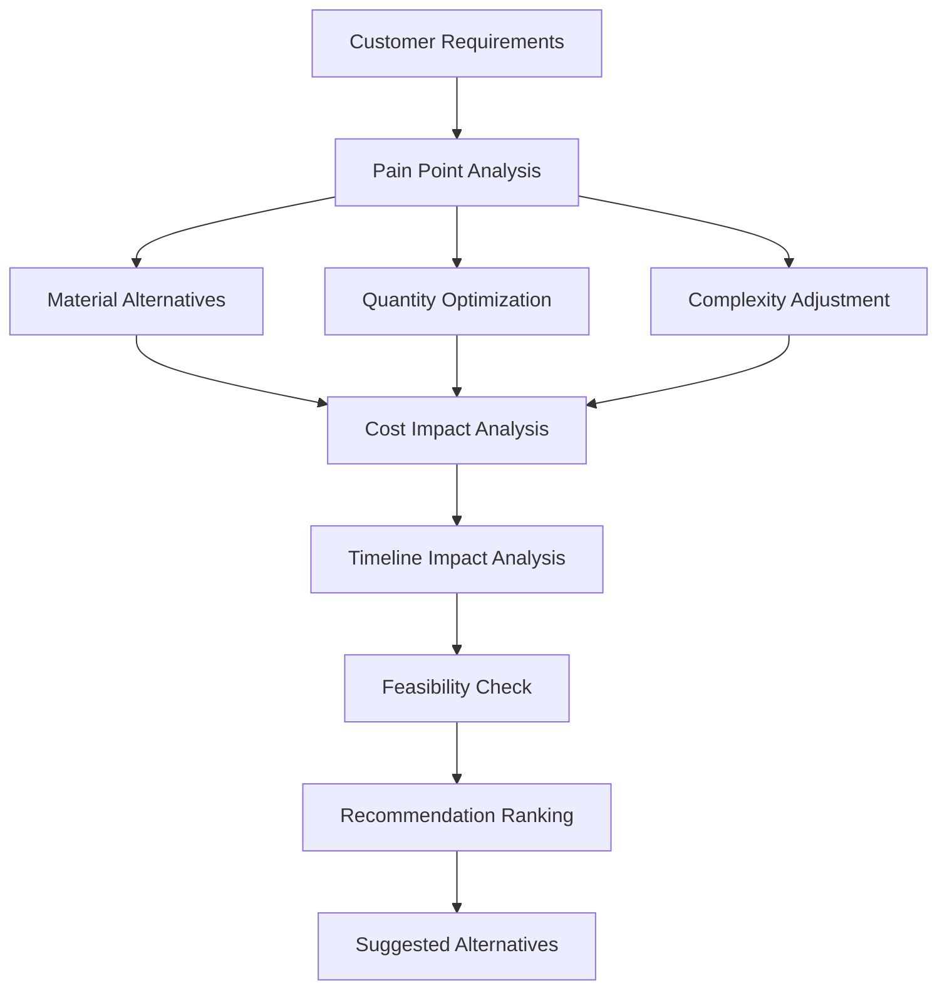
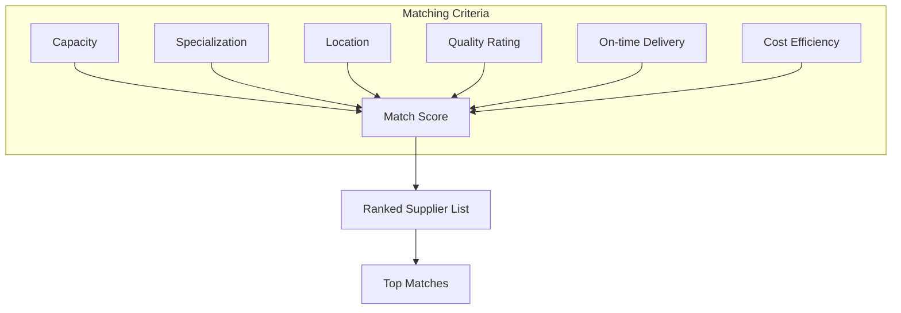
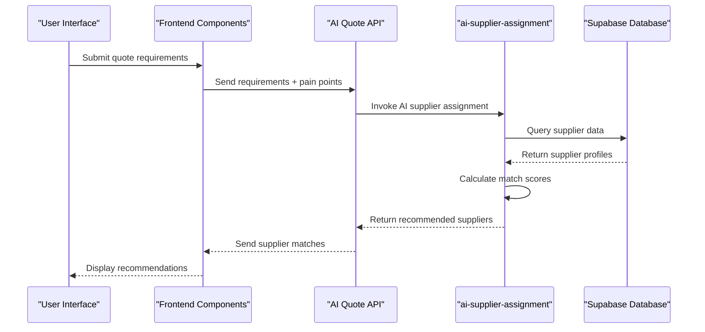

# Smart Recommendations and Factory Matching

<cite>
**Referenced Files in This Document**
- [SmartRecommendations.tsx](file://src/components/quote/SmartRecommendations.tsx)
- [SmartFactoryMatcher.tsx](file://src/components/quote/SmartFactoryMatcher.tsx)
- [PainPointSelector.tsx](file://src/components/quote/PainPointSelector.tsx)
- [ai-supplier-assignment/index.ts](file://supabase/functions/ai-supplier-assignment/index.ts)
- [aiQuote.ts](file://src/lib/api/aiQuote.ts)
</cite>

## Table of Contents
1. [Introduction](#introduction)
2. [Core Components Overview](#core-components-overview)
3. [PainPointSelector: Capturing Customer Requirements](#painpointselector-capturing-customer-requirements)
4. [SmartRecommendations: Alternative Suggestions Engine](#smartrecommendations-alternative-suggestions-engine)
5. [SmartFactoryMatcher: Intelligent Supplier Assignment](#smartfactorymatcher-intelligent-supplier-assignment)
6. [Integration with ai-supplier-assignment Function](#integration-with-ai-supplier-assignment-function)
7. [Recommendation Scenarios and User Actions](#recommendation-scenarios-and-user-actions)
8. [Conclusion](#conclusion)

## Introduction
This document provides comprehensive documentation for the SmartRecommendations and SmartFactoryMatcher components within the SleekApparels platform. These systems work together to deliver intelligent product and supplier recommendations by analyzing customer requirements, pain points, and business constraints. The documentation details how the PainPointSelector captures customer needs, how alternative materials, quantities, and complexity levels are suggested to optimize pricing and timelines, and how factories are matched based on capacity, specialization, and location.

## Core Components Overview
The recommendation system consists of three primary components that work in concert:
- **PainPointSelector**: Captures customer requirements and constraints
- **SmartRecommendations**: Generates alternative suggestions for materials, quantities, and complexity
- **SmartFactoryMatcher**: Matches quotes with optimal suppliers based on multiple criteria

These components integrate with backend AI functions to provide intelligent, data-driven recommendations that balance customer needs with production feasibility.

**Section sources**
- [SmartRecommendations.tsx](file://src/components/quote/SmartRecommendations.tsx)
- [SmartFactoryMatcher.tsx](file://src/components/quote/SmartFactoryMatcher.tsx)
- [PainPointSelector.tsx](file://src/components/quote/PainPointSelector.tsx)

## PainPointSelector: Capturing Customer Requirements
The PainPointSelector component serves as the primary interface for capturing customer requirements and constraints during the quoting process. It identifies key pain points that influence the recommendation logic, including:
- Budget constraints
- Timeline requirements
- Quality expectations
- Minimum order quantity needs
- Sustainability preferences
- Technical complexity tolerance

By systematically capturing these pain points, the system can tailor recommendations to address specific customer concerns while optimizing for business objectives.

The selector uses a combination of explicit user input and implicit behavioral analysis to determine priority factors that influence subsequent recommendations. This information becomes the foundation for the SmartRecommendations engine's decision-making process.

**Section sources**
- [PainPointSelector.tsx](file://src/components/quote/PainPointSelector.tsx)

## SmartRecommendations: Alternative Suggestions Engine
The SmartRecommendations component implements an algorithm that suggests alternative materials, quantities, or complexity levels to optimize pricing and timelines. The recommendation engine evaluates multiple factors:

**Diagram sources**
- [SmartRecommendations.tsx](file://src/components/quote/SmartRecommendations.tsx)
- [aiQuote.ts](file://src/lib/api/aiQuote.ts)

The algorithm considers:
- Material substitution options that maintain quality while reducing cost
- Economies of scale at different order quantities
- Simplification opportunities for complex designs
- Lead time implications of various choices
- Supplier capability constraints

Recommendations are ranked based on how well they address the customer's primary pain points while maintaining profitability and feasibility.

**Section sources**
- [SmartRecommendations.tsx](file://src/components/quote/SmartRecommendations.tsx)

## SmartFactoryMatcher: Intelligent Supplier Assignment
The SmartFactoryMatcher component evaluates potential suppliers based on multiple criteria to ensure optimal factory matching:

**Diagram sources**
- [SmartFactoryMatcher.tsx](file://src/components/quote/SmartFactoryMatcher.tsx)

Key matching factors include:
- Current production capacity and availability
- Specialization in specific garment types or techniques
- Geographic location and shipping implications
- Historical quality performance
- Cost structure and pricing competitiveness
- Lead time capabilities
- Minimum order quantity requirements

The matcher generates a ranked list of suitable suppliers, with transparency into the factors influencing each ranking.

**Section sources**
- [SmartFactoryMatcher.tsx](file://src/components/quote/SmartFactoryMatcher.tsx)

## Integration with ai-supplier-assignment Function
The frontend components integrate with the backend ai-supplier-assignment function through a well-defined API contract:

**Diagram sources**
- [ai-supplier-assignment/index.ts](file://supabase/functions/ai-supplier-assignment/index.ts)
- [aiQuote.ts](file://src/lib/api/aiQuote.ts)

The integration enables:
- Real-time supplier matching based on current capacity
- Dynamic adjustment to market conditions
- Learning from historical assignment outcomes
- Consistent application of business rules across assignments

The function processes supplier data, quote requirements, and pain point information to generate optimal matches that balance customer needs with operational constraints.

**Section sources**
- [ai-supplier-assignment/index.ts](file://supabase/functions/ai-supplier-assignment/index.ts)
- [aiQuote.ts](file://src/lib/api/aiQuote.ts)

## Recommendation Scenarios and User Actions
The system handles various recommendation scenarios based on customer requirements:

### Scenario 1: Budget-Constrained Customer
When a customer prioritizes cost reduction:
- Suggest alternative materials with similar aesthetics but lower cost
- Recommend slightly higher quantities to leverage economies of scale
- Propose design simplifications that reduce production complexity
- Match with cost-efficient suppliers in optimal locations

### Scenario 2: Time-Sensitive Customer
When a customer requires accelerated timelines:
- Suggest readily available materials to reduce sourcing time
- Prioritize suppliers with immediate capacity
- Recommend standard designs over custom elements
- Identify regional suppliers to minimize shipping duration

### Scenario 3: Quality-Focused Customer
When a customer emphasizes quality:
- Recommend premium materials with proven performance
- Match with specialized suppliers known for high-quality output
- Suggest moderate order quantities to ensure attention to detail
- Highlight suppliers with strong quality control processes

Users can act on suggested alternatives through:
- One-click acceptance of recommended changes
- Side-by-side comparison of original vs. optimized options
- Customization of recommended parameters
- Direct communication with matched suppliers

The interface provides clear explanations of the benefits (cost savings, time reduction) and trade-offs of each recommendation.

**Section sources**
- [SmartRecommendations.tsx](file://src/components/quote/SmartRecommendations.tsx)
- [SmartFactoryMatcher.tsx](file://src/components/quote/SmartFactoryMatcher.tsx)
- [PainPointSelector.tsx](file://src/components/quote/PainPointSelector.tsx)

## Conclusion
The SmartRecommendations and SmartFactoryMatcher system represents a sophisticated approach to intelligent quoting and supplier assignment. By capturing customer pain points through the PainPointSelector, generating optimized alternatives through SmartRecommendations, and matching with appropriate suppliers through SmartFactoryMatcher, the platform delivers value to both buyers and suppliers. The integration with the ai-supplier-assignment function ensures that recommendations are data-driven, consistent, and continuously improving based on real-world outcomes. This comprehensive system enables customers to make informed decisions while optimizing for their primary business objectives.