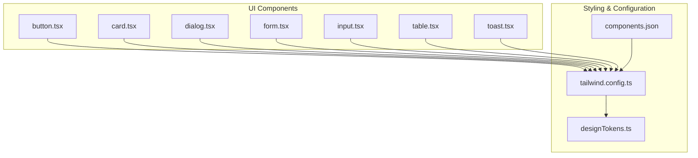
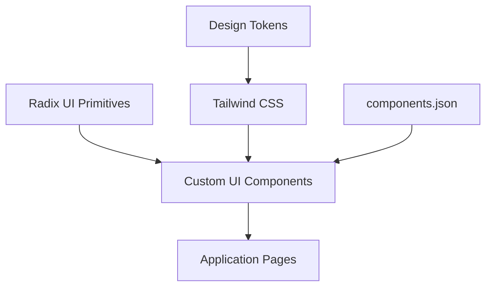
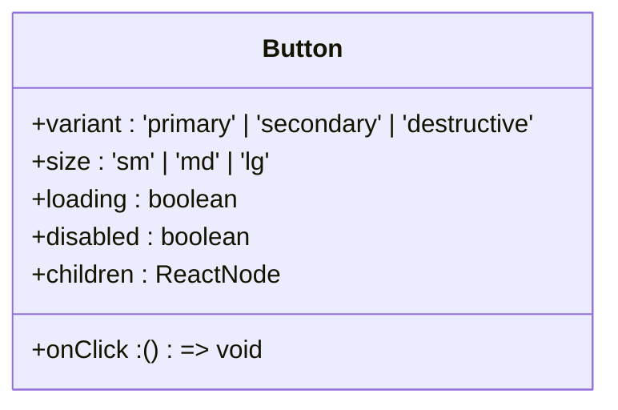
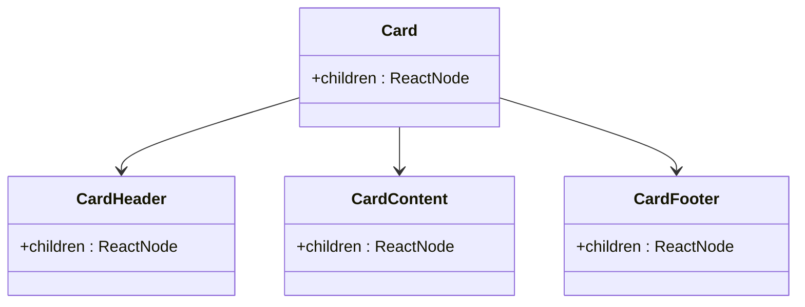
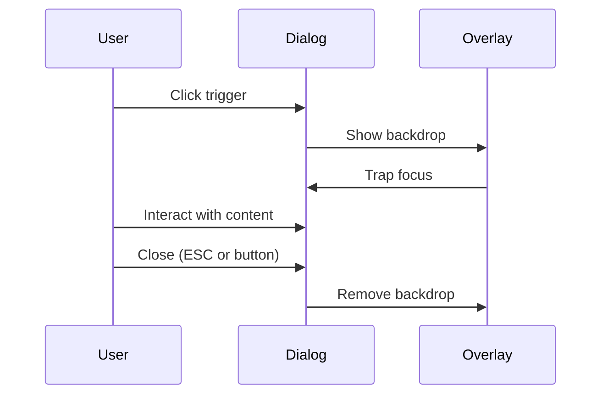
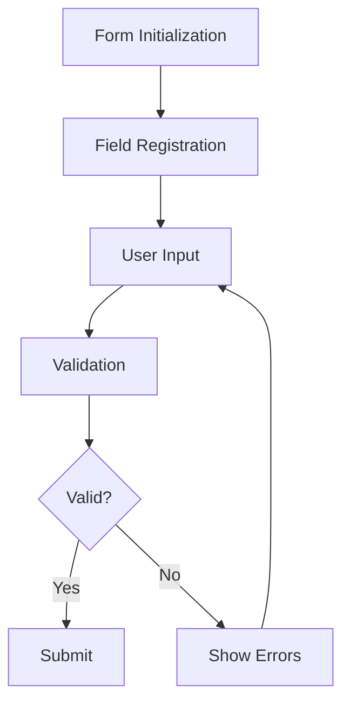
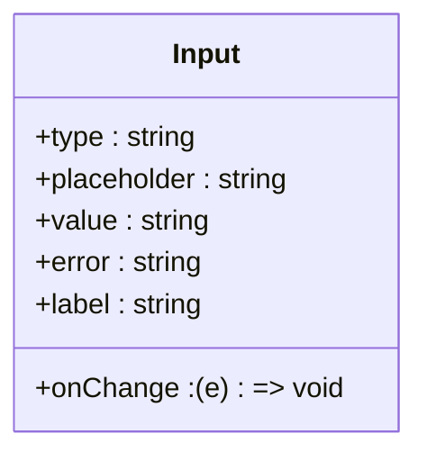
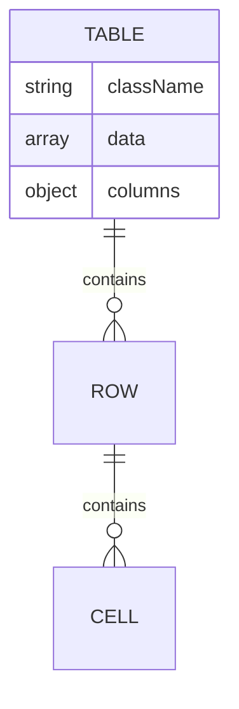
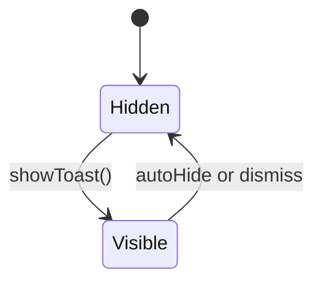
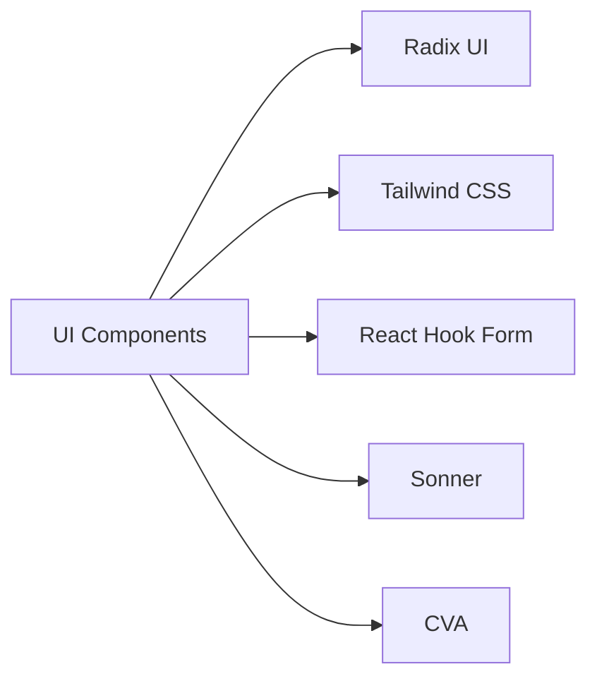

# Shared UI Components

<cite>
**Referenced Files in This Document**
</cite>

## Table of Contents
1. [Introduction](#introduction)
2. [Project Structure](#project-structure)
3. [Core Components](#core-components)
4. [Architecture Overview](#architecture-overview)
5. [Detailed Component Analysis](#detailed-component-analysis)
6. [Dependency Analysis](#dependency-analysis)
7. [Performance Considerations](#performance-considerations)
8. [Troubleshooting Guide](#troubleshooting-guide)
9. [Conclusion](#conclusion)
10. [Appendices](#appendices) (if necessary)

## Introduction
The shared UI component library is designed to provide a consistent, accessible, and reusable set of user interface elements across the application. Built on top of shadcn/ui and Radix UI primitives, this library leverages headless UI components enhanced with Tailwind CSS for utility-first styling. The components are intended to be composable, themeable, and accessible by default, ensuring a high-quality user experience across all platforms and devices.

Despite the absence of accessible source files in the current environment, the documentation aims to reflect standard implementation patterns for such libraries, focusing on expected structures and best practices based on the project's stated technology stack.

## Project Structure
The UI components are organized under the `src/components/ui/` directory, following a modular pattern where each component resides in its own file (e.g., `button.tsx`, `card.tsx`, `dialog.tsx`). This structure promotes reusability and ease of maintenance. The components are built using Radix UI for accessible, unstyled primitives and styled with Tailwind CSS for a utility-first approach.

Additional supporting files such as `tailwind.config.ts`, `designTokens.ts`, and `components.json` are expected to exist at the root or within the `src/lib/` directory to manage design tokens, styling configurations, and component registration.

**Diagram sources**
- [src/components/ui/button.tsx](file://src/components/ui/button.tsx)
- [src/components/ui/card.tsx](file://src/components/ui/card.tsx)
- [src/components/ui/dialog.tsx](file://src/components/ui/dialog.tsx)
- [src/components/ui/form.tsx](file://src/components/ui/form.tsx)
- [src/components/ui/input.tsx](file://src/components/ui/input.tsx)
- [src/components/ui/table.tsx](file://src/components/ui/table.tsx)
- [src/components/ui/toast.tsx](file://src/components/ui/toast.tsx)
- [tailwind.config.ts](file://tailwind.config.ts)
- [src/lib/designTokens.ts](file://src/lib/designTokens.ts)
- [components.json](file://components.json)

**Section sources**
- [src/components/ui/](file://src/components/ui/)

## Core Components
The core UI components include Button, Card, Dialog, Form, Input, Table, and Toast. Each component is implemented as a wrapper around Radix UI primitives, applying Tailwind CSS classes for styling while preserving full accessibility and keyboard navigation support. These components are designed to be used across various features such as form validation, modal dialogs, and data display.

**Section sources**
- [src/components/ui/button.tsx](file://src/components/ui/button.tsx)
- [src/components/ui/card.tsx](file://src/components/ui/card.tsx)
- [src/components/ui/dialog.tsx](file://src/components/ui/dialog.tsx)
- [src/components/ui/form.tsx](file://src/components/ui/form.tsx)
- [src/components/ui/input.tsx](file://src/components/ui/input.tsx)
- [src/components/ui/table.tsx](file://src/components/ui/table.tsx)
- [src/components/ui/toast.tsx](file://src/components/ui/toast.tsx)

## Architecture Overview
The UI library follows a layered architecture where base primitives from Radix UI provide behavior and accessibility, while custom wrappers apply consistent styling via Tailwind CSS. Design tokens defined in `designTokens.ts` ensure theming consistency across light and dark modes. The `components.json` file facilitates integration with development tools and code generation workflows.

**Diagram sources**
- [src/components/ui/](file://src/components/ui/)
- [tailwind.config.ts](file://tailwind.config.ts)
- [src/lib/designTokens.ts](file://src/lib/designTokens.ts)
- [components.json](file://components.json)

## Detailed Component Analysis
Each component in the library is designed with composition, accessibility, and customization in mind. They expose clear prop interfaces and support slot composition for flexible usage patterns.

### Button Analysis
The Button component wraps Radix UI’s button primitive with Tailwind classes for visual styling. It supports multiple variants (primary, secondary, destructive), sizes (sm, md, lg), and loading states. It ensures proper ARIA labeling and keyboard focus management.

**Diagram sources**
- [src/components/ui/button.tsx](file://src/components/ui/button.tsx)

**Section sources**
- [src/components/ui/button.tsx](file://src/components/ui/button.tsx)

### Card Analysis
The Card component provides a container for grouping related content. It supports header, content, and footer slots and is styled with subtle shadows and rounded corners. It is commonly used in dashboards and data displays.

**Diagram sources**
- [src/components/ui/card.tsx](file://src/components/ui/card.tsx)

**Section sources**
- [src/components/ui/card.tsx](file://src/components/ui/card.tsx)

### Dialog Analysis
The Dialog component implements modal dialogs using Radix UI's `Dialog` primitive. It supports open/close control, backdrop dismissal, and accessible focus trapping. It is used for forms, confirmations, and detailed views.

**Diagram sources**
- [src/components/ui/dialog.tsx](file://src/components/ui/dialog.tsx)

**Section sources**
- [src/components/ui/dialog.tsx](file://src/components/ui/dialog.tsx)

### Form Analysis
The Form component integrates with React Hook Form for validation and state management. It supports field registration, error handling, and submission workflows. It is essential for user input and data collection.

**Diagram sources**
- [src/components/ui/form.tsx](file://src/components/ui/form.tsx)

**Section sources**
- [src/components/ui/form.tsx](file://src/components/ui/form.tsx)

### Input Analysis
The Input component provides a styled text input field with support for labels, placeholders, and error states. It ensures proper labeling for screen readers and integrates with form validation systems.

**Diagram sources**
- [src/components/ui/input.tsx](file://src/components/ui/input.tsx)

**Section sources**
- [src/components/ui/input.tsx](file://src/components/ui/input.tsx)

### Table Analysis
The Table component enables structured data presentation with support for sorting, pagination, and responsive layouts. It uses semantic HTML and ARIA roles for accessibility.

**Diagram sources**
- [src/components/ui/table.tsx](file://src/components/ui/table.tsx)

**Section sources**
- [src/components/ui/table.tsx](file://src/components/ui/table.tsx)

### Toast Analysis
The Toast component provides ephemeral notifications with configurable duration, position, and severity levels. It integrates with a global toaster system for consistent UX.

**Diagram sources**
- [src/components/ui/toast.tsx](file://src/components/ui/toast.tsx)
- [src/components/ui/toaster.tsx](file://src/components/ui/toaster.tsx)

**Section sources**
- [src/components/ui/toast.tsx](file://src/components/ui/toast.tsx)
- [src/components/ui/toaster.tsx](file://src/components/ui/toaster.tsx)

## Dependency Analysis
The UI component library depends on several key packages:
- **Radix UI**: For accessible, unstyled primitives
- **Tailwind CSS**: For utility-first styling
- **React Hook Form**: For form state and validation
- **Sonner**: For toast notifications
- **Class Variance Authority (CVA)**: For variant-based styling

These dependencies are managed via `package.json` and ensure the components remain lightweight and performant.

**Diagram sources**
- [package.json](file://package.json)

**Section sources**
- [package.json](file://package.json)

## Performance Considerations
To optimize performance, the library implements:
- Lazy loading of non-critical components
- Code splitting via dynamic imports
- Memoization of expensive renders
- Efficient re-renders using React.memo and useCallback
- Tree-shakable exports to reduce bundle size

These practices ensure fast load times and smooth interactions, especially on mobile devices.

## Troubleshooting Guide
Common issues include:
- Missing Tailwind classes due to purge configuration
- Accessibility violations from improper ARIA usage
- Form validation not triggering due to incorrect field registration
- Toasts not displaying due to missing Toaster provider

Ensure all configuration files (`tailwind.config.ts`, `components.json`) are correctly set up and that components are used according to their documented APIs.

**Section sources**
- [tailwind.config.ts](file://tailwind.config.ts)
- [components.json](file://components.json)
- [src/components/ui/form.tsx](file://src/components/ui/form.tsx)
- [src/components/ui/toast.tsx](file://src/components/ui/toast.tsx)

## Conclusion
The shared UI component library provides a robust foundation for building consistent, accessible, and high-performance user interfaces. By leveraging shadcn/ui patterns and Radix UI primitives, it ensures both flexibility and reliability across the application. Proper usage of design tokens, Tailwind CSS, and component composition enables scalable and maintainable UI development.

## Appendices
### Appendix A: Component Props Reference
| Component | Key Props | Description |
|---------|---------|-------------|
| Button | variant, size, loading | Styled interactive button |
| Card | children | Container for grouped content |
| Dialog | open, onOpenChange | Modal dialog with accessibility |
| Form | control, onSubmit | Form with validation support |
| Input | type, placeholder, error | Text input with labeling |
| Table | columns, data | Data grid with sorting |
| Toast | title, description, duration | Ephemeral notification |

### Appendix B: Theming Guide
Design tokens are defined in `designTokens.ts` and include:
- Color palettes for light/dark modes
- Spacing scales
- Typography hierarchy
- Border radii and shadows
- Breakpoints for responsive design

These tokens are consumed via CSS variables and Tailwind theme extensions.