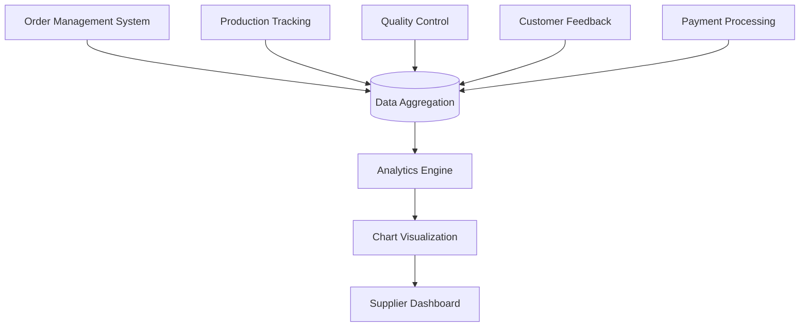

# Capacity Management and Performance Analytics

<cite>
**Referenced Files in This Document**  
- [FactoryCapacityManager.tsx](file://src/components/supplier/FactoryCapacityManager.tsx)
- [SupplierPerformanceMetrics.tsx](file://src/components/supplier/SupplierPerformanceMetrics.tsx)
- [FinancialDashboard.tsx](file://src/components/supplier/FinancialDashboard.tsx)
- [chart.tsx](file://src/components/ui/chart.tsx)
- [ModernSupplierDashboard.tsx](file://src/pages/ModernSupplierDashboard.tsx)
- [useFactoryCapacity.ts](file://src/hooks/useFactoryCapacity.ts)
- [usePerformance.ts](file://src/hooks/usePerformance.ts)
</cite>

## Table of Contents
1. [Introduction](#introduction)
2. [Factory Capacity Management](#factory-capacity-management)
3. [Supplier Performance Metrics](#supplier-performance-metrics)
4. [Financial Dashboard](#financial-dashboard)
5. [Data Aggregation and Visualization](#data-aggregation-and-visualization)
6. [Impact on Supplier Ranking and Order Allocation](#impact-on-supplier-ranking-and-order-allocation)
7. [Conclusion](#conclusion)

## Introduction
This document provides comprehensive documentation for the supplier operational analytics system within the SleekApparels platform. It details the core components that enable suppliers to manage production capacity, monitor performance metrics, and track financial outcomes. The system integrates real-time data visualization, intelligent recommendations, and marketplace feedback loops to optimize supplier operations and improve competitiveness.

## Factory Capacity Management

The FactoryCapacityManager component enables suppliers to visualize and manage their production capacity utilization and order assignment limits. Suppliers can view real-time capacity metrics, including available production hours, current workload percentage, and projected capacity for upcoming weeks. The system provides intelligent order recommendations based on current workload, historical performance, and production capabilities.

The capacity management system calculates optimal order assignments by analyzing multiple factors such as factory size, workforce availability, equipment capacity, and seasonal demand patterns. Suppliers receive alerts when approaching capacity limits and can adjust their availability settings accordingly. The interface includes visual indicators for peak periods, bottleneck warnings, and suggested capacity expansion opportunities.

**Section sources**
- [FactoryCapacityManager.tsx](file://src/components/supplier/FactoryCapacityManager.tsx)
- [useFactoryCapacity.ts](file://src/hooks/useFactoryCapacity.ts)

## Supplier Performance Metrics

The SupplierPerformanceMetrics component displays comprehensive performance data including quality scores, on-time delivery rates, and buyer satisfaction metrics. These metrics are aggregated from multiple sources such as order fulfillment records, quality inspection reports, and post-delivery feedback surveys.

Quality scores are calculated based on defect rates, compliance with specifications, and consistency across production batches. On-time delivery rates track the percentage of orders delivered within agreed timeframes, accounting for both production and shipping durations. Buyer satisfaction metrics incorporate ratings, review sentiment analysis, and repeat order frequency.

The performance dashboard uses color-coded indicators to highlight areas needing improvement and recognizes excellence through achievement badges. Historical trends are displayed to help suppliers identify performance patterns and measure the impact of process improvements over time.

**Section sources**
- [SupplierPerformanceMetrics.tsx](file://src/components/supplier/SupplierPerformanceMetrics.tsx)
- [usePerformance.ts](file://src/hooks/usePerformance.ts)

## Financial Dashboard

The FinancialDashboard component provides suppliers with comprehensive revenue tracking, payment history, and earnings analytics. The dashboard displays current earnings, pending payments, and historical revenue trends across different time periods. Detailed breakdowns show income by product category, buyer segment, and order size.

Payment history includes transaction dates, amounts, payment method, and status (processed, pending, or failed). Earnings analytics highlight profitability metrics, average order value, and commission rates. The system also projects future earnings based on confirmed orders and historical conversion rates.

Suppliers can export financial data for accounting purposes and set up payment threshold alerts. The dashboard integrates with external accounting systems through secure API connections, enabling seamless financial management.

**Section sources**
- [FinancialDashboard.tsx](file://src/components/supplier/FinancialDashboard.tsx)

## Data Aggregation and Visualization

The analytics system aggregates data from multiple sources including order management, production tracking, quality control, and customer feedback systems. This integrated approach provides a holistic view of supplier operations and marketplace performance.

Data visualization is powered by the chart.tsx component, which supports various chart types including line charts for trend analysis, bar charts for comparative metrics, and pie charts for distribution breakdowns. The visualization system emphasizes clarity and responsiveness, adapting to different screen sizes and data volumes.

Real-time data updates ensure that suppliers always have access to current information. The system implements data caching and incremental loading to maintain performance even with large datasets. Customizable date ranges and filtering options allow suppliers to focus on specific time periods or metric categories.

**Diagram sources**
- [chart.tsx](file://src/components/ui/chart.tsx)

**Section sources**
- [chart.tsx](file://src/components/ui/chart.tsx)

## Impact on Supplier Ranking and Order Allocation

Supplier performance data directly influences marketplace ranking and order allocation algorithms. The system uses a weighted scoring model that combines capacity utilization efficiency, quality metrics, delivery reliability, and financial stability to determine supplier rankings.

Higher-ranked suppliers receive preferential placement in search results and are automatically recommended for relevant orders through the SmartSupplierAssignment system. The ranking algorithm adjusts dynamically based on recent performance, giving suppliers opportunities to improve their standing through consistent excellence.

Order allocation considers both supplier capacity and performance history to ensure optimal matching between buyer requirements and supplier capabilities. Suppliers with strong performance metrics may receive larger order volumes and premium product assignments, creating positive incentives for continuous improvement.

The system provides transparency into ranking factors, allowing suppliers to understand how specific actions impact their marketplace position. Regular performance reviews highlight areas for development and suggest targeted improvement strategies.

**Section sources**
- [ModernSupplierDashboard.tsx](file://src/pages/ModernSupplierDashboard.tsx)
- [SupplierPerformanceMetrics.tsx](file://src/components/supplier/SupplierPerformanceMetrics.tsx)
- [FactoryCapacityManager.tsx](file://src/components/supplier/FactoryCapacityManager.tsx)

## Conclusion

The supplier operational analytics system provides a comprehensive suite of tools for capacity management, performance monitoring, and financial tracking. By integrating real-time data visualization with intelligent recommendations, the platform empowers suppliers to optimize their operations and enhance marketplace competitiveness. The transparent ranking system creates positive incentives for quality improvement and reliable performance, ultimately benefiting both suppliers and buyers within the ecosystem.