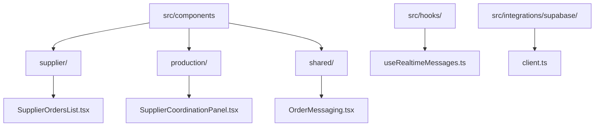
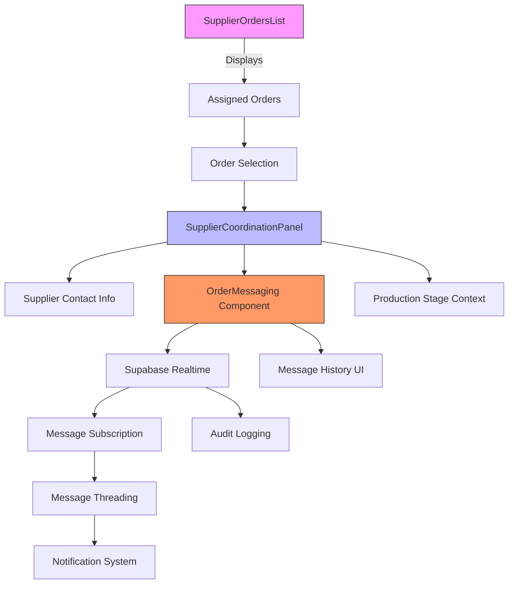
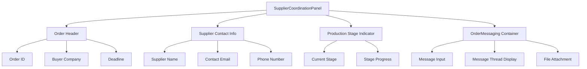
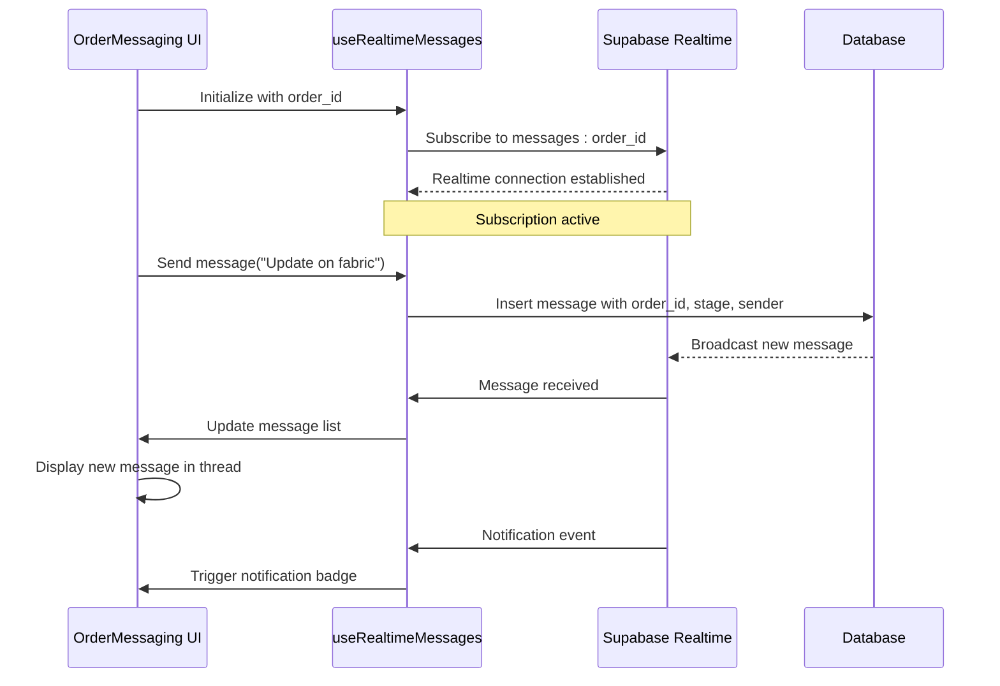
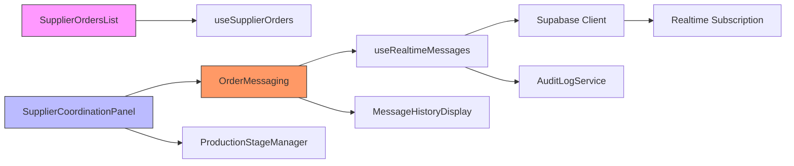

# Order Coordination and Communication

<cite>
**Referenced Files in This Document**  
- [SupplierOrdersList.tsx](file://src/components/supplier/SupplierOrdersList.tsx)
- [SupplierCoordinationPanel.tsx](file://src/components/production/SupplierCoordinationPanel.tsx)
- [OrderMessaging.tsx](file://src/components/shared/OrderMessaging.tsx)
- [useRealtimeMessages.ts](file://src/hooks/useRealtimeMessages.ts)
- [supabase/client.ts](file://src/integrations/supabase/client.ts)
- [types/order.ts](file://src/types/order.ts)
- [lib/supabaseHelpers.ts](file://src/lib/supabaseHelpers.ts)
</cite>

## Table of Contents
1. [Introduction](#introduction)
2. [Project Structure](#project-structure)
3. [Core Components](#core-components)
4. [Architecture Overview](#architecture-overview)
5. [Detailed Component Analysis](#detailed-component-analysis)
6. [Dependency Analysis](#dependency-analysis)
7. [Performance Considerations](#performance-considerations)
8. [Troubleshooting Guide](#troubleshooting-guide)
9. [Conclusion](#conclusion)

## Introduction
The supplier order coordination system enables seamless communication between suppliers and buyers throughout the production lifecycle. This document details the implementation of key components that facilitate order visibility, real-time messaging, and secure collaboration. The system centers around the SupplierOrdersList for order management, SupplierCoordinationPanel for contextual interaction, and OrderMessaging for real-time communication powered by Supabase subscriptions.

## Project Structure

**Diagram sources**
- [SupplierOrdersList.tsx](file://src/components/supplier/SupplierOrdersList.tsx)
- [SupplierCoordinationPanel.tsx](file://src/components/production/SupplierCoordinationPanel.tsx)
- [OrderMessaging.tsx](file://src/components/shared/OrderMessaging.tsx)
- [useRealtimeMessages.ts](file://src/hooks/useRealtimeMessages.ts)

**Section sources**
- [SupplierOrdersList.tsx](file://src/components/supplier/SupplierOrdersList.tsx)
- [SupplierCoordinationPanel.tsx](file://src/components/production/SupplierCoordinationPanel.tsx)

## Core Components

The supplier order coordination system consists of three primary components: SupplierOrdersList for viewing and filtering assigned orders, SupplierCoordinationPanel as a dedicated space for supplier-buyer interaction within the production context, and OrderMessaging which handles real-time communication. These components work together to provide a comprehensive communication layer tied to specific orders and production stages, ensuring all interactions are contextual, secure, and auditable.

**Section sources**
- [SupplierOrdersList.tsx](file://src/components/supplier/SupplierOrdersList.tsx)
- [SupplierCoordinationPanel.tsx](file://src/components/production/SupplierCoordinationPanel.tsx)
- [OrderMessaging.tsx](file://src/components/shared/OrderMessaging.tsx)

## Architecture Overview

**Diagram sources**
- [SupplierOrdersList.tsx](file://src/components/supplier/SupplierOrdersList.tsx)
- [SupplierCoordinationPanel.tsx](file://src/components/production/SupplierCoordinationPanel.tsx)
- [OrderMessaging.tsx](file://src/components/shared/OrderMessaging.tsx)
- [useRealtimeMessages.ts](file://src/hooks/useRealtimeMessages.ts)

## Detailed Component Analysis

### SupplierOrdersList Analysis

The SupplierOrdersList component serves as the entry point for suppliers to view and filter their assigned orders. It provides filtering capabilities by production stage, order status, and priority level. The component retrieves order data through Supabase queries and displays key information including order ID, buyer details, production timeline, and current status. Each order entry is clickable, leading to the detailed SupplierCoordinationPanel for that specific order.

**Section sources**
- [SupplierOrdersList.tsx](file://src/components/supplier/SupplierOrdersList.tsx)

### SupplierCoordinationPanel Analysis

**Diagram sources**
- [SupplierCoordinationPanel.tsx](file://src/components/production/SupplierCoordinationPanel.tsx)
- [types/order.ts](file://src/types/order.ts)

The SupplierCoordinationPanel provides a dedicated interface for supplier-buyer communication within the context of a specific production order. It displays supplier contact information prominently and integrates the OrderMessaging component for real-time interaction. The panel is contextualized with the current production stage, ensuring all communications are relevant to the ongoing manufacturing process.

**Section sources**
- [SupplierCoordinationPanel.tsx](file://src/components/production/SupplierCoordinationPanel.tsx)

### OrderMessaging Implementation

**Diagram sources**
- [OrderMessaging.tsx](file://src/components/shared/OrderMessaging.tsx)
- [useRealtimeMessages.ts](file://src/hooks/useRealtimeMessages.ts)
- [supabase/client.ts](file://src/integrations/supabase/client.ts)

The OrderMessaging component implements real-time communication using Supabase real-time subscriptions. When initialized with an order ID, it establishes a subscription to a dedicated channel for that order. Messages are automatically linked to both the specific order and current production stage, creating an auditable trail of communication. The system implements message threading with timestamps, sender identification, and read status indicators.

**Section sources**
- [OrderMessaging.tsx](file://src/components/shared/OrderMessaging.tsx)
- [useRealtimeMessages.ts](file://src/hooks/useRealtimeMessages.ts)

## Dependency Analysis

**Diagram sources**
- [SupplierOrdersList.tsx](file://src/components/supplier/SupplierOrdersList.tsx)
- [SupplierCoordinationPanel.tsx](file://src/components/production/SupplierCoordinationPanel.tsx)
- [OrderMessaging.tsx](file://src/components/shared/OrderMessaging.tsx)
- [useRealtimeMessages.ts](file://src/hooks/useRealtimeMessages.ts)
- [lib/supabaseHelpers.ts](file://src/lib/supabaseHelpers.ts)

The components depend on Supabase for real-time messaging and data persistence. The useRealtimeMessages hook abstracts the Supabase subscription logic, providing a clean interface to the OrderMessaging component. All messages are automatically tagged with order and production stage metadata, ensuring proper context and auditability.

**Section sources**
- [useRealtimeMessages.ts](file://src/hooks/useRealtimeMessages.ts)
- [supabase/client.ts](file://src/integrations/supabase/client.ts)
- [lib/supabaseHelpers.ts](file://src/lib/supabaseHelpers.ts)

## Performance Considerations

The messaging system is optimized for real-time performance with efficient Supabase subscription handling. Message history is paginated to prevent excessive data loading, and the UI implements virtualized scrolling for long message threads. The useRealtimeMessages hook includes connection state management to handle network interruptions gracefully, automatically resuming subscriptions when connectivity is restored.

## Troubleshooting Guide

Common issues include subscription timeouts and message delivery delays. The system includes built-in retry logic for failed message sends and connection recovery. Developers can monitor the Supabase dashboard for subscription health and message throughput. The audit logging system records all message operations for debugging and compliance purposes.

**Section sources**
- [useRealtimeMessages.ts](file://src/hooks/useRealtimeMessages.ts)
- [lib/supabaseHelpers.ts](file://src/lib/supabaseHelpers.ts)

## Conclusion

The supplier order coordination system provides a robust framework for secure, contextual communication between suppliers and buyers. By integrating real-time messaging with production context and comprehensive audit logging, the system ensures transparent and efficient collaboration throughout the manufacturing process. The architecture balances real-time responsiveness with data integrity and security requirements.