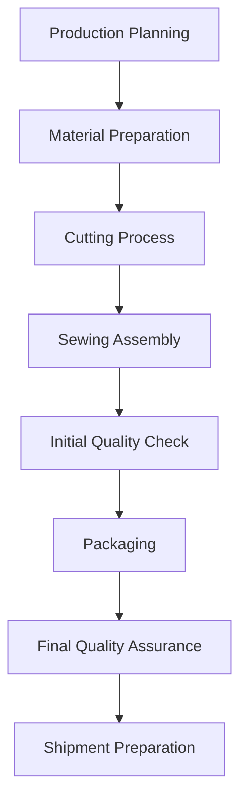
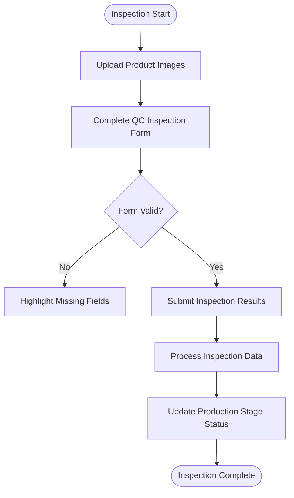
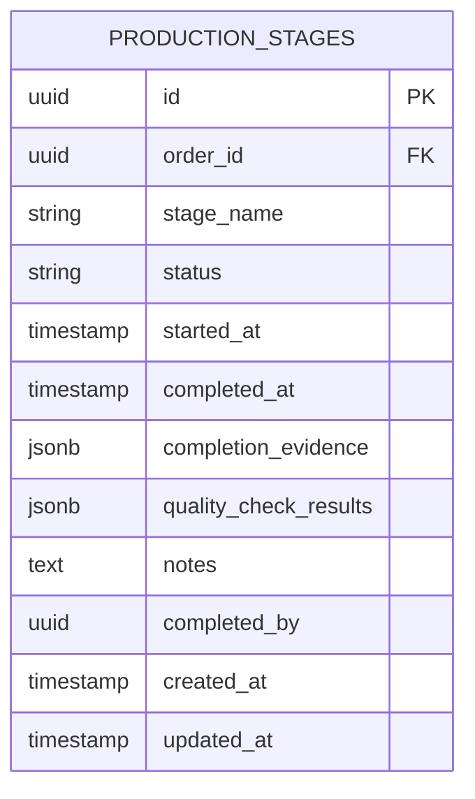

# Production Management Workflow

<cite>
**Referenced Files in This Document**
- [production_stages.sql](file://supabase/migrations/20251123052149_create_lead_capture_system.sql)
- [initialize-production-stages.ts](file://supabase/functions/initialize-production-stages/index.ts)
</cite>

## Table of Contents
1. [Introduction](#introduction)
2. [Production Workflow Overview](#production-workflow-overview)
3. [Production Stage Management](#production-stage-management)
4. [Quality Control Inspection Process](#quality-control-inspection-process)
5. [Database Schema and State Management](#database-schema-and-state-management)
6. [Real-time Synchronization and React Query Integration](#real-time-synchronization-and-react-query-integration)
7. [Status Transitions and Timestamp Tracking](#status-transitions-and-timestamp-tracking)
8. [Buyer-Facing Tracking Interface Integration](#buyer-facing-tracking-interface-integration)
9. [Conclusion](#conclusion)

## Introduction
This document provides comprehensive documentation for the supplier production workflow within the SleekApparel platform. The system centers around the LoopTrace™ manufacturing tracking framework, enabling suppliers to manage production progress through an 8-stage workflow with real-time synchronization. The documentation details the implementation of production management components, quality control processes, and database integration that power the end-to-end manufacturing tracking system.

## Production Workflow Overview
The LoopTrace™ production workflow consists of eight distinct manufacturing stages that track garment production from initial setup to final shipment. The workflow is designed to provide both suppliers and buyers with transparent, real-time visibility into production progress. Each stage represents a critical phase in the manufacturing process, with specific requirements and deliverables that must be completed before advancing to the next stage.

The workflow begins with production planning and progresses through material preparation, cutting, sewing, quality inspections, packaging, and final quality assurance before shipment. This structured approach ensures consistent quality control and enables accurate production forecasting and delay prediction through the system's AI-powered analytics.

**Section sources**
- [initialize-production-stages.ts](file://supabase/functions/initialize-production-stages/index.ts)

## Production Stage Management
The production stage management system enables suppliers to update progress across the 8-stage LoopTrace™ workflow. The system is initialized through a dedicated Supabase function that sets up the production stages for new orders, ensuring consistent workflow implementation across all manufacturing partners.

Each production stage contains specific requirements and documentation needs, with mandatory fields that must be completed before a stage can be marked as complete. The system enforces sequential progression through the workflow, preventing suppliers from skipping stages or marking future stages as complete prematurely.

The management interface provides suppliers with a clear visual representation of the current production status, highlighting completed stages, the current active stage, and upcoming stages in the workflow. This interface also displays relevant documentation requirements and deadlines for each stage.

**Diagram sources**
- [initialize-production-stages.ts](file://supabase/functions/initialize-production-stages/index.ts)

**Section sources**
- [initialize-production-stages.ts](file://supabase/functions/initialize-production-stages/index.ts)

## Quality Control Inspection Process
The quality control inspection process is a critical component of the production workflow, ensuring that garments meet the required quality standards at multiple points during manufacturing. The system implements a structured inspection framework that requires suppliers to document quality checks at designated stages in the production process.

The inspection process includes mandatory documentation requirements such as high-resolution images of the garments, detailed quality assessment forms, and approval signatures from quality control personnel. These requirements are enforced through the QC inspection system, which validates all submissions before accepting them into the production record.

For each inspection stage, suppliers must complete a comprehensive quality assessment that evaluates fabric quality, stitching integrity, dimensional accuracy, and overall garment appearance. The system also supports AI-powered quality scanning that can detect potential defects or inconsistencies in the submitted images.

## Database Schema and State Management
The production workflow is backed by a robust database schema that tracks the state of each production stage. The production_stages table serves as the central data store for manufacturing progress, containing fields for stage status, timestamps, completion evidence, and quality control documentation.

The schema includes comprehensive tracking fields that record when each stage was initiated, when it was completed, who completed it, and any relevant notes or observations. It also includes references to uploaded media files, inspection reports, and quality control documentation associated with each stage.

The database design supports both real-time status updates and historical tracking, enabling the system to provide detailed production analytics and performance metrics. This structure also facilitates audit trails and compliance reporting, which are essential for quality assurance and customer transparency.

**Diagram sources**
- [production_stages.sql](file://supabase/migrations/20251123052149_create_lead_capture_system.sql)

**Section sources**
- [production_stages.sql](file://supabase/migrations/20251123052149_create_lead_capture_system.sql)

## Real-time Synchronization and React Query Integration
The production management system utilizes React Query hooks to enable real-time synchronization between the supplier interface and the backend database. This integration ensures that production updates are immediately reflected across all connected systems and user interfaces.

React Query provides efficient data fetching, caching, and synchronization capabilities that minimize network requests while maintaining data consistency. The system implements optimized queries that retrieve only the necessary production data for the current view, reducing bandwidth usage and improving performance.

The integration also supports optimistic updates, allowing the interface to reflect changes immediately while the system processes the update in the background. This creates a responsive user experience while maintaining data integrity through proper error handling and rollback mechanisms.

When suppliers update production stages or submit quality control documentation, React Query handles the mutation process, automatically updating the local cache and synchronizing with the server. This ensures that all users viewing the same production order see consistent, up-to-date information.

## Status Transitions and Timestamp Tracking
The system implements comprehensive status tracking for each production stage, recording precise timestamps for key events in the manufacturing process. When a supplier begins a production stage, the system automatically records the start time. When the stage is marked as complete, the completion timestamp is recorded along with the user who completed the stage.

This timestamp data enables detailed production analytics, including cycle time calculations, bottleneck identification, and performance benchmarking. The system uses this data to generate predictive analytics that can forecast potential delays and suggest process improvements.

The status transition system enforces business rules that prevent invalid state changes, such as completing a stage before its predecessor or marking a stage as complete without the required documentation. Each status transition triggers appropriate notifications to relevant stakeholders, including buyers and internal operations teams.

## Buyer-Facing Tracking Interface Integration
The production updates made by suppliers are immediately reflected in buyer-facing tracking interfaces, providing customers with real-time visibility into the manufacturing status of their orders. The system transforms the detailed production data into a consumer-friendly format that highlights key milestones and estimated completion times.

Buyers can view a visual timeline of the production process, seeing which stages have been completed, which stage is currently in progress, and what remains to be done. The interface also displays quality control results and inspection images, giving buyers confidence in the manufacturing quality.

The integration ensures data consistency between the supplier management interface and the buyer tracking interface, with all updates synchronized in real-time. This transparency builds trust with customers and reduces the need for status inquiry communications, improving overall customer satisfaction.

## Conclusion
The supplier production workflow in the SleekApparel platform provides a comprehensive system for managing garment manufacturing through the LoopTrace™ 8-stage process. By combining a structured production framework with robust quality control processes and real-time synchronization, the system enables suppliers to efficiently manage production while providing buyers with transparent, up-to-date information about their orders.

The integration of React Query hooks with the production_stages database table ensures data consistency and real-time updates across all interfaces. The comprehensive timestamp tracking and status transition system provides valuable analytics for process optimization and delay prediction. Together, these components create a powerful production management ecosystem that enhances efficiency, quality, and customer satisfaction.