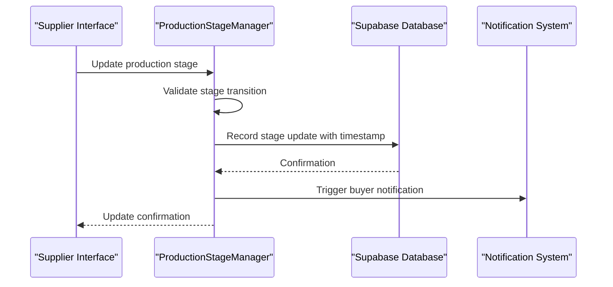
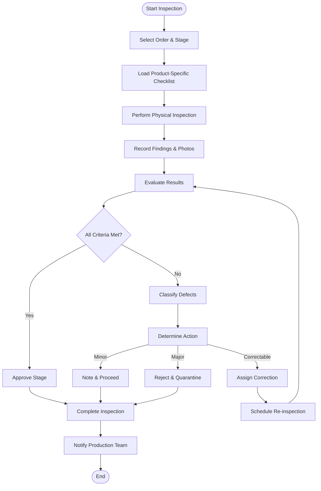
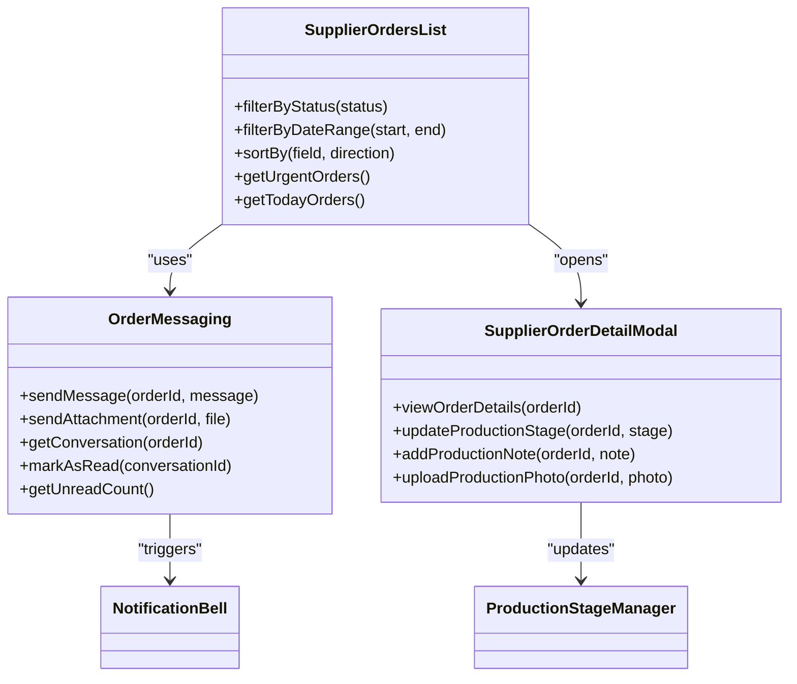
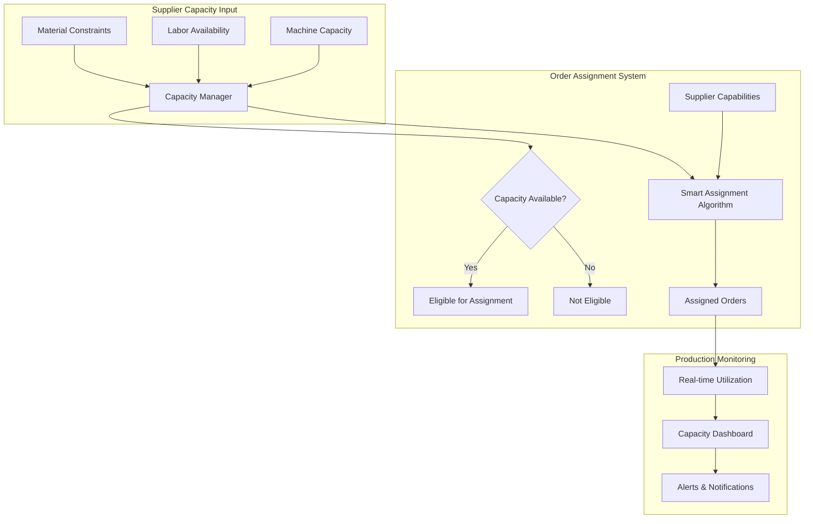

# Supplier Components

<cite>
**Referenced Files in This Document**  
- [AssignedQuotesPanel.tsx](file://src/components/supplier/AssignedQuotesPanel.tsx)
- [FactoryCapacityManager.tsx](file://src/components/supplier/FactoryCapacityManager.tsx)
- [FinancialDashboard.tsx](file://src/components/supplier/FinancialDashboard.tsx)
- [OrderMessaging.tsx](file://src/components/supplier/OrderMessaging.tsx)
- [ProductionManagementPanel.tsx](file://src/components/supplier/ProductionManagementPanel.tsx)
- [ProductionStageManager.tsx](file://src/components/supplier/ProductionStageManager.tsx)
- [QCInspectionForm.tsx](file://src/components/supplier/QCInspectionForm.tsx)
- [SupplierCoordinationPanel.tsx](file://src/components/production/SupplierCoordinationPanel.tsx)
- [SupplierOrdersList.tsx](file://src/components/supplier/SupplierOrdersList.tsx)
- [SupplierPerformanceMetrics.tsx](file://src/components/supplier/SupplierPerformanceMetrics.tsx)
- [SupplierProfile.tsx](file://src/components/supplier/SupplierProfile.tsx)
- [useSupplierOrders.ts](file://src/hooks/useSupplierOrders.ts)
- [useFactoryCapacity.ts](file://src/hooks/useFactoryCapacity.ts)
- [order.ts](file://src/types/order.ts)
- [database.ts](file://src/types/database.ts)
</cite>

## Table of Contents
1. [Introduction](#introduction)
2. [Supplier Profile Management](#supplier-profile-management)
3. [Production Management and Stage Updates](#production-management-and-stage-updates)
4. [Quality Control and Inspection](#quality-control-and-inspection)
5. [Supplier Orders and Messaging](#supplier-orders-and-messaging)
6. [Capacity and Order Assignment](#capacity-and-order-assignment)
7. [Performance and Financial Analytics](#performance-and-financial-analytics)
8. [Quote Management for Suppliers](#quote-management-for-suppliers)
9. [Conclusion](#conclusion)

## Introduction
This document provides comprehensive documentation for the supplier-specific components in the SleekApparels platform. It details the implementation of key features that enable suppliers to manage production, communicate with buyers, track orders, and optimize capacity. The components are designed to streamline supplier operations, enhance transparency in production workflows, and provide data-driven insights for performance improvement.

## Supplier Profile Management

The SupplierProfile component serves as the central hub for supplier identity and capability information. It allows suppliers to maintain their business details, certifications, production specialties, and factory information. The profile is used throughout the platform for supplier discovery, capability matching, and order assignment decisions.

The component integrates with the platform's authentication and verification systems to ensure supplier legitimacy and compliance with quality standards. It also displays performance metrics and ratings that are updated based on order fulfillment history and quality control outcomes.

**Section sources**
- [SupplierProfile.tsx](file://src/components/supplier/SupplierProfile.tsx#L1-L150)

## Production Management and Stage Updates

### Production Management Panel
The ProductionManagementPanel provides suppliers with a comprehensive view of all active production orders. It displays order timelines, current production stages, deadlines, and priority indicators. The panel enables suppliers to monitor progress across multiple orders simultaneously and identify potential bottlenecks.

### Production Stage Management
The ProductionStageManager component implements a structured workflow for updating production progress. It allows suppliers to advance orders through predefined stages such as Material Procurement, Cutting, Sewing, Quality Inspection, and Packaging. Each stage update triggers notifications to buyers and updates the order tracking system.

The component enforces validation rules to ensure stages are completed in the correct sequence and that required documentation is attached when necessary. It also captures timestamps for each stage transition, which are used for performance analytics and delivery predictions.



**Diagram sources**
- [ProductionStageManager.tsx](file://src/components/supplier/ProductionStageManager.tsx#L10-L80)
- [useSupplierOrders.ts](file://src/hooks/useSupplierOrders.ts#L25-L45)

**Section sources**
- [ProductionManagementPanel.tsx](file://src/components/supplier/ProductionManagementPanel.tsx#L1-L200)
- [ProductionStageManager.tsx](file://src/components/supplier/ProductionStageManager.tsx#L1-L120)

## Quality Control and Inspection

### QC Inspection Form
The QCInspectionForm component provides a structured interface for recording quality control checks at various production stages. It includes configurable checklists based on product type, defect categorization, photo documentation capabilities, and corrective action tracking.

The form captures detailed inspection data including measurements, defect types, severity levels, and resolution status. This data is used to generate quality reports, identify recurring issues, and calculate supplier performance metrics.

### Integration with Production Workflow
Quality inspections are integrated into the production stage workflow, with certain stages requiring successful QC approval before progression. The system supports both pass/fail outcomes and conditional approvals with notes, allowing for minor defects to be documented and addressed without halting production.



**Diagram sources**
- [QCInspectionForm.tsx](file://src/components/supplier/QCInspectionForm.tsx#L15-L90)
- [ProductionStageManager.tsx](file://src/components/supplier/ProductionStageManager.tsx#L45-L60)

**Section sources**
- [QCInspectionForm.tsx](file://src/components/supplier/QCInspectionForm.tsx#L1-L130)

## Supplier Orders and Messaging

### Supplier Orders List
The SupplierOrdersList component displays all orders assigned to a supplier with filtering and sorting capabilities. It shows order status, deadlines, production stage, priority level, and buyer information. The list provides quick access to order details, production updates, and communication channels.

The component uses real-time data synchronization to ensure suppliers see immediate updates when new orders are assigned or existing orders are modified. It also highlights urgent items and upcoming deadlines to help suppliers prioritize their workflow.

### Order Messaging System
The OrderMessaging component enables direct communication between suppliers and buyers regarding specific orders. It provides a threaded conversation interface attached to each order, ensuring all communications are contextually relevant and easily referenceable.

The messaging system supports text messages, file attachments (including production updates and QC photos), and automated notifications for production milestones. It also integrates with the supplier's notification preferences and availability settings.



**Diagram sources**
- [SupplierOrdersList.tsx](file://src/components/supplier/SupplierOrdersList.tsx#L20-L50)
- [OrderMessaging.tsx](file://src/components/supplier/OrderMessaging.tsx#L15-L40)
- [SupplierOrderDetailModal.tsx](file://src/components/supplier/SupplierOrderDetailModal.tsx#L10-L35)

**Section sources**
- [SupplierOrdersList.tsx](file://src/components/supplier/SupplierOrdersList.tsx#L1-L110)
- [OrderMessaging.tsx](file://src/components/supplier/OrderMessaging.tsx#L1-L95)

## Capacity and Order Assignment

### Factory Capacity Manager
The FactoryCapacityManager component enables suppliers to manage their production capacity across different product categories and time periods. Suppliers can input their available machine hours, labor capacity, and material constraints for various product types.

The system uses this capacity data to determine order assignment eligibility and to prevent overcommitment. It provides visual indicators of capacity utilization and alerts suppliers when approaching maximum capacity.

### Integration with Order Assignment
The capacity management system integrates with the smart supplier assignment algorithm, which considers both capability and availability when matching quotes to suppliers. Suppliers with appropriate certifications and sufficient available capacity are prioritized in the assignment process.

The component also supports capacity forecasting, allowing suppliers to plan for future production needs and adjust their availability accordingly.



**Diagram sources**
- [FactoryCapacityManager.tsx](file://src/components/supplier/FactoryCapacityManager.tsx#L25-L70)
- [useFactoryCapacity.ts](file://src/hooks/useFactoryCapacity.ts#L10-L40)

**Section sources**
- [FactoryCapacityManager.tsx](file://src/components/supplier/FactoryCapacityManager.tsx#L1-L140)
- [useFactoryCapacity.ts](file://src/hooks/useFactoryCapacity.ts#L1-L60)

## Performance and Financial Analytics

### Supplier Performance Metrics
The SupplierPerformanceMetrics component visualizes key performance indicators for suppliers, including on-time delivery rate, quality defect rate, production efficiency, and customer satisfaction scores.

The metrics are calculated from historical order data and updated in real-time as new production updates are recorded. The component provides trend analysis over time and benchmarking against industry standards.

### Financial Dashboard
The FinancialDashboard component provides suppliers with insights into their financial performance, including revenue by product category, profit margins, payment status, and outstanding invoices.

It integrates with the payment processing system to show payment timelines and provides forecasting tools for future revenue based on active orders and production schedules.

```mermaid
erDiagram
SUPPLIER ||--o{ ORDER : "has"
SUPPLIER ||--o{ PRODUCTION_STAGE : "manages"
SUPPLIER ||--o{ QC_INSPECTION : "performs"
SUPPLIER ||--o{ FINANCIAL_RECORD : "generates"
ORDER }|--|| ORDER_TYPE : "belongs to"
ORDER }|--|| BUYER : "from"
PRODUCTION_STAGE }|--|| STAGE_TYPE : "is"
QC_INSPECTION }|--|| DEFECT_TYPE : "identifies"
FINANCIAL_RECORD }|--|| PAYMENT_STATUS : "has"
class SUPPLIER {
string id PK
string name
string certification_level
datetime onboarding_date
}
class ORDER {
string id PK
string supplier_id FK
string buyer_id FK
string order_type_id FK
datetime deadline
enum status
decimal value
}
class PRODUCTION_STAGE {
string id PK
string order_id FK
string stage_type_id FK
datetime start_time
datetime end_time
boolean completed
}
class QC_INSPECTION {
string id PK
string order_id FK
string defect_type_id FK
datetime inspection_time
enum severity
string corrective_action
}
class FINANCIAL_RECORD {
string id PK
string order_id FK
string payment_status_id FK
decimal amount
datetime invoice_date
datetime due_date
datetime payment_date
}
```

**Diagram sources**
- [SupplierPerformanceMetrics.tsx](file://src/components/supplier/SupplierPerformanceMetrics.tsx#L20-L50)
- [FinancialDashboard.tsx](file://src/components/supplier/FinancialDashboard.tsx#L15-L45)
- [database.ts](file://src/types/database.ts#L100-L200)

**Section sources**
- [SupplierPerformanceMetrics.tsx](file://src/components/supplier/SupplierPerformanceMetrics.tsx#L1-L120)
- [FinancialDashboard.tsx](file://src/components/supplier/FinancialDashboard.tsx#L1-L130)

## Quote Management for Suppliers

### Assigned Quotes Panel
The AssignedQuotesPanel component displays all quotes that have been assigned to a supplier for production. It shows quote details, requested deadlines, product specifications, and buyer requirements.

Suppliers can review quote specifications, indicate their interest in fulfilling the order, and provide preliminary capacity assessments through this interface. The panel also shows the quote's position in the supplier's production queue and any dependencies with existing orders.

The component integrates with the capacity management system to automatically assess feasibility based on current workload and resource availability, helping suppliers make informed decisions about quote acceptance.

**Section sources**
- [AssignedQuotesPanel.tsx](file://src/components/supplier/AssignedQuotesPanel.tsx#L1-L100)

## Conclusion
The supplier components in the SleekApparels platform provide a comprehensive suite of tools for managing production operations, quality control, order fulfillment, and business performance. By integrating these components into a cohesive workflow, suppliers can efficiently manage their operations while maintaining transparency with buyers.

The system's architecture emphasizes real-time data synchronization, automated workflows, and data-driven decision making. Future enhancements could include predictive capacity planning, AI-assisted quality defect detection, and enhanced collaboration features for complex production requirements.

These components collectively support the platform's mission of creating a transparent, efficient, and high-quality apparel manufacturing ecosystem that benefits both suppliers and buyers.