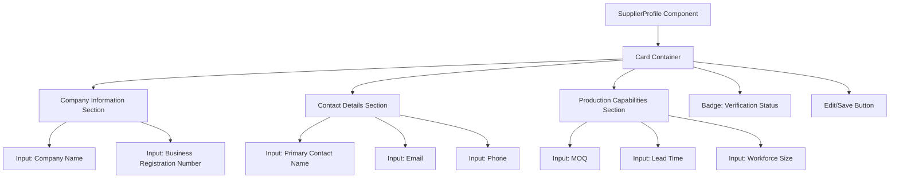
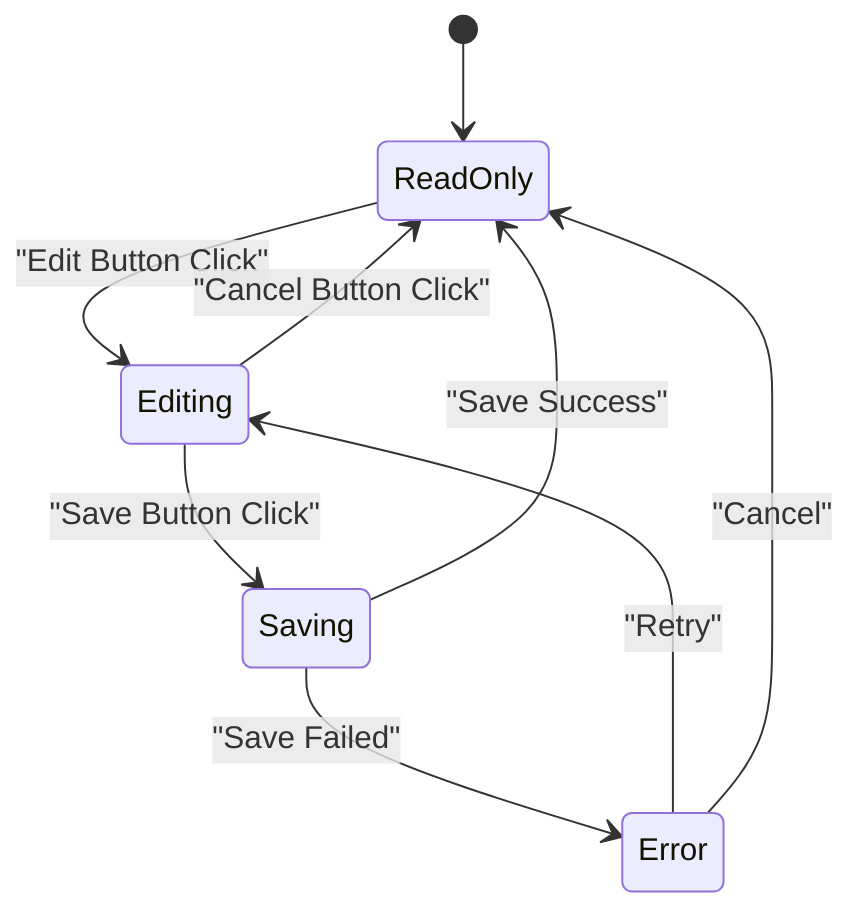
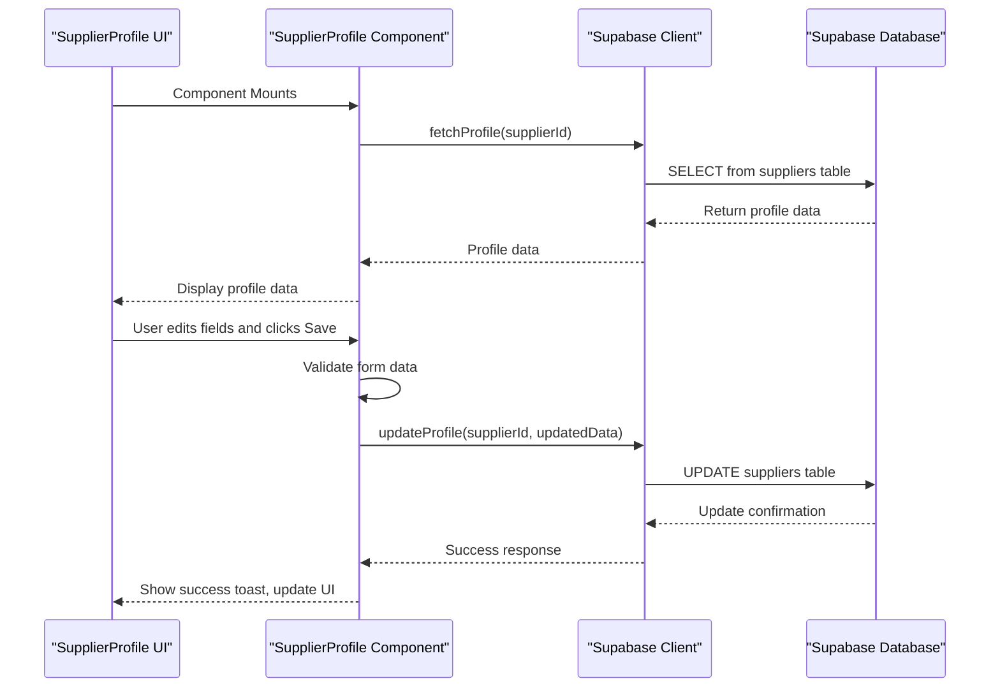
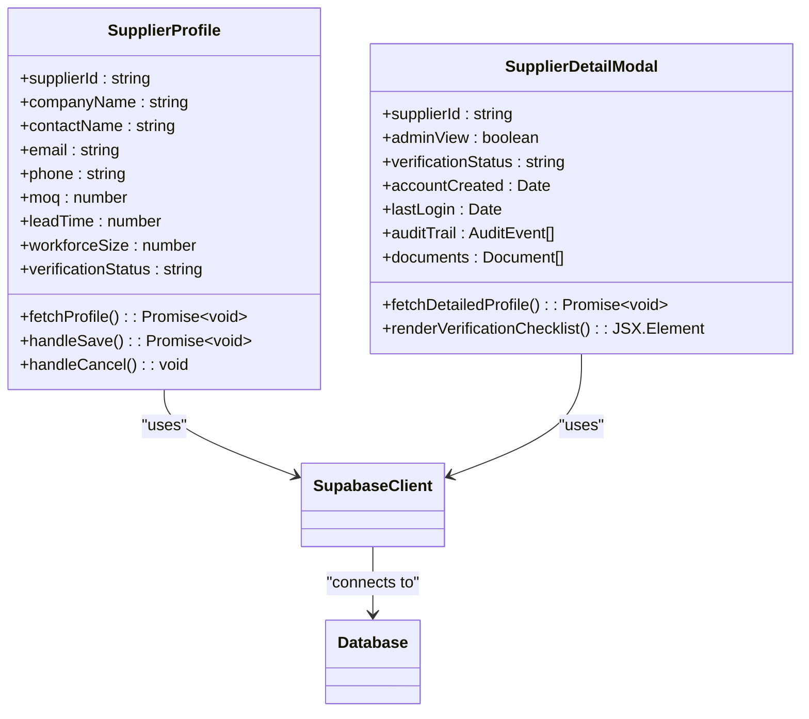
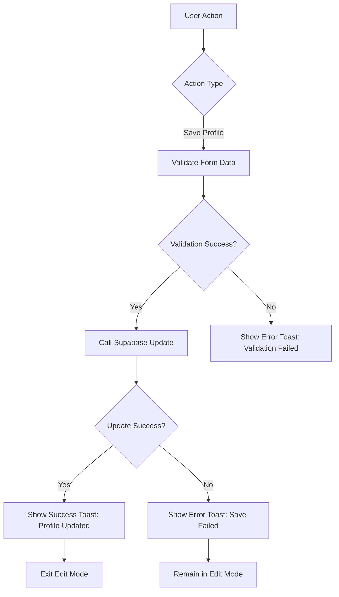

# Supplier Profile Management

<cite>
**Referenced Files in This Document**  
- [SupplierProfile.tsx](file://src/components/supplier/SupplierProfile.tsx)
- [SupplierDetailModal.tsx](file://src/components/admin/SupplierDetailModal.tsx)
- [client.ts](file://src/integrations/supabase/client.ts)
- [database.ts](file://src/types/database.ts)
- [supabaseHelpers.ts](file://src/lib/supabaseHelpers.ts)
- [ui/card.tsx](file://src/components/ui/card.tsx)
- [ui/input.tsx](file://src/components/ui/input.tsx)
- [ui/badge.tsx](file://src/components/ui/badge.tsx)
- [useToast.ts](file://src/hooks/use-toast.ts)
</cite>

## Table of Contents
1. [Introduction](#introduction)
2. [Component Overview](#component-overview)
3. [Form Structure and UI Components](#form-structure-and-ui-components)
4. [State Management and Edit Functionality](#state-management-and-edit-functionality)
5. [Supabase Integration and Data Persistence](#supabase-integration-and-data-persistence)
6. [Admin View: SupplierDetailModal](#admin-view-supplierdetailmodal)
7. [Data Flow and Validation Patterns](#data-flow-and-validation-patterns)
8. [User Feedback and Toast Notifications](#user-feedback-and-toast-notifications)
9. [Conclusion](#conclusion)

## Introduction
The SupplierProfile component is a central interface for suppliers to manage their company information within the SleekApparels platform. This documentation details the implementation of the profile management system, focusing on its form structure, state management, and integration with Supabase for persistent data storage. The component enables suppliers to edit key business details including company information, contact data, minimum order quantities (MOQ), lead times, and workforce size, while providing administrators with an extended read-only view through the SupplierDetailModal.

## Component Overview
The SupplierProfile component serves as the primary interface for suppliers to maintain their business information. It features an editable form layout with real-time validation, loading states during data operations, and seamless integration with the Supabase backend. The component leverages React's state management for form handling and implements a clean, card-based UI design using standardized components from the UI library.

**Section sources**
- [SupplierProfile.tsx](file://src/components/supplier/SupplierProfile.tsx#L1-L50)

## Form Structure and UI Components
The SupplierProfile form is structured using a Card component as the container, with organized sections for different types of information. The form includes input fields for company name, contact details, MOQ, lead time, and workforce size, implemented using the standardized Input component. Badge components are used to display verification status and other categorical information.

The layout follows a responsive design pattern, with fields grouped logically and labeled clearly. Each input field is wrapped in appropriate form controls with validation states, and the overall structure maintains consistency with the platform's design system.

**Diagram sources**
- [SupplierProfile.tsx](file://src/components/supplier/SupplierProfile.tsx#L50-L200)
- [ui/card.tsx](file://src/components/ui/card.tsx)
- [ui/input.tsx](file://src/components/ui/input.tsx)
- [ui/badge.tsx](file://src/components/ui/badge.tsx)

**Section sources**
- [SupplierProfile.tsx](file://src/components/supplier/SupplierProfile.tsx#L50-L250)

## State Management and Edit Functionality
The component implements a controlled form pattern with React state hooks to manage the edit lifecycle. When the user clicks the edit button, the form transitions from read-only to editable mode, enabling all input fields. During editing, changes are tracked in component state without immediately persisting to the backend.

The implementation includes loading states during data saving operations, preventing multiple concurrent saves. Form validation occurs both at the field level (ensuring proper format) and at the submission level (ensuring required fields are completed). The component also supports cancellation of edits, reverting to the last saved state.

**Diagram sources**
- [SupplierProfile.tsx](file://src/components/supplier/SupplierProfile.tsx#L200-L400)

**Section sources**
- [SupplierProfile.tsx](file://src/components/supplier/SupplierProfile.tsx#L250-L500)

## Supabase Integration and Data Persistence
The SupplierProfile component integrates with Supabase for data persistence, using the Supabase client to perform CRUD operations on supplier data. On component mount, it fetches the current supplier profile data from the Supabase database. When saving changes, it updates the corresponding record in the database with the modified fields.

The integration follows security best practices, with proper error handling for network issues and permission errors. The component uses the Supabase real-time functionality to receive updates if the data changes from other sources, ensuring data consistency across sessions.

**Diagram sources**
- [SupplierProfile.tsx](file://src/components/supplier/SupplierProfile.tsx#L400-L600)
- [client.ts](file://src/integrations/supabase/client.ts)
- [database.ts](file://src/types/database.ts)

**Section sources**
- [SupplierProfile.tsx](file://src/components/supplier/SupplierProfile.tsx#L400-L700)
- [client.ts](file://src/integrations/supabase/client.ts)
- [supabaseHelpers.ts](file://src/lib/supabaseHelpers.ts)

## Admin View: SupplierDetailModal
The SupplierDetailModal component provides administrators with an extended read-only view of supplier information, including additional metadata not available to regular suppliers. This modal displays verification status, account creation date, last login information, and audit trail data.

The component is designed for administrative oversight, allowing verification teams to review supplier information thoroughly before approval. It includes tabs for different categories of information and highlights any discrepancies or incomplete verification steps.

**Diagram sources**
- [SupplierDetailModal.tsx](file://src/components/admin/SupplierDetailModal.tsx)
- [SupplierProfile.tsx](file://src/components/supplier/SupplierProfile.tsx)
- [client.ts](file://src/integrations/supabase/client.ts)

**Section sources**
- [SupplierDetailModal.tsx](file://src/components/admin/SupplierDetailModal.tsx#L1-L300)

## Data Flow and Validation Patterns
The data flow from the SupplierProfile component to the Supabase backend follows a consistent pattern: user input is validated locally, then sent to the Supabase client which handles the database interaction. The component implements both synchronous validation (for format checking) and asynchronous validation (for uniqueness checks).

Validation rules include:
- Company name: required, minimum 2 characters
- Email: valid email format, verified through Supabase auth
- MOQ: positive integer, minimum 100 units
- Lead time: positive integer, maximum 90 days
- Workforce size: positive integer, reasonable range validation

The component also implements optimistic UI updates, immediately reflecting changes in the interface while the backend operation completes, with rollback capability if the operation fails.

**Section sources**
- [SupplierProfile.tsx](file://src/components/supplier/SupplierProfile.tsx#L300-L500)
- [supabaseHelpers.ts](file://src/lib/supabaseHelpers.ts#L50-L150)

## User Feedback and Toast Notifications
The component uses the platform's toast notification system to provide feedback on user actions. After successful profile updates, a success toast appears confirming the changes were saved. For errors, descriptive error toasts explain what went wrong and how to fix it.

The toast system is implemented through the useToast hook, which provides a clean API for triggering notifications. Different toast types (success, error, info) are used appropriately to convey the outcome of user actions, with sufficient duration for users to read the message.

**Diagram sources**
- [SupplierProfile.tsx](file://src/components/supplier/SupplierProfile.tsx#L500-L700)
- [useToast.ts](file://src/hooks/use-toast.ts)

**Section sources**
- [SupplierProfile.tsx](file://src/components/supplier/SupplierProfile.tsx#L500-L700)
- [useToast.ts](file://src/hooks/use-toast.ts)

## Conclusion
The SupplierProfile component provides a comprehensive solution for supplier information management, combining an intuitive user interface with robust data persistence through Supabase. Its implementation follows modern React patterns for state management and form handling, while the integration with the admin-facing SupplierDetailModal ensures comprehensive oversight capabilities. The component's validation patterns and user feedback mechanisms create a reliable and user-friendly experience for suppliers managing their business information.