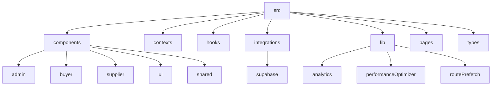
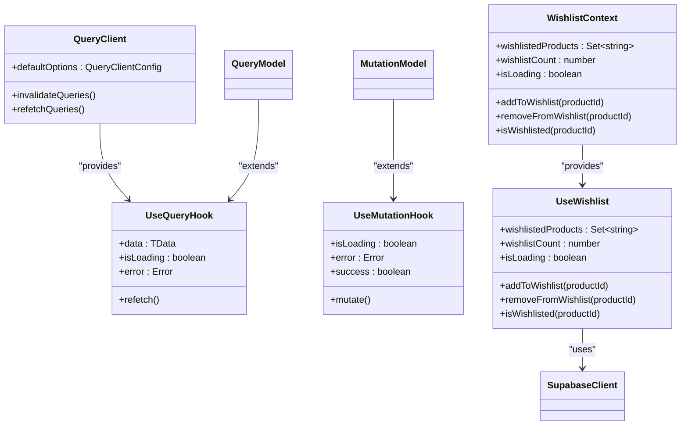
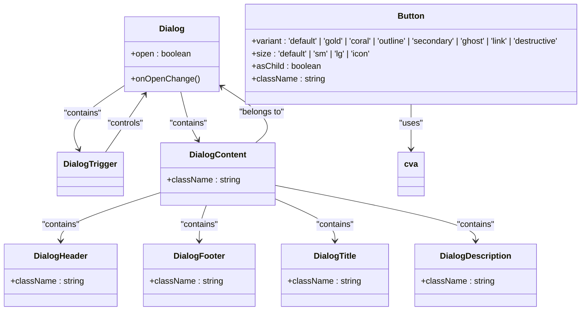
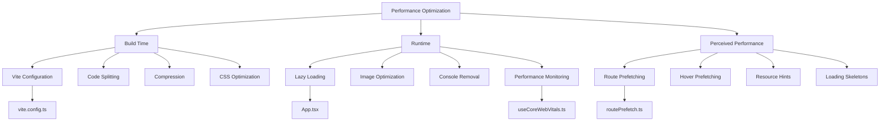
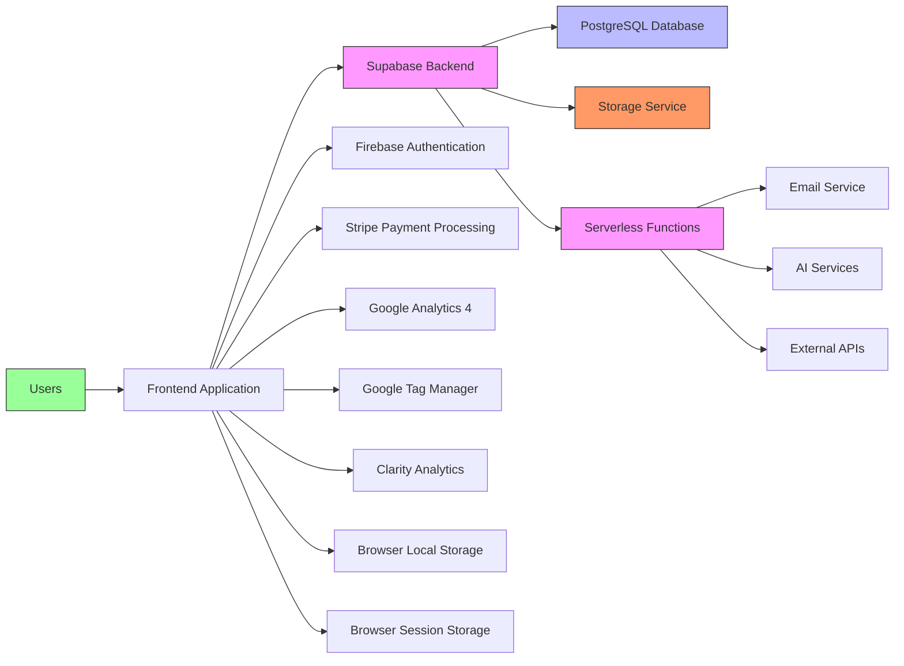

# Frontend Architecture

<cite>
**Referenced Files in This Document**   
- [package.json](file://package.json)
- [vite.config.ts](file://vite.config.ts)
- [tailwind.config.ts](file://tailwind.config.ts)
- [main.tsx](file://src/main.tsx)
- [App.tsx](file://src/App.tsx)
- [components.json](file://components.json)
- [button.tsx](file://src/components/ui/button.tsx)
- [dialog.tsx](file://src/components/ui/dialog.tsx)
- [WishlistContext.tsx](file://src/contexts/WishlistContext.tsx)
- [use-toast.ts](file://src/hooks/use-toast.ts)
- [useQuotes.ts](file://src/hooks/useQuotes.ts)
- [lazyLoadRoutes.ts](file://src/lib/lazyLoadRoutes.ts)
- [performanceOptimizer.ts](file://src/lib/performanceOptimizer.ts)
- [routePrefetch.ts](file://src/lib/routePrefetch.ts)
- [Index.tsx](file://src/pages/Index.tsx)
</cite>

## Table of Contents
1. [Introduction](#introduction)
2. [Technology Stack](#technology-stack)
3. [Project Structure](#project-structure)
4. [Component Architecture](#component-architecture)
5. [State Management](#state-management)
6. [Routing System](#routing-system)
7. [UI Component System](#ui-component-system)
8. [Performance Optimization](#performance-optimization)
9. [Infrastructure and Deployment](#infrastructure-and-deployment)
10. [Cross-Cutting Concerns](#cross-cutting-concerns)
11. [System Context and Data Flow](#system-context-and-data-flow)
12. [Conclusion](#conclusion)

## Introduction

The frontend architecture of sleekapp-v100 is designed as a modern, high-performance React application built with TypeScript, Vite, and Tailwind CSS. The architecture follows domain-driven organization principles with a focus on performance, maintainability, and user experience. The system leverages React 18 features including concurrent rendering, server-side rendering capabilities, and advanced state management patterns. The frontend serves as the primary interface for buyers, suppliers, and administrators in a global apparel manufacturing platform, requiring robust handling of complex workflows, real-time data, and responsive interactions across diverse user personas.

**Section sources**
- [package.json](file://package.json)
- [vite.config.ts](file://vite.config.ts)
- [tailwind.config.ts](file://tailwind.config.ts)

## Technology Stack

The frontend technology stack is carefully selected to balance developer productivity, performance, and long-term maintainability. At its core, the application uses React 18 with TypeScript for type safety and enhanced developer experience. Vite serves as the build tool, providing rapid development server startup and optimized production builds. Tailwind CSS enables utility-first styling with design system consistency.

The stack includes several key libraries:
- **React Router DOM**: For client-side routing and navigation
- **React Query**: For data fetching, caching, and server state management
- **shadcn/ui**: For component primitives built on Radix UI
- **Radix UI**: For accessible, unstyled UI primitives
- **Zod**: For schema validation
- **React Hook Form**: For efficient form handling
- **Framer Motion**: For advanced animations and micro-interactions
- **Recharts**: For data visualization in admin dashboards

The architecture also incorporates Firebase for authentication and Supabase for real-time data synchronization, with Stripe integration for payment processing. The combination of these technologies enables a rich, interactive user experience while maintaining code quality and performance standards.

**Section sources**
- [package.json](file://package.json)
- [vite.config.ts](file://vite.config.ts)
- [tailwind.config.ts](file://tailwind.config.ts)

## Project Structure

The project follows a domain-driven organization pattern with clear separation of concerns. The `src` directory contains the main application structure, organized into logical domains and technical concerns:

- **components**: Domain-specific components organized by feature area (admin, buyer, supplier, etc.) with shared UI components in the ui subdirectory
- **contexts**: React context providers for global state management
- **hooks**: Custom hooks for data fetching, state logic, and reusable behaviors
- **integrations**: Third-party service clients and adapters
- **lib**: Utility functions, performance optimizations, and shared logic
- **pages**: Route-level components representing application views
- **types**: TypeScript type definitions and interfaces
- **hooks**: Custom React hooks for data fetching and state management

This structure enables teams to work independently on different domains while maintaining consistency in UI patterns and technical implementation. The domain-driven approach makes it easier to locate related functionality and understand the application's feature boundaries.

**Diagram sources**
- [src](file://src)
- [components](file://src/components)
- [contexts](file://src/contexts)
- [hooks](file://src/hooks)
- [integrations](file://src/integrations)
- [lib](file://src/lib)
- [pages](file://src/pages)
- [types](file://src/types)

## Component Architecture

The component architecture follows a layered approach with clear separation between presentational and container components. Components are organized by domain in the `src/components` directory, with shared UI components implemented using the shadcn/ui pattern built on Radix UI primitives.

The architecture implements several key patterns:
- **Domain-Driven Organization**: Components are grouped by business domain (admin, buyer, supplier) for better maintainability
- **Atomic Design Principles**: UI components follow a hierarchy from primitive elements to complex organisms
- **Composition over Inheritance**: Components are designed to be composable and reusable through props and children
- **Separation of Concerns**: Presentational components are separated from data-fetching logic

The component structure enables consistent UI patterns across the application while allowing domain-specific customization. The use of TypeScript interfaces ensures type safety and improves developer experience through better tooling support.

**Section sources**
- [components.json](file://components.json)
- [button.tsx](file://src/components/ui/button.tsx)
- [dialog.tsx](file://src/components/ui/dialog.tsx)
- [Index.tsx](file://src/pages/Index.tsx)

## State Management

The application employs a hybrid state management strategy combining React Query for server state and React Context for client state. This approach follows the principle of using the right tool for the right job, leveraging React Query's advanced caching, synchronization, and revalidation capabilities for server data while using Context for truly global UI state.

React Query is configured with optimized settings for the application's needs:
- 5-minute stale time for data freshness
- 10-minute garbage collection time
- Disabled refetch on window focus to reduce unnecessary network requests
- Always refetch on reconnect for data consistency
- Structural sharing for efficient updates

The application implements several custom hooks in the `src/hooks` directory that encapsulate data fetching logic and provide a clean API to components. These hooks use React Query's useQuery and useMutation hooks to handle loading, error, and success states consistently.

For global client state, the application uses React Context with the provider pattern. The WishlistContext is a prime example, managing user wishlist state across the application. The context uses a custom hook (useWishlistContext) to provide type-safe access to the context value, with proper error handling for cases where the hook is used outside the provider.

**Diagram sources**
- [App.tsx](file://src/App.tsx#L128-L145)
- [useQuotes.ts](file://src/hooks/useQuotes.ts)
- [WishlistContext.tsx](file://src/contexts/WishlistContext.tsx)
- [use-toast.ts](file://src/hooks/use-toast.ts)

## Routing System

The routing system is built on React Router DOM with a sophisticated configuration that supports both static and dynamic routes. The application implements a comprehensive routing strategy with route-level code splitting, lazy loading, and intelligent prefetching to optimize performance.

The router configuration in App.tsx defines over 100 routes, including:
- Public marketing pages
- User authentication flows
- Buyer dashboard and order management
- Supplier portal and production tracking
- Admin interfaces for system management
- SEO-optimized landing pages for key search terms

The system implements several advanced routing features:
- **Route Aliases**: Legacy URLs are redirected to current paths to maintain SEO value
- **Subdomain Routing**: Admin functionality is accessible via admin subdomain
- **Protected Routes**: Authentication checks are handled at the route level
- **Route-Level Code Splitting**: Each route is bundled separately for optimal loading

Lazy loading is implemented using React's lazy import function, with critical pages loaded immediately and secondary pages loaded on demand. The application also implements intelligent route prefetching through the routePrefetch utility, which prefetches critical routes after initial load and prefetches routes on hover to reduce perceived navigation latency.

**Section sources**
- [App.tsx](file://src/App.tsx#L176-L298)
- [lazyLoadRoutes.ts](file://src/lib/lazyLoadRoutes.ts)
- [routePrefetch.ts](file://src/lib/routePrefetch.ts)

## UI Component System

The UI component system is built on the shadcn/ui pattern, which provides a collection of reusable components built on top of Radix UI primitives and Tailwind CSS. This approach combines the accessibility and composability of Radix UI with the styling flexibility of Tailwind CSS.

The components.json configuration file defines the project's component aliases and styling preferences:
- Base color theme is set to "slate"
- CSS variables are enabled for theme customization
- Import aliases are configured for common directories

The UI components follow a consistent pattern with several key characteristics:
- **Accessibility First**: Built on Radix UI primitives that provide full accessibility out of the box
- **Customizable**: Extensive use of props and variants for styling flexibility
- **Composable**: Components are designed to be composed together
- **Type Safe**: Full TypeScript support with precise type definitions

The button component exemplifies the design principles, using class-variance-authority (cva) to define variants for different visual styles (default, gold, coral, outline, etc.) and sizes (default, sm, lg, icon). The component supports the asChild prop pattern, allowing it to render as different HTML elements while maintaining consistent styling.

**Diagram sources**
- [components.json](file://components.json)
- [button.tsx](file://src/components/ui/button.tsx)
- [dialog.tsx](file://src/components/ui/dialog.tsx)

## Performance Optimization

The application implements a comprehensive performance optimization strategy addressing both runtime performance and perceived performance. The optimizations are implemented at multiple levels: build configuration, runtime behavior, and user experience.

The Vite configuration includes several performance-focused settings:
- **Code Splitting**: Manual chunks are defined for critical dependencies (React, React Router, React Query, etc.)
- **Compression**: Both gzip and Brotli compression are enabled for production builds
- **CSS Optimization**: Lightning CSS is used for faster CSS minification
- **Preload Transformation**: CSS links are transformed to preload links to eliminate render-blocking

The application implements several runtime optimizations:
- **Lazy Loading**: Non-critical pages and components are lazy-loaded
- **Code Splitting**: The build process creates separate chunks for different feature areas
- **Image Optimization**: Image optimizer plugin is configured (currently disabled due to build issues)
- **Console Removal**: Console logs are removed in production builds

Performance monitoring is implemented through several mechanisms:
- **Core Web Vitals Tracking**: User experience metrics are collected and reported
- **Performance Monitoring**: Custom performance monitor captures key metrics
- **Bundle Analysis**: Visualizer plugin generates bundle analysis reports

The application also implements intelligent prefetching strategies:
- **Route Prefetching**: Critical routes are prefetched after initial load
- **Hover Prefetching**: Routes are prefetched when users hover over navigation links
- **Resource Hints**: DNS prefetch and preconnect hints are added for external resources

**Diagram sources**
- [vite.config.ts](file://vite.config.ts)
- [App.tsx](file://src/App.tsx)
- [performanceOptimizer.ts](file://src/lib/performanceOptimizer.ts)
- [routePrefetch.ts](file://src/lib/routePrefetch.ts)

## Infrastructure and Deployment

The frontend infrastructure is designed for high availability, performance, and scalability. The application is configured to work with modern deployment platforms and CDN services to ensure fast global delivery.

Key infrastructure characteristics include:
- **Static Asset Hosting**: The built application is designed to be served as static files
- **CDN Integration**: The application leverages CDN caching for optimal performance
- **Subdomain Strategy**: Admin functionality is separated via subdomain routing
- **Environment Configuration**: Environment variables are used for configuration

The deployment configuration includes:
- **Vercel Integration**: vercel.json configures routes and rewrites
- **Netlify Integration**: netlify.toml configures redirects and headers
- **Service Worker**: sw.js implements caching strategy for offline support
- **Sitemap Generation**: sitemap.xml provides SEO indexing guidance

The build process generates optimized assets with content hashing for effective caching. The application implements cache-busting through the VITE_BUILD_ID environment variable, ensuring users receive the latest version after deployments.

**Section sources**
- [vite.config.ts](file://vite.config.ts)
- [vercel.json](file://vercel.json)
- [netlify.toml](file://netlify.toml)
- [sw.js](file://public/sw.js)
- [sitemap.xml](file://public/sitemap.xml)

## Cross-Cutting Concerns

The application addresses several cross-cutting concerns that impact multiple aspects of the system. These concerns are implemented consistently across the codebase to ensure a cohesive user experience and maintainable code.

### Accessibility
The application prioritizes accessibility through several mechanisms:
- **Semantic HTML**: Components use appropriate HTML elements
- **ARIA Attributes**: Proper ARIA roles and attributes are implemented
- **Keyboard Navigation**: Full keyboard support for all interactive elements
- **Screen Reader Support**: Content is structured for screen reader consumption
- **Color Contrast**: Sufficient contrast ratios for text and interactive elements

### Responsive Design
The responsive design strategy ensures optimal user experience across devices:
- **Mobile-First Approach**: Styles are designed for mobile and enhanced for larger screens
- **Breakpoint System**: Tailwind's responsive prefixes are used consistently
- **Touch Targets**: Adequate sizing for touch interactions
- **Adaptive Layouts**: Layouts adjust based on screen size and orientation

### Developer Experience
The architecture prioritizes developer experience through:
- **Type Safety**: Comprehensive TypeScript typing
- **Consistent Patterns**: Reusable component and hook patterns
- **Tooling Integration**: ESLint, Prettier, and other developer tools
- **Documentation**: Inline comments and documentation for complex logic

### Error Handling
Robust error handling is implemented at multiple levels:
- **Global Error Boundaries**: RootErrorBoundary and RouteErrorBoundary components
- **Network Error Handling**: React Query's built-in error handling with custom notifications
- **Form Validation**: Client-side validation with user-friendly error messages
- **User Feedback**: Toast notifications for success and error states

**Section sources**
- [App.tsx](file://src/App.tsx)
- [RootErrorBoundary.tsx](file://src/components/RootErrorBoundary.tsx)
- [RouteErrorBoundary.tsx](file://src/components/RouteErrorBoundary.tsx)
- [use-toast.ts](file://src/hooks/use-toast.ts)
- [tailwind.config.ts](file://tailwind.config.ts)

## System Context and Data Flow

The frontend application operates as part of a larger ecosystem, interacting with various backend services and third-party systems. The system context diagram illustrates the key components and their interactions.

**Diagram sources**
- [App.tsx](file://src/App.tsx)
- [integrations/supabase/client.ts](file://src/integrations/supabase/client.ts)
- [lib/analytics.ts](file://src/lib/analytics.ts)
- [firebase.json](file://firebase.json)

The data flow follows a predictable pattern:
1. User interactions trigger events in the frontend
2. Custom hooks handle data operations using React Query
3. Supabase client communicates with the backend
4. Serverless functions process business logic and integrate with external services
5. Data is returned to the frontend and cached by React Query
6. Components re-render with updated data
7. Analytics events are tracked and sent to monitoring services

This architecture ensures data consistency, provides offline capabilities through caching, and delivers a responsive user experience even under varying network conditions.

## Conclusion

The frontend architecture of sleekapp-v100 represents a modern, well-structured React application that balances performance, maintainability, and user experience. The architecture leverages industry best practices including domain-driven organization, component composition, and strategic state management.

Key architectural strengths include:
- **Performance Optimization**: Comprehensive strategies for both runtime and perceived performance
- **Scalable Structure**: Domain-driven organization that supports team scalability
- **Robust State Management**: Hybrid approach using React Query and Context
- **Accessible Components**: shadcn/ui pattern built on Radix UI primitives
- **Developer Experience**: Strong typing, consistent patterns, and tooling support

The architecture is well-positioned to support the application's growth and evolving requirements, with clear extension points for new features and integrations. By following modern React patterns and performance best practices, the frontend delivers a high-quality user experience while maintaining code quality and development velocity.