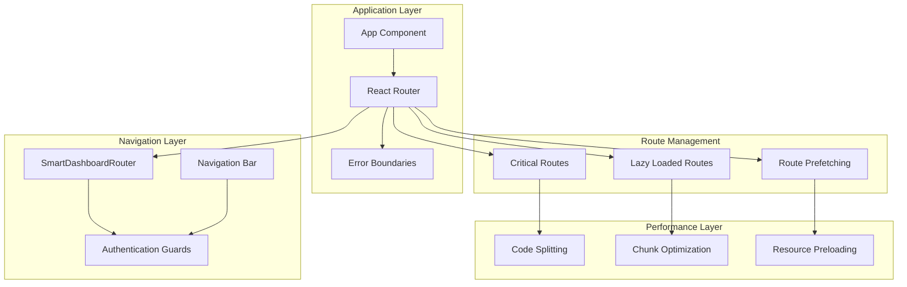
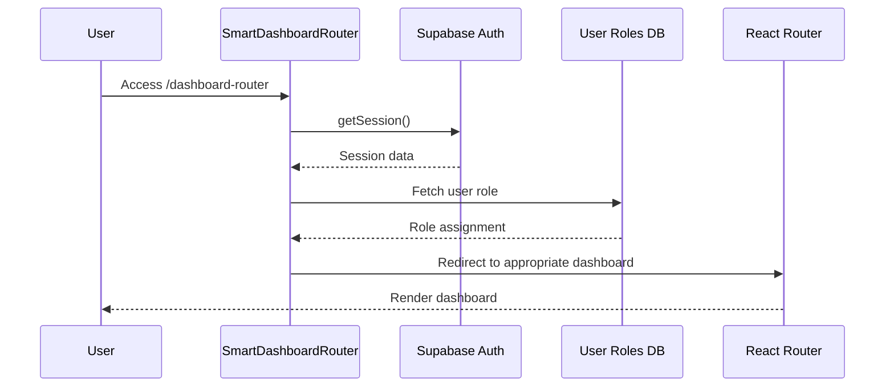
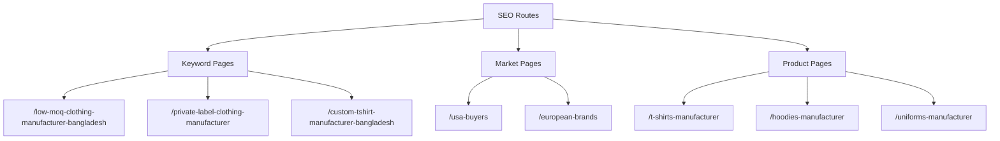
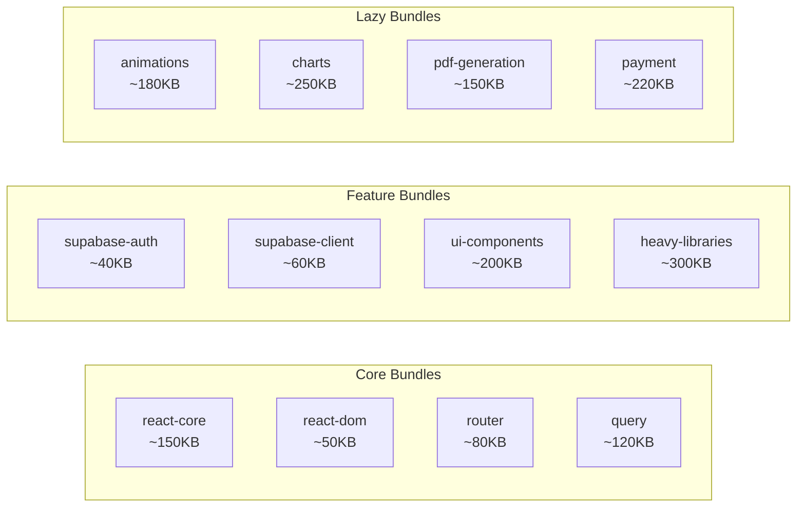
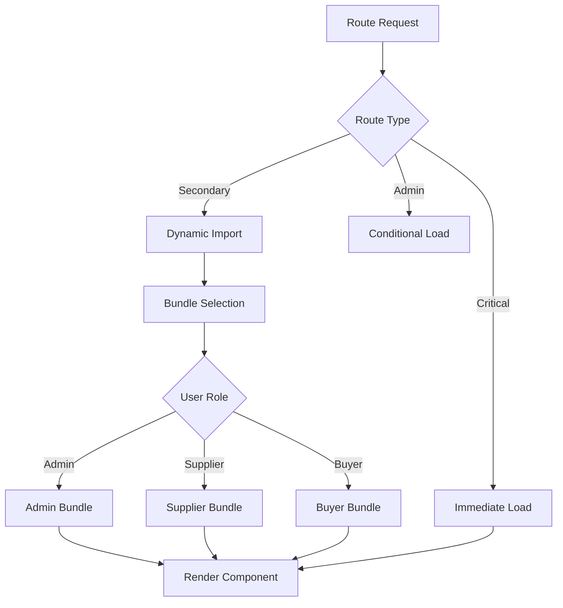
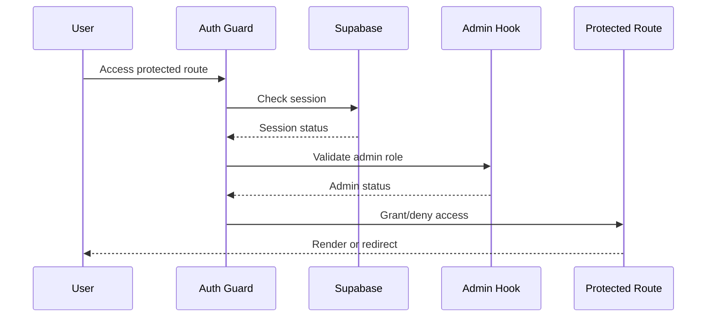
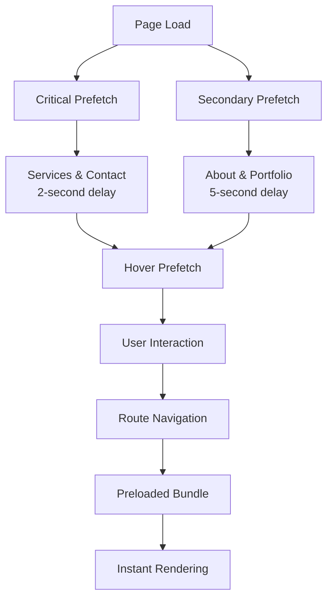
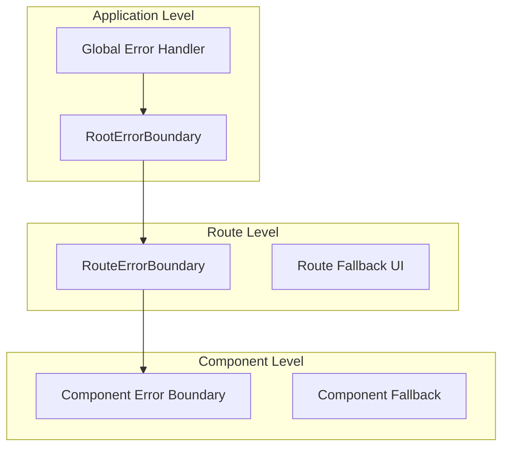
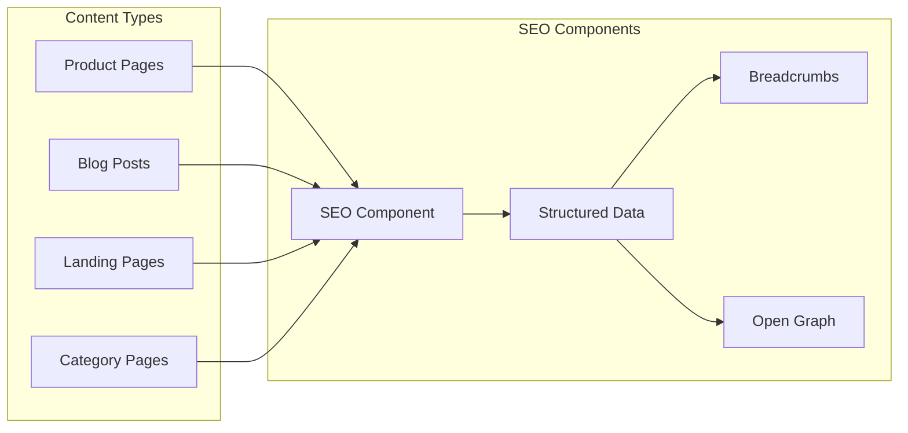
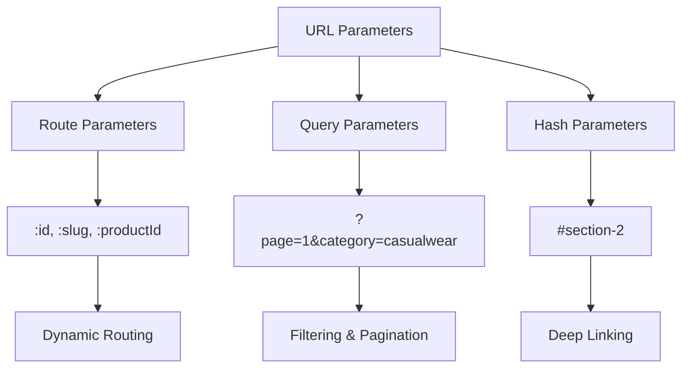

# Routing & Navigation

<cite>
**Referenced Files in This Document**
- [main.tsx](file://src/main.tsx)
- [App.tsx](file://src/App.tsx)
- [SmartDashboardRouter.tsx](file://src/components/SmartDashboardRouter.tsx)
- [vite.config.ts](file://vite.config.ts)
- [lazyLoadRoutes.ts](file://src/lib/lazyLoadRoutes.ts)
- [routePrefetch.ts](file://src/lib/routePrefetch.ts)
- [RouteErrorBoundary.tsx](file://src/components/RouteErrorBoundary.tsx)
- [RootErrorBoundary.tsx](file://src/components/RootErrorBoundary.tsx)
- [Index.tsx](file://src/pages/Index.tsx)
- [useAdminAuth.ts](file://src/hooks/useAdminAuth.ts)
- [Navbar.tsx](file://src/components/Navbar.tsx)
- [seo.ts](file://src/lib/seo.ts)
- [SEO.tsx](file://src/components/SEO.tsx)
</cite>

## Table of Contents
1. [Introduction](#introduction)
2. [Architecture Overview](#architecture-overview)
3. [SmartDashboardRouter Component](#smartdashboardrouter-component)
4. [Route Structure & Organization](#route-structure--organization)
5. [Code Splitting Strategy](#code-splitting-strategy)
6. [Route-Based Code Splitting](#route-based-code-splitting)
7. [Navigation Guards & Authentication](#navigation-guards--authentication)
8. [Performance Optimization](#performance-optimization)
9. [Error Handling](#error-handling)
10. [SEO Implementation](#seo-implementation)
11. [URL Parameter Handling](#url-parameter-handling)
12. [Best Practices](#best-practices)

## Introduction

The sleekapp-v100 routing and navigation system implements a sophisticated React Router DOM-based architecture with advanced performance optimizations, role-based access control, and comprehensive SEO capabilities. Built on React Router v6 with React Query for state management, the system provides seamless client-side navigation with intelligent code splitting, prefetching, and error boundaries.

The routing system is designed around three core principles: **performance-first architecture**, **role-based navigation**, and **seamless user experience**. It handles everything from immediate loading of critical pages to intelligent lazy loading of secondary content, ensuring optimal page load times while maintaining full functionality.

## Architecture Overview

The routing architecture follows a hierarchical structure with multiple layers of abstraction and optimization:



**Diagram sources**
- [App.tsx](file://src/App.tsx#L176-L298)
- [SmartDashboardRouter.tsx](file://src/components/SmartDashboardRouter.tsx#L7-L139)
- [vite.config.ts](file://vite.config.ts#L102-L184)

**Section sources**
- [App.tsx](file://src/App.tsx#L176-L298)
- [main.tsx](file://src/main.tsx#L34-L38)

## SmartDashboardRouter Component

The SmartDashboardRouter serves as the central authentication and routing controller for user dashboards, implementing role-based navigation with intelligent redirection logic.

### Authentication Flow



**Diagram sources**
- [SmartDashboardRouter.tsx](file://src/components/SmartDashboardRouter.tsx#L15-L114)

### Role-Based Redirection Logic

The SmartDashboardRouter implements a sophisticated role detection system that automatically redirects users to their appropriate dashboard based on their role:

- **Admin users**: Redirected to `/admin` with full administrative privileges
- **Supplier users**: Redirected to `/supplier-dashboard` for manufacturing operations  
- **Buyer users**: Redirected to `/dashboard` for purchasing and order management
- **Default fallback**: Buyer dashboard for unauthenticated or role-less users

### Timeout & Error Handling

The component includes robust error handling with:
- **10-second timeout** for authentication checks
- **Retry logic** for role fetching with exponential backoff
- **Graceful degradation** with fallback to buyer dashboard
- **User feedback** through toast notifications and loading states

**Section sources**
- [SmartDashboardRouter.tsx](file://src/components/SmartDashboardRouter.tsx#L7-L139)

## Route Structure & Organization

The application implements a comprehensive route structure organized into distinct categories for optimal performance and maintainability.

### Critical Pages (Immediate Loading)

These essential pages are loaded immediately to ensure core functionality:

| Route Path | Component | Purpose | Load Strategy |
|------------|-----------|---------|---------------|
| `/` | Index | Home page with hero content | Immediate |
| `/health` | Health | System health monitoring | Immediate |
| `/contact` | Contact | Contact form and information | Immediate |
| `/auth` | Auth | User authentication | Immediate |

### Secondary Pages (Lazy Loading)

Performance-critical secondary pages are lazy-loaded for optimal initial load times:

| Category | Routes | Load Strategy | Performance Impact |
|----------|--------|---------------|-------------------|
| **Product Catalog** | `/products`, `/products/:id` | Dynamic import | ~200KB per page |
| **Services** | `/services`, `/casualwear`, `/activewear` | Dynamic import | ~150KB per page |
| **Information** | `/about`, `/sustainability`, `/faq` | Dynamic import | ~100KB per page |
| **Marketing** | `/blog`, `/portfolio`, `/brochure` | Dynamic import | ~180KB per page |
| **Admin** | `/admin/*` routes | Dynamic import | ~300KB per page |

### SEO-Optimized Routes

High-priority SEO landing pages are strategically placed for search engine optimization:



**Diagram sources**
- [App.tsx](file://src/App.tsx#L275-L289)

**Section sources**
- [App.tsx](file://src/App.tsx#L18-L298)
- [lazyLoadRoutes.ts](file://src/lib/lazyLoadRoutes.ts#L1-L43)

## Code Splitting Strategy

The Vite configuration implements a sophisticated manual chunking strategy optimized for different types of dependencies and usage patterns.

### Manual Chunk Configuration



**Diagram sources**
- [vite.config.ts](file://vite.config.ts#L102-L184)

### Bundle Allocation Strategy

The code splitting strategy categorizes dependencies into specific bundles:

| Bundle Category | Dependencies | Size Range | Purpose |
|----------------|--------------|------------|---------|
| **Core React** | `react`, `react-dom`, `scheduler` | 150-200KB | Essential runtime |
| **Router** | `react-router-dom`, `react-router` | 80KB | Navigation infrastructure |
| **State Management** | `@tanstack/react-query` | 120KB | Global state management |
| **UI Components** | `@radix-ui`, `lucide-react` | 200KB | Reusable components |
| **Heavy Libraries** | `framer-motion`, `recharts` | 150-300KB | Feature-specific |
| **Vendor** | General third-party libs | 100-500KB | Miscellaneous dependencies |

### Dynamic Import Patterns

The application uses consistent dynamic import patterns for optimal code splitting:

```typescript
// Critical immediate load
import Index from "./pages/Index";

// Lazy-loaded secondary pages
const ProductCatalog = lazy(() => import("./pages/ProductCatalog"));
const AdminDashboard = lazy(() => import("./pages/AdminDashboard"));

// Feature-specific lazy loading
const Analytics = lazy(() => import("./pages/admin/Analytics"));
```

**Section sources**
- [vite.config.ts](file://vite.config.ts#L102-L184)
- [App.tsx](file://src/App.tsx#L18-L87)

## Route-Based Code Splitting

The application implements intelligent route-based code splitting with multiple strategies for different use cases.

### Lazy Loading Implementation



**Diagram sources**
- [App.tsx](file://src/App.tsx#L26-L87)
- [lazyLoadRoutes.ts](file://src/lib/lazyLoadRoutes.ts#L1-L43)

### Route-Specific Optimization

Different route types receive specialized optimization:

#### Product Routes
- **Product Catalog**: Lazy-loaded with image optimization
- **Product Detail**: Dynamic import with SSR-like hydration
- **Category Pages**: Progressive loading with skeleton screens

#### Admin Routes  
- **Dashboard**: Conditional loading based on role permissions
- **Analytics**: Heavy chart libraries loaded on demand
- **Management**: Modular components for different admin functions

#### Marketing Routes
- **Blog**: Content-heavy pages with progressive loading
- **Portfolio**: Media-rich galleries with lazy loading
- **Landing Pages**: Optimized for conversion with minimal JS

**Section sources**
- [App.tsx](file://src/App.tsx#L26-L87)
- [lazyLoadRoutes.ts](file://src/lib/lazyLoadRoutes.ts#L1-L43)

## Navigation Guards & Authentication

The routing system implements comprehensive authentication and authorization controls through multiple layers of protection.

### Authentication Guards



**Diagram sources**
- [useAdminAuth.ts](file://src/hooks/useAdminAuth.ts#L5-L47)
- [SmartDashboardRouter.tsx](file://src/components/SmartDashboardRouter.tsx#L33-L114)

### Role-Based Access Control

The system implements granular role-based access control:

#### User Roles & Permissions
- **Buyer**: Full access to purchasing, ordering, and profile management
- **Supplier**: Access to manufacturing dashboard, order management, and product uploads
- **Admin**: Complete system administration with user management and analytics
- **Guest**: Limited access to public content and registration

#### Protected Route Implementation

Protected routes are implemented using React Router's navigation guards with Supabase authentication:

```typescript
// Example protected route configuration
{
  path: "/admin",
  element: <AdminDashboard />,
  loader: async () => {
    const { isAdmin } = await checkAdminStatus();
    if (!isAdmin) throw new Response("Unauthorized", { status: 403 });
    return null;
  }
}
```

### Navigation Protection Strategies

The system employs multiple protection strategies:

1. **Client-Side Guards**: React Router navigation guards
2. **Server-Side Validation**: Edge function authentication
3. **Permission Checks**: Role-based feature access
4. **Fallback Redirection**: Graceful handling of unauthorized access

**Section sources**
- [useAdminAuth.ts](file://src/hooks/useAdminAuth.ts#L5-L47)
- [SmartDashboardRouter.tsx](file://src/components/SmartDashboardRouter.tsx#L33-L114)

## Performance Optimization

The routing system incorporates comprehensive performance optimizations to ensure fast navigation and optimal user experience.

### Intelligent Route Prefetching



**Diagram sources**
- [routePrefetch.ts](file://src/lib/routePrefetch.ts#L12-L123)

### Prefetching Strategy

The application implements a multi-tier prefetching system:

#### Critical Prefetching
- **Timing**: 2-second delay after page load
- **Routes**: `/services`, `/contact`
- **Priority**: High importance for user conversion
- **Implementation**: Link prefetch with high importance

#### Secondary Prefetching
- **Timing**: 5-second delay after page load  
- **Routes**: `/about`, `/portfolio`, `/products`
- **Priority**: Medium importance for content discovery
- **Implementation**: Standard link prefetch

#### Hover Prefetching
- **Trigger**: Mouse hover over navigation links (200ms delay)
- **Logic**: Intelligent detection of user intent
- **Implementation**: Dynamic prefetch based on user behavior

### Resource Preloading

The system implements comprehensive resource preloading:

#### Critical Assets
- **Fonts**: Web fonts preloaded with high priority
- **Images**: Critical images preloaded for hero sections
- **JavaScript**: Core bundles preloaded for immediate functionality

#### Deferred Loading
- **Non-critical JS**: Loaded after initial render
- **Large libraries**: Loaded on demand with user interaction
- **Media files**: Progressive loading with lazy loading

### Performance Monitoring

Built-in performance monitoring tracks:

- **Navigation Timing**: Route change performance metrics
- **Bundle Loading**: Chunk load times and sizes
- **User Experience**: Cumulative Layout Shift (CLS) during navigation
- **Error Rates**: Navigation failure rates and patterns

**Section sources**
- [routePrefetch.ts](file://src/lib/routePrefetch.ts#L12-L123)
- [main.tsx](file://src/main.tsx#L10-L21)

## Error Handling

The routing system implements comprehensive error handling through multiple layers of error boundaries and graceful degradation strategies.

### Error Boundary Architecture



**Diagram sources**
- [RootErrorBoundary.tsx](file://src/components/RootErrorBoundary.tsx#L15-L115)
- [RouteErrorBoundary.tsx](file://src/components/RouteErrorBoundary.tsx#L17-L77)

### Error Boundary Implementation

#### RootErrorBoundary
- **Scope**: Application-wide error handling
- **Features**: Cache clearing, service worker cleanup, full page recovery
- **Fallback**: Comprehensive error screen with recovery options
- **Use Case**: Critical application errors requiring full reset

#### RouteErrorBoundary  
- **Scope**: Individual route-level errors
- **Features**: Automatic error reporting, user-friendly fallback
- **Fallback**: Custom error page with navigation options
- **Use Case**: Route-specific rendering failures

### Error Recovery Strategies

The system implements multiple error recovery mechanisms:

#### Automatic Recovery
- **Network Errors**: Automatic retry with exponential backoff
- **Authentication Errors**: Seamless re-authentication flow
- **Rendering Errors**: Component-level fallback rendering

#### User Recovery Options
- **Reload Button**: Quick page refresh for transient errors
- **Back Navigation**: Safe navigation history traversal
- **Cache Clearing**: Advanced recovery for persistent issues

#### Developer Tools
- **Error Reporting**: Automatic error logging to monitoring systems
- **Debug Information**: Detailed error context in development mode
- **Stack Traces**: Comprehensive error stack traces for debugging

**Section sources**
- [RootErrorBoundary.tsx](file://src/components/RootErrorBoundary.tsx#L15-L115)
- [RouteErrorBoundary.tsx](file://src/components/RouteErrorBoundary.tsx#L17-L77)

## SEO Implementation

The routing system incorporates comprehensive SEO optimization through structured data, meta tags, and performance-focused navigation.

### Structured Data Implementation



**Diagram sources**
- [SEO.tsx](file://src/components/SEO.tsx#L23-L255)
- [seo.ts](file://src/lib/seo.ts#L18-L293)

### SEO Configuration Strategy

The application implements comprehensive SEO configuration:

#### Page-Level SEO
- **Dynamic Meta Tags**: Automatic title and description generation
- **Canonical URLs**: Proper canonical URL handling for duplicate content prevention
- **Structured Data**: JSON-LD schemas for rich snippets
- **Open Graph**: Social media optimization for sharing

#### Content-Specific Optimization
- **Product Pages**: SKU-specific metadata with pricing and availability
- **Blog Pages**: Article schemas with publication dates and authors
- **Landing Pages**: Keyword-optimized content with schema markup
- **Category Pages**: Breadcrumb navigation and category-specific metadata

### Performance-First SEO

SEO implementation prioritizes performance:

#### Critical SEO Elements
- **Above-the-fold SEO**: Essential meta tags loaded immediately
- **Progressive Enhancement**: Non-critical SEO elements deferred
- **Lazy Loading**: Large media files optimized for SEO
- **AMP Compatibility**: Accelerated Mobile Pages support

#### Search Engine Optimization
- **Mobile-Friendly**: Responsive design with mobile-first SEO
- **Fast Loading**: Optimized bundle sizes for search ranking
- **Secure Connections**: HTTPS implementation for trust signals
- **Structured Data**: Rich snippets for improved click-through rates

**Section sources**
- [SEO.tsx](file://src/components/SEO.tsx#L23-L255)
- [seo.ts](file://src/lib/seo.ts#L18-L293)

## URL Parameter Handling

The routing system implements sophisticated URL parameter handling for dynamic content, filtering, and state management.

### Parameter Types & Patterns



### Dynamic Route Parameters

The system handles various parameter types:

#### Route Parameters
- **Product IDs**: `/products/:id` for individual product pages
- **Slugs**: `/blog/:slug` for blog post routing
- **Category Codes**: `/categories/:category` for category browsing
- **User Profiles**: `/users/:userId` for user-specific content

#### Query Parameters
- **Filters**: `?category=activewear&color=black` for product filtering
- **Pagination**: `?page=2&limit=24` for content pagination
- **Sorting**: `?sort=price&order=desc` for content sorting
- **Search**: `?q=hoodie&size=large` for search functionality

#### Hash Parameters
- **Deep Links**: `#features` for section navigation
- **Modal Triggers**: `#login-modal` for modal activation
- **Anchor Navigation**: `#faq-section` for content jumping

### Parameter Validation & Sanitization

The system implements comprehensive parameter handling:

#### Input Validation
- **Type Checking**: Parameter type validation and coercion
- **Range Validation**: Numeric parameter bounds checking
- **Format Validation**: URL-safe parameter encoding
- **Length Limits**: Parameter length restrictions

#### Security Measures
- **XSS Prevention**: Parameter sanitization against cross-site scripting
- **SQL Injection**: Parameter escaping for database queries
- **CSRF Protection**: Token validation for state-changing operations
- **Rate Limiting**: Parameter-based rate limiting for abuse prevention

### State Management Integration

URL parameters integrate seamlessly with application state:

#### React Query Integration
- **Query Key Generation**: Automatic query key creation from URL parameters
- **Cache Management**: URL parameter-aware cache invalidation
- **Prefetching**: Parameter-based route prefetching
- **Error Handling**: Parameter-specific error recovery

#### React Router Integration
- **Parameter Passing**: Automatic parameter passing between routes
- **Navigation Preservation**: Parameter preservation during navigation
- **URL Synchronization**: Bidirectional synchronization with application state
- **History Management**: Parameter-aware browser history management

**Section sources**
- [App.tsx](file://src/App.tsx#L18-L298)
- [Navbar.tsx](file://src/components/Navbar.tsx#L130-L170)

## Best Practices

The routing system follows established best practices for React applications with performance, maintainability, and user experience as primary concerns.

### Development Guidelines

#### Code Organization
- **Separation of Concerns**: Clear separation between routing logic and business logic
- **Modular Architecture**: Route-specific modules with dedicated imports
- **Consistent Naming**: Standardized naming conventions for routes and components
- **Type Safety**: Comprehensive TypeScript typing for route parameters and props

#### Performance Optimization
- **Bundle Analysis**: Regular bundle size analysis and optimization
- **Code Splitting**: Strategic code splitting based on user behavior patterns
- **Lazy Loading**: Intelligent lazy loading with proper fallback handling
- **Resource Optimization**: Efficient resource loading and caching strategies

#### Testing Strategies
- **Unit Testing**: Route-level component testing with mocking
- **Integration Testing**: End-to-end navigation testing
- **Performance Testing**: Navigation performance benchmarking
- **Error Testing**: Comprehensive error boundary testing

### Maintenance & Scalability

#### Scalable Architecture
- **Extensible Design**: Easy addition of new routes and features
- **Configuration-Driven**: Route configuration through centralized configuration
- **Plugin Architecture**: Modular route extensions and customizations
- **Version Compatibility**: Backward compatibility maintenance

#### Monitoring & Analytics
- **Performance Tracking**: Navigation performance monitoring and alerting
- **User Behavior**: Navigation pattern analysis and optimization
- **Error Tracking**: Comprehensive error reporting and resolution
- **A/B Testing**: Route-level experimentation and optimization

### Security Considerations

#### Authentication & Authorization
- **Role-Based Access**: Granular permission systems
- **Token Management**: Secure token handling and refresh
- **CSRF Protection**: Cross-site request forgery prevention
- **Input Validation**: Comprehensive parameter validation and sanitization

#### Data Protection
- **Sensitive Data**: Secure handling of user data and transactions
- **Privacy Compliance**: GDPR and CCPA compliance measures
- **Audit Logging**: Comprehensive audit trails for security events
- **Secure Defaults**: Security-first configuration defaults