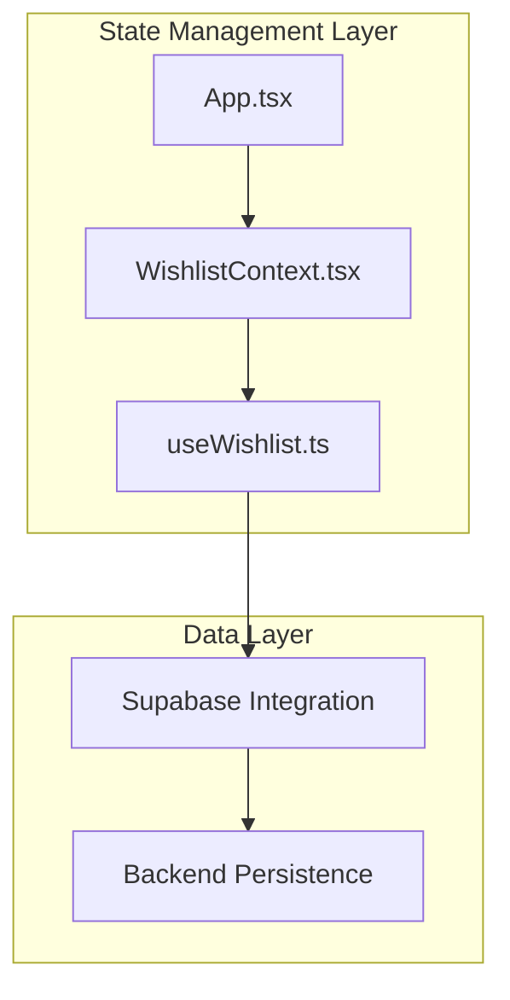
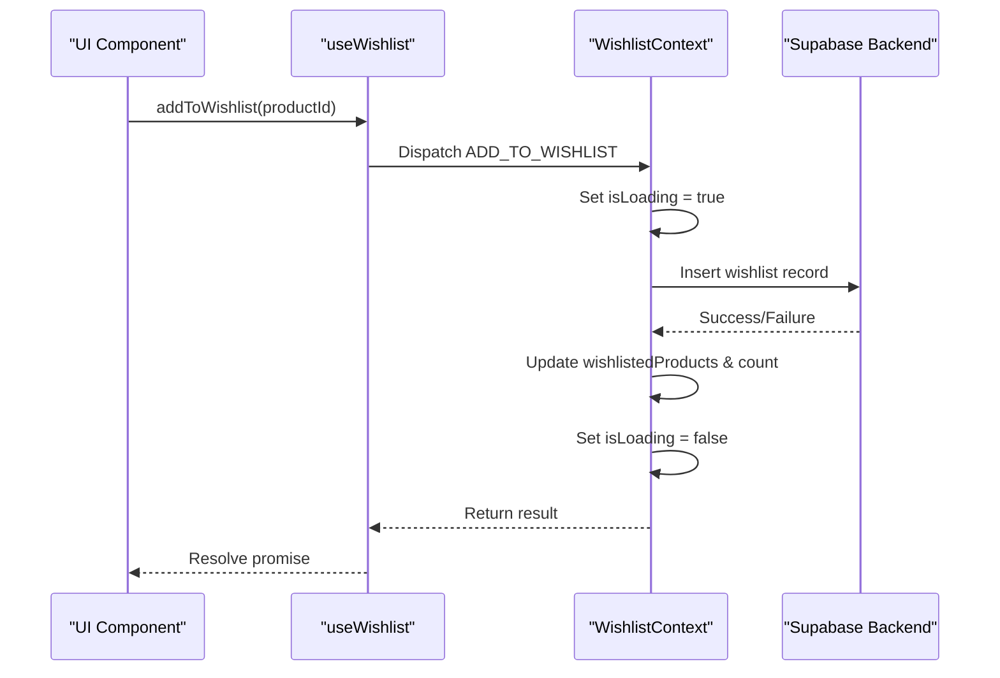
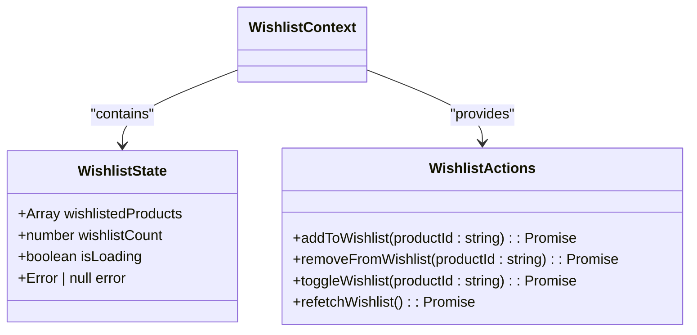
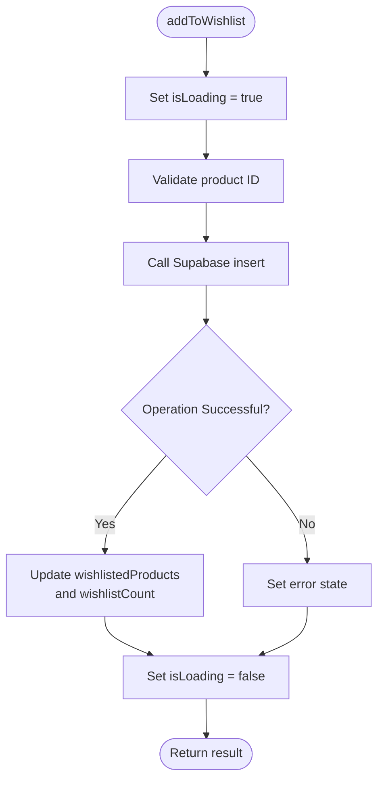
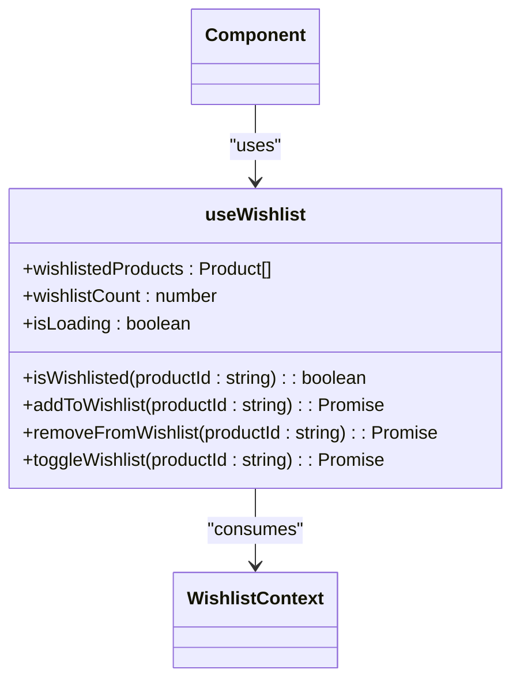
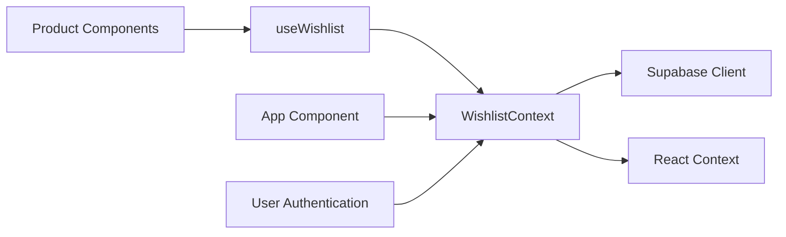

# Client State Management with Context API

<cite>
**Referenced Files in This Document**  
- [WishlistContext.tsx](file://src/contexts/WishlistContext.tsx)
- [useWishlist.ts](file://src/hooks/useWishlist.ts)
- [App.tsx](file://src/App.tsx)
</cite>

## Table of Contents
1. [Introduction](#introduction)
2. [Project Structure](#project-structure)
3. [Core Components](#core-components)
4. [Architecture Overview](#architecture-overview)
5. [Detailed Component Analysis](#detailed-component-analysis)
6. [Dependency Analysis](#dependency-analysis)
7. [Performance Considerations](#performance-considerations)
8. [Troubleshooting Guide](#troubleshooting-guide)
9. [Conclusion](#conclusion)

## Introduction
This document provides comprehensive documentation for the client state management system in sleekapp-v100, focusing on the implementation of user-specific wishlist functionality using React Context API. The system enables persistent storage and synchronization of user wishlists through Supabase backend integration, supporting key operations such as adding, removing, and toggling products. The design follows modern React patterns for state management, including custom hooks, context providers, and asynchronous data handling.

## Project Structure
The client state management system is organized within the `src` directory following a modular architecture. The core state logic resides in dedicated directories: `contexts` for context providers, `hooks` for custom hooks, and components that consume the state. This separation ensures maintainability and scalability of the state management layer.

**Diagram sources**
- [WishlistContext.tsx](file://src/contexts/WishlistContext.tsx)
- [useWishlist.ts](file://src/hooks/useWishlist.ts)
- [App.tsx](file://src/App.tsx)

**Section sources**
- [WishlistContext.tsx](file://src/contexts/WishlistContext.tsx)
- [App.tsx](file://src/App.tsx)

## Core Components
The wishlist system consists of three primary components: the WishlistContext provider, the useWishlist custom hook, and the application-level provider setup. These components work together to manage user wishlist state across sessions, handle asynchronous operations with Supabase, and provide a clean API for components to interact with the wishlist.

**Section sources**
- [WishlistContext.tsx](file://src/contexts/WishlistContext.tsx)
- [useWishlist.ts](file://src/hooks/useWishlist.ts)

## Architecture Overview
The architecture follows the React Context Provider pattern, where state is created and managed in a central context provider and consumed throughout the application via a custom hook. The state includes wishlisted products, wishlist count, and loading status, with all mutations handled through asynchronous functions that synchronize with the Supabase backend.

**Diagram sources**
- [WishlistContext.tsx](file://src/contexts/WishlistContext.tsx)
- [useWishlist.ts](file://src/hooks/useWishlist.ts)

## Detailed Component Analysis

### WishlistContext Analysis
The WishlistContext implementation manages the complete lifecycle of wishlist state, including initialization, mutation, and persistence. It uses React's useState and useReducer hooks to manage state and provides asynchronous actions for all CRUD operations.

#### State Structure

**Diagram sources**
- [WishlistContext.tsx](file://src/contexts/WishlistContext.tsx)

#### Asynchronous Operations
The context implements robust error handling and loading state management for all asynchronous operations. Each action follows a consistent pattern: set loading state, perform Supabase operation, update local state, and handle errors appropriately.

**Diagram sources**
- [WishlistContext.tsx](file://src/contexts/WishlistContext.tsx)

**Section sources**
- [WishlistContext.tsx](file://src/contexts/WishlistContext.tsx)

### useWishlist Hook Analysis
The useWishlist custom hook provides a clean, type-safe interface for components to interact with the wishlist context. It handles the context consumption pattern and provides convenient utility functions.

**Diagram sources**
- [useWishlist.ts](file://src/hooks/useWishlist.ts)

**Section sources**
- [useWishlist.ts](file://src/hooks/useWishlist.ts)

## Dependency Analysis
The wishlist system has well-defined dependencies that enable its functionality while maintaining separation of concerns.

**Diagram sources**
- [WishlistContext.tsx](file://src/contexts/WishlistContext.tsx)
- [useWishlist.ts](file://src/hooks/useWishlist.ts)
- [App.tsx](file://src/App.tsx)

**Section sources**
- [WishlistContext.tsx](file://src/contexts/WishlistContext.tsx)
- [useWishlist.ts](file://src/hooks/useWishlist.ts)

## Performance Considerations
The implementation includes several performance optimizations to minimize re-renders and ensure smooth user experience:

- **Memoization**: The context value is memoized using useMemo to prevent unnecessary re-renders
- **Loading State**: Granular loading state prevents UI blocking during operations
- **Batch Updates**: State updates are batched where possible to reduce render cycles
- **Selective Re-renders**: Components can use the isWishlisted utility to avoid subscribing to full state

For scaling beyond this implementation, consider:
- Moving to Redux Toolkit or Zustand for more complex state
- Implementing optimistic updates for better perceived performance
- Adding caching layers for frequently accessed data
- Using React Query for server state management

## Troubleshooting Guide
Common issues and their solutions:

### Context Undefined Errors
Ensure the provider is properly wrapped in App.tsx and that components are rendered within the provider scope.

### State Synchronization Across Tabs
Implement localStorage event listeners to synchronize state changes across browser tabs using the StorageEvent API.

### Performance Issues
- Use React.memo for components that consume wishlist state
- Avoid unnecessary re-renders by using selective state access
- Implement debouncing for rapid-fire operations

### Common Error Scenarios
- **Authentication Errors**: Handle cases where Supabase operations fail due to auth state
- **Network Errors**: Implement retry logic and proper error fallbacks
- **Race Conditions**: Use cleanup functions and loading states to prevent race conditions

**Section sources**
- [WishlistContext.tsx](file://src/contexts/WishlistContext.tsx)
- [useWishlist.ts](file://src/hooks/useWishlist.ts)
- [App.tsx](file://src/App.tsx)

## Conclusion
The client state management system in sleekapp-v100 provides a robust solution for managing user wishlists using React Context API. The implementation effectively balances simplicity with functionality, offering a clean API for components while handling complex asynchronous operations and persistence. The architecture is suitable for medium-complexity state management needs and can be extended or replaced with more sophisticated solutions as requirements evolve.