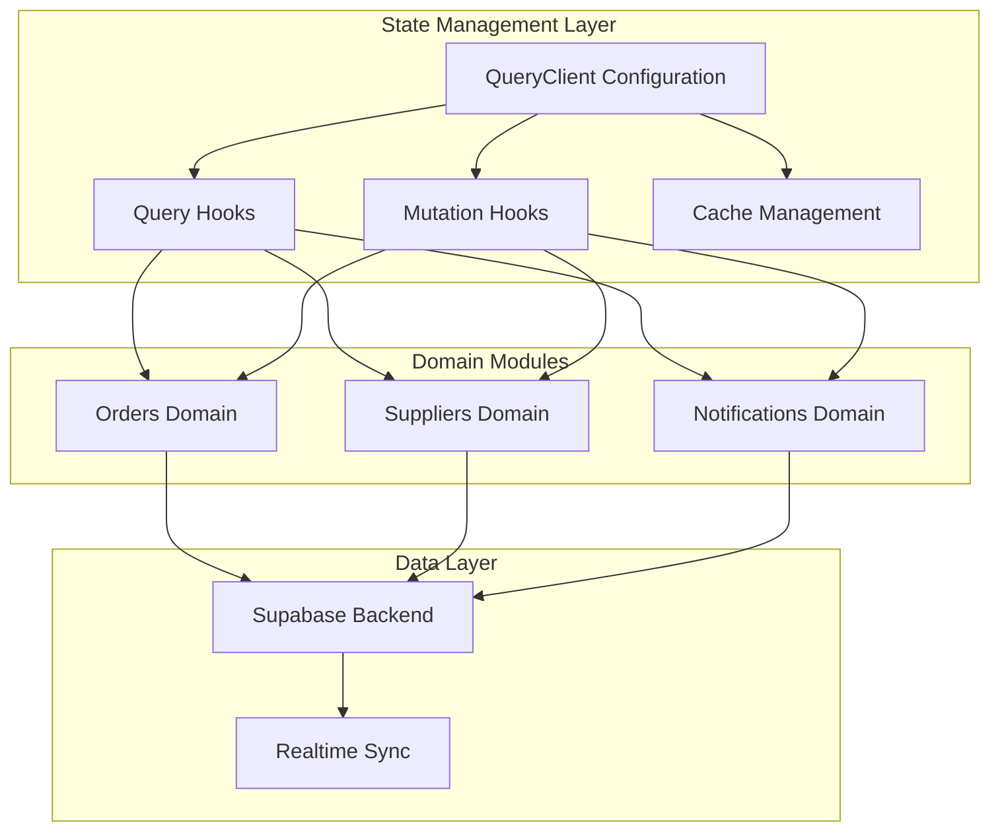
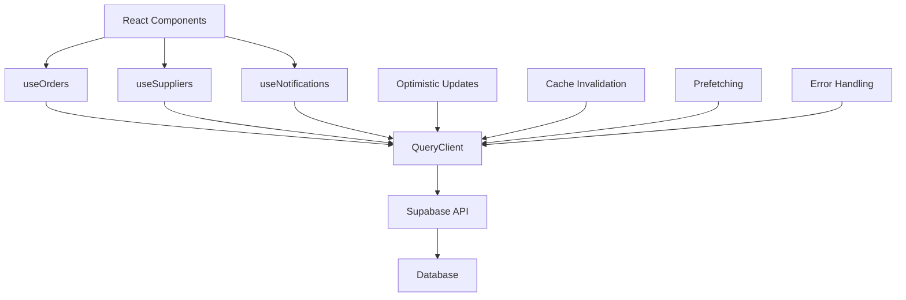
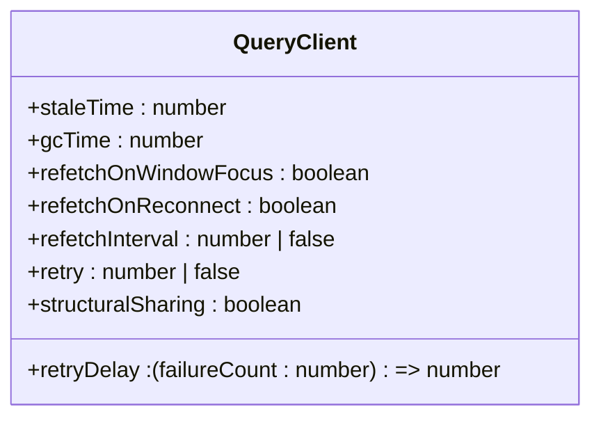
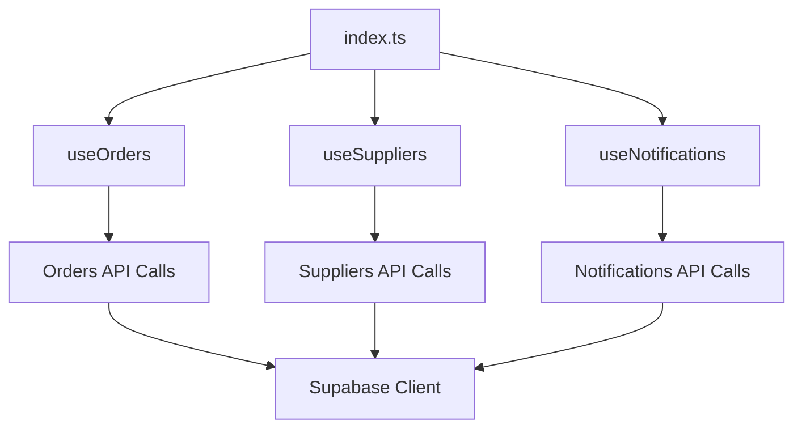
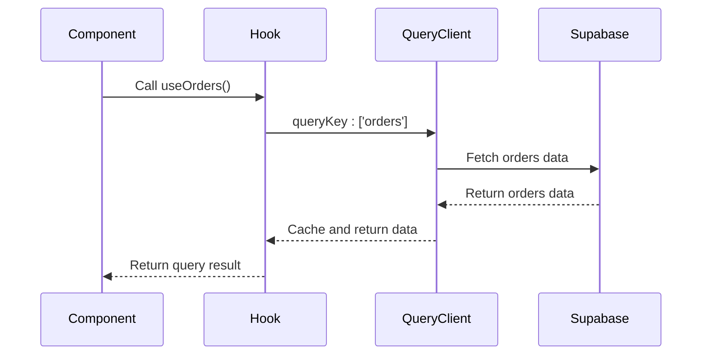
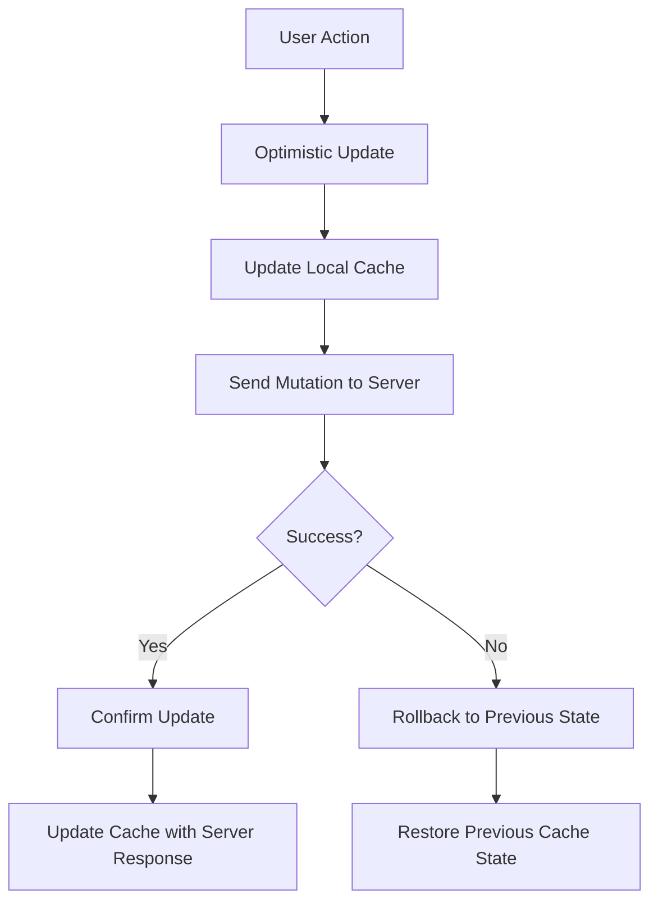
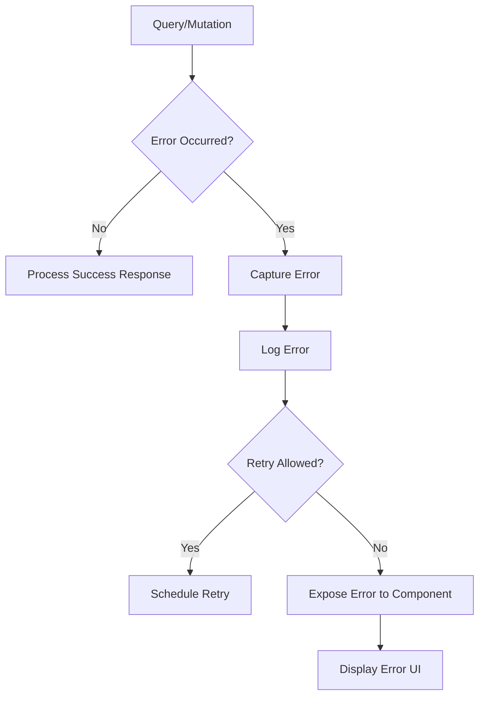
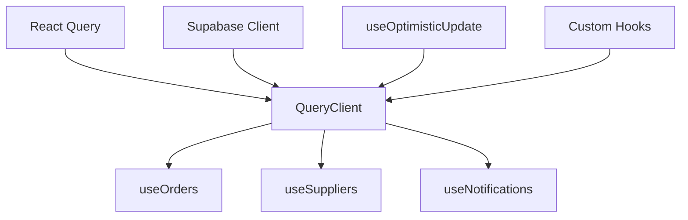
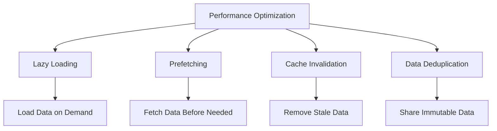

# Server State Management with React Query

<cite>
**Referenced Files in This Document**  
- [App.tsx](file://src/App.tsx)
- [index.ts](file://src/hooks/queries/index.ts)
- [useOrders.ts](file://src/hooks/queries/useOrders.ts)
- [useSuppliers.ts](file://src/hooks/queries/useSuppliers.ts)
- [useNotifications.ts](file://src/hooks/queries/useNotifications.ts)
- [useOptimisticUpdate.ts](file://src/hooks/useOptimisticUpdate.ts)
- [client.ts](file://src/integrations/supabase/client.ts)
</cite>

## Table of Contents
1. [Introduction](#introduction)
2. [Project Structure](#project-structure)
3. [Core Components](#core-components)
4. [Architecture Overview](#architecture-overview)
5. [Detailed Component Analysis](#detailed-component-analysis)
6. [Dependency Analysis](#dependency-analysis)
7. [Performance Considerations](#performance-considerations)
8. [Troubleshooting Guide](#troubleshooting-guide)
9. [Conclusion](#conclusion)

## Introduction
This document provides comprehensive documentation for the server state management system in sleekapp-v100, which leverages React Query for efficient data synchronization between the frontend and Supabase backend. The system is designed to handle complex state management requirements across multiple domains including orders, suppliers, and notifications. The documentation covers the configuration of QueryClient, centralized query hook architecture, implementation patterns for queries and mutations, caching strategies, optimistic updates, error handling, performance optimizations, and integration with Supabase.

## Project Structure
The server state management system is organized within the `src/hooks/queries` directory, which contains domain-specific hooks for orders, suppliers, and notifications. These hooks are exported through a centralized index file, enabling consistent import patterns across the application. The React Query client is configured at the application root level in App.tsx, establishing global settings for caching, refetching, and garbage collection.

**Diagram sources**
- [App.tsx](file://src/App.tsx#L1-L50)
- [index.ts](file://src/hooks/queries/index.ts#L1-L20)

**Section sources**
- [App.tsx](file://src/App.tsx#L1-L100)
- [index.ts](file://src/hooks/queries/index.ts#L1-L30)

## Core Components
The core components of the server state management system include the QueryClient configuration, domain-specific query hooks, mutation handlers, and utility functions for optimistic updates. The system is built around React Query's powerful caching mechanism, which enables automatic background refetching, stale data management, and structural sharing of query results. The centralized hook architecture promotes code reuse and maintains consistency across different parts of the application.

**Section sources**
- [App.tsx](file://src/App.tsx#L25-L100)
- [index.ts](file://src/hooks/queries/index.ts#L10-L40)

## Architecture Overview
The server state management architecture is designed to provide a seamless experience for data fetching, caching, and synchronization. At the core of the system is the QueryClient, which is configured with specific settings for staleTime, gcTime, and refetch behaviors. These settings determine how long data remains fresh, when it should be garbage collected, and under what conditions it should be automatically refetched.

**Diagram sources**
- [App.tsx](file://src/App.tsx#L15-L60)
- [useOrders.ts](file://src/hooks/queries/useOrders.ts#L5-L25)

## Detailed Component Analysis

### QueryClient Configuration
The QueryClient is configured in App.tsx with specific settings that govern the behavior of all queries in the application. The staleTime is set to control how long data remains fresh before being considered stale, while gcTime determines the duration after which inactive queries are garbage collected. The refetch behavior is configured to balance between data freshness and network efficiency, with options for refetching on window focus, network recovery, and specific intervals.

**Section sources**
- [App.tsx](file://src/App.tsx#L30-L80)

#### QueryClient Settings

**Diagram sources**
- [App.tsx](file://src/App.tsx#L40-L70)

### Centralized Query Hook Architecture
The centralized query hook architecture is implemented through src/hooks/queries/index.ts, which exports standardized hooks for different domains. This approach ensures consistent patterns for data fetching across the application and simplifies maintenance and updates. The useOrders, useSuppliers, and useNotifications hooks provide domain-specific functionality while sharing common configuration and error handling patterns.

#### Hook Export Structure

**Diagram sources**
- [index.ts](file://src/hooks/queries/index.ts#L1-L40)

**Section sources**
- [index.ts](file://src/hooks/queries/index.ts#L1-L50)

### Query and Mutation Implementation Patterns
The implementation patterns for queries and mutations follow React Query best practices, with clear separation between data fetching and state updates. Queries are used for retrieving data from the Supabase backend, while mutations handle data modifications. The system leverages React Query's built-in features for loading states, error handling, and automatic refetching after mutations.

#### Data Fetching Pattern

**Diagram sources**
- [useOrders.ts](file://src/hooks/queries/useOrders.ts#L10-L30)

### Optimistic Updates
The system implements optimistic updates using the useOptimisticUpdate hook, which allows for immediate UI updates before the server confirms the changes. This creates a responsive user experience by reducing perceived latency. The hook manages the temporary state changes and handles rollback in case of server errors.

#### Optimistic Update Flow

**Diagram sources**
- [useOptimisticUpdate.ts](file://src/hooks/useOptimisticUpdate.ts#L5-L25)

**Section sources**
- [useOptimisticUpdate.ts](file://src/hooks/useOptimisticUpdate.ts#L1-L40)

### Error Handling Strategy
The error handling strategy is designed to provide meaningful feedback to users while maintaining application stability. Errors from queries and mutations are captured and exposed through the query result object, allowing components to display appropriate error messages. The system also implements retry mechanisms and fallback values to enhance resilience.

**Diagram sources**
- [useOrders.ts](file://src/hooks/queries/useOrders.ts#L50-L70)
- [useSuppliers.ts](file://src/hooks/queries/useSuppliers.ts#L45-L65)

## Dependency Analysis
The server state management system has dependencies on React Query, Supabase client, and various utility functions within the application. The QueryClient serves as the central dependency that connects all query and mutation hooks to the data source. The system also depends on proper configuration of the Supabase client for authentication and database access.

**Diagram sources**
- [App.tsx](file://src/App.tsx#L20-L40)
- [client.ts](file://src/integrations/supabase/client.ts#L1-L15)

**Section sources**
- [App.tsx](file://src/App.tsx#L1-L100)
- [client.ts](file://src/integrations/supabase/client.ts#L1-L30)

## Performance Considerations
The system incorporates several performance optimization techniques to ensure efficient data management and responsive user interfaces. These include lazy loading of data, prefetching of likely-needed information, and strategic cache invalidation. The configuration of staleTime and gcTime balances data freshness with network efficiency, while structural sharing minimizes memory usage by reusing immutable data structures.

### Performance Optimization Techniques

**Diagram sources**
- [App.tsx](file://src/App.tsx#L60-L80)
- [useOrders.ts](file://src/hooks/queries/useOrders.ts#L80-L100)

## Troubleshooting Guide
Common issues in the server state management system include stale data, network race conditions, and cache synchronization problems. The React Query Devtools provide valuable insights into query states and cache contents, helping diagnose these issues. For stale data problems, adjusting the staleTime configuration or implementing manual refetching can resolve the issue. Network race conditions can be mitigated through proper mutation ordering and optimistic updates.

**Section sources**
- [App.tsx](file://src/App.tsx#L85-L100)
- [useOptimisticUpdate.ts](file://src/hooks/useOptimisticUpdate.ts#L30-L50)

## Conclusion
The server state management system in sleekapp-v100 effectively leverages React Query to handle complex data synchronization requirements. The centralized hook architecture, combined with thoughtful configuration of caching and refetching behaviors, provides a robust foundation for maintaining consistent application state. The integration with Supabase enables real-time data synchronization, while optimistic updates and comprehensive error handling create a responsive and resilient user experience. The system's design prioritizes performance through lazy loading, prefetching, and efficient cache management, ensuring optimal application responsiveness.