# State Management

<cite>
**Referenced Files in This Document**   
- [useQuotes.ts](file://src/hooks/useQuotes.ts)
- [useSuppliers.ts](file://src/hooks/useSuppliers.ts)
- [useOrders.ts](file://src/hooks/queries/useOrders.ts)
- [useNotifications.ts](file://src/hooks/queries/useNotifications.ts)
- [useSmartSupplierAssignment.ts](file://src/hooks/useSmartSupplierAssignment.ts)
- [useOptimisticUpdate.ts](file://src/hooks/useOptimisticUpdate.ts)
- [useWishlist.ts](file://src/hooks/useWishlist.ts)
- [WishlistContext.tsx](file://src/contexts/WishlistContext.tsx)
- [index.ts](file://src/hooks/queries/index.ts)
</cite>

## Table of Contents
1. [Introduction](#introduction)
2. [State Management Architecture](#state-management-architecture)
3. [React Query for Server State](#react-query-for-server-state)
4. [Context API for Global Client State](#context-api-for-global-client-state)
5. [Custom Hooks Implementation](#custom-hooks-implementation)
6. [Query Hook Architecture](#query-hook-architecture)
7. [Wishlist Context Implementation](#wishlist-context-implementation)
8. [Mutation Patterns and Optimistic Updates](#mutation-patterns-and-optimistic-updates)
9. [Real-time Data Synchronization](#real-time-data-synchronization)
10. [Performance Considerations](#performance-considerations)
11. [Cache Management Strategies](#cache-management-strategies)
12. [Error Handling Patterns](#error-handling-patterns)
13. [Common Issues and Debugging Guidance](#common-issues-and-debugging-guidance)
14. [Conclusion](#conclusion)

## Introduction

The state management system in sleekapp-v100 implements a dual approach combining React Query for server state management and Context API for global client state. This architecture provides a robust solution for handling both server-side data synchronization and client-side state persistence across the application. The system is designed to ensure optimal performance, real-time data updates, and a seamless user experience while maintaining code organization and reusability through custom hooks.

**Section sources**
- [useQuotes.ts](file://src/hooks/useQuotes.ts#L1-L261)
- [useSuppliers.ts](file://src/hooks/useSuppliers.ts#L1-L215)
- [useOrders.ts](file://src/hooks/queries/useOrders.ts#L1-L152)

## State Management Architecture

The state management architecture in sleekapp-v100 follows a clear separation of concerns between server state and client state. React Query handles all server state operations including data fetching, caching, synchronization, and background updates, while Context API manages global client state that needs to persist across components and user sessions. This dual approach allows the application to efficiently manage data at different levels of the stack, ensuring optimal performance and user experience.

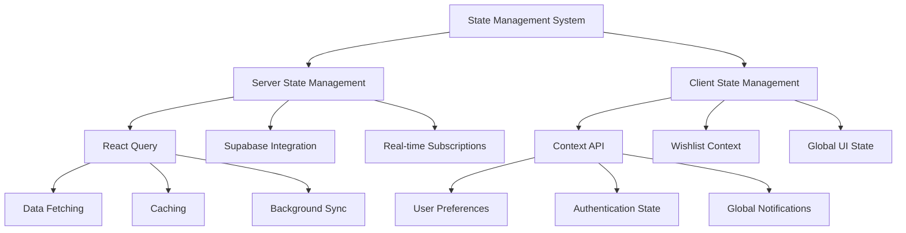

**Diagram sources**
- [useQuotes.ts](file://src/hooks/useQuotes.ts#L1-L261)
- [useWishlist.ts](file://src/hooks/useWishlist.ts#L1-L132)
- [WishlistContext.tsx](file://src/contexts/WishlistContext.tsx#L1-L34)

## React Query for Server State

React Query serves as the primary solution for server state management in sleekapp-v100, providing a comprehensive set of features for data fetching, caching, and synchronization. The implementation leverages React Query's powerful caching mechanisms, automatic background refetching, and stale-while-revalidate strategy to ensure data consistency while maintaining optimal performance.

The system uses query keys with structured naming conventions to organize and identify different data sets, enabling efficient cache invalidation and targeted refetching. For example, the useOrders hook implements a hierarchical query key structure that allows for both individual order retrieval and filtered lists based on buyer or factory IDs.

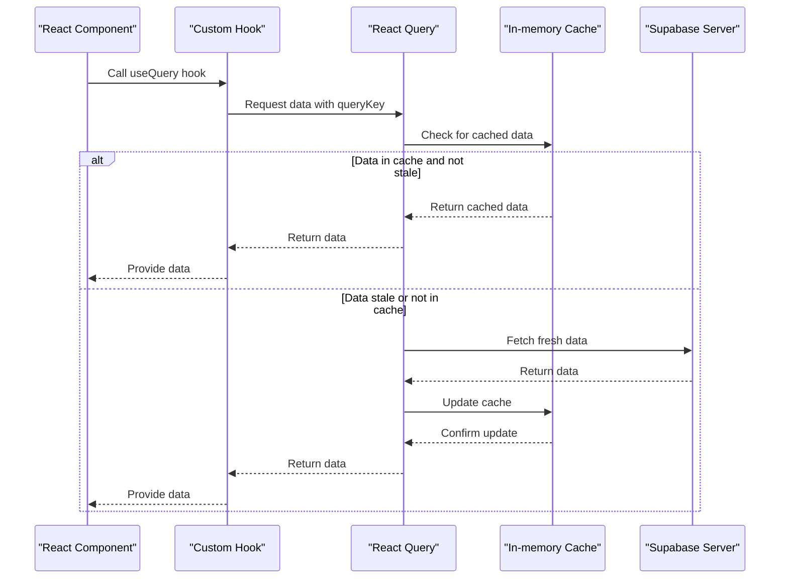

**Diagram sources**
- [useOrders.ts](file://src/hooks/queries/useOrders.ts#L6-L17)
- [useNotifications.ts](file://src/hooks/queries/useNotifications.ts#L6-L10)
- [useSuppliers.ts](file://src/hooks/useSuppliers.ts#L48-L98)

**Section sources**
- [useOrders.ts](file://src/hooks/queries/useOrders.ts#L1-L152)
- [useNotifications.ts](file://src/hooks/queries/useNotifications.ts#L1-L135)
- [useSuppliers.ts](file://src/hooks/useSuppliers.ts#L1-L215)

## Context API for Global Client State

The Context API is used to manage global client state that needs to persist across the application and survive component unmounts. The primary implementation is the WishlistContext, which maintains the user's wishlist state across different components and pages. This context provides a centralized store for wishlist data, ensuring consistency and eliminating the need for prop drilling.

The context implementation follows best practices by providing a clear interface with type definitions, proper error handling for cases where the context is used outside of its provider, and optimized re-renders through careful state management. The useWishlistContext hook serves as the consumer interface, making it easy for components to access and modify wishlist state.

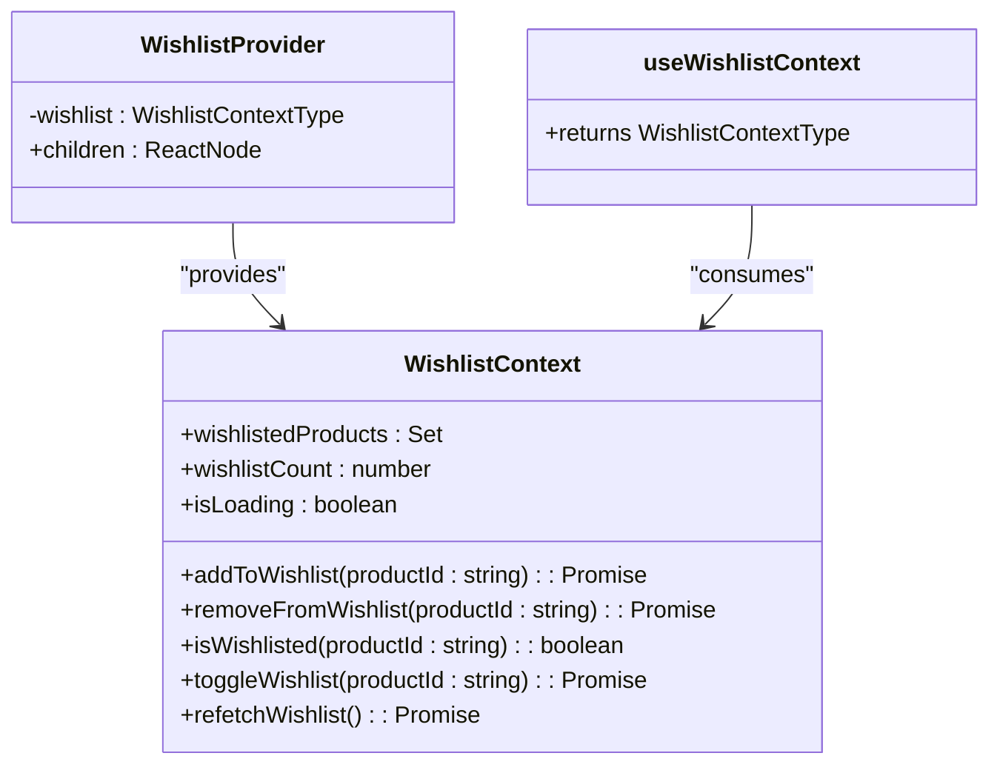

**Diagram sources**
- [WishlistContext.tsx](file://src/contexts/WishlistContext.tsx#L1-L34)
- [useWishlist.ts](file://src/hooks/useWishlist.ts#L1-L132)

**Section sources**
- [WishlistContext.tsx](file://src/contexts/WishlistContext.tsx#L1-L34)
- [useWishlist.ts](file://src/hooks/useWishlist.ts#L1-L132)

## Custom Hooks Implementation

The application implements a comprehensive set of custom hooks to encapsulate state management logic and provide reusable interfaces for common operations. These hooks are organized in the src/hooks directory and follow a consistent pattern of exposing data and actions through a clean API.

Key custom hooks include:
- useQuotes: Manages quote-related data and operations
- useOrders: Handles order data fetching and manipulation
- useSuppliers: Provides supplier data and filtering capabilities
- useSmartSupplierAssignment: Facilitates AI-powered supplier recommendations
- useOptimisticUpdate: Enables optimistic UI updates with rollback capabilities

Each hook follows the React Query mutation and query patterns, providing automatic cache invalidation, error handling with user feedback through toast notifications, and loading state management.

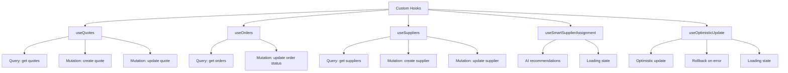

**Diagram sources**
- [useQuotes.ts](file://src/hooks/useQuotes.ts#L55-L261)
- [useOrders.ts](file://src/hooks/queries/useOrders.ts#L19-L152)
- [useSuppliers.ts](file://src/hooks/useSuppliers.ts#L48-L190)
- [useSmartSupplierAssignment.ts](file://src/hooks/useSmartSupplierAssignment.ts#L14-L55)
- [useOptimisticUpdate.ts](file://src/hooks/useOptimisticUpdate.ts#L16-L176)

**Section sources**
- [useQuotes.ts](file://src/hooks/useQuotes.ts#L1-L261)
- [useOrders.ts](file://src/hooks/queries/useOrders.ts#L1-L152)
- [useSuppliers.ts](file://src/hooks/useSuppliers.ts#L1-L215)
- [useSmartSupplierAssignment.ts](file://src/hooks/useSmartSupplierAssignment.ts#L1-L55)
- [useOptimisticUpdate.ts](file://src/hooks/useOptimisticUpdate.ts#L1-L176)

## Query Hook Architecture

The query hook architecture in sleekapp-v100 follows a modular and organized approach, with a centralized export system in src/hooks/queries/index.ts. This file serves as the entry point for all query hooks, allowing for clean imports and consistent usage across the application.

The architecture implements several best practices:
- Query keys are defined as structured objects to enable type safety and prevent string-based errors
- Each query hook includes appropriate cache time and stale time configurations based on data volatility
- Error handling is standardized with user feedback through toast notifications
- Loading states are managed internally within the hooks
- Automatic cache invalidation is implemented after mutations

The index.ts file exports all query hooks, creating a single source of truth for data fetching operations:

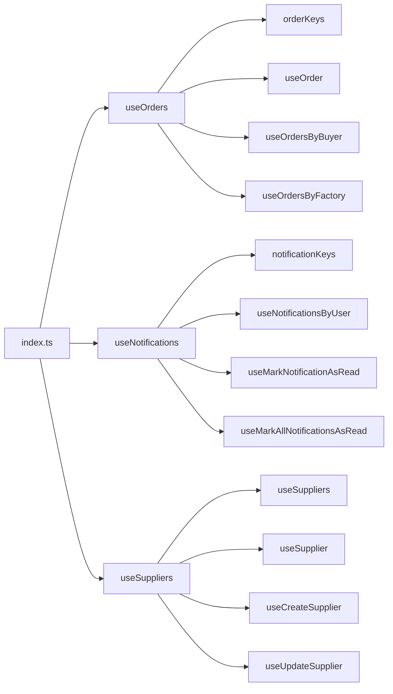

**Diagram sources**
- [index.ts](file://src/hooks/queries/index.ts#L1-L5)
- [useOrders.ts](file://src/hooks/queries/useOrders.ts#L6-L17)
- [useNotifications.ts](file://src/hooks/queries/useNotifications.ts#L6-L10)

**Section sources**
- [index.ts](file://src/hooks/queries/index.ts#L1-L5)
- [useOrders.ts](file://src/hooks/queries/useOrders.ts#L1-L152)
- [useNotifications.ts](file://src/hooks/queries/useNotifications.ts#L1-L135)

## Wishlist Context Implementation

The WishlistContext implementation provides a robust solution for managing persistent user state across the application. The context is built on top of the useWishlist hook, which handles all data operations with Supabase, including loading, adding, and removing items from the wishlist.

Key features of the implementation include:
- Automatic loading of wishlist data on component mount
- Real-time synchronization with authentication state changes
- Optimistic updates with rollback capabilities
- Efficient state management using Set data structure for O(1) lookups
- Comprehensive API for wishlist operations

The context maintains three primary state values: wishlistedProducts (a Set of product IDs), wishlistCount (the number of items), and isLoading (a boolean flag). These values are updated through various actions that handle both local state changes and server synchronization.

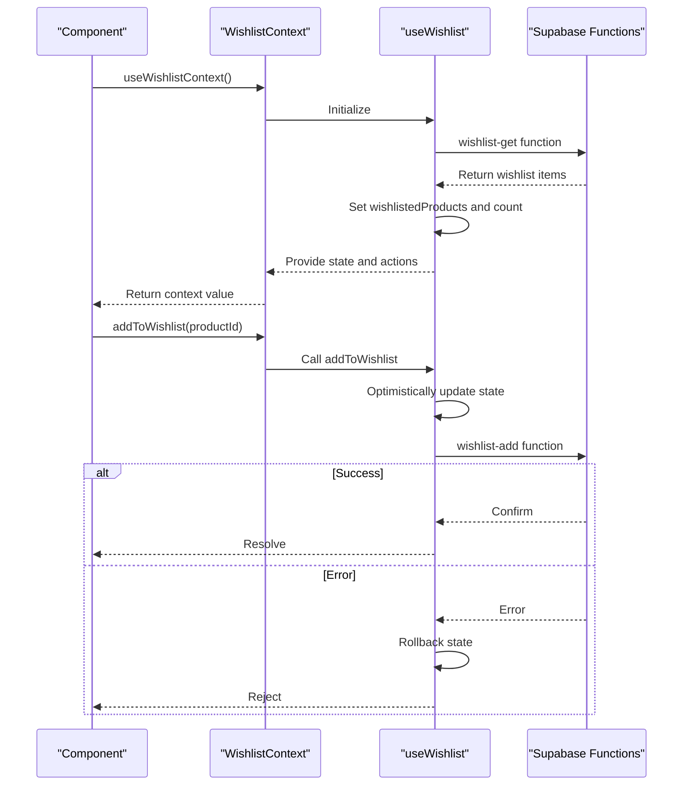

**Diagram sources**
- [WishlistContext.tsx](file://src/contexts/WishlistContext.tsx#L1-L34)
- [useWishlist.ts](file://src/hooks/useWishlist.ts#L1-L132)

**Section sources**
- [WishlistContext.tsx](file://src/contexts/WishlistContext.tsx#L1-L34)
- [useWishlist.ts](file://src/hooks/useWishlist.ts#L1-L132)

## Mutation Patterns and Optimistic Updates

The application implements sophisticated mutation patterns with a strong emphasis on user experience through optimistic updates. The useOptimisticUpdate hook provides a generic solution for implementing optimistic UI updates with automatic rollback in case of failures.

Key mutation patterns include:
- Standard mutations with automatic cache invalidation
- Optimistic updates with rollback capabilities
- Batch operations for improved performance
- Error handling with user feedback
- Loading state management

The useOptimisticUpdate hook accepts an initial state, an update function, and optional success/error callbacks. It manages the UI state optimistically, immediately reflecting changes to the user interface while the server request is in progress. If the server request fails, the hook automatically rolls back to the previous state and provides appropriate error feedback.

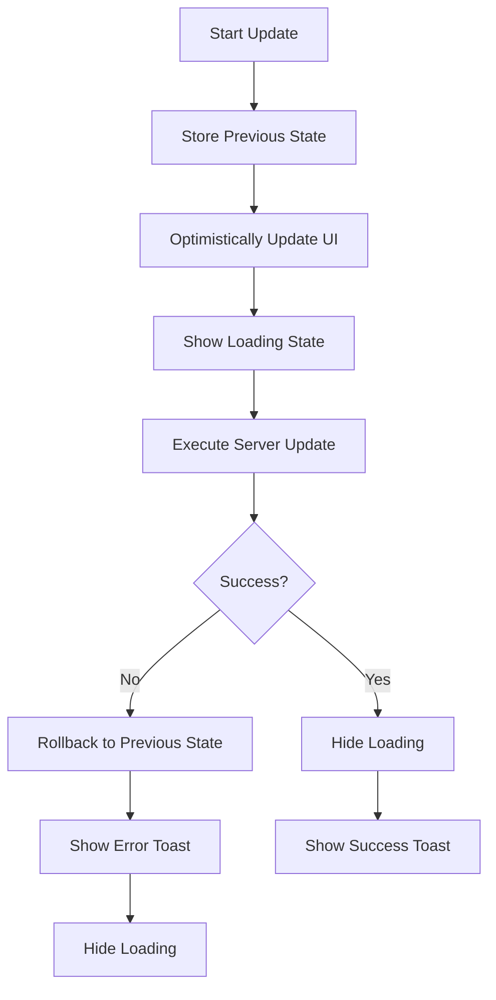

**Diagram sources**
- [useOptimisticUpdate.ts](file://src/hooks/useOptimisticUpdate.ts#L16-L74)
- [useWishlist.ts](file://src/hooks/useWishlist.ts#L53-L78)

**Section sources**
- [useOptimisticUpdate.ts](file://src/hooks/useOptimisticUpdate.ts#L1-L176)
- [useWishlist.ts](file://src/hooks/useWishlist.ts#L1-L132)

## Real-time Data Synchronization

The application implements real-time data synchronization using Supabase's real-time capabilities, ensuring that users see the most up-to-date information without manual refreshes. This is achieved through PostgreSQL's replication features and Supabase's real-time subscriptions.

Key real-time features include:
- Production stage updates with live progress tracking
- Order status changes with immediate UI reflection
- Notification delivery with in-app toasts
- Message system with instant delivery
- Connection status monitoring

The real-time system is implemented through Supabase channels that subscribe to database changes. When a relevant record is inserted, updated, or deleted, the change is immediately pushed to all subscribed clients, which then update their local state accordingly.

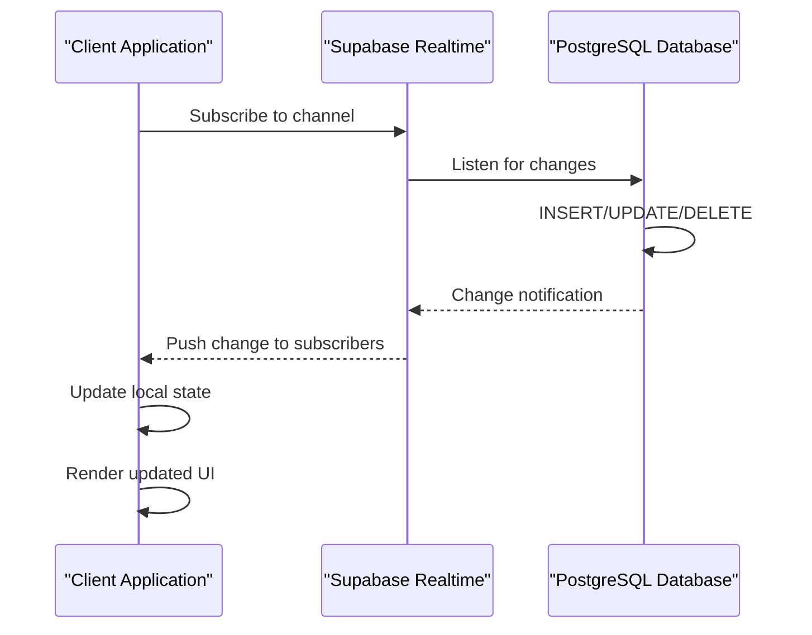

**Diagram sources**
- [ConnectionStatusIndicator.tsx](file://src/components/production/ConnectionStatusIndicator.tsx#L38-L48)
- [ProductionUpdatesFeed.tsx](file://src/components/ProductionUpdatesFeed.tsx#L85-L131)
- [useRealtimeMessages.ts](file://src/hooks/useRealtimeMessages.ts#L1-L61)

## Performance Considerations

The state management system incorporates several performance optimizations to ensure a responsive user experience:

- **Caching Strategy**: React Query's intelligent caching with configurable stale and cache times prevents unnecessary network requests
- **Data Fetching**: Queries are designed to fetch only necessary fields using Supabase's select method
- **Memoization**: Expensive operations like filtering are memoized using React's useMemo hook
- **Batch Operations**: Related mutations are batched when possible to reduce network overhead
- **Lazy Loading**: Data is fetched only when needed, with proper enabled conditions on queries
- **Efficient State Updates**: State updates are optimized to minimize re-renders

The system also implements connection status monitoring to adapt behavior based on network conditions, providing appropriate feedback to users during connectivity issues.

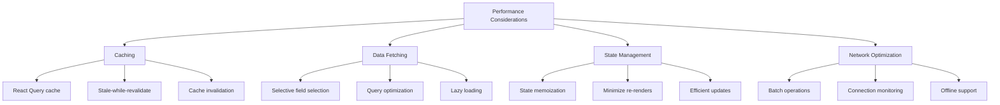

**Diagram sources**
- [useSuppliers.ts](file://src/hooks/useSuppliers.ts#L95-L97)
- [useQuotes.ts](file://src/hooks/useQuotes.ts#L56-L78)
- [ConnectionStatusIndicator.tsx](file://src/components/production/ConnectionStatusIndicator.tsx#L42-L48)

## Cache Management Strategies

The application implements comprehensive cache management strategies to balance data freshness with performance:

- **Cache Time Configuration**: Different data types have appropriate cache durations based on their volatility
- **Stale Time Settings**: Data is marked as stale after a certain period, triggering background refetching
- **Targeted Invalidation**: Specific queries are invalidated after mutations to ensure data consistency
- **Prefetching**: Data is prefetched when navigation is anticipated
- **Cache Persistence**: Critical cache data is persisted across page reloads

For example, supplier data has a stale time of 10 minutes and cache time of 15 minutes, reflecting its relatively stable nature, while order data may have shorter cache times due to its dynamic nature.

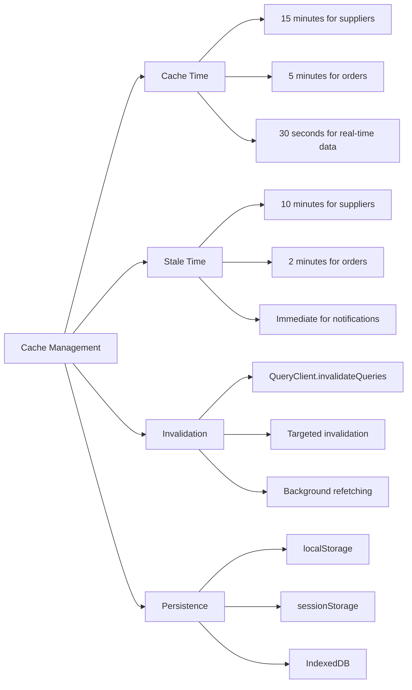

**Diagram sources**
- [useSuppliers.ts](file://src/hooks/useSuppliers.ts#L95-L97)
- [useOrders.ts](file://src/hooks/queries/useOrders.ts#L20-L28)
- [useQuotes.ts](file://src/hooks/useQuotes.ts#L56-L78)

## Error Handling Patterns

The state management system implements robust error handling patterns to ensure reliability and provide meaningful feedback to users:

- **Centralized Error Handling**: Errors are caught and handled within custom hooks
- **User Feedback**: Toast notifications provide immediate feedback on success and failure
- **Graceful Degradation**: The application continues to function even when individual operations fail
- **Automatic Retry**: Failed requests may be automatically retried based on error type
- **Detailed Logging**: Errors are logged for debugging and monitoring purposes

Error handling is implemented consistently across all hooks, with standardized patterns for mutation error handling, query error handling, and network connectivity issues.

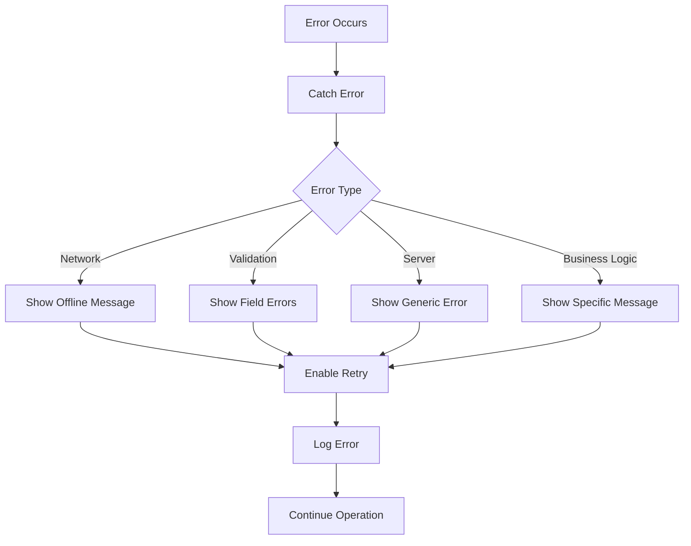

**Diagram sources**
- [useQuotes.ts](file://src/hooks/useQuotes.ts#L157-L159)
- [useOrders.ts](file://src/hooks/queries/useOrders.ts#L137-L143)
- [useOptimisticUpdate.ts](file://src/hooks/useOptimisticUpdate.ts#L49-L63)

## Common Issues and Debugging Guidance

Common issues in the state management system and their debugging approaches include:

- **Stale Data**: Ensure proper cache invalidation after mutations and verify stale time settings
- **Missing Data**: Check query keys for consistency and verify data fetching conditions
- **Performance Issues**: Monitor network requests and optimize queries with appropriate field selection
- **Race Conditions**: Implement proper loading states and disable actions during processing
- **Memory Leaks**: Ensure proper cleanup of subscriptions and event listeners

Debugging guidance:
- Use React Query Devtools to inspect query states and cache contents
- Monitor network requests to verify data fetching patterns
- Check console logs for error messages and warnings
- Verify authentication state when data access issues occur
- Test offline scenarios to ensure proper error handling

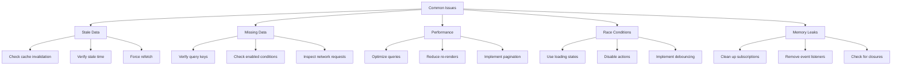

**Diagram sources**
- [useOrders.ts](file://src/hooks/queries/useOrders.ts#L120-L135)
- [useWishlist.ts](file://src/hooks/useWishlist.ts#L54-L56)
- [useRealtimeMessages.ts](file://src/hooks/useRealtimeMessages.ts#L55-L57)

## Conclusion

The state management system in sleekapp-v100 effectively combines React Query and Context API to create a robust, scalable solution for managing both server and client state. The architecture provides excellent performance through intelligent caching, ensures data consistency with real-time synchronization, and delivers a seamless user experience with optimistic updates and comprehensive error handling.

The modular design with reusable custom hooks promotes code organization and maintainability, while the centralized query architecture ensures consistency across the application. By following React Query best practices and implementing thoughtful optimizations, the system delivers reliable performance even with complex data requirements.

Future enhancements could include more sophisticated caching strategies, improved offline support, and enhanced debugging tools to further improve developer experience and application reliability.