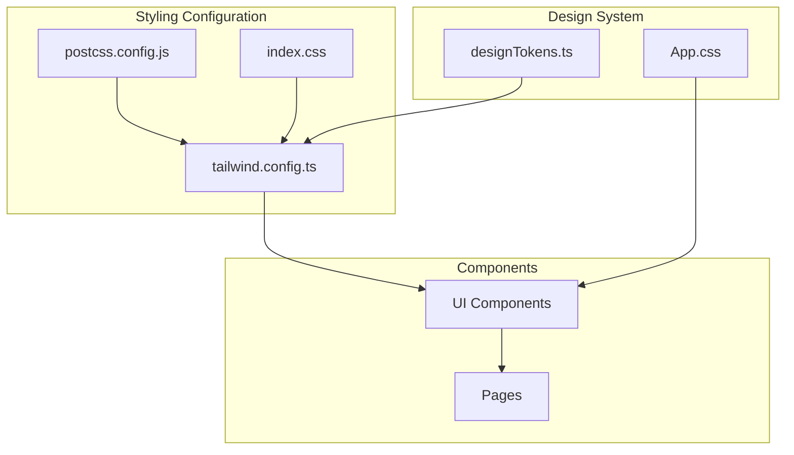
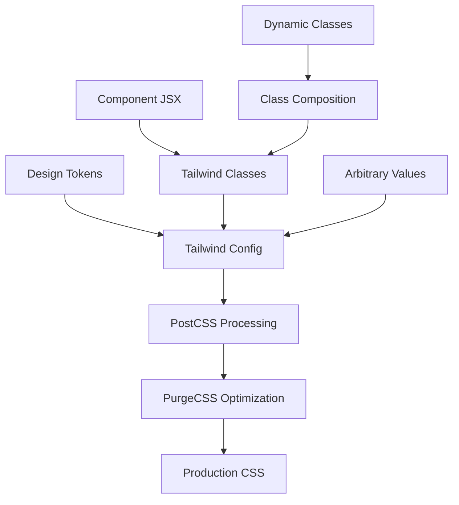
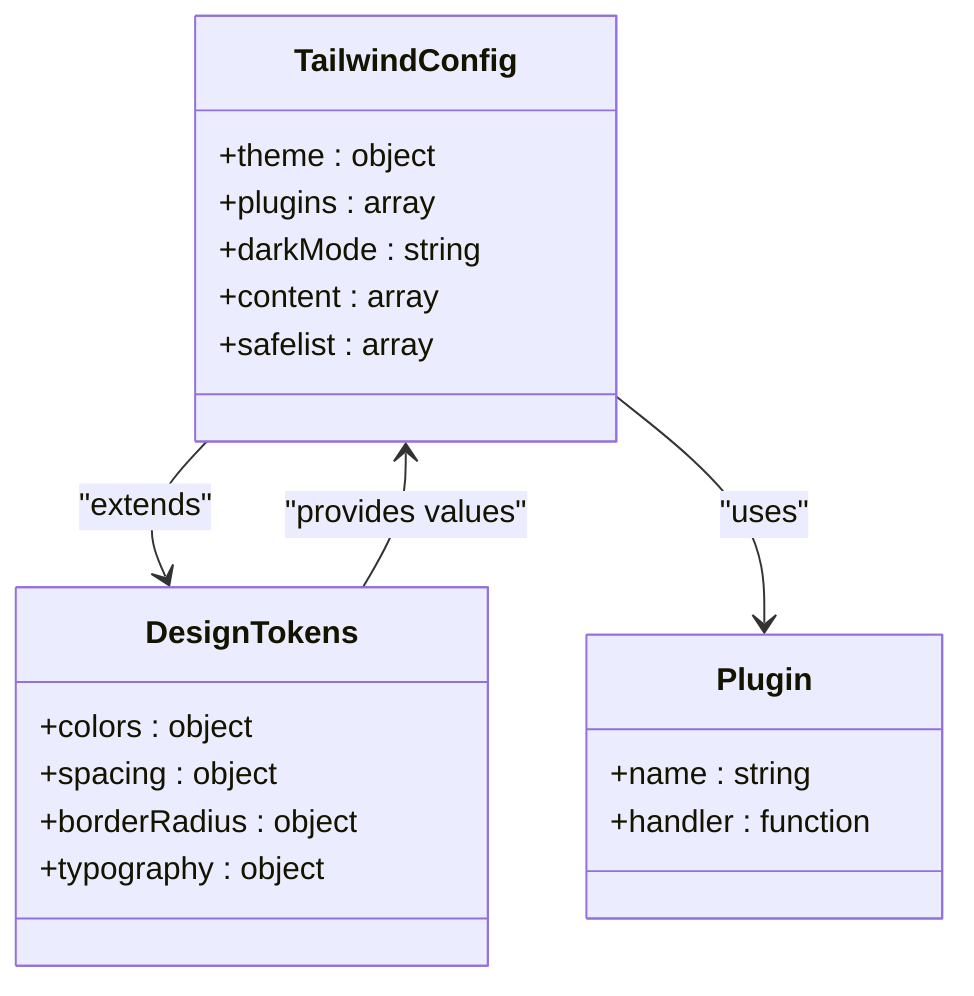
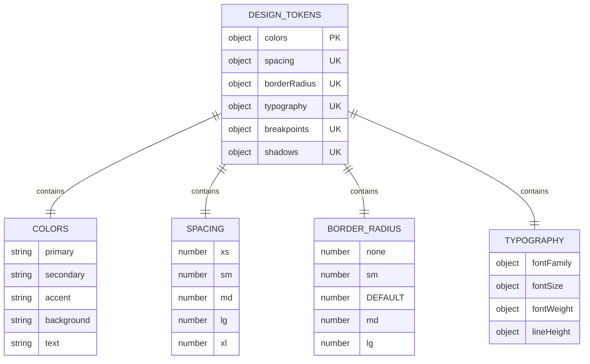
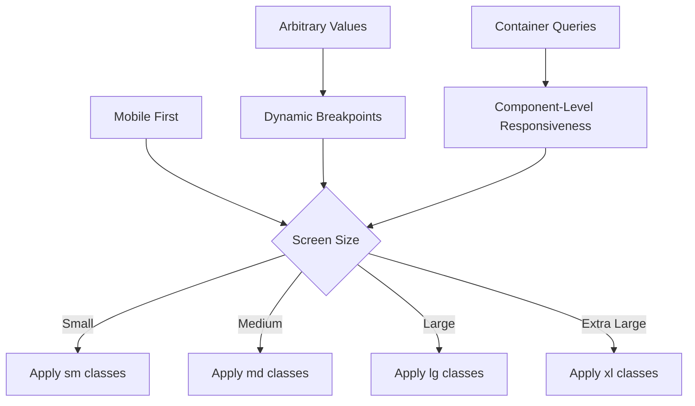
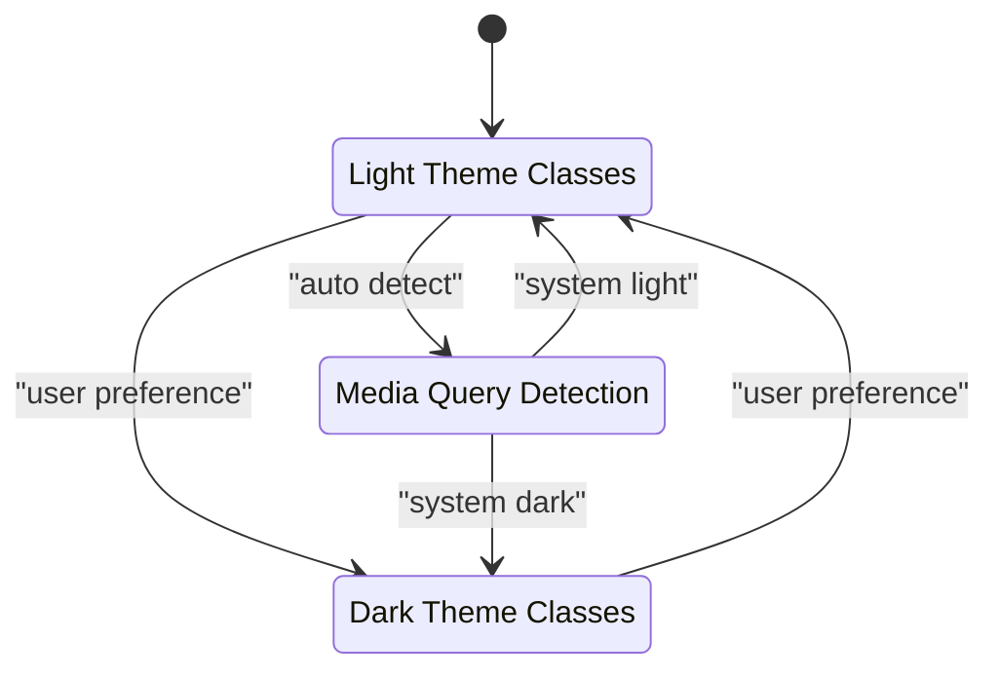
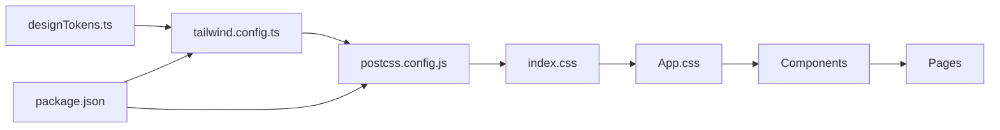
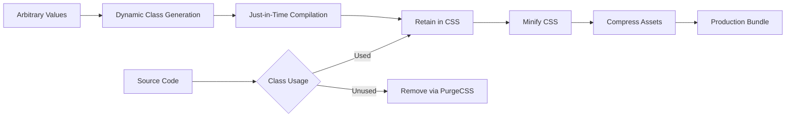

# Styling Strategy

<cite>
**Referenced Files in This Document**  
- [tailwind.config.ts](file://tailwind.config.ts)
- [src/lib/designTokens.ts](file://src/lib/designTokens.ts)
- [src/index.css](file://src/index.css)
- [src/App.css](file://src/App.css)
- [postcss.config.js](file://postcss.config.js)
- [package.json](file://package.json)
</cite>

## Table of Contents
1. [Introduction](#introduction)
2. [Project Structure](#project-structure)
3. [Core Components](#core-components)
4. [Architecture Overview](#architecture-overview)
5. [Detailed Component Analysis](#detailed-component-analysis)
6. [Dependency Analysis](#dependency-analysis)
7. [Performance Considerations](#performance-considerations)
8. [Troubleshooting Guide](#troubleshooting-guide)
9. [Conclusion](#conclusion)

## Introduction
The sleekapp-v100 application implements a modern styling strategy using Tailwind CSS with a utility-first approach. This document details the configuration, design token integration, responsive design patterns, and performance optimization techniques used throughout the codebase. The styling system is designed to provide consistency, scalability, and maintainability while supporting dark mode, accessibility, and dynamic class generation.

## Project Structure
The project follows a component-based architecture with a clear separation between UI components, business logic, and styling configuration. The styling system is centralized in configuration files at the root level, with design tokens defined in the lib directory and applied consistently across all components.

**Diagram sources**
- [tailwind.config.ts](file://tailwind.config.ts)
- [src/lib/designTokens.ts](file://src/lib/designTokens.ts)
- [src/index.css](file://src/index.css)

**Section sources**
- [tailwind.config.ts](file://tailwind.config.ts)
- [src/lib/designTokens.ts](file://src/lib/designTokens.ts)

## Core Components
The styling strategy revolves around several core components: the Tailwind configuration file, design tokens library, and CSS entry points. These components work together to define a consistent visual language across the application. The utility-first approach enables developers to apply styles directly in JSX while maintaining design consistency through configured theme values and plugins.

**Section sources**
- [tailwind.config.ts](file://tailwind.config.ts)
- [src/lib/designTokens.ts](file://src/lib/designTokens.ts)
- [src/index.css](file://src/index.css)

## Architecture Overview
The styling architecture follows a layered approach where design tokens are abstracted into a dedicated module and consumed by the Tailwind configuration. This creates a single source of truth for design values that can be used both in utility classes and programmatically in components. The PostCSS pipeline processes these configurations and generates optimized CSS that is purged of unused classes in production.

**Diagram sources**
- [tailwind.config.ts](file://tailwind.config.ts)
- [postcss.config.js](file://postcss.config.js)
- [src/lib/designTokens.ts](file://src/lib/designTokens.ts)

## Detailed Component Analysis

### Tailwind Configuration Analysis
The tailwind.config.ts file serves as the central configuration point for the styling system. It extends the default theme with custom values from the design tokens module, registers plugins for additional functionality, and configures important settings for dark mode, responsive design, and tree shaking.

#### Theme Extension and Plugin Integration

**Diagram sources**
- [tailwind.config.ts](file://tailwind.config.ts)
- [src/lib/designTokens.ts](file://src/lib/designTokens.ts)

**Section sources**
- [tailwind.config.ts](file://tailwind.config.ts)
- [src/lib/designTokens.ts](file://src/lib/designTokens.ts)

### Design Token Implementation
The design token system in src/lib/designTokens.ts provides a structured approach to defining and managing design values. These tokens are used to ensure consistency across the application and enable easy theming and brand updates.

#### Design Token Structure

**Diagram sources**
- [src/lib/designTokens.ts](file://src/lib/designTokens.ts)

**Section sources**
- [src/lib/designTokens.ts](file://src/lib/designTokens.ts)

### Responsive Design Implementation
The responsive design system leverages Tailwind's breakpoint configuration to create adaptive layouts across different screen sizes. Custom breakpoints are defined in the design tokens and applied consistently throughout the application.

**Diagram sources**
- [tailwind.config.ts](file://tailwind.config.ts)
- [src/lib/designTokens.ts](file://src/lib/designTokens.ts)

**Section sources**
- [tailwind.config.ts](file://tailwind.config.ts)
- [src/lib/designTokens.ts](file://src/lib/designTokens.ts)

### Dark Mode Support
The dark mode implementation uses Tailwind's built-in dark mode features with a class-based strategy. This allows users to toggle between light and dark themes while maintaining accessibility standards.

**Diagram sources**
- [tailwind.config.ts](file://tailwind.config.ts)
- [src/index.css](file://src/index.css)

**Section sources**
- [tailwind.config.ts](file://tailwind.config.ts)
- [src/index.css](file://src/index.css)

## Dependency Analysis
The styling system has well-defined dependencies between configuration files, design tokens, and components. Understanding these relationships is crucial for maintaining consistency and avoiding circular dependencies.

**Diagram sources**
- [tailwind.config.ts](file://tailwind.config.ts)
- [postcss.config.js](file://postcss.config.js)
- [src/lib/designTokens.ts](file://src/lib/designTokens.ts)
- [src/index.css](file://src/index.css)
- [src/App.css](file://src/App.css)
- [package.json](file://package.json)

**Section sources**
- [tailwind.config.ts](file://tailwind.config.ts)
- [postcss.config.js](file://postcss.config.js)
- [package.json](file://package.json)

## Performance Considerations
The styling system includes several performance optimizations to ensure fast load times and efficient CSS delivery. The PurgeCSS configuration eliminates unused styles in production, while the build process optimizes the final CSS bundle.

### Style Optimization Pipeline

**Diagram sources**
- [tailwind.config.ts](file://tailwind.config.ts)
- [postcss.config.js](file://postcss.config.js)

**Section sources**
- [tailwind.config.ts](file://tailwind.config.ts)
- [postcss.config.js](file://postcss.config.js)

## Troubleshooting Guide
Common issues with the styling system typically involve configuration errors, missing design tokens, or incorrect class composition. This section provides guidance for diagnosing and resolving these issues.

**Section sources**
- [tailwind.config.ts](file://tailwind.config.ts)
- [src/lib/designTokens.ts](file://src/lib/designTokens.ts)
- [postcss.config.js](file://postcss.config.js)

## Conclusion
The styling strategy for sleekapp-v100 effectively leverages Tailwind CSS with a utility-first approach to create a consistent, maintainable, and performant design system. By centralizing design tokens, extending the Tailwind configuration, and implementing proper optimization techniques, the application achieves visual consistency while maintaining development efficiency. The system supports responsive design, dark mode, and dynamic styling patterns while ensuring accessibility and performance best practices are followed.