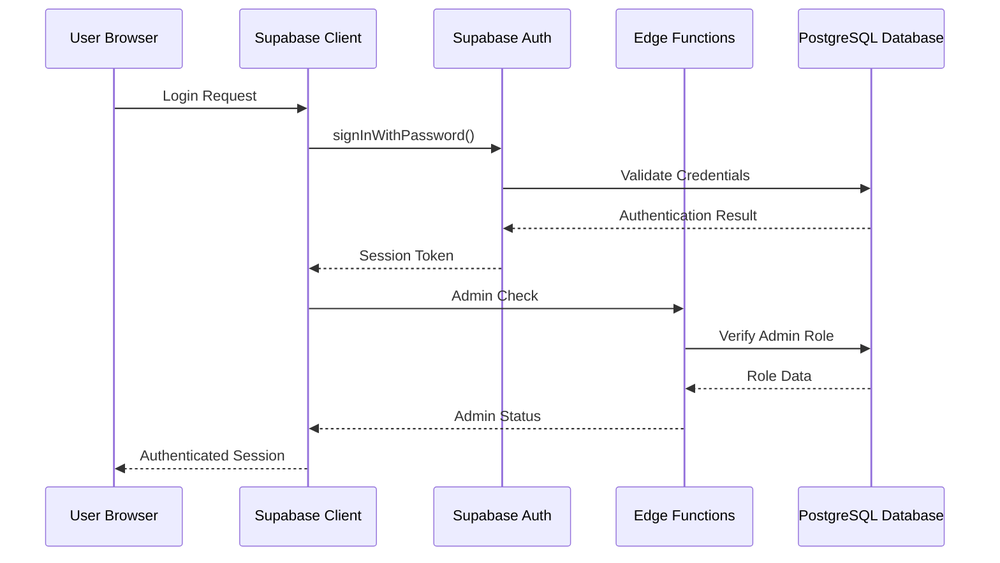
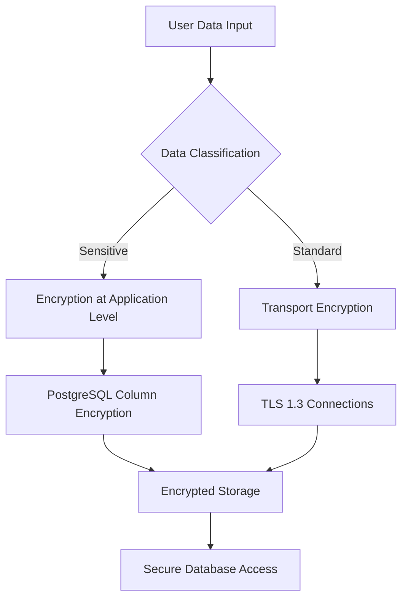
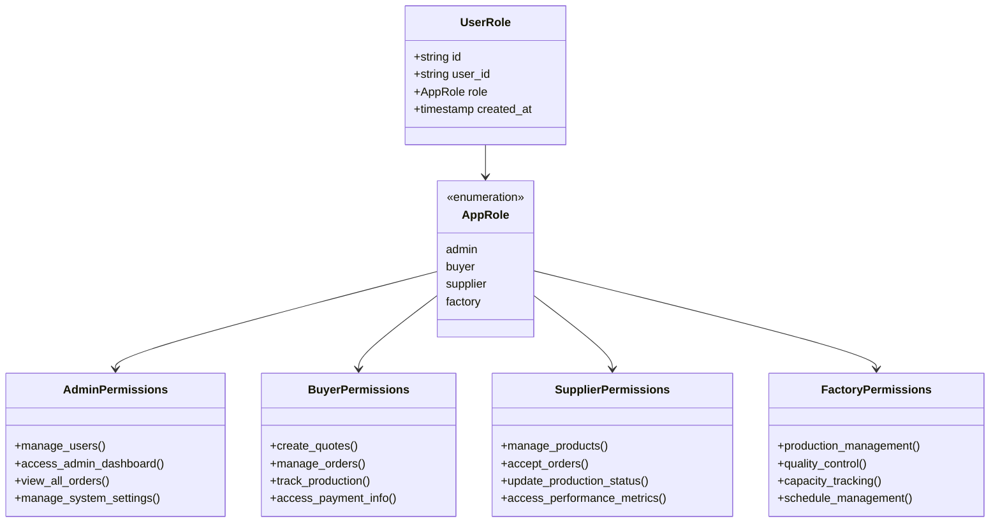
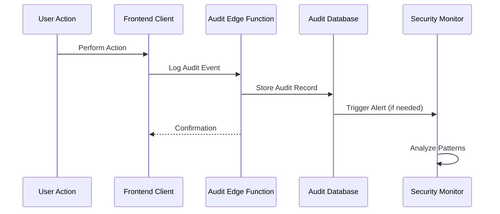

# Security Considerations

<cite>
**Referenced Files in This Document**
- [SECURITY.md](file://SECURITY.md)
- [src/integrations/supabase/client.ts](file://src/integrations/supabase/client.ts)
- [src/lib/supabaseHelpers.ts](file://src/lib/supabaseHelpers.ts)
- [src/hooks/useAdminAuth.ts](file://src/hooks/useAdminAuth.ts)
- [src/pages/SecurityMonitoring.tsx](file://src/pages/SecurityMonitoring.tsx)
- [src/types/database.ts](file://src/types/database.ts)
- [src/lib/enhancedAuditLog.ts](file://src/lib/enhancedAuditLog.ts)
- [src/lib/env-validator.ts](file://src/lib/env-validator.ts)
- [supabase/functions/shared/securityLogger.ts](file://supabase/functions/shared/securityLogger.ts)
- [supabase/functions/log-audit-action/index.ts](file://supabase/functions/log-audit-action/index.ts)
- [supabase/functions/admin-check/index.ts](file://supabase/functions/admin-check/index.ts)
- [supabase/functions/password-breach-check/index.ts](file://supabase/functions/password-breach-check/index.ts)
- [supabase/functions/log-security-event/index.ts](file://supabase/functions/log-security-event/index.ts)
- [supabase/migrations/20251115150759_remix_migration_from_pg_dump.sql](file://supabase/migrations/20251115150759_remix_migration_from_pg_dump.sql)
- [supabase/COMPLETE_SETUP.sql](file://supabase/COMPLETE_SETUP.sql)
- [netlify.toml](file://netlify.toml)
- [src/lib/firebase/auth.ts](file://src/lib/firebase/auth.ts)
- [src/lib/firebase/supabase-adapter.ts](file://src/lib/firebase/supabase-adapter.ts)
- [src/pages/Auth.tsx](file://src/pages/Auth.tsx)
</cite>

## Table of Contents
1. [Introduction](#introduction)
2. [Authentication Architecture](#authentication-architecture)
3. [Data Protection Strategies](#data-protection-strategies)
4. [Role-Based Access Control](#role-based-access-control)
5. [Security Best Practices](#security-best-practices)
6. [Security Monitoring and Logging](#security-monitoring-and-logging)
7. [Compliance Considerations](#compliance-considerations)
8. [Secure Deployment](#secure-deployment)
9. [Incident Response Procedures](#incident-response-procedures)
10. [Ongoing Security Maintenance](#ongoing-security-maintenance)

## Introduction

SleekApparels implements a comprehensive security architecture built on Supabase Auth with multiple layers of protection, including authentication flows, data encryption, role-based access control, and continuous security monitoring. The platform prioritizes data privacy and regulatory compliance while maintaining robust defenses against common web vulnerabilities.

The security framework encompasses both client-side and server-side protections, utilizing edge functions for critical security operations and implementing defense-in-depth strategies across all system components.

## Authentication Architecture

### Supabase Auth Implementation

The authentication system leverages Supabase Auth with dual authentication providers: email/password and OAuth social logins.

**Diagram sources**
- [src/integrations/supabase/client.ts](file://src/integrations/supabase/client.ts#L14-L20)
- [src/hooks/useAdminAuth.ts](file://src/hooks/useAdminAuth.ts#L14-L46)

### Multi-Factor Authentication Support

The system supports multiple authentication methods:

- **Email/Password Authentication**: Secure credential-based login with password strength validation
- **Social Login Integration**: Google OAuth with offline access and consent prompts
- **Phone OTP Authentication**: Two-factor authentication for enhanced security
- **Session Management**: Persistent sessions with automatic token refresh

### Authentication Flow Security

The authentication process implements several security measures:

- **Token Validation**: Server-side JWT validation for all authenticated requests
- **Session Persistence**: Secure session storage with automatic refresh
- **CSRF Protection**: Built-in CSRF prevention through Supabase Auth
- **Rate Limiting**: Automatic protection against brute force attacks

**Section sources**
- [src/integrations/supabase/client.ts](file://src/integrations/supabase/client.ts#L1-L20)
- [src/hooks/useAdminAuth.ts](file://src/hooks/useAdminAuth.ts#L1-L47)
- [src/pages/Auth.tsx](file://src/pages/Auth.tsx#L48-L87)

## Data Protection Strategies

### Encryption at Rest and in Transit

The platform implements comprehensive encryption strategies:

#### Transport Layer Security (TLS)
- **HTTPS Enforcement**: All communications encrypted via TLS 1.2+
- **Certificate Management**: Automated SSL certificate provisioning
- **HSTS Implementation**: Strict Transport Security headers
- **Secure Headers**: Comprehensive security headers including CSP, X-Frame-Options, and XSS protection

#### Data Encryption Implementation

**Diagram sources**
- [netlify.toml](file://netlify.toml#L1-L123)
- [src/lib/env-validator.ts](file://src/lib/env-validator.ts#L93-L142)

### Data Sanitization and Protection

The system implements automatic sanitization of sensitive data:

- **Email Redaction**: Partial masking of email addresses in logs
- **Phone Number Anonymization**: Masking of phone numbers while preserving format
- **Order ID Obfuscation**: Truncated identifiers for public display
- **Password Protection**: Never logged or exposed in plain text

### Secure API Access

API security is enforced through multiple mechanisms:

- **Service Role Authentication**: Dedicated service account for backend operations
- **Edge Function Security**: Isolated execution environment with restricted permissions
- **CORS Configuration**: Strict cross-origin request policies
- **Rate Limiting**: Protection against abuse and DDoS attacks

**Section sources**
- [netlify.toml](file://netlify.toml#L1-L123)
- [supabase/functions/shared/securityLogger.ts](file://supabase/functions/shared/securityLogger.ts#L1-L88)
- [src/lib/enhancedAuditLog.ts](file://src/lib/enhancedAuditLog.ts#L100-L228)

## Role-Based Access Control

### Role Definition and Hierarchy

The RBAC system defines four primary roles with distinct permissions:

**Diagram sources**
- [src/types/database.ts](file://src/types/database.ts#L5-L7)
- [src/lib/supabaseHelpers.ts](file://src/lib/supabaseHelpers.ts#L228-L246)

### Permission Matrix

| Action | Admin | Buyer | Supplier | Factory |
|--------|-------|-------|----------|---------|
| Access Admin Dashboard | ✓ | ✗ | ✗ | ✗ |
| Manage User Accounts | ✓ | ✗ | ✗ | ✗ |
| Create/Modify Quotes | ✓ | ✓ | ✗ | ✗ |
| Place Orders | ✗ | ✓ | ✗ | ✗ |
| Manage Supplier Profiles | ✓ | ✗ | ✓ | ✗ |
| Update Production Status | ✗ | ✗ | ✓ | ✓ |
| Access Financial Reports | ✓ | ✓ | ✓ | ✗ |
| View System Logs | ✓ | ✗ | ✗ | ✗ |

### Row-Level Security Policies

PostgreSQL row-level security (RLS) enforces data isolation:

- **Supplier Data Access**: Suppliers can only access their own supplier records
- **Order Visibility**: Buyers see only their orders, suppliers see assigned orders
- **Financial Data**: Restricted access to financial information based on role
- **Audit Trail**: Complete audit trail for all data modifications

**Section sources**
- [src/types/database.ts](file://src/types/database.ts#L5-L7)
- [src/lib/supabaseHelpers.ts](file://src/lib/supabaseHelpers.ts#L228-L246)
- [supabase/migrations/20251115150759_remix_migration_from_pg_dump.sql](file://supabase/migrations/20251115150759_remix_migration_from_pg_dump.sql#L4225-L4386)

## Security Best Practices

### Input Validation and Sanitization

The platform implements comprehensive input validation:

#### Client-Side Validation
- **Form Validation**: Real-time field validation with user-friendly error messages
- **Type Checking**: JavaScript type validation before submission
- **Length Limits**: Enforced character limits for all inputs
- **Format Validation**: Email, phone number, and currency format validation

#### Server-Side Validation
- **Database Constraints**: PostgreSQL constraint validation
- **Edge Function Validation**: Server-side validation in edge functions
- **Sanitization**: Automatic sanitization of potentially dangerous inputs
- **Whitelist Validation**: Allow-list based input validation

### Protection Against Common Web Vulnerabilities

#### Cross-Site Scripting (XSS) Protection
- **Content Security Policy**: Strict CSP headers preventing inline scripts
- **Output Encoding**: Automatic HTML encoding of dynamic content
- **Safe Template Rendering**: Template engines with automatic escaping
- **Script Tag Filtering**: Removal of dangerous script tags

#### Cross-Site Request Forgery (CSRF) Protection
- **Built-in CSRF Tokens**: Supabase Auth provides automatic CSRF protection
- **Token Validation**: Server-side validation of CSRF tokens
- **SameSite Cookies**: Secure cookie attributes
- **Origin Validation**: Origin header verification for API requests

#### SQL Injection Prevention
- **Parameterized Queries**: Supabase client automatically parameterizes queries
- **Type Safety**: TypeScript enforces type-safe database operations
- **Stored Procedures**: Database functions with strict parameter validation
- **Query Logging**: All queries logged for security analysis

### Secure Data Handling

#### Password Security
- **Hashing**: bcrypt hashing with configurable cost factors
- **Breached Password Detection**: Integration with Have I Been Pwned API
- **Password Strength**: Minimum length and complexity requirements
- **Rate Limiting**: Protection against password guessing attacks

#### Session Security
- **Secure Cookies**: HttpOnly, Secure, SameSite attributes
- **Session Rotation**: Automatic session token rotation
- **Idle Timeout**: Configurable session timeout
- **Multi-Device Support**: Separate sessions per device

**Section sources**
- [supabase/functions/password-breach-check/index.ts](file://supabase/functions/password-breach-check/index.ts#L71-L110)
- [netlify.toml](file://netlify.toml#L1-L123)

## Security Monitoring and Logging

### Comprehensive Audit Logging

The system maintains detailed audit trails for all security-relevant actions:

**Diagram sources**
- [src/lib/enhancedAuditLog.ts](file://src/lib/enhancedAuditLog.ts#L100-L228)
- [supabase/functions/log-audit-action/index.ts](file://supabase/functions/log-audit-action/index.ts#L1-L97)

### Security Event Monitoring

#### Real-Time Security Events
- **Suspicious Activity Detection**: Automated detection of unusual patterns
- **Rate Limit Violations**: Monitoring and alerting for excessive requests
- **Failed Login Attempts**: Tracking and analysis of authentication failures
- **Unauthorized Access**: Immediate alerts for privilege escalation attempts

#### AI Cost Monitoring
- **Token Usage Tracking**: Detailed tracking of AI model token consumption
- **Cost Analysis**: Hourly and daily cost aggregation
- **Budget Alerts**: Automatic notifications for cost thresholds
- **Model Performance**: Efficiency monitoring for different AI models

### Incident Response Capabilities

#### Automated Response Mechanisms
- **IP Blocking**: Automatic blocking of malicious IP addresses
- **Rate Limiting**: Dynamic adjustment of rate limits based on threat level
- **Session Termination**: Immediate termination of suspicious sessions
- **Alert Escalation**: Multi-tier alerting for different severity levels

#### Manual Investigation Tools
- **Audit Log Analysis**: Comprehensive search and filtering capabilities
- **User Activity Tracking**: Detailed user behavior analysis
- **System Health Monitoring**: Real-time system performance monitoring
- **Forensic Analysis**: Detailed event reconstruction capabilities

**Section sources**
- [src/lib/enhancedAuditLog.ts](file://src/lib/enhancedAuditLog.ts#L100-L228)
- [supabase/functions/log-security-event/index.ts](file://supabase/functions/log-security-event/index.ts#L40-L60)
- [supabase/functions/shared/securityLogger.ts](file://supabase/functions/shared/securityLogger.ts#L1-L88)

## Compliance Considerations

### Data Privacy Regulations

#### GDPR Compliance
The platform implements comprehensive GDPR compliance measures:

- **Data Minimization**: Collection of only necessary personal data
- **Right to Access**: User-friendly data access and export capabilities
- **Right to Erasure**: Complete data deletion upon user request
- **Data Portability**: Easy export of user data in standard formats
- **Consent Management**: Clear consent mechanisms for data processing
- **Data Breach Notification**: Automated notification systems for breaches

#### Data Processing Agreements
- **Standard Contract Clauses**: Legal agreements for international data transfers
- **Processor Agreements**: Third-party processor compliance requirements
- **Data Subject Rights**: Mechanisms for exercising data subject rights
- **Privacy Impact Assessments**: Regular assessments of data processing activities

### Regulatory Standards

#### Industry Certifications
- **OEKO-TEX Standard 100**: Textile safety certification compliance
- **BSCI Certification**: Business Social Compliance Initiative standards
- **REACH Compliance**: Registration, Evaluation, Authorization, and Restriction of Chemicals
- **ISO 27001**: Information security management systems

#### Quality Assurance
- **Regular Audits**: Scheduled security and compliance audits
- **Penetration Testing**: Periodic security testing by external experts
- **Continuous Monitoring**: 24/7 security monitoring and alerting
- **Documentation**: Comprehensive security documentation and procedures

**Section sources**
- [src/pages/EuropeanBrands.tsx](file://src/pages/EuropeanBrands.tsx#L66-L259)
- [src/pages/Privacy.tsx](file://src/pages/Privacy.tsx#L35-L73)

## Secure Deployment

### Infrastructure Security

#### Network Security
- **Firewall Configuration**: Comprehensive firewall rules and network segmentation
- **VPN Access**: Secure remote access for administrative functions
- **DDoS Protection**: Automatic protection against distributed denial-of-service attacks
- **Network Monitoring**: Continuous monitoring of network traffic and anomalies

#### Container Security
- **Image Scanning**: Automated scanning of container images for vulnerabilities
- **Runtime Protection**: Container runtime security monitoring
- **Secret Management**: Secure handling of API keys and sensitive configuration
- **Network Policies**: Kubernetes network policies for pod communication

### Environment Configuration

#### Development Security
- **Environment Separation**: Strict separation between development, staging, and production
- **Automated Testing**: Security testing integrated into CI/CD pipeline
- **Dependency Scanning**: Regular scanning of third-party dependencies
- **Code Review**: Mandatory security-focused code reviews

#### Production Hardening
- **Minimal Permissions**: Principle of least privilege for all services
- **Immutable Infrastructure**: Immutable deployments with rollback capabilities
- **Configuration Management**: Centralized and version-controlled configuration
- **Backup Security**: Encrypted backups with secure retention policies

**Section sources**
- [src/lib/env-validator.ts](file://src/lib/env-validator.ts#L93-L142)
- [netlify.toml](file://netlify.toml#L1-L123)

## Incident Response Procedures

### Response Framework

#### Incident Classification
- **Critical Incidents**: System-wide outages or data breaches requiring immediate attention
- **High Severity**: Significant security incidents impacting multiple users
- **Medium Severity**: Localized issues affecting specific functionality
- **Low Severity**: Minor issues requiring investigation

#### Response Teams
- **Security Team**: Dedicated security personnel for incident response
- **Development Team**: Technical expertise for system remediation
- **Operations Team**: Infrastructure support for system recovery
- **Legal Team**: Compliance and legal advice for breach situations

### Communication Protocols

#### Internal Communication
- **Immediate Notification**: Automated alerts to security team
- **Status Updates**: Regular updates during incident resolution
- **Escalation Procedures**: Clear escalation paths for different severity levels
- **Post-Incident Review**: Comprehensive analysis and lessons learned

#### External Communication
- **Customer Notification**: Timely communication for affected customers
- **Regulatory Reporting**: Compliance with reporting requirements
- **Media Relations**: Coordinated communication for public incidents
- **Stakeholder Updates**: Regular updates to business stakeholders

### Recovery Procedures

#### Immediate Actions
- **Containment**: Isolation of affected systems and data
- **Investigation**: Forensic analysis of incident scope
- **Communication**: Activation of communication protocols
- **Documentation**: Comprehensive documentation of incident details

#### Long-term Recovery
- **System Restoration**: Gradual restoration of affected systems
- **Security Hardening**: Implementation of additional security measures
- **Testing**: Thorough testing of restored systems
- **Monitoring**: Enhanced monitoring for residual threats

## Ongoing Security Maintenance

### Regular Security Updates

#### Patch Management
- **Automated Updates**: Regular automated updates for dependencies
- **Vulnerability Scanning**: Continuous scanning for known vulnerabilities
- **Exploit Monitoring**: Tracking of emerging exploits and mitigation
- **Emergency Patches**: Rapid deployment for critical security issues

#### Security Monitoring
- **24/7 Monitoring**: Continuous security monitoring and alerting
- **Threat Intelligence**: Integration with threat intelligence feeds
- **Behavioral Analysis**: Machine learning-based anomaly detection
- **Performance Baselines**: Establishing and monitoring performance baselines

### Security Training and Awareness

#### Developer Training
- **Security Workshops**: Regular training sessions for development teams
- **Coding Standards**: Security-focused coding guidelines and standards
- **Code Reviews**: Mandatory security-focused code review processes
- **Incident Simulation**: Regular security incident simulation exercises

#### User Education
- **Security Awareness**: Regular security awareness programs for users
- **Best Practices**: Guidance on secure usage of the platform
- **Phishing Training**: Education on recognizing and avoiding phishing attacks
- **Account Security**: Tips for maintaining secure accounts

### Continuous Improvement

#### Security Metrics
- **Incident Metrics**: Tracking of security incidents and resolution times
- **Vulnerability Metrics**: Analysis of discovered vulnerabilities and remediation
- **Compliance Metrics**: Monitoring of compliance adherence and gaps
- **Performance Metrics**: Security performance and effectiveness measurements

#### Architecture Evolution
- **Security Architecture Reviews**: Regular review and improvement of security architecture
- **Technology Updates**: Adoption of new security technologies and practices
- **Process Improvements**: Continuous improvement of security processes
- **Policy Updates**: Regular updates to security policies and procedures

**Section sources**
- [SECURITY.md](file://SECURITY.md#L1-L22)
- [src/pages/SecurityMonitoring.tsx](file://src/pages/SecurityMonitoring.tsx#L1-L8)