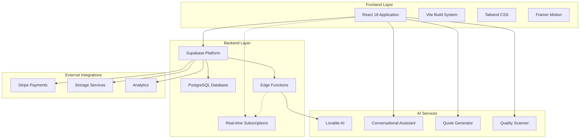
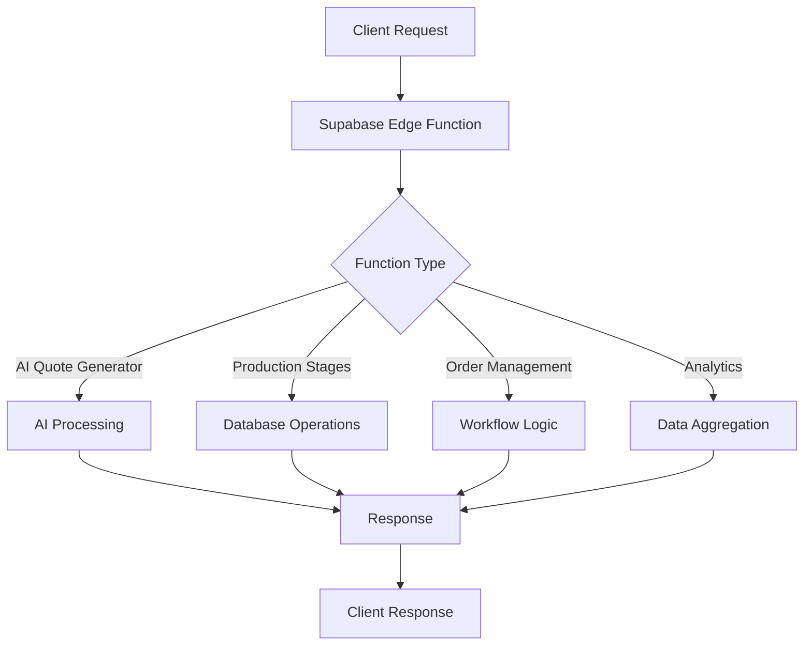
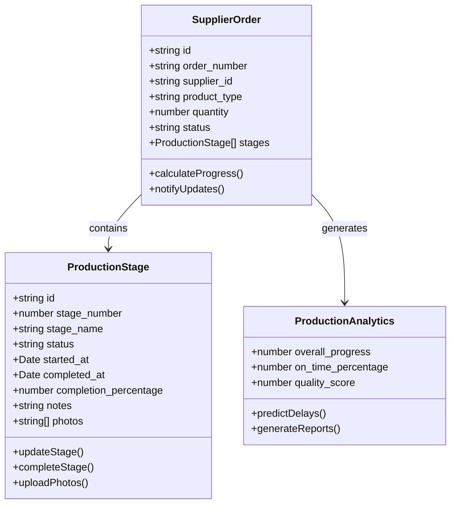
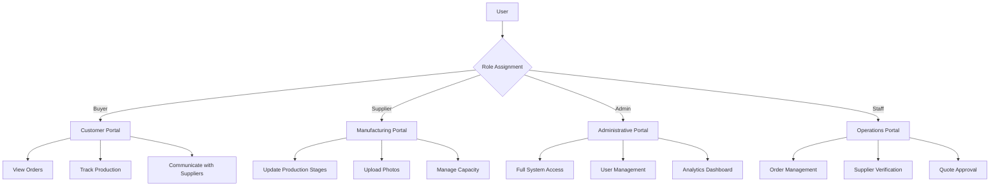
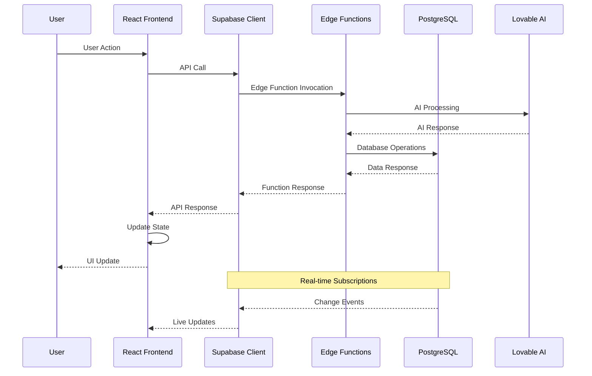
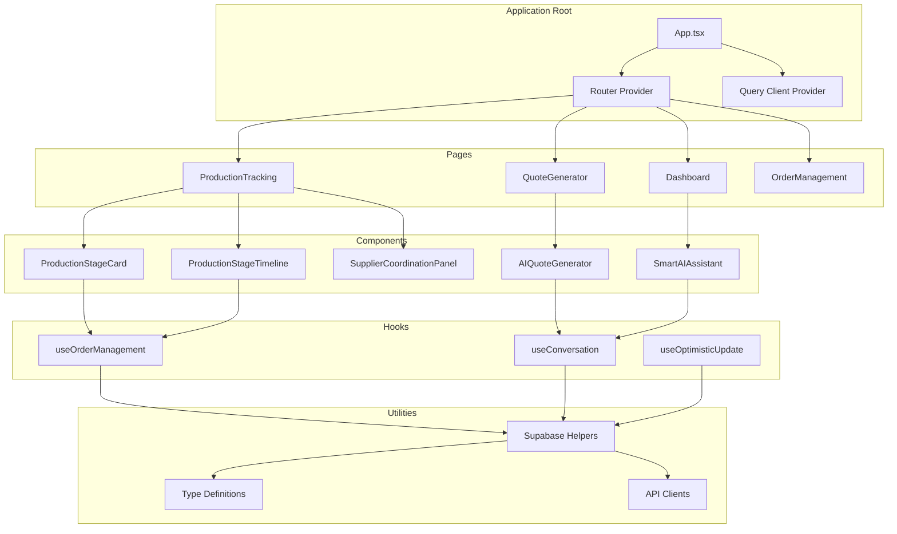
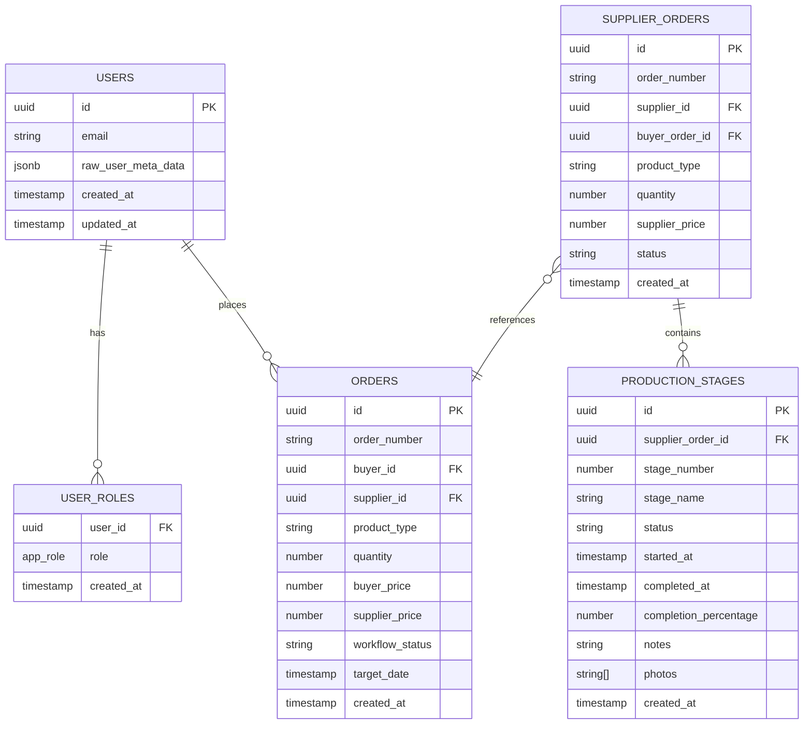

# System Overview

<cite>
**Referenced Files in This Document**
- [README.md](file://README.md)
- [package.json](file://package.json)
- [vite.config.ts](file://vite.config.ts)
- [tailwind.config.ts](file://tailwind.config.ts)
- [src/App.tsx](file://src/App.tsx)
- [src/integrations/supabase/client.ts](file://src/integrations/supabase/client.ts)
- [src/hooks/useOrderManagement.ts](file://src/hooks/useOrderManagement.ts)
- [src/pages/ProductionTracking.tsx](file://src/pages/ProductionTracking.tsx)
- [src/components/production/ProductionStageTimeline.tsx](file://src/components/production/ProductionStageTimeline.tsx)
- [src/components/production/ProductionStageCard.tsx](file://src/components/production/ProductionStageCard.tsx)
- [src/components/SmartAIAssistant.tsx](file://src/components/SmartAIAssistant.tsx)
- [supabase/functions/ai-quote-generator/index.ts](file://supabase/functions/ai-quote-generator/index.ts)
- [supabase/functions/initialize-production-stages/index.ts](file://supabase/functions/initialize-production-stages/index.ts)
- [src/lib/supabaseHelpers.ts](file://src/lib/supabaseHelpers.ts)
</cite>

## Table of Contents
1. [Introduction](#introduction)
2. [System Architecture Overview](#system-architecture-overview)
3. [Core Technologies](#core-technologies)
4. [AI-Powered Features](#ai-powered-features)
5. [Production Tracking System](#production-tracking-system)
6. [Role-Based Access Control](#role-based-access-control)
7. [Data Flow Architecture](#data-flow-architecture)
8. [Component Relationships](#component-relationships)
9. [Development Environment](#development-environment)
10. [Deployment Architecture](#deployment-architecture)
11. [Performance Considerations](#performance-considerations)
12. [Conclusion](#conclusion)

## Introduction

Sleek Apparels is a comprehensive knitwear manufacturing and supply chain management platform built with cutting-edge technologies. The system features AI-powered production tracking (LoopTrace™ Technology) and intelligent quote generation, providing real-time visibility into the entire manufacturing process from order placement to delivery.

The platform serves as a full-stack solution connecting buyers, suppliers, and manufacturers through a unified interface, leveraging modern web technologies to deliver seamless user experiences and automated business processes.

**Section sources**
- [README.md](file://README.md#L1-L50)

## System Architecture Overview

The sleekapp-v100 system follows a modern full-stack architecture combining React 18 frontend, Supabase backend, and Vite build system with comprehensive AI capabilities.

**Diagram sources**
- [src/App.tsx](file://src/App.tsx#L1-L50)
- [src/integrations/supabase/client.ts](file://src/integrations/supabase/client.ts#L1-L20)

### Key Architectural Principles

The system is built around several core principles:

- **Modular Component Architecture**: React components organized by feature and domain
- **Type Safety**: Full TypeScript implementation for compile-time error prevention
- **Real-time Updates**: WebSocket-based real-time data synchronization
- **AI Integration**: Seamless integration of Lovable AI services
- **Progressive Enhancement**: Graceful degradation for various device capabilities

**Section sources**
- [src/App.tsx](file://src/App.tsx#L1-L100)
- [package.json](file://package.json#L1-L50)

## Core Technologies

### Frontend Technologies

The frontend leverages modern React ecosystem technologies:

**React 18 with Concurrent Features**
- Concurrent rendering for improved performance
- Automatic batching of state updates
- New suspense features for data fetching

**Build System and Tooling**
- **Vite**: Lightning-fast development server and build tool
- **ESBuild**: Ultra-fast JavaScript bundling
- **Rollup**: Module bundling with tree-shaking
- **LightningCSS**: Fast CSS processing

**Styling and Design**
- **Tailwind CSS**: Utility-first CSS framework
- **shadcn/ui**: Component library with dark mode support
- **Lucide React**: Consistent iconography
- **Framer Motion**: Animation library for smooth transitions

**State Management**
- **React Query**: Data fetching and caching
- **Context API**: Global state management
- **Local Storage**: Persistent user preferences

**Section sources**
- [package.json](file://package.json#L14-L90)
- [vite.config.ts](file://vite.config.ts#L1-L216)
- [tailwind.config.ts](file://tailwind.config.ts#L1-L196)

### Backend Infrastructure

**Supabase Platform**
- **PostgreSQL Database**: Relational database with JSONB support
- **Real-time Subscriptions**: WebSocket-based live data updates
- **Authentication**: Built-in user authentication and authorization
- **Storage**: File upload and CDN integration
- **Edge Functions**: Serverless functions for business logic

**Edge Functions Architecture**

**Diagram sources**
- [supabase/functions/ai-quote-generator/index.ts](file://supabase/functions/ai-quote-generator/index.ts#L1-L100)
- [supabase/functions/initialize-production-stages/index.ts](file://supabase/functions/initialize-production-stages/index.ts#L1-L133)

**Section sources**
- [src/integrations/supabase/client.ts](file://src/integrations/supabase/client.ts#L1-L20)

## AI-Powered Features

### LoopTrace™ Technology

The cornerstone of the system is LoopTrace™, an AI-powered production tracking technology that provides real-time visibility across eight manufacturing stages.

#### Eight-Stage Manufacturing Workflow

```mermaid
flowchart LR
A[Order Confirmation<br/>Stage 1] --> B[Fabric Sourcing<br/>Stage 2]
B --> C[Accessories Procurement<br/>Stage 3]
C --> D[Cutting & Pattern Making<br/>Stage 4]
D --> E[Sewing & Assembly<br/>Stage 5]
E --> F[Quality Control<br/>Stage 6]
F --> G[Finishing & Packaging<br/>Stage 7]
G --> H[Shipment & Delivery<br/>Stage 8]
style A fill:#e1f5fe
style B fill:#f3e5f5
style C fill:#fff3e0
style D fill:#e8f5e8
style E fill:#e3f2fd
style F fill:#fce4ec
style G fill:#f1f8e9
style H fill:#fff8e1
```

**Diagram sources**
- [src/pages/ProductionTracking.tsx](file://src/pages/ProductionTracking.tsx#L39-L48)

#### AI Quote Generator

The AI Quote Generator provides intelligent pricing with:

- **Natural Language Processing**: Understands product descriptions in plain text
- **Market Research Integration**: Real-time market data analysis
- **OTM Verification**: Secure customer authentication
- **Historical Comparison**: Past quote analysis
- **Alternative Suggestions**: Material and design recommendations

#### Conversational AI Assistant

The Smart AI Assistant enables:
- **Natural Conversations**: Human-like interaction patterns
- **Lead Qualification**: Automatic lead scoring and categorization
- **Quote Generation**: AI-powered quote creation
- **Quick Replies**: Contextually appropriate response suggestions

**Section sources**
- [src/components/SmartAIAssistant.tsx](file://src/components/SmartAIAssistant.tsx#L1-L41)
- [supabase/functions/ai-quote-generator/index.ts](file://supabase/functions/ai-quote-generator/index.ts#L1-L200)

## Production Tracking System

### Real-Time Production Monitoring

The production tracking system provides comprehensive visibility into manufacturing processes:

#### Production Stage Management

**Diagram sources**
- [src/components/production/ProductionStageCard.tsx](file://src/components/production/ProductionStageCard.tsx#L27-L44)
- [src/components/production/ProductionStageTimeline.tsx](file://src/components/production/ProductionStageTimeline.tsx#L6-L20)

#### Key Features

- **Real-time Status Updates**: Live production stage changes
- **Progress Tracking**: Percentage completion and timeline visualization
- **Photo Documentation**: Visual evidence at each stage
- **Supplier Coordination**: Direct messaging between parties
- **Predictive Analytics**: AI-powered delay detection
- **Quality Control**: Inspection and validation tracking

**Section sources**
- [src/pages/ProductionTracking.tsx](file://src/pages/ProductionTracking.tsx#L1-L540)
- [src/hooks/useOrderManagement.ts](file://src/hooks/useOrderManagement.ts#L1-L130)

## Role-Based Access Control

The system implements comprehensive RBAC (Role-Based Access Control) with four distinct user roles:

### User Roles and Permissions

**Diagram sources**
- [src/lib/supabaseHelpers.ts](file://src/lib/supabaseHelpers.ts#L228-L255)

### Permission Matrix

| Feature | Buyer | Supplier | Admin | Staff |
|---------|-------|----------|-------|-------|
| View Orders | ✓ | ✓ | ✓ | ✓ |
| Track Production | ✓ | ✓ | ✓ | ✓ |
| Update Stages | ✗ | ✓ | ✓ | ✓ |
| Manage Users | ✗ | ✗ | ✓ | ✓ |
| Approve Quotes | ✗ | ✗ | ✓ | ✓ |
| System Analytics | ✗ | ✗ | ✓ | ✓ |
| Supplier Management | ✗ | ✗ | ✓ | ✓ |

**Section sources**
- [src/lib/supabaseHelpers.ts](file://src/lib/supabaseHelpers.ts#L228-L255)

## Data Flow Architecture

### Frontend-Backend Communication

**Diagram sources**
- [src/integrations/supabase/client.ts](file://src/integrations/supabase/client.ts#L1-L20)
- [src/hooks/useOrderManagement.ts](file://src/hooks/useOrderManagement.ts#L1-L130)

### Real-Time Data Synchronization

The system utilizes Supabase's real-time capabilities for immediate data updates:

- **Postgres Changes**: Automatic subscription to database events
- **WebSocket Connections**: Persistent real-time communication
- **Optimistic Updates**: Immediate UI feedback with rollback capability
- **Conflict Resolution**: Automatic handling of concurrent updates

**Section sources**
- [src/pages/ProductionTracking.tsx](file://src/pages/ProductionTracking.tsx#L65-L90)

## Component Relationships

### Frontend Component Architecture

**Diagram sources**
- [src/App.tsx](file://src/App.tsx#L1-L345)

### Data Flow Between Components

The system follows a unidirectional data flow pattern:

1. **User Interaction**: User actions trigger state updates
2. **Hook Processing**: Custom hooks handle business logic
3. **API Communication**: Supabase client manages backend communication
4. **State Updates**: React state is updated with new data
5. **UI Rendering**: Components re-render with new props

**Section sources**
- [src/components/production/ProductionStageCard.tsx](file://src/components/production/ProductionStageCard.tsx#L1-L200)

## Development Environment

### Build Configuration

The project uses Vite for development and production builds with sophisticated optimization:

#### Development Features
- **Hot Module Replacement**: Instant code updates
- **TypeScript Support**: Full type checking during development
- **Source Maps**: Debugging support
- **Environment Variables**: Secure configuration management

#### Production Optimizations
- **Code Splitting**: Dynamic imports for optimal loading
- **Tree Shaking**: Dead code elimination
- **Asset Optimization**: Image compression and caching
- **Bundle Analysis**: Detailed build statistics

**Section sources**
- [vite.config.ts](file://vite.config.ts#L1-L216)

### Testing and Quality Assurance

The system includes comprehensive testing infrastructure:

- **Unit Tests**: Component and hook testing
- **Integration Tests**: API and workflow testing
- **End-to-End Tests**: User journey validation
- **Type Checking**: TypeScript compilation and linting

**Section sources**
- [package.json](file://package.json#L7-L11)

## Deployment Architecture

### Lovable Platform Integration

The system is deployed using the Lovable platform, providing:

- **Zero-Configuration Deployment**: Automatic build and deployment
- **Environment Management**: Separate environments for development and production
- **Scaling**: Automatic scaling based on demand
- **Monitoring**: Built-in performance and error monitoring

### Database Schema

The PostgreSQL database follows a normalized schema with JSONB support for flexible data structures:

**Diagram sources**
- [src/lib/supabaseHelpers.ts](file://src/lib/supabaseHelpers.ts#L1-L376)

**Section sources**
- [README.md](file://README.md#L116-L142)

## Performance Considerations

### Frontend Performance

The system implements several performance optimization strategies:

#### Bundle Optimization
- **Dynamic Imports**: Lazy loading of heavy components
- **Code Splitting**: Automatic chunking based on usage patterns
- **Vendor Separation**: Third-party libraries in separate bundles
- **Tree Shaking**: Elimination of unused code

#### Runtime Performance
- **React Memoization**: Component and hook memoization
- **Optimistic Updates**: Immediate UI feedback
- **Debounced Inputs**: Reduced API calls
- **Virtual Scrolling**: Efficient list rendering

### Backend Performance

#### Database Optimization
- **Indexing**: Strategic indexing for query performance
- **Connection Pooling**: Efficient database connections
- **Query Optimization**: Optimized SQL queries
- **Caching**: Redis-style caching for frequently accessed data

#### Edge Function Performance
- **Cold Start Mitigation**: Warm instances for critical functions
- **Async Processing**: Non-blocking operation execution
- **Resource Management**: Efficient memory and CPU usage

**Section sources**
- [vite.config.ts](file://vite.config.ts#L103-L187)

## Conclusion

The sleekapp-v100 system represents a comprehensive solution for knitwear manufacturing and supply chain management. By combining modern frontend technologies with robust backend infrastructure and AI capabilities, the platform delivers:

- **Seamless User Experience**: Intuitive interfaces for all user roles
- **Real-time Visibility**: Comprehensive production tracking and monitoring
- **AI-Enhanced Features**: Intelligent quote generation and conversational assistance
- **Scalable Architecture**: Foundation for future growth and feature expansion
- **Developer-Friendly**: Clean codebase with extensive documentation and testing

The system's modular architecture ensures maintainability and extensibility, while the AI-powered features provide competitive advantages in speed, accuracy, and user engagement. The combination of React 18, Supabase, and Lovable AI creates a powerful platform that addresses the complex needs of modern knitwear manufacturing and supply chain operations.

Future enhancements will continue to leverage AI capabilities, expand real-time features, and improve user experience through additional integrations and automation.